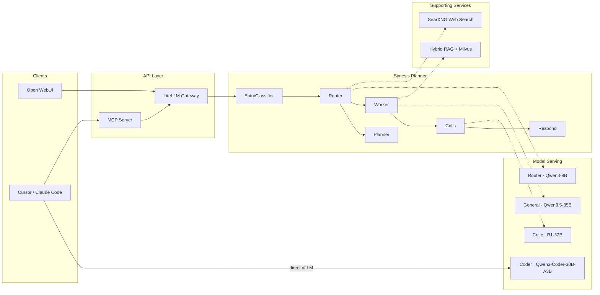

# Project Synesis

[](https://github.com/supernovae/synesis/actions/workflows/build-images.yml)
[](https://github.com/supernovae/synesis/actions/workflows/lint.yml)
[](LICENSE)

A composable, self-hosted LLM assistant built on [OpenShift AI](https://www.redhat.com/en/technologies/cloud-computing/openshift/openshift-ai). Multi-model architecture with taxonomy-driven prompt shaping, hybrid RAG, and YAML-configurable behavior profiles — from 2 GPUs to production scale.

> **Synesis** (coined by Erik Hollnagel): The unification of productivity, quality, safety, and reliability. Safety and success are not separate goals, but emergent properties of the same adaptive processes.

**Repository:** [github.com/supernovae/synesis](https://github.com/supernovae/synesis)

## Architecture

Synesis separates concerns across specialized model roles. A fast router classifies intent and steers requests through a LangGraph pipeline, while IDE clients connect directly to a dedicated coding model. All model assignments, vLLM tuning, and deployment profiles are driven from a single [`models.yaml`](models.yaml).



**Key design decisions:**

- **IDEs connect directly to Coder** — a separate vLLM endpoint with tool-calling support, no LangGraph overhead. The MCP server lets the Coder reach Synesis capabilities (RAG, taxonomy, architecture knowledge) as tool calls when needed.
- **Open WebUI users get the full pipeline** — Router classifies intent, Worker generates with RAG context, Critic validates with thinking budget, Respond assembles the final message.
- **Sandbox and LSP are exception-flow tools** — they fire on code validation failures, not on every request. This keeps the happy path fast. See [docs/SANDBOX.md](docs/SANDBOX.md) and [docs/LSP.md](docs/LSP.md).
- **Taxonomy-driven prompt shaping** — domain behavior, critic depth, worker persona, and planner decomposition rules are all YAML-configurable. No prompt logic is hardcoded in nodes. See [docs/TAXONOMY_SHAPING.md](docs/TAXONOMY_SHAPING.md).

## Model Roles

All model definitions live in [`models.yaml`](models.yaml) — the single source of truth for model repos, vLLM args, PVC sizing, and deployment names.

| Role | Default Model | Purpose |
|------|--------------|---------|
| **Router** | Qwen3-8B FP8 | Fast intent classification and taxonomy routing |
| **General** | Qwen3.5-35B-A3B | General reasoning, writer synthesis, Open WebUI default |
| **Coder** | Qwen3-Coder-30B-A3B (small) / Next (med+) | Agentic coding for IDE clients (direct vLLM endpoint) |
| **Critic** | DeepSeek R1-Distill-32B FP8 | Deep reasoning critic with configurable thinking budget |
| **Summarizer** | Qwen2.5-0.5B-Instruct | Conversation history compression (CPU) |

Models are deployed via **OpenShift AI 3** (dashboard or InferenceService YAML). See [`base/model-serving/README.md`](base/model-serving/README.md) for deployment examples.

## Composable Deployment Profiles

Synesis scales from a 2-GPU proof of concept to a production cluster. Each profile defines model assignments, quantization, tensor parallelism, and GPU mapping.

| Profile | Hardware | Use Case | Models |
|---------|----------|----------|--------|
| **Small** | 2x L40S | Single developer, proof of concept | Router + Critic share GPU 0; Coder on GPU 1 |
| **Medium** | 4x L40S | Team use, all roles dedicated | General on GPU 0; Coder TP=2 on GPUs 1-2; Router + Critic on GPU 3 |
| **Large** | 8x GPU | Production with HPA auto-scaling | All roles dedicated; Coder scales 2-4 replicas on queue depth |

```bash
# Deploy all models for a profile
./scripts/run-model-pipeline.sh --profile=small

# Deploy just one role
./scripts/run-model-pipeline.sh --role=router
```

See [`models.yaml`](models.yaml) for full profile definitions, vLLM args, and HPA configuration. See [docs/HARDWARE_SIZING.md](docs/HARDWARE_SIZING.md) for GPU memory and bandwidth guidance.

## Quick Start

### Prerequisites

- **OpenShift AI 3.x** (fast or stable channel)
- NVIDIA GPU Operator
- `oc`, `kubectl`, `kustomize` CLI tools

### 1. Bootstrap the cluster

```bash
./scripts/bootstrap.sh                  # Namespaces + RAG stack
./scripts/bootstrap.sh --ghcr-creds     # + GHCR pull secrets
./scripts/bootstrap.sh --hf-token       # + HuggingFace token for model downloads
```

### 2. Deploy models

Deploy via the OpenShift AI dashboard (Model Hub, `hf://`, or OCI) or use the pipeline scripts:

```bash
./scripts/run-model-pipeline.sh --profile=small
```

### 3. Build and push images

```bash
./scripts/build-images.sh --push              # All 10 images to GHCR
./scripts/build-images.sh --push --tag v1.0   # With version tag
./scripts/build-images.sh --only planner,admin --push  # Subset
```

### 4. Deploy services

```bash
./scripts/deploy.sh dev       # Development (debug logging)
./scripts/deploy.sh staging   # Staging
./scripts/deploy.sh prod      # Production (HA, PDBs)
```

### 5. Connect your tools

| Endpoint | URL Pattern | Use Case |
|----------|------------|----------|
| **synesis-api** | `https://synesis-api.<cluster>/v1` | Full pipeline via LiteLLM (Open WebUI, API clients) |
| **synesis-coder** | `https://synesis-coder.<cluster>/v1` | Direct vLLM coder for Cursor / Claude Code |
| **synesis-planner** | `https://synesis-planner.<cluster>/v1` | LangGraph pipeline without LiteLLM |
| **synesis-admin** | `https://synesis-admin.<cluster>/` | Failure dashboard, knowledge gap review |

See [docs/USERGUIDE.md](docs/USERGUIDE.md) for detailed configuration, API examples, and Open WebUI setup.

## Capabilities

| Capability | Description | Documentation |
|-----------|-------------|---------------|
| **Taxonomy-Driven Prompt Shaping** | YAML-configurable behavior per domain — tone, depth, critic mode, planner rules | [docs/TAXONOMY_SHAPING.md](docs/TAXONOMY_SHAPING.md) |
| **Hybrid RAG** | Vector + BM25 retrieval, Reciprocal Rank Fusion, cross-encoder re-ranking | [docs/RAG.md](docs/RAG.md) |
| **Knowledge Indexers** | Code (tree-sitter AST), API specs, architecture whitepapers, license compliance | [docs/INDEXERS.md](docs/INDEXERS.md) |
| **Code Sandbox** | Exception-flow validation: lint, security scan, execute in isolated pods | [docs/SANDBOX.md](docs/SANDBOX.md) |
| **LSP Intelligence** | 6-language deep diagnostics (Python, Go, TypeScript, Bash, Java, Rust) | [docs/LSP.md](docs/LSP.md) |
| **Web Search** | Self-hosted SearXNG for live grounding — no API keys, no tracking | [docs/WEB_SEARCH.md](docs/WEB_SEARCH.md) |
| **Conversation Memory** | Per-user L1 memory with plan approval and needs_input resume | [docs/CONVERSATION_MEMORY.md](docs/CONVERSATION_MEMORY.md) |
| **Failure Knowledge** | Vector store of past mistakes; fail-fast cache for instant pattern matching | [docs/FAILURE_KB.md](docs/FAILURE_KB.md) |
| **Observability** | Perses dashboards (COO), Prometheus metrics, per-profile model panels | [docs/OBSERVABILITY.md](docs/OBSERVABILITY.md) |
| **Open WebUI** | Pre-configured chat interface with zero-setup LiteLLM integration | [docs/OPENWEBUI.md](docs/OPENWEBUI.md) |

## Project Structure

```
synesis/
├── models.yaml                 # Single source of truth for all model roles + profiles
├── docs/                       # Architecture, guides, and capability deep-dives
├── base/
│   ├── planner/                # FastAPI + LangGraph orchestrator
│   │   ├── app/graph.py        # Entry → Router → Planner/Worker → Critic → Respond
│   │   ├── app/nodes/          # Node implementations (supervisor, worker, critic, etc.)
│   │   ├── taxonomy_prompt_config.yaml   # Domain behavior configuration
│   │   ├── intent_weights.yaml           # Intent classification + routing thresholds
│   │   └── plugins/weights/              # Vertical domain overlays
│   ├── model-serving/          # vLLM deployments + InferenceService manifests
│   ├── gateway/                # LiteLLM proxy (OpenAI-compatible API)
│   ├── mcp/                    # MCP server for IDE tool integration
│   ├── rag/                    # Milvus + embedder + unified catalog + indexers
│   ├── sandbox/                # Isolated code execution (warm pool + Jobs)
│   ├── lsp/                    # LSP Intelligence Gateway (6 languages)
│   ├── search/                 # SearXNG meta-search engine
│   ├── webui/                  # Open WebUI chat frontend
│   ├── admin/                  # Failure pattern dashboard
│   ├── supervisor/             # Health monitoring
│   └── observability/          # Prometheus ServiceMonitors + Perses dashboards
├── overlays/
│   ├── dev/                    # Debug logging, reduced resources
│   ├── staging/                # Mirrors prod topology
│   └── prod/                   # HA, NetworkPolicies, PDBs
├── pipelines/                  # KFP model download pipelines (reads models.yaml)
├── scripts/                    # Bootstrap, deploy, build, pipeline runners
└── .github/workflows/          # CI: lint, test, build images, security scan
```

## Documentation

| Document | Description |
|----------|-------------|
| [docs/WORKFLOW.md](docs/WORKFLOW.md) | Full graph flow, routing logic, plan approval, needs_input |
| [docs/TAXONOMY_SHAPING.md](docs/TAXONOMY_SHAPING.md) | How to customize model behavior via YAML configuration |
| [docs/RAG.md](docs/RAG.md) | Hybrid retrieval pipeline, re-ranker options, resilience |
| [docs/INDEXERS.md](docs/INDEXERS.md) | Code, API spec, architecture, and license indexers |
| [docs/SANDBOX.md](docs/SANDBOX.md) | Code execution sandbox, warm pool, security controls |
| [docs/LSP.md](docs/LSP.md) | LSP Gateway architecture, supported languages, circuit breakers |
| [docs/WEB_SEARCH.md](docs/WEB_SEARCH.md) | SearXNG integration, search profiles, auto-trigger logic |
| [docs/CONVERSATION_MEMORY.md](docs/CONVERSATION_MEMORY.md) | Per-user memory, conversation scoping, pending plan resume |
| [docs/FAILURE_KB.md](docs/FAILURE_KB.md) | Failure vector store, fail-fast cache, admin dashboard |
| [docs/OBSERVABILITY.md](docs/OBSERVABILITY.md) | Perses dashboards, metrics catalog, logging levels |
| [docs/OPENWEBUI.md](docs/OPENWEBUI.md) | Open WebUI setup, troubleshooting, available models |
| [docs/HARDWARE_SIZING.md](docs/HARDWARE_SIZING.md) | GPU memory, bandwidth, cluster sizing by profile |
| [docs/COST_ESTIMATE.md](docs/COST_ESTIMATE.md) | Cloud cost estimates by profile |
| [docs/VLLM_RECIPES.md](docs/VLLM_RECIPES.md) | Model-specific vLLM args and troubleshooting |
| [docs/GPU_TOPOLOGY.md](docs/GPU_TOPOLOGY.md) | GPU topology and scheduling |
| [docs/DEVELOPMENT_CHECKS.md](docs/DEVELOPMENT_CHECKS.md) | Local development and CI checks |

## Changing Models

1. Edit [`models.yaml`](models.yaml) with the new HuggingFace repo, name, and vLLM args
2. Run `./scripts/run-model-pipeline.sh --role=<role>` to download and deploy
3. Redeploy services if config changed: `./scripts/deploy.sh dev`

The `.cursor/rules/model-alignment.mdc` rule reminds you which files reference model endpoints.

## Contributing

See [CONTRIBUTING.md](CONTRIBUTING.md) for guidelines on submitting issues, pull requests, and code standards.

## License

Apache License 2.0. See [LICENSE](LICENSE) for the full text.
