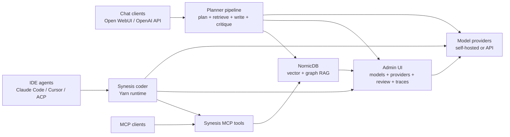

# Synesis

[](https://github.com/supernovae/synesis/actions/workflows/build-images.yml)
[](https://github.com/supernovae/synesis/actions/workflows/lint.yml)
[](LICENSE)

**Build your own AI control plane: chat, coding agents, graph-native RAG, MCP tools, model governance, and security controls on infrastructure you own.**

Synesis is a self-hosted AI platform for teams that want more than a chatbot and more than a model proxy. It gives your organization a shared knowledge layer, an agent-ready coding runtime, an admin surface for model and provider operations, and safety controls that travel with the data instead of living in one-off prompts.

Use it to wire Open WebUI, IDE agents, MCP clients, OpenAI-compatible APIs, self-hosted models, and provider APIs into one system you can inspect, operate, and extend.

**Start here:** [Local Compose](docs/LOCAL_COMPOSE.md) · [Helm install](docs/HELM_INSTALL.md) · [Connect an IDE with MCP](docs/clients/MCP_QUICKSTART.md) · [Coder clients](docs/clients/CLIENTS.md) · [Security model](docs/SECURITY.md) · [Design theory](docs/DESIGN_THEORY.md) · [Docs index](docs/README.md)

---

## Why Synesis Exists

Most AI stacks make you choose:

- a RAG app that cannot power coding agents,
- a coding agent that knows nothing about your organization,
- a model gateway without review, provenance, or operational controls,
- or a SaaS product that cannot be air-gapped or deeply customized.

Synesis is the integrated version: a Kubernetes-native platform where knowledge, tools, models, traces, review workflows, and safety policies are shared infrastructure.

## What You Can Build

**A private knowledge assistant**

Run Open WebUI or any OpenAI-compatible chat client against a planner pipeline that classifies intent, builds a plan, retrieves evidence, writes with citations, and applies critic checks before responding.

**An IDE-native coding layer**

Connect Claude Code, Cursor, VS Code, JetBrains, OpenCode, ACP clients, or custom harnesses to Synesis coder endpoints and MCP tools. Give agents access to your docs, code corpus, SynPack bundles, web search, and safety checks.

**A graph-native RAG system**

Index docs, code, API specs, web pages, and package knowledge into NornicDB. Retrieval can combine vector search, graph expansion, freshness scoring, authority signals, HITL review status, and OpenFGA-backed authorization.

**An AI operations console**

Use the admin UI to manage model registry entries, provider routing, provider API keys, RAG review queues, security events, chat feedback, traces, and operational settings.

**A platform to fork**

The repo is organized as real services and shared packages, not a demo script. You can replace model providers, add MCP tools, tune taxonomy behavior, wire new indexers, or run only the pieces you need.

## The Fun Parts

- **MCP that knows your world**: `@synesis/mcp` gives IDEs and agents graph search, docs search, code search, SynPack bundles, web search, and patch integrity checks.
- **Trust envelopes everywhere**: untrusted RAG, web, tool, and MCP content is wrapped in `TrustPacketV1` with attribution and policy metadata.
- **Multi-role model architecture**: route planner, writer, coder, critic, summarizer, and embedding work to the models that fit each job.
- **Taxonomy-shaped behavior**: domain behavior lives in YAML instead of being buried in prompt strings.
- **Coder context control**: Yarn adds compaction, transcript pruning, tool-result reduction, model-aware mediation, tracing, and governance around OpenAI/Claude-style coding traffic.
- **Operator-first security**: prompt-injection events, review queues, authz traces, security headers, and hardened schemas are visible and testable.

## Try It

### 1. Try it locally

Run the core stack without Kubernetes:

```bash
cp .env.example .env
podman compose -f podman-compose.yaml up -d
```

Then open Open WebUI at <http://localhost:3000>. See [`docs/LOCAL_COMPOSE.md`](docs/LOCAL_COMPOSE.md) for Docker Compose, optional RAG/MCP/search profiles, and model-provider configuration.

### 2. Deploy the platform

Pick a checked-in values example for your environment, copy it, then edit hosts, storage, providers, and secrets.

```bash
cp charts/synesis/examples/values-eks-external.yaml my-values.yaml

helm upgrade --install synesis ./charts/synesis \
  -f my-values.yaml \
  --namespace default \
  --create-namespace \
  --timeout 20m
```

Other starting points are in [`charts/synesis/examples/`](charts/synesis/examples/), including AKS and GKE variants. The full production guide is [`docs/HELM_INSTALL.md`](docs/HELM_INSTALL.md).

### 3. Bootstrap admin access

Create a user in the Keycloak `synesis` realm, assign `synesis-admin`, and sign in to the admin app. The admin API intentionally has no hardcoded username/password fallback.

Guide: [`docs/admin/KEYCLOAK_BOOTSTRAP.md`](docs/admin/KEYCLOAK_BOOTSTRAP.md)

### 4. Connect your IDE or agent harness

After you create a Synesis PAT with `mcp:invoke` or `coder` scope, point your client at Synesis MCP:

```json
{
  "mcpServers": {
    "synesis": {
      "command": "npx",
      "args": ["-y", "@synesis/mcp"],
      "env": {
        "SYNESIS_URL": "https://synesis.company.com",
        "SYNESIS_PAT": "syn-your-token"
      }
    }
  }
}
```

Setup guides:

- [`docs/clients/MCP_QUICKSTART.md`](docs/clients/MCP_QUICKSTART.md) for MCP.
- [`docs/clients/CLIENTS.md`](docs/clients/CLIENTS.md) for Claude Code, Cursor, ACP, and HTTP clients.
- [`base/yarn-ts/README.md`](base/yarn-ts/README.md) for coder runtime details.

## How It Fits Together


```mermaid
flowchart LR
    Chat[Chat clients\nOpen WebUI / OpenAI API] --> Planner[Planner pipeline\nplan + retrieve + write + critique]
    IDE[IDE agents\nClaude Code / Cursor / ACP] --> Coder[Synesis coder\nYarn runtime]
    MCP[MCP clients] --> Tools[Synesis MCP tools]

    Planner --> RAG[NornicDB\nvector + graph RAG]
    Tools --> RAG
    Coder --> Tools

    Planner --> Admin[Admin UI\nmodels + providers + review + traces]
    Coder --> Admin
    RAG --> Admin

    Admin --> Providers[Model providers\nself-hosted or API]
    Planner --> Providers
    Coder --> Providers
```

The short version:

- **Chat** goes through the planner pipeline for structured planning, retrieval, writing, and critic review.
- **Coder** traffic goes through Yarn, an OpenAI/Claude-compatible runtime for IDE and agent workflows.
- **MCP** exposes Synesis knowledge and safety tools to external agents.
- **Admin** is the operator surface for models, providers, review queues, security events, and traces.
- **RAG** is graph-native and authorization-aware, backed by NornicDB and optional OpenFGA row checks.

## Explore The System

- [Graph-native RAG](docs/RAG.md): retrieval, NornicDB, graph expansion, provenance, and authz.
- [Planner workflow](docs/chat/WORKFLOW_PLANNER.MD): entry, planning, routing, writing, critic, and response flow.
- [Coder runtime](docs/coder/README.md): Yarn, harness compatibility, compaction, tracing, and tool governance.
- [Security posture](docs/SECURITY.md): trust envelopes, schema hardening, prompt-injection controls, and operator checks.
- [Web search](docs/WEB_SEARCH.md): self-hosted SearXNG grounding.
- [Indexers](docs/INDEXERS.md): queue-driven ingestion for docs, code, APIs, licenses, and web pages.
- [Sandbox](docs/SANDBOX.md): isolated code execution and validation.
- [Observability](docs/OBSERVABILITY.md): metrics, dashboards, traces, and validation.
- [Design theory](docs/DESIGN_THEORY.md): guiding hypotheses, research lineage, and why the platform is shaped as a control plane.
- [Comparison notes](docs/COMPARISON.md): where Synesis fits relative to frameworks, RAG apps, coding agents, and SaaS search.

## Repository Map

```text
base/                 Runtime services: planner, coder, admin, RAG, MCP, sandbox, model serving
packages/             Shared TypeScript packages and publishable MCP tooling
charts/synesis/       Helm chart, examples, templates, and production deployment knobs
docs/                 Product, operator, security, client, and development docs
clients/              Client-side helpers and integration assets
evals/                Evaluation fixtures and harness material
scripts/              Build, validation, dependency, and maintenance helpers
```

## Project Goals

- Keep AI infrastructure inspectable, portable, and self-hostable.
- Make retrieval, provenance, review, and security shared platform features.
- Give coding agents access to real organizational context without turning every IDE into a separate silo.
- Support heterogeneous model fleets instead of assuming one model should do everything.
- Make operator controls visible: model routing, provider keys, security events, traces, feedback, and review queues.
- Stay forkable: clear services, shared contracts, docs, tests, and Kubernetes-first deployment.

## Contributing

Contributions are welcome, especially around clients, MCP tools, indexers, model adapters, evals, docs, and deployment hardening. Start with [CONTRIBUTING.md](CONTRIBUTING.md) and the [development docs](docs/development/README.md).

## License

Apache License 2.0. See [LICENSE](LICENSE) for the full text.
