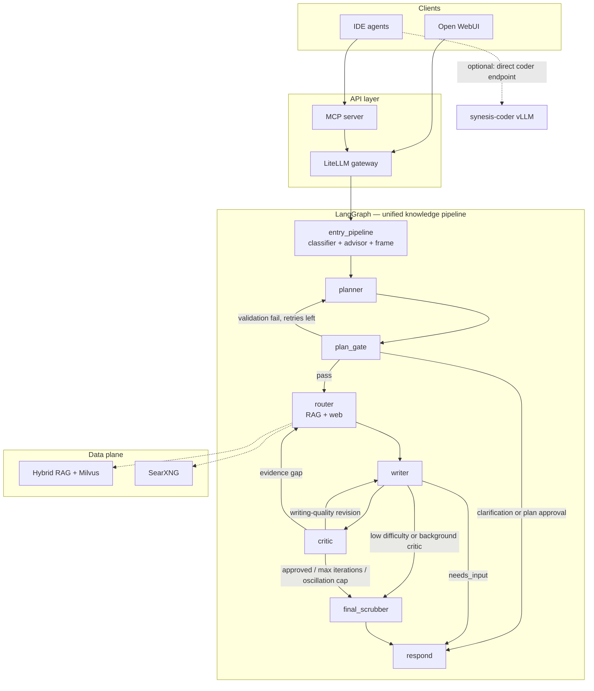

# Project Synesis

[](https://github.com/supernovae/synesis/actions/workflows/build-images.yml)
[](https://github.com/supernovae/synesis/actions/workflows/lint.yml)
[](LICENSE)

A composable, self-hosted LLM platform built on [OpenShift AI](https://www.redhat.com/en/technologies/cloud-computing/openshift/openshift-ai). Multi-model architecture with taxonomy-driven prompt shaping, hybrid RAG, and YAML-configurable behavior profiles — from 3 GPUs to production scale.

> **Synesis** (coined by Erik Hollnagel): The unification of productivity, quality, safety, and reliability. Safety and success are not separate goals, but emergent properties of the same adaptive processes.

**Repository:** [github.com/supernovae/synesis](https://github.com/supernovae/synesis)

## Theoretical Foundations

Synesis is not just an AI platform with heuristics bolted on. Its architecture is grounded in established research on how humans and systems make sense of complex, multi-domain problems.

- **Joint Cognitive Systems (Woods & Hollnagel, 2006)** — The system is designed as a human-AI collaboration where the machine exposes its understanding and uncertainty, inviting the human to refine direction rather than proceeding blindly or stalling silently.
- **Safety-II (Hollnagel, 2014)** — Quality, safety, and productivity emerge from the same adaptive processes. The critic, taxonomy routing, and evidence-gated retrieval are not bolted-on safety checks but core architectural patterns that make all output better.
- **Sensemaking / Data-Frame Theory (Klein et al., 2007)** — The system builds a holistic frame of the user's intent before acting. Domains are profiled as weighted vectors (Blei et al., 2003 LDA), not single-label classifications. A scientist managing cloud GPU ML on OpenShift genuinely spans multiple domains and should be served accordingly.
- **Cynefin Framework (Snowden & Boone, 2007)** — Response strategy scales with problem complexity. Focused prompts get focused answers. Multi-domain prompts get proportional coverage across all domains. Unclear prompts trigger collaborative clarification (probe-sense-respond) rather than assumption or stall.
- **Information Foraging (Pirolli & Card, 1999)** — Evidence gathering is guided by a conceptual TopicFrame built from what the user wants, not by keyword matching on what tools they mentioned.

See [docs/SENSEMAKING_REFERENCES.md](docs/SENSEMAKING_REFERENCES.md) for the full research bibliography with codebase mapping.

## Lateral Collaboration Model

Synesis implements a **lateral collaboration model** — domain agents operate independently with their own tools and context, but share a common layer of intelligence infrastructure: taxonomy routing, knowledge retrieval, quality gates, and critic reasoning.

The Coder agent is the first instance of this pattern. It connects directly to a dedicated coding model with tool-calling support, and reaches Synesis capabilities (RAG, taxonomy, architecture knowledge, critic review) through MCP tool calls when it needs them. The agent stays lightweight and domain-focused; Synesis provides the connective tissue.

This is the Hollnagel insight applied to multi-agent AI. Quality, safety, and productivity aren't separate concerns bolted onto each agent — they emerge from the shared adaptive processes (taxonomy-driven routing, evidence-gated critique, knowledge retrieval) that surround every agent equally.

**The pattern generalizes beyond coding.** A GIS spatial analysis agent, a compliance auditor, or a data pipeline builder can each plug into the same lateral infrastructure. Each domain agent brings its own model and tools for domain-specific work, while MCP connections to Synesis give it access to organizational knowledge, quality validation, and structured reasoning — without forcing that intelligence into the agent itself.

The architecture doesn't even require a full agent. For lighter use cases, a guided LLM with taxonomy shaping can serve the same role — the router classifies intent, the taxonomy shapes behavior, and the critic validates output. The depth scales with the need: from a single guided model endpoint up to a fully autonomous agent with MCP tools and sandbox execution.

## Architecture

Synesis separates concerns across specialized model roles. A deterministic entry classifier routes requests through a LangGraph pipeline, while domain agents (like the Coder) connect directly to dedicated models and reach Synesis intelligence through MCP tools. All model assignments, vLLM tuning, and deployment profiles are driven from a single [`models.yaml`](models.yaml).


```mermaid
flowchart TD
    subgraph clients [Clients]
        WebUI[Open WebUI]
        IDE[IDE agents]
    end

    subgraph gateway [API layer]
        LiteLLM[LiteLLM gateway]
        MCP[MCP server]
    end

    subgraph graph [LangGraph — unified knowledge pipeline]
        EP[entry_pipeline\nclassifier + advisor + frame]
        PL[planner]
        PG[plan_gate]
        RT[router\nRAG + web]
        WR[writer]
        CR[critic]
        FS[final_scrubber]
        RS[respond]
    end

    subgraph support [Data plane]
        RAG[Hybrid RAG + Milvus]
        WEB[SearXNG]
    end

    WebUI --> LiteLLM
    IDE --> MCP
    IDE -.->|optional: direct coder endpoint| CoderEP[synesis-coder vLLM]
    MCP --> LiteLLM
    LiteLLM --> EP
    EP --> PL --> PG
    PG -->|validation fail, retries left| PL
    PG -->|clarification or plan approval| RS
    PG -->|pass| RT
    RT --> WR
    WR -->|needs_input| RS
    WR -->|low difficulty or background critic| FS
    WR --> CR
    CR -->|writing-quality revision| WR
    CR -->|evidence gap| RT
    CR -->|approved / max iterations / oscillation cap| FS
    FS --> RS

    RT -.-> RAG
    RT -.-> WEB
```

Canonical order is **entry → planner → plan gate → router → writer → (critic or scrubber) → respond**. The entry node runs classifier, advisor, and frame work **before** planning (not router-first). Clarification and plan-approval prompts return from **respond**; the user’s next message resumes via **conversation memory** (often `entry_pipeline` → **planner** with merged answers — see [docs/WORKFLOW.md](docs/WORKFLOW.md)). Code execution / patch workflows are **not** on this graph; IDE coding uses the **coder** front door and optional MCP tools. Model names and GPUs: [`models.yaml`](models.yaml).

**Key design decisions:**

- **Unified planner-first graph** — every chat turn hits **entry_pipeline → planner → plan_gate** before retrieval. **Plan gate** validates the structured plan and can **retry the planner** with repair feedback. **Clarification** and **plan approval** short-circuit to **respond**; the next user turn restores pending context (draft plan, frame) from conversation memory. See [docs/WORKFLOW.md](docs/WORKFLOW.md).
- **Router-governed evidence architecture** — after the plan passes the gate, the **router** is the only retrieval orchestrator (RAG + web search). Evidence flows as structured **Evidence Packets**. A hybrid retrieval cache reduces duplicate fetches. See [docs/WORKFLOW.md](docs/WORKFLOW.md).
- **Multi-query retrieval enrichment** — each evidence request produces 3 query variants (direct, HyDE hypothetical document, conceptual expansion with taxonomy hints) retrieved in parallel and merged via Reciprocal Rank Fusion. BM25 corpus includes all indexed metadata (keywords, tags, document_name) with lightweight stemming.
- **Taxonomy-driven output style** — ~190 domain entries (see `taxonomy_prompt_config.yaml`) define persona, depth, `output_style_guidance`, `epistemic_guidance`, and `required_elements` injected into the Writer. High-complexity domains (>= 0.8) promote required elements to soft mandates in the Critic. All raw YAML fields pass through automatically — no plumbing changes needed when adding new fields.
- **Sensemaking-driven domain profiling** — Frame extraction builds a **TopicFrame** (conceptual entity guiding retrieval) and a **DomainProfile** (weighted multi-domain understanding of the prompt). Instead of hard single-domain locking, the system classifies frame coherence as **focused** (one dominant domain), **composite** (multi-domain prompt addressed proportionally), or **diffuse** (unclear frame — Cynefin probe triggered). For focused frames, a soft CohesionLock filters retrieval. For composite frames, all domains stay active and evidence is retrieved broadly. YAML-driven conflict groups (`cohesion_groups.yaml`) still inform which technologies are alternatives vs. complementary. See [docs/SENSEMAKING_REFERENCES.md](docs/SENSEMAKING_REFERENCES.md) for the research basis.
- **Evidence-aware critic** — 6-axis scoring with `evidence_utilization` (0.10 weight), deterministic citation rate check, and a strict depth gate that blocks shallow responses at high difficulty. Evidence is budget-trimmed (default 24k chars) to prevent token-budget fading. See [docs/CRITIC_RESEARCH.md](docs/CRITIC_RESEARCH.md).
- **IDEs connect directly to Coder** — a separate vLLM endpoint with tool-calling support, no LangGraph overhead. The MCP server lets the Coder reach Synesis capabilities (RAG, taxonomy, architecture knowledge) as tool calls when needed.
- **Sandbox and LSP are exception-flow tools** — they fire on code validation failures, not on every request. This keeps the happy path fast. See [docs/SANDBOX.md](docs/SANDBOX.md) and [docs/LSP.md](docs/LSP.md).
- **Taxonomy-driven prompt shaping** — Domain behavior, critic depth, writer persona, epistemic guidance, and planner decomposition rules are YAML-configurable (`taxonomy_prompt_config.yaml`). Taxonomy config is compiled at startup with Pydantic schema validation and orphan detection. No prompt logic is hardcoded in nodes. See [docs/TAXONOMY_SHAPING.md](docs/TAXONOMY_SHAPING.md).
- **Anti-oscillation controls** — immutable semantic frame, decision ledger consumed by writer (not planner prose), deterministic validators block style drift and decision oscillation across nodes, oscillation detector force-terminates runaway retry loops, retrieval churn detection. When prompts are ambiguous, **clarify-first** returns a short clarification question instead of guessing, reducing cost and avoiding retry loops.
- **Design theory (Cynefin, sensemaking, JCS, safety-II)** — Synesis is grounded in established sensemaking research. Frame coherence maps directly to the Cynefin framework (Snowden & Boone, 2007): **focused** = obvious/complicated (sense-categorize-respond); **composite** = complicated with multiple expert domains (sense-analyze-respond proportionally); **diffuse** = complex (probe-sense-respond, ask the user before retrieving blindly). Prompts are modeled as topic mixtures with weights (Blei et al., 2003 LDA), not single-label classifications. Data-Frame sensemaking (Klein et al., 2007) drives frame extraction: build a holistic understanding of the prompt before acting, rather than locking on the first keyword signal. Information foraging theory (Pirolli & Card, 1999) shapes how evidence is gathered after the frame is established. This keeps the system a joint cognitive system (human + AI), supports multi-disciplinary prompts (scientists managing cloud GPU ML clusters), and avoids the "whack-a-mole" failure mode of keyword-based hard exclusion. See [docs/SENSEMAKING_REFERENCES.md](docs/SENSEMAKING_REFERENCES.md).
- **Prompt injection hardening** — defense-in-depth with 8 layers: pattern scanning (Tier 1 + 2), trust delimiters (`<context trust="untrusted">`), instruction hierarchy (trust policies in every system prompt), sandwich defense (post-evidence reminders), datamarking (`[R:authority]`/`[W]` provenance), state sanitization (persona blocklist, step action scanning), index-time RAG scanning with admin review queue, and output guardrails. All external content — including human-vetted documents — is always wrapped as untrusted in prompts. Vetting boosts ranking, not trust. See [docs/SECURITY.md](docs/SECURITY.md).
- **EFS-backed model storage** — all model weights share a single AWS EFS PVC (`synesis-models-efs`), multi-AZ for Karpenter spot flexibility. No per-model EBS volumes.

## Model Roles

All model definitions live in [`models.yaml`](models.yaml) — the single source of truth for model repos, vLLM args, PVC sizing, and deployment names.

| Role | Default Model | Purpose |
|------|--------------|---------|
| **Router** | Qwen2.5-14B-Instruct | Fast routing, query generation, evidence summarization, planner |
| **General** | Qwen3-32B FP8 | Executor (code), Writer (knowledge synthesis), Open WebUI default |
| **Coder** | Qwen3-Coder-30B-A3B FP8 | Agentic coding for IDE clients (direct vLLM endpoint) |
| **Critic** | DeepSeek R1-Distill-Qwen-32B FP8 | Score-based quality review with configurable thinking budget |
| **Summarizer** | Qwen2.5-0.5B-Instruct | Conversation history compression (CPU) |

Models are deployed via **OpenShift AI 3** (dashboard or InferenceService YAML). See [`base/model-serving/README.md`](base/model-serving/README.md) for deployment examples.

## Composable Deployment Profiles

Synesis scales from a 3-GPU small deployment to a production cluster. Each profile defines model assignments, quantization, tensor parallelism, and GPU mapping.

| Profile | Hardware | Use Case | Models |
|---------|----------|----------|--------|
| **Small** | 3x L40S (3x g6e.2xlarge) | Multi-user small | Router + Critic on GPU 0; General on GPU 1; Coder on GPU 2 |
| **Medium** | 4x L40S | Team use, all roles dedicated | General on GPU 0; Coder TP=2 on GPUs 1-2; Router + Critic on GPU 3 |
| **Large** | 8x GPU | Production with HPA auto-scaling | All roles dedicated; Coder scales 2-4 replicas on queue depth |

```bash
# Deploy all models for a profile
./scripts/run-model-pipeline.sh --profile=small

# Deploy just one role
./scripts/run-model-pipeline.sh --role=router
```

See [`models.yaml`](models.yaml) for full profile definitions, vLLM args, and HPA configuration. See [docs/HARDWARE_SIZING.md](docs/HARDWARE_SIZING.md) for GPU memory and bandwidth guidance.

## Quick Start

### Prerequisites

- **OpenShift AI 3.x** (fast or stable channel)
- NVIDIA GPU Operator
- `oc`, `kubectl`, `kustomize` CLI tools

### 1. Bootstrap the cluster

```bash
./scripts/bootstrap.sh --ghcr-creds --hf-token   # Namespaces, PVCs, secrets
```

### 2. Deploy models

Deploy via the OpenShift AI dashboard (Model Hub, `hf://`, or OCI) or use the pipeline scripts:

```bash
./scripts/run-model-pipeline.sh --profile=small
```

### 3. Build and push images

```bash
./scripts/build-images.sh --push              # All 12 images to GHCR
./scripts/build-images.sh --push --tag v1.0   # With version tag
./scripts/build-images.sh --only planner,admin --push  # Subset
```

### 4. Deploy services

```bash
./scripts/deploy.sh dev       # Development (debug logging, RAG infra, all services)
./scripts/deploy.sh staging   # Staging
./scripts/deploy.sh prod      # Production (HA, PDBs)
```

### 5. Deploy the indexer

Run after `deploy.sh` so Milvus and embedder are healthy first. A single queue-driven CronJob processes all pending items from the admin database:

```bash
./scripts/deploy-indexer.sh            # Deploy the queue CronJob
./scripts/deploy-indexer.sh --run      # Also trigger a one-shot run now
```

Add content via the admin UI (RAG Pipeline > Ingestion Queue) or import bootstrap data:

```bash
for f in bootstrap/corpus/*.yaml; do
  curl -X POST http://synesis-admin.synesis-admin.svc:8080/api/v1/ingestion/bootstrap \
    -F "file=@$f" -H "Authorization: Bearer $TOKEN"
done
```

### 6. Connect your tools

| Endpoint | URL Pattern | Use Case |
|----------|------------|----------|
| **synesis-api** | `https://synesis-api.<cluster>/v1` | Full pipeline via LiteLLM (Open WebUI, API clients) |
| **synesis-coder** | `https://synesis-coder.<cluster>/v1` | Direct vLLM coder for Cursor / Claude Code |
| **synesis-planner** | `https://synesis-planner.<cluster>/v1` | LangGraph pipeline without LiteLLM |
| **synesis-admin** | `https://synesis-admin.<cluster>/` | Traces, web search log, RAG review, knowledge gaps, AI assistant |

The admin service serves the React SPA and a JSON API under `/api/v1`. **Interactive API docs** (Swagger UI) live at `/api/docs` on the same host; OpenAPI JSON at `/api/openapi.json`. Operator UX conventions and backlog: [base/admin/README.md](base/admin/README.md), [docs/admin/TODO.md](docs/admin/TODO.md).

See [docs/USERGUIDE.md](docs/USERGUIDE.md) for detailed configuration, API examples, and Open WebUI setup.

## Capabilities

| Capability | Description | Documentation |
|-----------|-------------|---------------|
| **Sensemaking Domain Profiling** | Weighted multi-domain frame coherence (focused/composite/diffuse) with Cynefin-inspired clarification for complex frames | [docs/SENSEMAKING_REFERENCES.md](docs/SENSEMAKING_REFERENCES.md) |
| **Taxonomy-Driven Prompt Shaping** | ~190 domain entries with persona, depth, epistemic guidance, output style — compiled at startup with Pydantic validation | [docs/TAXONOMY_SHAPING.md](docs/TAXONOMY_SHAPING.md) |
| **Hybrid RAG** | Vector + BM25 retrieval, multi-query expansion (HyDE + conceptual), RRF, authority-weighted provenance | [docs/RAG.md](docs/RAG.md) |
| **Knowledge Indexers** | Queue-driven indexer with handler plugins: code (tree-sitter AST), API specs, docs, license, web pages — content managed via admin UI | [docs/INDEXERS.md](docs/INDEXERS.md) |
| **Code Sandbox** | Exception-flow validation: lint, security scan, execute in isolated pods | [docs/SANDBOX.md](docs/SANDBOX.md) |
| **LSP Intelligence** | 6-language deep diagnostics (Python, Go, TypeScript, Bash, Java, Rust) | [docs/LSP.md](docs/LSP.md) |
| **Web Search** | Self-hosted SearXNG for live grounding — no API keys, no tracking | [docs/WEB_SEARCH.md](docs/WEB_SEARCH.md) |
| **Conversation Memory** | Per-user L1 memory with plan approval and needs_input resume | [docs/CONVERSATION_MEMORY.md](docs/CONVERSATION_MEMORY.md) |
| **Failure Knowledge** | Vector store of past mistakes; fail-fast cache for instant pattern matching | [docs/FAILURE_KB.md](docs/FAILURE_KB.md) |
| **Observability** | Perses dashboards (COO), Prometheus metrics, per-profile model panels | [docs/OBSERVABILITY.md](docs/OBSERVABILITY.md) |
| **LLM Tracing** | Per-node LangGraph tracing, LLM call rollups, critic scores, waterfall in admin UI (Postgres `traces`). Prompt-cache breakdowns: use LiteLLM spend logs or extend tracer — see [docs/WORKFLOW.md](docs/WORKFLOW.md#litellm-spend-logs-and-prompt-cache-tokens) | [docs/WORKFLOW.md](docs/WORKFLOW.md#observability-synesistracer) |
| **Web Search HITL** | Search event log, domain breakdown, per-URL vet/block/ingest actions, URL policy management — admin UI for human-in-the-loop web search review | [docs/WEB_SEARCH.md](docs/WEB_SEARCH.md) |
| **Open WebUI** | Themed child image (Synesis `custom.css`), LiteLLM integration, SSE phases | [docs/OPENWEBUI.md](docs/OPENWEBUI.md) |
| **Prompt Injection Hardening** | 8-layer defense-in-depth: pattern scanning, trust delimiters, instruction hierarchy, sandwich defense, datamarking, state sanitization, index-time RAG scanning, output guardrails | [docs/SECURITY.md](docs/SECURITY.md) |
| **Anti-Oscillation Framework** | Immutable frame, decision ledger, monotonic reducers, deterministic validators, oscillation detection, retrieval churn detection | [docs/WORKFLOW.md](docs/WORKFLOW.md#anti-oscillation-framework) |

## Project Structure

```
synesis/
├── models.yaml                 # Single source of truth for all model roles + profiles
├── docs/                       # Architecture, guides, and capability deep-dives
├── base/
│   ├── planner/                # FastAPI + LangGraph orchestrator
│   │   ├── app/graph.py        # entry_pipeline → planner → plan_gate → router → writer → critic|scrubber → respond
│   │   ├── app/nodes/          # Node implementations (router, executor, writer, planner, critic, cohesion, etc.)
│   │   ├── app/taxonomy_prompt_factory.py  # Taxonomy resolver — startup-compiled, all YAML fields forwarded
│   │   ├── app/taxonomy_config_linter.py   # Pydantic schema validation for taxonomy config
│   │   ├── taxonomy_prompt_config.yaml     # Domain behavior entries (persona, depth, epistemic, output style)
│   │   ├── intent_weights.yaml             # Intent classification + routing thresholds
│   │   └── plugins/weights/                # Vertical domain overlays (41 plugins)
│   ├── model-serving/          # vLLM deployments + InferenceService manifests
│   ├── gateway/                # LiteLLM proxy (OpenAI-compatible API)
│   ├── mcp/                    # MCP server for IDE tool integration
│   ├── rag/                    # Milvus + embedder + unified catalog + indexers
│   ├── sandbox/                # Isolated code execution (warm pool + Jobs)
│   ├── lsp/                    # LSP Intelligence Gateway (6 languages)
│   ├── search/                 # SearXNG meta-search engine
│   ├── webui/                  # Open WebUI chat frontend
│   ├── admin/                  # Admin UI — traces, web search log, RAG review, AI assistant
│   ├── postgres/               # CloudNativePG cluster (admin + trace DB)
│   ├── quality-runner/         # Corpus quality CronJob (curator agent)
│   ├── supervisor/             # Health monitoring
│   └── observability/          # Prometheus ServiceMonitors + Perses dashboards
├── overlays/
│   ├── dev/                    # Debug logging, reduced resources
│   ├── staging/                # Mirrors prod topology
│   └── prod/                   # HA, NetworkPolicies, PDBs
├── pipelines/                  # KFP model download pipelines (reads models.yaml)
├── scripts/                    # Bootstrap, deploy, build, pipeline runners
└── .github/workflows/          # CI: lint, test, build images, security scan
```

## Documentation

| Document | Description |
|----------|-------------|
| [docs/WORKFLOW.md](docs/WORKFLOW.md) | Full graph flow, retries, clarification resume, router-governed evidence |
| [docs/PLANNER_PREFIX_KV_CACHE.md](docs/PLANNER_PREFIX_KV_CACHE.md) | Prefix / KV cache expectations, clarification resume, LiteLLM usage notes |
| [docs/TAXONOMY_SHAPING.md](docs/TAXONOMY_SHAPING.md) | How to customize model behavior via YAML configuration |
| [docs/INTENT_TAXONOMY.md](docs/INTENT_TAXONOMY.md) | Intent classes, BM25 routing, critic behavior by intent |
| [docs/TAXONOMY.md](docs/TAXONOMY.md) | Full taxonomy coverage design — domain entries across categories (see YAML) |
| [docs/RAG.md](docs/RAG.md) | Hybrid retrieval pipeline, multi-query expansion, provenance, authority weighting |
| [docs/INDEXERS.md](docs/INDEXERS.md) | Queue-driven RAG indexer, handler plugins, bootstrap import |
| [docs/SANDBOX.md](docs/SANDBOX.md) | Code execution sandbox, warm pool, security controls |
| [docs/LSP.md](docs/LSP.md) | LSP Gateway architecture, supported languages, circuit breakers |
| [docs/WEB_SEARCH.md](docs/WEB_SEARCH.md) | SearXNG integration, search profiles, auto-trigger logic |
| [docs/CONVERSATION_MEMORY.md](docs/CONVERSATION_MEMORY.md) | Per-user memory, conversation scoping, pending plan resume |
| [docs/FAILURE_KB.md](docs/FAILURE_KB.md) | Failure vector store, fail-fast cache, admin dashboard |
| [docs/OBSERVABILITY.md](docs/OBSERVABILITY.md) | Perses dashboards, metrics catalog, logging levels |
| [docs/OPENWEBUI.md](docs/OPENWEBUI.md) | Open WebUI setup, troubleshooting, available models |
| [docs/HARDWARE_SIZING.md](docs/HARDWARE_SIZING.md) | GPU memory, bandwidth, cluster sizing by profile |
| [docs/COST_ESTIMATE.md](docs/COST_ESTIMATE.md) | Cloud cost estimates by profile |
| [docs/VLLM_RECIPES.md](docs/VLLM_RECIPES.md) | Model-specific vLLM args and troubleshooting |
| [docs/GPU_TOPOLOGY.md](docs/GPU_TOPOLOGY.md) | GPU topology and scheduling |
| [docs/DEVELOPMENT_CHECKS.md](docs/DEVELOPMENT_CHECKS.md) | Local development and CI checks |
| [docs/MODEL_EXERCISE.md](docs/MODEL_EXERCISE.md) | Observed model limitations, benchmark history |
| [docs/SENSEMAKING_REFERENCES.md](docs/SENSEMAKING_REFERENCES.md) | Sensemaking, Cynefin, JCS, and Safety-II research foundations |
| [docs/CRITIC_RESEARCH.md](docs/CRITIC_RESEARCH.md) | Research basis for critic evaluation rubric, scoring dimensions, calibration path |
| [docs/LORA_TRAINING_GUIDE.md](docs/LORA_TRAINING_GUIDE.md) | LoRA adapter training strategy per model role |
| [docs/SECURITY.md](docs/SECURITY.md) | Prompt injection hardening, trust model, authority hierarchy, admin review workflow |
| [docs/OPENROUTER.md](docs/OPENROUTER.md) | OpenRouter deployment overlay, budget/quality tiers |
| [docs/OPENWEBUI_PHASES.md](docs/OPENWEBUI_PHASES.md) | SSE phase streaming, status events, background critic |
| [docs/OPENWEBUI_ADMIN_GUIDE.md](docs/OPENWEBUI_ADMIN_GUIDE.md) | Open WebUI admin configuration, feedback pipe |
| [docs/FEEDBACK_API.md](docs/FEEDBACK_API.md) | Thumbs up/down feedback API, Open WebUI plugin |
| [docs/STREAMING_BUFFERING.md](docs/STREAMING_BUFFERING.md) | HAProxy buffering, SSE streaming, critic modes |
| [docs/IDE_CLIENT_COORDINATION.md](docs/IDE_CLIENT_COORDINATION.md) | IDE/agent client trust model, prompt injection defense |
| [docs/UV_TOOLING.md](docs/UV_TOOLING.md) | UV for Python dependency management (local, CI, containers) |
| [docs/EXPERIMENTS.md](docs/EXPERIMENTS.md) | Design experiments: parallel critic, adaptive depth mode |
| [docs/COHERENCE_GATE_ARCHIVE.md](docs/COHERENCE_GATE_ARCHIVE.md) | Removed coherence gate: rationale, original implementation, restoration guide |
| [docs/ARCHITECTURE_AUDIT.md](docs/ARCHITECTURE_AUDIT.md) | Historical architecture audit and remediation log |
| [docs/admin/TODO.md](docs/admin/TODO.md) | Admin UI backlog: API explorer, MCP roadmap, doc/UX gaps |

## Changing Models

1. Edit [`models.yaml`](models.yaml) with the new HuggingFace repo, name, and vLLM args
2. Run `./scripts/run-model-pipeline.sh --role=<role>` to download and deploy
3. Redeploy services if config changed: `./scripts/deploy.sh dev`

The `.cursor/rules/model-alignment.mdc` rule reminds you which files reference model endpoints.

## Contributing

See [CONTRIBUTING.md](CONTRIBUTING.md) for guidelines on submitting issues, pull requests, and code standards.

## License

Apache License 2.0. See [LICENSE](LICENSE) for the full text.
