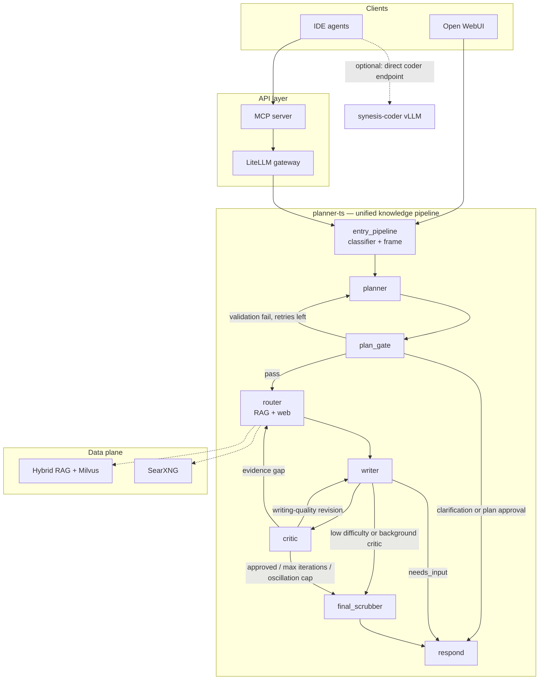

# Synesis

[](https://github.com/supernovae/synesis/actions/workflows/build-images.yml)
[](https://github.com/supernovae/synesis/actions/workflows/lint.yml)
[](LICENSE)

**A self-hosted enterprise intelligence platform — RAG, MCP, and agentic coding on your infrastructure.**

Synesis is a composable, multi-model AI platform for Kubernetes. It combines a taxonomy-driven knowledge pipeline, hybrid RAG with HITL quality gates, an MCP-connected agentic coding runtime, and a full admin surface — all self-hosted, all open source. OpenShift and OpenShift AI are supported deployment options with additional operational tooling.

> *Synesis* — from Erik Hollnagel's work on joint cognitive systems: productivity, quality, safety, and reliability as emergent properties of the same adaptive processes. See [docs/SYSTEMS_THEORY.md](docs/SYSTEMS_THEORY.md) for the research foundations that guide our architecture.

**Repository:** [github.com/supernovae/synesis](https://github.com/supernovae/synesis)

---

## What Synesis Does

Most enterprise AI platforms solve one problem well: a chatbot with RAG, or a coding assistant, or an orchestration framework. Synesis integrates these into a single self-hosted stack where knowledge, quality, and safety are shared infrastructure — not per-tool afterthoughts.

| Capability | What It Means |
|-----------|--------------|
| **Knowledge Pipeline** | Every chat turn goes through intent classification, domain profiling, structured planning, hybrid retrieval (Milvus + web), evidence-gated writing, and multi-axis critic review — not just "prompt → LLM → response" |
| **Hybrid RAG** | Dense + sparse vector search (Milvus), web search (SearXNG), RRF merge, cross-encoder reranking, authority-weighted provenance, document freshness scoring, and HITL review queues |
| **Agentic Coding** | Dedicated coder model with tool-calling, sandbox execution — IDE-native via MCP and OpenAI-compatible endpoints |
| **MCP Integration** | Domain agents (coding, analysis, compliance) connect to shared organizational intelligence (RAG, taxonomy, quality gates) through MCP tool calls — lightweight agents, shared infrastructure |
| **Taxonomy-Driven Behavior** | ~190 domain entries configure persona, depth, epistemic guidance, output style, and critic behavior via YAML — no prompt logic hardcoded in nodes |
| **Trust & Safety** | 9-layer prompt injection defense, unified trust envelopes with attribution metadata, index-time scanning, admin review queues, deterministic policy matrix |
| **Admin Surface** | Model registry, provider governance, security console, RAG pipeline management, quality benchmarks, observability traces — all in one UI |
| **Composable Deployment** | Role-based model serving on Kubernetes; provider-governed registry; shared storage for model weights |

### How Synesis Compares

| | Synesis | LangChain / LlamaIndex | Dify / Flowise | Cursor / Continue | Perplexity / Glean |
|-|---------|----------------------|---------------|------------------|-------------------|
| **Self-hosted, air-gappable** | Yes — your infrastructure, your models, your data | Framework only — bring your own infra | Partial — some cloud dependencies | Cloud-first | SaaS only |
| **Integrated RAG + coding + MCP** | Single platform | Separate libraries to compose | RAG workflows, no coding agent | Coding only, no RAG pipeline | Search only, no coding |
| **Taxonomy-driven behavior** | ~190 domains, YAML-configurable | Manual prompt engineering | Basic prompt templates | None | None |
| **Multi-axis critic review** | 6-axis scoring, evidence-gated, anti-oscillation | None built in | None | None | None |
| **Admin operations UI** | Model registry, security console, RAG review, traces | None | Basic UI | None | Dashboard |
| **Trust & attribution** | TrustPacketV1 envelopes, HITL review, scan + freshness | None | None | None | Source links |
| **Multi-model architecture** | Router, General, Coder, Critic, Summarizer — each provisioned for its role | Single model | Single model | Single model | Proprietary |

---

## Architecture

Synesis separates concerns across specialized model roles. A deterministic entry classifier routes requests through the **planner-ts** pipeline (`base/planner-ts/`, Fastify + TypeScript), while domain agents (like the Coder) connect directly to dedicated models and reach Synesis intelligence through MCP tools. Runtime model routing is configured in the admin Model Registry (Postgres) and reconciled to LiteLLM.


```mermaid
flowchart TD
    subgraph clients [Clients]
        WebUI[Open WebUI]
        IDE[IDE agents]
    end

    subgraph gateway [API layer]
        LiteLLM[LiteLLM gateway]
        MCP[MCP server]
    end

    subgraph graph [planner-ts — unified knowledge pipeline]
        EP[entry_pipeline\nclassifier + frame]
        PL[planner]
        PG[plan_gate]
        RT[router\nRAG + web]
        WR[writer]
        CR[critic]
        FS[final_scrubber]
        RS[respond]
    end

    subgraph support [Data plane]
        RAG[Hybrid RAG + Milvus]
        WEB[SearXNG]
    end

    WebUI --> EP
    IDE --> MCP
    IDE -.->|optional: direct coder endpoint| CoderEP[synesis-coder vLLM]
    MCP --> LiteLLM
    LiteLLM --> EP
    EP --> PL --> PG
    PG -->|validation fail, retries left| PL
    PG -->|clarification or plan approval| RS
    PG -->|pass| RT
    RT --> WR
    WR -->|needs_input| RS
    WR -->|low difficulty or background critic| FS
    WR --> CR
    CR -->|writing-quality revision| WR
    CR -->|evidence gap| RT
    CR -->|approved / max iterations / oscillation cap| FS
    FS --> RS

    RT -.-> RAG
    RT -.-> WEB
```

Canonical order: **entry → planner → plan gate → router → writer → (critic or scrubber) → respond**. Clarification and plan-approval prompts return from **respond**; the user's next message resumes via conversation memory. Code execution / patch workflows are **not** on this graph; IDE coding uses the **coder** front door and optional MCP tools.

**Where LiteLLM sits:** Open WebUI talks **only** to planner-ts (left side of the diagram). **Planner-ts** then reaches upstream models through **LiteLLM** when using hosted API providers, or **directly to vLLM** (InferenceService) for self-hosted models — that hop is not shown inside the LangGraph box. Some clients use **synesis-api** (LiteLLM) as their entry to the same pipeline instead of calling planner directly.

### Key Design Decisions

- **Unified planner-first graph** — every chat turn hits entry → planner → plan gate before retrieval. Plan gate validates the structured plan and can retry the planner with repair feedback. See [docs/chat/WORKFLOW_PLANNER.MD](docs/chat/WORKFLOW_PLANNER.MD).
- **Router-governed evidence** — after the plan passes the gate, the router is the sole retrieval orchestrator (RAG + web). Evidence flows as structured packets with trust envelopes and attribution metadata.
- **Unified retrieval with RRF** — parallel RAG and web searches merged via Reciprocal Rank Fusion. RAG uses Milvus hybrid search (dense + sparse) with adaptive top-K, cross-encoder reranking (BGE or FlashRank), authority weighting, and freshness scoring.
- **Evidence-aware critic** — 6-axis scoring with `evidence_utilization`, deterministic citation rate check, and a strict depth gate that blocks shallow responses at high difficulty.
- **Anti-oscillation controls** — immutable semantic frame, decision ledger, deterministic validators, oscillation detector, retrieval churn detection. When prompts are ambiguous, **clarify-first** returns a short clarification question instead of guessing.
- **Sensemaking-driven profiling** — Frame extraction builds a TopicFrame and DomainProfile with weighted multi-domain understanding. Frame coherence (focused / composite / diffuse) maps to Cynefin-style response strategies. See [docs/SYSTEMS_THEORY.md](docs/SYSTEMS_THEORY.md).
- **Prompt injection hardening** — 9-layer defense-in-depth: pattern scanning, JSON trust envelopes, instruction hierarchy, sandwich defense, datamarking, state sanitization, index-time scanning with HITL review, output guardrails, and error sanitization. See [docs/SECURITY.md](docs/SECURITY.md).

## Model Roles

Model/provider routing is managed through the admin Model Registry and synced to LiteLLM.

| Role | Default Model | Purpose |
|------|--------------|---------|
| **Router** | Qwen2.5-14B-Instruct | Fast routing, query generation, evidence summarization, planner |
| **General** | Qwen3-32B FP8 | Executor (code), Writer (knowledge synthesis), Open WebUI default |
| **Coder** | Qwen3-Coder-30B-A3B FP8 | Agentic coding for IDE clients (direct vLLM endpoint) |
| **Critic** | DeepSeek R1-Distill-Qwen-32B FP8 | Score-based quality review with configurable thinking budget |
| **Summarizer** | Qwen2.5-0.5B-Instruct | Conversation history compression (CPU) |

Models are deployed on Kubernetes through vLLM/KServe runtimes and then assigned in Model Registry. See [`base/model-serving/README.md`](base/model-serving/README.md).

## Capacity and Deployment Planning

Synesis scales from single-GPU role deployments to multi-node production clusters. Plan capacity with explicit resources: per-role GPU allocation, tensor parallelism, replica counts, and queue/backpressure policy.

| Dimension | Example | Why it matters |
|-----------|---------|----------------|
| **GPU allocation** | 1 GPU each for router/general/coder/critic | Prevents cross-role contention |
| **Tensor parallelism** | TP=2 for larger coder models | Enables larger checkpoints |
| **Replica policy** | 1-2 replicas per latency-critical role | Improves availability and tail latency |
| **Storage layout** | Shared PVC with role `subPath` mounts | Speeds restarts and model rollouts |

```bash
# Download/refresh one role model
./scripts/run-model-pipeline.sh --role=router --model-repo=Qwen/Qwen2.5-14B-Instruct
```

See [docs/HARDWARE_SIZING.md](docs/HARDWARE_SIZING.md) for GPU memory and bandwidth guidance.

## Quick Start

### Prerequisites

- Kubernetes cluster (OpenShift supported)
- NVIDIA GPU Operator
- `oc`, `kubectl`, `kustomize` CLI tools

### 1. Bootstrap the cluster

```bash
./scripts/bootstrap.sh --ghcr-creds --hf-token   # Namespaces, PVCs, secrets
```

### 2. Deploy models

Deploy models through your serving runtime (OpenShift AI dashboard, KServe, or vLLM) and/or use the pipeline script:

```bash
./scripts/run-model-pipeline.sh --role=router --model-repo=Qwen/Qwen2.5-14B-Instruct
```

### 3. Build and push images

```bash
./scripts/build-images.sh --push              # All 17 images to GHCR (3 base + 14 service)
./scripts/build-images.sh --push --tag v1.0   # With version tag
./scripts/build-images.sh --only planner,admin --push  # Subset
```

### 4. Deploy services

```bash
./scripts/deploy.sh dev       # Development (debug logging, RAG infra, all services)
./scripts/deploy.sh staging   # Staging
./scripts/deploy.sh prod      # Production (HA, PDBs)
```

### 4b. First Synesis Admin login (Keycloak)

There is **no** built-in Synesis username/password. After Keycloak and realm **`synesis`** are up, create at least one user **in realm `synesis`**, assign the **`synesis-admin`** realm role, align **`synesis-admin`** client redirect URIs with your admin URL, and set **`SYNESIS_KEYCLOAK_ISSUER_URL`** on the admin deployment. Then open the admin SPA and sign in via OIDC.

Step-by-step: **[docs/admin/KEYCLOAK_BOOTSTRAP.md](docs/admin/KEYCLOAK_BOOTSTRAP.md)**.

### 5. Deploy the indexer

Run after `deploy.sh` so Milvus and embedder are healthy first. A single queue-driven CronJob processes all pending items from the admin database:

```bash
./scripts/deploy-indexer.sh            # Deploy the queue CronJob
./scripts/deploy-indexer.sh --run      # Also trigger a one-shot run now
```

Add content via the admin UI (RAG Pipeline > Ingestion Queue) or import bootstrap data:

```bash
# TOKEN = Personal Access Token (syn-...) or Keycloak access token — see KEYCLOAK_BOOTSTRAP.md
for f in bootstrap/corpus/*.yaml; do
  curl -X POST http://synesis-admin.synesis-admin.svc:8080/api/v1/ingestion/bootstrap \
    -F "file=@$f" -H "Authorization: Bearer $TOKEN"
done
```

Or use `./scripts/load-bootstrap.sh` with `SYNESIS_ADMIN_TOKEN` set.

### 6. Connect your tools

| Endpoint | URL Pattern | Use Case |
|----------|------------|----------|
| **synesis-api** | `https://synesis-api.<cluster>/v1` | LiteLLM gateway (external API clients and tools that target the gateway) |
| **synesis-coder** | `https://synesis-coder.<cluster>/v1` | Direct vLLM coder for Cursor / Claude Code |
| **synesis-planner-ts** | `https://synesis-planner-ts.<cluster>/v1` | Planner pipeline — **Open WebUI** uses this URL directly (not via LiteLLM) |
| **synesis-admin** | `https://synesis-admin.<cluster>/` | Model Registry, Provider Management, traces, RAG review, security console |

The admin service serves the React SPA and a JSON API under `/api/v1`. **Interactive API docs** (Swagger UI) live at `/api/docs`; OpenAPI JSON at `/api/openapi.json`. Key admin surfaces:

- **Model Registry** — assign models to pipeline roles; reconcile to LiteLLM
- **Provider Management** — enable/disable providers, set defaults, governance policies
- **Security Console** — guardrail event dashboard, severity triage, containment actions
- **RAG Pipeline** — ingestion queue, corpus review, quality benchmarks, trust attribution, freshness scoring
- **Observability** — traces, web search log, knowledge gaps, feedback review

Operator UX conventions and backlog: [base/admin/README.md](base/admin/README.md), [docs/admin/TODO.md](docs/admin/TODO.md).

See [docs/user/USERGUIDE.md](docs/user/USERGUIDE.md) for detailed configuration, API examples, and Open WebUI setup.

## Capabilities

| Capability | Description | Documentation |
|-----------|-------------|---------------|
| **Knowledge Pipeline** | Sensemaking-driven domain profiling, Cynefin-aware clarification, structured planning, evidence-gated writing, multi-axis critic | [docs/chat/WORKFLOW_PLANNER.MD](docs/chat/WORKFLOW_PLANNER.MD) |
| **Taxonomy-Driven Prompt Shaping** | ~190 domain entries with persona, depth, epistemic guidance, output style — compiled at startup with Pydantic validation | [docs/TAXONOMY_SHAPING.md](docs/TAXONOMY_SHAPING.md) |
| **Hybrid RAG** | Milvus hybrid search (dense + sparse), RRF merge of RAG + web, cross-encoder reranking, authority-weighted provenance, freshness scoring | [docs/RAG.md](docs/RAG.md) |
| **Knowledge Indexers** | Queue-driven indexer with handler plugins: code (tree-sitter AST), API specs, docs, license, web pages — content managed via admin UI | [docs/INDEXERS.md](docs/INDEXERS.md) |
| **Agentic Coding** | Coder model with tool-calling, code sandbox (lint, security scan, execute) | [docs/SANDBOX.md](docs/SANDBOX.md) |
| **Web Search** | Self-hosted SearXNG for live grounding — no API keys, no tracking | [docs/WEB_SEARCH.md](docs/WEB_SEARCH.md) |
| **Trust & Safety** | 9-layer prompt injection defense, TrustPacketV1 envelopes, attribution metadata, HITL review, shared guardrails core | [docs/SECURITY.md](docs/SECURITY.md) |
| **Admin Operations** | Model registry, provider governance, security console, RAG review with trust/freshness pivots, traces | [base/admin/README.md](base/admin/README.md) |
| **Conversation Memory** | L1 in-process turns + pending state; optional Redis L2 for pending checkpoints and pivot archives | [docs/chat/CONVERSATION_MEMORY.md](docs/chat/CONVERSATION_MEMORY.md) |
| **Observability** | Perses dashboards (COO), Prometheus metrics, model-role panels, span-based pipeline tracing | [docs/OBSERVABILITY.md](docs/OBSERVABILITY.md) |
| **Open WebUI** | Themed child image, direct connection to planner-ts, SSE phase streaming, background critic | [docs/chat/OPENWEBUI.md](docs/chat/OPENWEBUI.md) |
| **Anti-Oscillation Framework** | Immutable frame, decision ledger, monotonic reducers, deterministic validators, oscillation detection | [docs/chat/WORKFLOW_PLANNER.MD](docs/chat/WORKFLOW_PLANNER.MD) |

## Project Structure

```
synesis/
├── docs/                       # Doc hub: platform + chat/ (planner-ts) + coder/ (yarn-ts) + user/ + development/
├── base/
│   ├── planner-ts/             # Fastify + TypeScript pipeline (primary planner runtime)
│   │   ├── src/graph.ts        # entry_pipeline → planner → plan_gate → router → writer → critic|scrubber → respond
│   │   ├── src/pipeline.ts     # Graph execution, direct-stream fast path
│   │   ├── src/nodes/          # Node implementations (router, writer, planner, critic, scoring-engine, etc.)
│   │   ├── src/retrieval/      # Unified RAG + web retrieval, cohesion, RRF merge
│   │   ├── src/security/       # Scanner, normalizer, trust prompts, step sanitizer
│   │   └── src/tracing/        # SpanCollector — pipeline-level span tracing
│   ├── model-serving/          # vLLM deployments + InferenceService manifests
│   ├── gateway/                # LiteLLM proxy (OpenAI-compatible API)
│   ├── mcp/                    # MCP server for IDE tool integration
│   ├── rag/                    # Milvus + embedder + unified catalog + indexers
│   ├── sandbox/                # Isolated code execution (warm pool + Jobs)
│   ├── search/                 # SearXNG meta-search engine
│   ├── webui/                  # Open WebUI chat frontend
│   ├── yarn-ts/                # Synesis Yarn (TypeScript) — OpenAI-compatible IDE/agent runtime
│   ├── security/               # Shared guardrails core (scanner, policy matrix, metrics)
│   ├── admin/                  # Admin UI — model registry, provider governance, security console, traces
│   ├── postgres/               # CloudNativePG cluster (admin + trace DB)
│   ├── quality-runner/         # Corpus quality CronJob (curator agent)
│   ├── supervisor/             # Health monitoring
│   └── observability/          # Prometheus ServiceMonitors + Perses dashboards
├── packages/
│   └── synesis-context-trust/  # Shared trust envelopes, attribution, freshness scoring
├── overlays/
│   ├── dev/                    # Debug logging, reduced resources
│   ├── staging/                # Mirrors prod topology
│   └── prod/                   # HA, NetworkPolicies, PDBs
├── pipelines/                  # KFP model download pipelines (role-driven CLI parameters)
├── scripts/                    # Bootstrap, deploy, build, pipeline runners
└── .github/workflows/          # CI: lint, test, build images, guardrails, security scan, quality pipeline
```

## Documentation

Start at **[docs/README.md](docs/README.md)** for how the tree is organized (**chat** vs **coder** vs **platform** vs **user/clients** vs **engineering**).

| Document | Description |
|----------|-------------|
| [docs/README.md](docs/README.md) | Documentation map (chat, coder, platform, user, development) |
| [docs/AWESOME_PAPERS.MD](docs/AWESOME_PAPERS.MD) | Curated papers and primary references (security, RAG, critic, sensemaking, routing) |
| [docs/SYSTEMS_THEORY.md](docs/SYSTEMS_THEORY.md) | Research foundations: sensemaking, Cynefin, JCS, Safety-II, information foraging, trust research |
| [docs/DESIGN_THEORY.md](docs/DESIGN_THEORY.md) | Cynefin domain mapping, clarify-first behavior, epistemic discipline |
| [docs/chat/WORKFLOW_PLANNER.MD](docs/chat/WORKFLOW_PLANNER.MD) | Full graph flow, retries, clarification resume, router-governed evidence |
| [docs/TAXONOMY_SHAPING.md](docs/TAXONOMY_SHAPING.md) | How to customize model behavior via YAML configuration |
| [docs/INTENT_TAXONOMY.md](docs/INTENT_TAXONOMY.md) | Intent classes, BM25 routing, critic behavior by intent |
| [docs/TAXONOMY.md](docs/TAXONOMY.md) | Full taxonomy coverage design — domain entries across categories |
| [docs/RAG.md](docs/RAG.md) | Hybrid retrieval pipeline, multi-query expansion, provenance, authority weighting |
| [docs/INDEXERS.md](docs/INDEXERS.md) | Queue-driven RAG indexer, handler plugins, v13 schema, trust attribution |
| [docs/ADMIN_QUALITY_UI.md](docs/ADMIN_QUALITY_UI.md) | Feedback loops, quality signals, HITL review, freshness scoring |
| [docs/SANDBOX.md](docs/SANDBOX.md) | Code execution sandbox, warm pool, security controls |
| [docs/WEB_SEARCH.md](docs/WEB_SEARCH.md) | SearXNG integration, search profiles, auto-trigger logic |
| [docs/chat/CONVERSATION_MEMORY.md](docs/chat/CONVERSATION_MEMORY.md) | L1/L2 memory, scope key, Redis pending + pivot archive |
| [docs/SECURITY.md](docs/SECURITY.md) | Trust envelopes, 9-layer prompt injection defense, attribution, admin review |
| [docs/coder/README.md](docs/coder/README.md) | **Coder** (yarn-ts): IDE/agent runtime, governance, RAG integration |
| [docs/YARN_RUNTIME.md](docs/YARN_RUNTIME.md) | Short redirect to coder + `base/yarn-ts` (legacy filename) |
| [docs/OBSERVABILITY.md](docs/OBSERVABILITY.md) | Perses dashboards, metrics catalog, logging levels |
| [docs/HARDWARE_SIZING.md](docs/HARDWARE_SIZING.md) | GPU memory, bandwidth, and capacity planning |
| [docs/COST_ESTIMATE.md](docs/COST_ESTIMATE.md) | Cloud cost estimates by explicit resource footprint |
| [docs/VLLM_RECIPES.md](docs/VLLM_RECIPES.md) | Model-specific vLLM args and troubleshooting |
| [docs/chat/OPENWEBUI.md](docs/chat/OPENWEBUI.md) | Open WebUI setup, troubleshooting, available models |
| [docs/development/README.md](docs/development/README.md) | **Engineering hub:** CI/test inventory (**TESTING**), milestone M1–M11 archive, GitHub validation secrets, parity trackers |
| [docs/CRITIC_RESEARCH.md](docs/CRITIC_RESEARCH.md) | Research basis for critic evaluation rubric |
| [docs/chat/PLANNER_PREFIX_KV_CACHE.md](docs/chat/PLANNER_PREFIX_KV_CACHE.md) | Prefix / KV cache expectations, LiteLLM usage |
| [docs/LORA_TRAINING_GUIDE.md](docs/LORA_TRAINING_GUIDE.md) | LoRA adapter training strategy per model role |
| [docs/admin/TODO.md](docs/admin/TODO.md) | Admin UI backlog: API explorer, MCP roadmap, doc/UX gaps |

## Changing Models

**For a running cluster** (typical day-to-day):

1. Open the **admin Model Registry** and update role → model assignments
2. Run **Reconcile** to sync changes to LiteLLM
3. Deploy the model through your cluster serving runtime if it is not already running

**To deploy/refresh a local runtime model**:

1. Run `./scripts/run-model-pipeline.sh --role=<role> --model-repo=<hf-repo>` to download model weights
2. Confirm or update the serving deployment (vLLM/KServe) for that role
3. Redeploy services if config changed: `./scripts/deploy.sh dev`

## Contributing

See [CONTRIBUTING.md](CONTRIBUTING.md) for guidelines on submitting issues, pull requests, and code standards.

## License

Apache License 2.0. See [LICENSE](LICENSE) for the full text.
