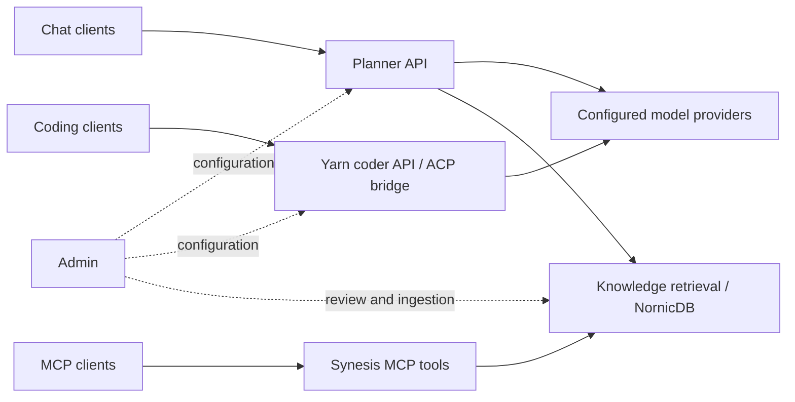

# Synesis

[](https://github.com/supernovae/synesis/actions/workflows/build-images.yml)
[](https://github.com/supernovae/synesis/actions/workflows/lint.yml)
[](LICENSE)

**Self-hosted chat, coding-agent integration, knowledge retrieval, and model operations.**

Synesis connects chat clients and coding agents to shared model providers, indexed knowledge, tools, and operator controls. Run models on your own infrastructure or use hosted APIs, with routing, retrieval, session diagnostics, and review workflows in one platform.

The project is built for teams that want to operate and extend their AI stack. Start with a local evaluation; use the Helm chart to deploy on Kubernetes.

[Try locally](docs/LOCAL_COMPOSE.md) · [Deploy with Helm](docs/HELM_INSTALL.md) · [Connect a client](docs/clients/CLIENTS.md) · [Documentation](docs/README.md) · [Contribute](CONTRIBUTING.md)

## What it provides

| Surface | What you can use |
| --- | --- |
| **Chat** | A planner API for Open WebUI and OpenAI-compatible clients, with direct-answer, planning, retrieval, writing, and critic paths selected by workflow and configuration. |
| **Coder** | Yarn, a runtime for OpenAI- and Claude-style coding traffic, with provider routing, context budgets, tool validation, session state, and an ACP bridge. |
| **Knowledge** | NornicDB-backed vector and graph retrieval over indexed documents and code, with provenance, freshness, review metadata, and optional OpenFGA authorization checks. |
| **MCP tools** | Knowledge search, SynPack context bundles, web search, and patch checks for external agents. Available tools depend on the deployment and enabled integrations. |
| **Administration** | Model and provider configuration, credentials, review queues, usage, traces, feedback, and security events. |

Shared TypeScript packages and service boundaries let you add tools, indexers, model adapters, and deployment integrations. Taxonomy and policy configuration provide additional ways to adapt behavior without editing prompts throughout the codebase.

## Try it locally

Install Podman with Compose support, or Docker Compose, then run from this repository:

```bash
cp .env.example .env
podman compose -f podman-compose.yaml up -d
```

For Docker, substitute `docker compose` for `podman compose`.

Open <http://localhost:3000> to create an Open WebUI account. **Model calls are disabled by default:** this first step starts the services for UI and health checks. Follow the [local setup guide](docs/LOCAL_COMPOSE.md#quick-start) to configure a model endpoint and enable chat.

The local stack uses published container images. RAG, ingestion, search, and MCP services are optional profiles. Admin browser login requires a configured OIDC provider; the Compose stack does not include a Keycloak realm import. Local defaults are intended for development and evaluation.

## Deploy and connect

For Kubernetes, choose and customize a [Helm values example](charts/synesis/examples/), then follow the [installation guide](docs/HELM_INSTALL.md). Configure identity, secrets, storage, networking, and model providers for your environment. The chart provides deployment configuration; operating and securing the installation remains your responsibility.

Once a deployment is running:

- [Bootstrap admin access](docs/admin/KEYCLOAK_BOOTSTRAP.md) through Keycloak.
- [Connect MCP tools](docs/clients/MCP_QUICKSTART.md) using a PAT with `mcp:invoke` scope or the documented OIDC flow.
- [Connect a coding client](docs/clients/CLIENTS.md) to the coder API or ACP bridge.
- [Index your content](docs/INDEXERS.md) and configure [RAG](docs/RAG.md) or [SynPacks](docs/SYNPACKS.md).

## How it fits together


```mermaid
flowchart LR
    Chat[Chat clients] --> Planner[Planner API]
    Agents[Coding clients] --> Yarn[Yarn coder API / ACP bridge]
    MCP[MCP clients] --> Tools[Synesis MCP tools]
    Planner --> Models[Configured model providers]
    Yarn --> Models
    Planner --> Knowledge[Knowledge retrieval / NornicDB]
    Tools --> Knowledge
    Admin[Admin] -. configuration .-> Planner
    Admin -. configuration .-> Yarn
    Admin -. review and ingestion .-> Knowledge
```

Planner and Yarn share contracts and infrastructure, but serve different workflows. An existing coding client continues to own its native tools, execution environment, and approval controls. Synesis supplies additional context and policy checks at the API boundary.

## Compatibility and boundaries

- **Client support is integration-specific.** The [harness compatibility guide](docs/clients/HARNESS_COMPATIBILITY.md) covers recognized clients, including Hermes Agent and DeepSeek Harness, metadata requirements, and tested contracts. Recognition is not certification of every client version or plugin.
- **Model behavior and endpoint behavior are separate.** The [model shim audit](docs/model-shim-audit-2026-09.md) documents DeepSeek, Qwen, GLM, Kimi, MiniMax, and MiMo handling, including reasoning replay and current validation limits. Tool parsers and optional API features depend on the serving endpoint.
- **Context reduction has tradeoffs.** Configured budgets, exact-output deduplication, and recoverable artifacts can reduce repeated input. Compaction can still remove useful detail; model names do not justify automatic context discounts or recall guarantees.
- **Security controls have defined boundaries.** Schema validation, trust metadata, authorization checks, and tool policies provide defense in depth. They do not guarantee correct answers or replace the execution host's sandbox. See the [security model](docs/SECURITY.md).
- **Self-hosted does not automatically mean offline.** Hosted models, web search, package downloads, and external connectors create network dependencies. A disconnected installation requires internally available models, images, dependencies, and data sources.

Automated tests exercise contracts and regression cases. Live model quality, latency, cost, and compatibility depend on your configuration and workload. Use the [testing guide](docs/development/TESTING.md) and deployment canaries before relying on a new integration.

## Explore the project

- [Documentation index](docs/README.md): setup, users, operators, and development.
- [Chat workflow](docs/chat/WORKFLOW_PLANNER.MD) and [coder runtime](base/yarn-ts/README.md).
- [Knowledge retrieval](docs/RAG.md), [indexers](docs/INDEXERS.md), and [web search](docs/WEB_SEARCH.md).
- [Observability](docs/OBSERVABILITY.md) and [security](docs/SECURITY.md).
- [Design hypotheses](docs/DESIGN_THEORY.md) and [project fit](docs/COMPARISON.md).

```text
base/                 Runtime services
packages/             Shared TypeScript packages and MCP tooling
charts/synesis/       Helm chart and deployment examples
docs/                 User, operator, design, and development documentation
clients/              Client helpers and integration assets
evals/                Evaluation fixtures and harness material
scripts/              Build, validation, and maintenance tools
```

## Contributing

Contributions to integrations, evals, documentation, tools, and deployment workflows are welcome. Start with [CONTRIBUTING.md](CONTRIBUTING.md) and the [development guide](docs/development/README.md). For behavioral changes, include a reproducible example and relevant validation; distinguish measured results from intended improvements.

## License

[Apache License 2.0](LICENSE).
