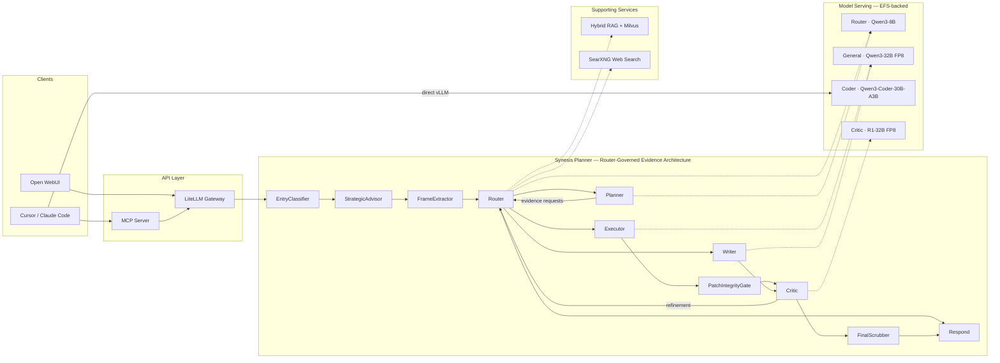

# Project Synesis

[](https://github.com/supernovae/synesis/actions/workflows/build-images.yml)
[](https://github.com/supernovae/synesis/actions/workflows/lint.yml)
[](LICENSE)

A composable, self-hosted LLM platform built on [OpenShift AI](https://www.redhat.com/en/technologies/cloud-computing/openshift/openshift-ai). Multi-model architecture with taxonomy-driven prompt shaping, hybrid RAG, and YAML-configurable behavior profiles — from 3 GPUs to production scale.

> **Synesis** (coined by Erik Hollnagel): The unification of productivity, quality, safety, and reliability. Safety and success are not separate goals, but emergent properties of the same adaptive processes.

**Repository:** [github.com/supernovae/synesis](https://github.com/supernovae/synesis)

## Lateral Collaboration Model

Synesis implements a **lateral collaboration model** — domain agents operate independently with their own tools and context, but share a common layer of intelligence infrastructure: taxonomy routing, knowledge retrieval, quality gates, and critic reasoning.

The Coder agent is the first instance of this pattern. It connects directly to a dedicated coding model with tool-calling support, and reaches Synesis capabilities (RAG, taxonomy, architecture knowledge, critic review) through MCP tool calls when it needs them. The agent stays lightweight and domain-focused; Synesis provides the connective tissue.

This is the Hollnagel insight applied to multi-agent AI. Quality, safety, and productivity aren't separate concerns bolted onto each agent — they emerge from the shared adaptive processes (taxonomy-driven routing, evidence-gated critique, knowledge retrieval) that surround every agent equally.

**The pattern generalizes beyond coding.** A GIS spatial analysis agent, a compliance auditor, or a data pipeline builder can each plug into the same lateral infrastructure. Each domain agent brings its own model and tools for domain-specific work, while MCP connections to Synesis give it access to organizational knowledge, quality validation, and structured reasoning — without forcing that intelligence into the agent itself.

The architecture doesn't even require a full agent. For lighter use cases, a guided LLM with taxonomy shaping can serve the same role — the router classifies intent, the taxonomy shapes behavior, and the critic validates output. The depth scales with the need: from a single guided model endpoint up to a fully autonomous agent with MCP tools and sandbox execution.

## Architecture

Synesis separates concerns across specialized model roles. A deterministic entry classifier routes requests through a LangGraph pipeline, while domain agents (like the Coder) connect directly to dedicated models and reach Synesis intelligence through MCP tools. All model assignments, vLLM tuning, and deployment profiles are driven from a single [`models.yaml`](models.yaml).


```mermaid
flowchart LR
    subgraph clients [Clients]
        WebUI[Open WebUI]
        IDE[Cursor / Claude Code]
    end

    subgraph gateway [API Layer]
        LiteLLM[LiteLLM Gateway]
        MCPSrv[MCP Server]
    end

    subgraph pipeline [Synesis Planner — Router-Governed Evidence Architecture]
        Entry[EntryClassifier]
        Advisor[StrategicAdvisor]
        FrameExtractor[FrameExtractor]
        Router[Router]
        PlannerNode[Planner]
        Executor[Executor]
        Writer[Writer]
        PatchIntegrityGate[PatchIntegrityGate]
        CriticNode[Critic]
        FinalScrubber[FinalScrubber]
        RespondNode[Respond]
    end

    subgraph models [Model Serving — EFS-backed]
        RouterLLM["Router · Qwen3-8B"]
        GeneralLLM["General · Qwen3-32B FP8"]
        CoderLLM["Coder · Qwen3-Coder-30B-A3B"]
        CriticLLM["Critic · R1-32B FP8"]
    end

    subgraph support [Supporting Services]
        RAGSvc[Hybrid RAG + Milvus]
        SearchSvc[SearXNG Web Search]
    end

    WebUI --> LiteLLM
    IDE -->|direct vLLM| CoderLLM
    IDE --> MCPSrv
    MCPSrv --> LiteLLM
    LiteLLM --> Entry
    Entry --> Advisor
    Advisor --> FrameExtractor
    FrameExtractor --> Router
    Router --> PlannerNode
    Router --> Executor
    Router --> Writer
    Router --> RespondNode
    PlannerNode -->|evidence requests| Router
    Executor --> PatchIntegrityGate
    PatchIntegrityGate --> CriticNode
    Writer --> CriticNode
    CriticNode -->|refinement| Router
    CriticNode --> FinalScrubber
    FinalScrubber --> RespondNode
    Router -.-> RAGSvc
    Router -.-> SearchSvc
    Router -.-> RouterLLM
    PlannerNode -.-> RouterLLM
    Executor -.-> GeneralLLM
    Writer -.-> GeneralLLM
    CriticNode -.-> CriticLLM
```

**Key design decisions:**

- **Router-governed evidence architecture** — the Router is the single retrieval orchestrator (RAG + web search). Evidence flows as structured "Evidence Packets" between nodes. A Hybrid Retrieval Cache prevents redundant retrieval. See [docs/WORKFLOW.md](docs/WORKFLOW.md).
- **Multi-query retrieval enrichment** — each evidence request produces 3 query variants (direct, HyDE hypothetical document, conceptual expansion with taxonomy hints) retrieved in parallel and merged via Reciprocal Rank Fusion. BM25 corpus includes all indexed metadata (keywords, tags, document_name) with lightweight stemming.
- **Taxonomy-driven output style** — 173 domain entries define persona, depth, `output_style_guidance`, `epistemic_guidance`, and `required_elements` injected into the Writer. High-complexity domains (>= 0.8) promote required elements to soft mandates in the Critic. All raw YAML fields pass through automatically — no plumbing changes needed when adding new fields.
- **Cohesion Lock engine** — Frame extraction identifies the dominant entity/theory; a micro-critique filters retrieved documents for topic coherence; contextual compression strips off-topic sentences; LongContextReorder optimizes LLM attention placement. This prevents mixed-topic answers (e.g., combining AWS, GCP, and Azure in a single architecture response).
- **Evidence-aware critic** — 6-axis scoring with `evidence_utilization` (0.10 weight), deterministic citation rate check, and a strict depth gate that blocks shallow responses at high difficulty. Evidence is budget-trimmed (default 24k chars) to prevent token-budget fading. See [docs/CRITIC_RESEARCH.md](docs/CRITIC_RESEARCH.md).
- **IDEs connect directly to Coder** — a separate vLLM endpoint with tool-calling support, no LangGraph overhead. The MCP server lets the Coder reach Synesis capabilities (RAG, taxonomy, architecture knowledge) as tool calls when needed.
- **Sandbox and LSP are exception-flow tools** — they fire on code validation failures, not on every request. This keeps the happy path fast. See [docs/SANDBOX.md](docs/SANDBOX.md) and [docs/LSP.md](docs/LSP.md).
- **Taxonomy-driven prompt shaping** — 173 domain entries across 27 categories. Domain behavior, critic depth, writer persona, epistemic guidance, and planner decomposition rules are all YAML-configurable. Taxonomy config is compiled at startup with Pydantic schema validation and orphan detection. No prompt logic is hardcoded in nodes. See [docs/TAXONOMY_SHAPING.md](docs/TAXONOMY_SHAPING.md).
- **Anti-oscillation controls** — immutable semantic frame, decision ledger consumed by writer (not planner prose), deterministic validators block style drift and decision oscillation across nodes, oscillation detector force-terminates runaway retry loops, retrieval churn detection. When prompts are ambiguous, **clarify-first** returns a short clarification question instead of guessing, reducing cost and avoiding retry loops. See [docs/DESIGN_THEORY.md](docs/DESIGN_THEORY.md).
- **Design theory (Cynefin, sensemaking, joint cognitive systems)** — we frame complexity in Cynefin terms: clear → direct answer; complicated → plan + evidence + critic; complex → probe (retrieval, CRAG) then respond or escalate; chaotic → clarify first (ask the user), don’t run full writer/critic until the frame is stable. That keeps the system a joint cognitive system (human + AI), reduces oscillation on ambiguous prompts, and supports consistent quality across architecture, scientific, and other complex domains. See [docs/DESIGN_THEORY.md](docs/DESIGN_THEORY.md).
- **Prompt injection hardening** — defense-in-depth with 8 layers: pattern scanning (Tier 1 + 2), trust delimiters (`<context trust="untrusted">`), instruction hierarchy (trust policies in every system prompt), sandwich defense (post-evidence reminders), datamarking (`[R:authority]`/`[W]` provenance), state sanitization (persona blocklist, step action scanning), index-time RAG scanning with admin review queue, and output guardrails. All external content — including human-vetted documents — is always wrapped as untrusted in prompts. Vetting boosts ranking, not trust. See [docs/SECURITY.md](docs/SECURITY.md).
- **EFS-backed model storage** — all model weights share a single AWS EFS PVC (`synesis-models-efs`), multi-AZ for Karpenter spot flexibility. No per-model EBS volumes.

## Model Roles

All model definitions live in [`models.yaml`](models.yaml) — the single source of truth for model repos, vLLM args, PVC sizing, and deployment names.

| Role | Default Model | Purpose |
|------|--------------|---------|
| **Router** | Qwen3-8B FP8 | Fast routing, query generation, evidence summarization, planner |
| **General** | Qwen3-32B FP8 | Executor (code), Writer (knowledge synthesis), Open WebUI default |
| **Coder** | Qwen3-Coder-30B-A3B FP8 | Agentic coding for IDE clients (direct vLLM endpoint) |
| **Critic** | DeepSeek R1-Distill-32B FP8 | Toulmin-based quality review with configurable thinking budget |
| **Summarizer** | Qwen2.5-0.5B-Instruct | Conversation history compression (CPU) |

Models are deployed via **OpenShift AI 3** (dashboard or InferenceService YAML). See [`base/model-serving/README.md`](base/model-serving/README.md) for deployment examples.

## Composable Deployment Profiles

Synesis scales from a 2-GPU proof of concept to a production cluster. Each profile defines model assignments, quantization, tensor parallelism, and GPU mapping.

| Profile | Hardware | Use Case | Models |
|---------|----------|----------|--------|
| **Small** | 3x L40S (3x g6e.2xlarge) | Multi-user small | Router + Critic on GPU 0; General on GPU 1; Coder on GPU 2 |
| **Medium** | 4x L40S | Team use, all roles dedicated | General on GPU 0; Coder TP=2 on GPUs 1-2; Router + Critic on GPU 3 |
| **Large** | 8x GPU | Production with HPA auto-scaling | All roles dedicated; Coder scales 2-4 replicas on queue depth |

```bash
# Deploy all models for a profile
./scripts/run-model-pipeline.sh --profile=small

# Deploy just one role
./scripts/run-model-pipeline.sh --role=router
```

See [`models.yaml`](models.yaml) for full profile definitions, vLLM args, and HPA configuration. See [docs/HARDWARE_SIZING.md](docs/HARDWARE_SIZING.md) for GPU memory and bandwidth guidance.

## Quick Start

### Prerequisites

- **OpenShift AI 3.x** (fast or stable channel)
- NVIDIA GPU Operator
- `oc`, `kubectl`, `kustomize` CLI tools

### 1. Bootstrap the cluster

```bash
./scripts/bootstrap.sh --ghcr-creds --hf-token   # Namespaces, PVCs, secrets
```

### 2. Deploy models

Deploy via the OpenShift AI dashboard (Model Hub, `hf://`, or OCI) or use the pipeline scripts:

```bash
./scripts/run-model-pipeline.sh --profile=small
```

### 3. Build and push images

```bash
./scripts/build-images.sh --push              # All 10 images to GHCR
./scripts/build-images.sh --push --tag v1.0   # With version tag
./scripts/build-images.sh --only planner,admin --push  # Subset
```

### 4. Deploy services

```bash
./scripts/deploy.sh dev       # Development (debug logging, RAG infra, all services)
./scripts/deploy.sh staging   # Staging
./scripts/deploy.sh prod      # Production (HA, PDBs)
```

### 5. Deploy indexer CronJobs

Run after `deploy.sh` so Milvus and embedder are healthy first:

```bash
./scripts/deploy-indexer.sh dev       # CronJobs suspended (manual trigger)
./scripts/deploy-indexer.sh staging   # Bi-weekly schedule
./scripts/deploy-indexer.sh prod      # Weekly schedule
```

### 6. Connect your tools

| Endpoint | URL Pattern | Use Case |
|----------|------------|----------|
| **synesis-api** | `https://synesis-api.<cluster>/v1` | Full pipeline via LiteLLM (Open WebUI, API clients) |
| **synesis-coder** | `https://synesis-coder.<cluster>/v1` | Direct vLLM coder for Cursor / Claude Code |
| **synesis-planner** | `https://synesis-planner.<cluster>/v1` | LangGraph pipeline without LiteLLM |
| **synesis-admin** | `https://synesis-admin.<cluster>/` | Failure dashboard, knowledge gap review |

See [docs/USERGUIDE.md](docs/USERGUIDE.md) for detailed configuration, API examples, and Open WebUI setup.

## Capabilities

| Capability | Description | Documentation |
|-----------|-------------|---------------|
| **Taxonomy-Driven Prompt Shaping** | 173 domain entries with persona, depth, epistemic guidance, output style — compiled at startup with Pydantic validation | [docs/TAXONOMY_SHAPING.md](docs/TAXONOMY_SHAPING.md) |
| **Hybrid RAG** | Vector + BM25 retrieval, multi-query expansion (HyDE + conceptual), RRF, authority-weighted provenance | [docs/RAG.md](docs/RAG.md) |
| **Knowledge Indexers** | Code (tree-sitter AST), API specs, architecture docs, license, web-docs (Crawl4AI) | [docs/INDEXERS.md](docs/INDEXERS.md) |
| **Code Sandbox** | Exception-flow validation: lint, security scan, execute in isolated pods | [docs/SANDBOX.md](docs/SANDBOX.md) |
| **LSP Intelligence** | 6-language deep diagnostics (Python, Go, TypeScript, Bash, Java, Rust) | [docs/LSP.md](docs/LSP.md) |
| **Web Search** | Self-hosted SearXNG for live grounding — no API keys, no tracking | [docs/WEB_SEARCH.md](docs/WEB_SEARCH.md) |
| **Conversation Memory** | Per-user L1 memory with plan approval and needs_input resume | [docs/CONVERSATION_MEMORY.md](docs/CONVERSATION_MEMORY.md) |
| **Failure Knowledge** | Vector store of past mistakes; fail-fast cache for instant pattern matching | [docs/FAILURE_KB.md](docs/FAILURE_KB.md) |
| **Observability** | Perses dashboards (COO), Prometheus metrics, per-profile model panels | [docs/OBSERVABILITY.md](docs/OBSERVABILITY.md) |
| **LLM Tracing** | Built-in per-node LangGraph tracing with LLM call detail, critic score correlation, waterfall timeline in admin UI — zero additional infrastructure (Redis-backed) | [docs/WORKFLOW.md](docs/WORKFLOW.md#observability-synesistracer) |
| **Open WebUI** | Pre-configured chat interface with zero-setup LiteLLM integration | [docs/OPENWEBUI.md](docs/OPENWEBUI.md) |
| **Anti-Oscillation Framework** | Immutable frame, decision ledger, monotonic reducers, deterministic validators, oscillation detection, retrieval churn detection | [docs/WORKFLOW.md](docs/WORKFLOW.md#anti-oscillation-framework) |

## Project Structure

```
synesis/
├── models.yaml                 # Single source of truth for all model roles + profiles
├── docs/                       # Architecture, guides, and capability deep-dives
├── base/
│   ├── planner/                # FastAPI + LangGraph orchestrator
│   │   ├── app/graph.py        # Entry → Advisor → Frame → Router → Planner/Executor/Writer → Critic → Respond
│   │   ├── app/nodes/          # Node implementations (router, executor, writer, planner, critic, cohesion, etc.)
│   │   ├── app/taxonomy_prompt_factory.py  # Taxonomy resolver — startup-compiled, all YAML fields forwarded
│   │   ├── app/taxonomy_config_linter.py   # Pydantic schema validation for taxonomy config
│   │   ├── taxonomy_prompt_config.yaml     # 173 domain behavior entries (persona, depth, epistemic, output style)
│   │   ├── intent_weights.yaml             # Intent classification + routing thresholds
│   │   └── plugins/weights/                # Vertical domain overlays (41 plugins)
│   ├── model-serving/          # vLLM deployments + InferenceService manifests
│   ├── gateway/                # LiteLLM proxy (OpenAI-compatible API)
│   ├── mcp/                    # MCP server for IDE tool integration
│   ├── rag/                    # Milvus + embedder + unified catalog + indexers
│   ├── sandbox/                # Isolated code execution (warm pool + Jobs)
│   ├── lsp/                    # LSP Intelligence Gateway (6 languages)
│   ├── search/                 # SearXNG meta-search engine
│   ├── webui/                  # Open WebUI chat frontend
│   ├── admin/                  # Failure pattern dashboard
│   ├── supervisor/             # Health monitoring
│   └── observability/          # Prometheus ServiceMonitors + Perses dashboards
├── overlays/
│   ├── dev/                    # Debug logging, reduced resources
│   ├── staging/                # Mirrors prod topology
│   └── prod/                   # HA, NetworkPolicies, PDBs
├── pipelines/                  # KFP model download pipelines (reads models.yaml)
├── scripts/                    # Bootstrap, deploy, build, pipeline runners
└── .github/workflows/          # CI: lint, test, build images, security scan
```

## Documentation

| Document | Description |
|----------|-------------|
| [docs/WORKFLOW.md](docs/WORKFLOW.md) | Full graph flow, router-governed evidence, hybrid cache, retrieval discipline |
| [docs/TAXONOMY_SHAPING.md](docs/TAXONOMY_SHAPING.md) | How to customize model behavior via YAML configuration |
| [docs/INTENT_TAXONOMY.md](docs/INTENT_TAXONOMY.md) | Intent classes, BM25 routing, critic behavior by intent |
| [docs/TAXONOMY.md](docs/TAXONOMY.md) | Full taxonomy coverage design — 173 domain entries across 27 categories |
| [docs/RAG.md](docs/RAG.md) | Hybrid retrieval pipeline, multi-query expansion, provenance, authority weighting |
| [docs/INDEXERS.md](docs/INDEXERS.md) | Code, API spec, architecture, license, and web-docs indexers |
| [docs/SANDBOX.md](docs/SANDBOX.md) | Code execution sandbox, warm pool, security controls |
| [docs/LSP.md](docs/LSP.md) | LSP Gateway architecture, supported languages, circuit breakers |
| [docs/WEB_SEARCH.md](docs/WEB_SEARCH.md) | SearXNG integration, search profiles, auto-trigger logic |
| [docs/CONVERSATION_MEMORY.md](docs/CONVERSATION_MEMORY.md) | Per-user memory, conversation scoping, pending plan resume |
| [docs/FAILURE_KB.md](docs/FAILURE_KB.md) | Failure vector store, fail-fast cache, admin dashboard |
| [docs/OBSERVABILITY.md](docs/OBSERVABILITY.md) | Perses dashboards, metrics catalog, logging levels |
| [docs/OPENWEBUI.md](docs/OPENWEBUI.md) | Open WebUI setup, troubleshooting, available models |
| [docs/HARDWARE_SIZING.md](docs/HARDWARE_SIZING.md) | GPU memory, bandwidth, cluster sizing by profile |
| [docs/COST_ESTIMATE.md](docs/COST_ESTIMATE.md) | Cloud cost estimates by profile |
| [docs/VLLM_RECIPES.md](docs/VLLM_RECIPES.md) | Model-specific vLLM args and troubleshooting |
| [docs/GPU_TOPOLOGY.md](docs/GPU_TOPOLOGY.md) | GPU topology and scheduling |
| [docs/DEVELOPMENT_CHECKS.md](docs/DEVELOPMENT_CHECKS.md) | Local development and CI checks |
| [docs/MODEL_EXERCISE.md](docs/MODEL_EXERCISE.md) | Observed model limitations, benchmark history |
| [docs/CRITIC_RESEARCH.md](docs/CRITIC_RESEARCH.md) | Research basis for critic evaluation rubric, scoring dimensions, calibration path |
| [docs/LORA_TRAINING_GUIDE.md](docs/LORA_TRAINING_GUIDE.md) | LoRA adapter training strategy per model role |
| [docs/SECURITY.md](docs/SECURITY.md) | Prompt injection hardening, trust model, authority hierarchy, admin review workflow |

## Changing Models

1. Edit [`models.yaml`](models.yaml) with the new HuggingFace repo, name, and vLLM args
2. Run `./scripts/run-model-pipeline.sh --role=<role>` to download and deploy
3. Redeploy services if config changed: `./scripts/deploy.sh dev`

The `.cursor/rules/model-alignment.mdc` rule reminds you which files reference model endpoints.

## Contributing

See [CONTRIBUTING.md](CONTRIBUTING.md) for guidelines on submitting issues, pull requests, and code standards.

## License

Apache License 2.0. See [LICENSE](LICENSE) for the full text.
