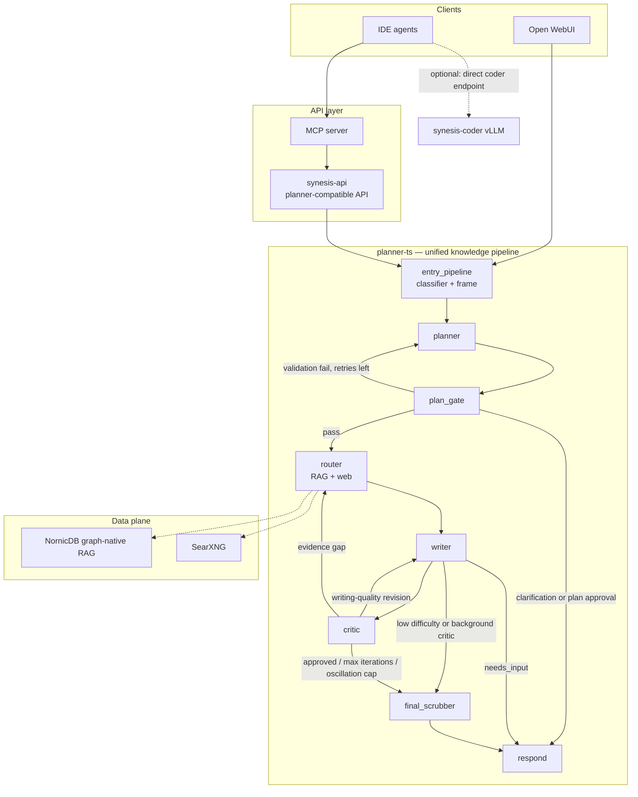

# Synesis

[](https://github.com/supernovae/synesis/actions/workflows/build-images.yml)
[](https://github.com/supernovae/synesis/actions/workflows/lint.yml)
[](LICENSE)

**A self-hosted enterprise intelligence platform — RAG, MCP, and agentic coding on your infrastructure.**

Synesis is a composable, multi-model AI platform for Kubernetes. It combines a taxonomy-driven knowledge pipeline, hybrid RAG with HITL quality gates, an MCP-connected agentic coding runtime, and a full admin surface — all self-hosted, all open source.

> *Synesis* — from Erik Hollnagel's work on joint cognitive systems: productivity, quality, safety, and reliability as emergent properties of the same adaptive processes. See [docs/SYSTEMS_THEORY.md](docs/SYSTEMS_THEORY.md) for the research foundations that guide our architecture.

**Repository:** [github.com/supernovae/synesis](https://github.com/supernovae/synesis)

---

## What Synesis Does

Most enterprise AI platforms solve one problem well: a chatbot with RAG, or a coding assistant, or an orchestration framework. Synesis integrates these into a single self-hosted stack where knowledge, quality, and safety are shared infrastructure — not per-tool afterthoughts.

| Capability | What It Means |
|-----------|--------------|
| **Knowledge Pipeline** | Every chat turn goes through intent classification, domain profiling, structured planning, graph-native retrieval, evidence-gated writing, and multi-axis critic review — not just "prompt → LLM → response" |
| **Graph-Native RAG** | NornicDB vector search plus code/document graph expansion, web search (SearXNG), RRF merge, cross-encoder reranking, authority-weighted provenance, document freshness scoring, and HITL review queues |
| **Agentic Coding** | Dedicated coder model with tool-calling, sandbox execution — IDE-native via MCP and OpenAI-compatible endpoints |
| **MCP Integration** | Connect any IDE or agent harness to your organization's knowledge graph, SynPack bundles, and multi-corpus search through the [Model Context Protocol](docs/clients/MCP_QUICKSTART.md) |
| **Taxonomy-Driven Behavior** | ~190 domain entries configure persona, depth, epistemic guidance, output style, and critic behavior via YAML — no prompt logic hardcoded in nodes |
| **Trust & Safety** | 9-layer prompt injection defense, unified trust envelopes with attribution metadata, index-time scanning, admin review queues, deterministic policy matrix |
| **Admin Surface** | Model registry, provider governance, security console, RAG pipeline management, quality benchmarks, observability traces — all in one UI |
| **Composable Deployment** | Role-based model serving on Kubernetes; provider-governed registry; works with any OpenAI-compatible model provider or self-hosted runtime |

### How Synesis Compares

| | Synesis | LangChain / LlamaIndex | Dify / Flowise | Cursor / Continue | Perplexity / Glean |
|-|---------|----------------------|---------------|------------------|-------------------|
| **Self-hosted, air-gappable** | Yes — your infrastructure, your models, your data | Framework only — bring your own infra | Partial — some cloud dependencies | Cloud-first | SaaS only |
| **Integrated RAG + coding + MCP** | Single platform | Separate libraries to compose | RAG workflows, no coding agent | Coding only, no RAG pipeline | Search only, no coding |
| **Taxonomy-driven behavior** | ~190 domains, YAML-configurable | Manual prompt engineering | Basic prompt templates | None | None |
| **Multi-axis critic review** | 6-axis scoring, evidence-gated, anti-oscillation | None built in | None | None | None |
| **Admin operations UI** | Model registry, security console, RAG review, traces | None | Basic UI | None | Dashboard |
| **Trust & attribution** | TrustPacketV1 envelopes, HITL review, scan + freshness | None | None | None | Source links |
| **Multi-model architecture** | Router, Writer, Coder, Critic, Summarizer — each provisioned for its role | Single model | Single model | Single model | Proprietary |

---

## Architecture

Synesis separates concerns across specialized model roles. A deterministic entry classifier routes requests through the **planner-ts** pipeline, while domain agents (like the Coder) connect directly to dedicated models and reach Synesis intelligence through MCP tools. Runtime model routing is configured in the admin Model Registry.


```mermaid
flowchart TD
    subgraph clients [Clients]
        WebUI[Open WebUI]
        IDE[IDE agents]
    end

    subgraph gateway [API layer]
        API[synesis-api\nplanner-compatible API]
        MCP[MCP server]
    end

    subgraph graph [planner-ts — unified knowledge pipeline]
        EP[entry_pipeline\nclassifier + frame]
        PL[planner]
        PG[plan_gate]
        RT[router\nRAG + web]
        WR[writer]
        CR[critic]
        FS[final_scrubber]
        RS[respond]
    end

    subgraph support [Data plane]
        RAG[NornicDB graph-native RAG]
        WEB[SearXNG]
    end

    WebUI --> EP
    IDE --> MCP
    IDE -.->|optional: direct coder endpoint| CoderEP[synesis-coder vLLM]
    API --> EP
    MCP --> API
    EP --> PL --> PG
    PG -->|validation fail, retries left| PL
    PG -->|clarification or plan approval| RS
    PG -->|pass| RT
    RT --> WR
    WR -->|needs_input| RS
    WR -->|low difficulty or background critic| FS
    WR --> CR
    CR -->|writing-quality revision| WR
    CR -->|evidence gap| RT
    CR -->|approved / max iterations / oscillation cap| FS
    FS --> RS

    RT -.-> RAG
    RT -.-> WEB
```

Canonical order: **entry → planner → plan gate → router → writer → (critic or scrubber) → respond**. Clarification and plan-approval prompts return from **respond**; the user's next message resumes via conversation memory.

### Key Design Decisions

- **Unified planner-first graph** — every chat turn hits entry → planner → plan gate before retrieval. Plan gate validates the structured plan and can retry the planner with repair feedback. See [docs/chat/WORKFLOW_PLANNER.MD](docs/chat/WORKFLOW_PLANNER.MD).
- **Router-governed evidence** — after the plan passes the gate, the router is the sole retrieval orchestrator (RAG + web). Evidence flows as structured packets with trust envelopes and attribution metadata.
- **Unified retrieval with RRF** — parallel RAG and web searches merged via Reciprocal Rank Fusion. RAG uses NornicDB seed-vector search plus graph expansion, adaptive top-K, cross-encoder reranking, authority weighting, and freshness scoring.
- **Hardened RAG authorization** — visibility scope derived from the resolved principal, not request-body hints. NornicDB predicates apply the same visibility rules, with optional OpenFGA row-level enforcement.
- **Evidence-aware critic** — 6-axis scoring with `evidence_utilization`, deterministic citation rate check, and a strict depth gate that blocks shallow responses at high difficulty.
- **Anti-oscillation controls** — immutable semantic frame, decision ledger, deterministic validators, oscillation detector, retrieval churn detection. When prompts are ambiguous, **clarify-first** returns a short clarification question instead of guessing.
- **Prompt injection hardening** — 9-layer defense-in-depth: pattern scanning, JSON trust envelopes, instruction hierarchy, sandwich defense, datamarking, state sanitization, index-time scanning with HITL review, output guardrails, and error sanitization. See [docs/SECURITY.md](docs/SECURITY.md).

---

## Quick Start

### Prerequisites

- Kubernetes cluster (OpenShift, AKS, EKS, GKE, or any conformant distribution)
- `helm` and `kubectl` (or `oc` for OpenShift)
- Postgres and Redis/Valkey backends (cloud-managed or operator-managed by the chart)
- Model provider API keys (OpenRouter, Azure OpenAI, etc.) or self-hosted model endpoints

### Install with Helm

```bash
# Start from an example values file
cp charts/synesis/examples/api-mode.yaml my-values.yaml

# Configure your provider keys, hostnames, and storage
# See docs/HELM_INSTALL.md for all options

# Install
helm upgrade --install synesis ./charts/synesis \
  -f my-values.yaml \
  --namespace default \
  --create-namespace \
  --timeout 20m
```

Full install guide: **[docs/HELM_INSTALL.md](docs/HELM_INSTALL.md)**

### First login

Create a user in the Keycloak **`synesis`** realm, assign the **`synesis-admin`** role, then sign in to the admin SPA via OIDC. Step-by-step: **[docs/admin/KEYCLOAK_BOOTSTRAP.md](docs/admin/KEYCLOAK_BOOTSTRAP.md)**.

### Connect your tools

| Endpoint | What it does |
|----------|-------------|
| **Synesis MCP** | Graph-native RAG, SynPack knowledge bundles, and multi-corpus search in any IDE — [MCP Quickstart](docs/clients/MCP_QUICKSTART.md) |
| **synesis-api** | OpenAI-compatible API backed by the full planner pipeline |
| **synesis-coder** | Direct model endpoint for IDE coding agents (Cursor, Claude Code, etc.) |
| **synesis-admin** | Model registry, provider governance, security console, RAG review, traces |
| **Open WebUI** | Chat frontend connected to the planner pipeline |

```json
// Add Synesis MCP to any IDE in seconds:
{
  "mcpServers": {
    "synesis": {
      "command": "npx",
      "args": ["-y", "@synesis/mcp"],
      "env": {
        "SYNESIS_URL": "https://synesis.company.com",
        "SYNESIS_PAT": "syn-your-token"
      }
    }
  }
}
```

---

## Capabilities

| Capability | Description | Documentation |
|-----------|-------------|---------------|
| **Knowledge Pipeline** | Sensemaking-driven domain profiling, Cynefin-aware clarification, structured planning, evidence-gated writing, multi-axis critic | [docs/chat/WORKFLOW_PLANNER.MD](docs/chat/WORKFLOW_PLANNER.MD) |
| **Taxonomy-Driven Prompt Shaping** | ~190 domain entries with persona, depth, epistemic guidance, output style — compiled at startup with Pydantic validation | [docs/TAXONOMY_SHAPING.md](docs/TAXONOMY_SHAPING.md) |
| **Graph-Native RAG** | NornicDB vector search, code/document graph expansion, exact scope/ACL predicates, optional OpenFGA row enforcement, RRF merge, authority-weighted provenance, freshness scoring | [docs/RAG.md](docs/RAG.md) |
| **MCP Integration** | Publishable npm package (`@synesis/mcp`) connects any IDE or agent SDK to your knowledge graph and SynPack bundles | [docs/clients/MCP_QUICKSTART.md](docs/clients/MCP_QUICKSTART.md) |
| **Knowledge Indexers** | Queue-driven indexer with handler plugins: code (tree-sitter AST), API specs, docs, license, web pages — content managed via admin UI | [docs/INDEXERS.md](docs/INDEXERS.md) |
| **Agentic Coding** | Coder model with tool-calling, code sandbox (lint, security scan, execute) | [docs/SANDBOX.md](docs/SANDBOX.md) |
| **Web Search** | Self-hosted SearXNG for live grounding — no API keys, no tracking | [docs/WEB_SEARCH.md](docs/WEB_SEARCH.md) |
| **Trust & Safety** | 9-layer prompt injection defense, TrustPacketV1 envelopes, attribution metadata, HITL review, shared guardrails core | [docs/SECURITY.md](docs/SECURITY.md) |
| **Admin Operations** | Model registry, provider governance, security console, RAG review with trust/freshness pivots, traces | [base/admin/README.md](base/admin/README.md) |
| **Observability** | Perses dashboards, Prometheus metrics, model-role panels, span-based pipeline tracing | [docs/OBSERVABILITY.md](docs/OBSERVABILITY.md) |

## Project Structure

```
synesis/
├── docs/                       # Platform, chat, coder, user, and engineering docs
├── base/
│   ├── planner-ts/             # Fastify + TypeScript pipeline (primary planner runtime)
│   ├── synesis-mcp/            # Hosted MCP server (Streamable HTTP, PAT + FGA for enterprise)
│   ├── yarn-ts/                # Synesis Yarn — OpenAI-compatible IDE/agent runtime
│   ├── admin/                  # Admin UI — model registry, provider governance, security, traces
│   ├── rag/                    # NornicDB + embedder + content graph + indexers
│   ├── sandbox/                # Isolated code execution (warm pool + Jobs)
│   ├── model-serving/          # vLLM deployments + InferenceService manifests
│   └── ...                     # Gateway, search, webui, security, observability
├── packages/
│   ├── synesis-mcp/            # @synesis/mcp — publishable CLI for IDE MCP integration
│   └── synesis-mcp-tools/      # @synesis/mcp-tools — shared tool definitions
├── charts/
│   └── synesis/                # Helm chart with examples for API and model modes
├── overlays/                   # Kustomize overlays (api, model)
├── scripts/                    # Build, deployment, and maintenance helpers
└── .github/workflows/          # CI: lint, test, build images, security scan
```

## Documentation

Start at **[docs/README.md](docs/README.md)** for the full documentation map.

| Document | Description |
|----------|-------------|
| [docs/HELM_INSTALL.md](docs/HELM_INSTALL.md) | Full Helm install guide with examples |
| [docs/clients/MCP_QUICKSTART.md](docs/clients/MCP_QUICKSTART.md) | MCP setup for Cursor, VS Code, JetBrains, and SDK consumers |
| [docs/chat/WORKFLOW_PLANNER.MD](docs/chat/WORKFLOW_PLANNER.MD) | Full planner graph flow with retries, clarification, and evidence gating |
| [docs/RAG.md](docs/RAG.md) | Graph-native retrieval, NornicDB authz, provenance, authority weighting |
| [docs/SECURITY.md](docs/SECURITY.md) | Trust envelopes, 9-layer prompt injection defense, attribution |
| [docs/TAXONOMY_SHAPING.md](docs/TAXONOMY_SHAPING.md) | How to customize model behavior via YAML configuration |
| [docs/INDEXERS.md](docs/INDEXERS.md) | Queue-driven RAG indexer, handler plugins, content graph |
| [docs/SANDBOX.md](docs/SANDBOX.md) | Code execution sandbox, warm pool, security controls |
| [base/admin/README.md](base/admin/README.md) | Admin operations: model registry, providers, security, RAG review |
| [docs/OBSERVABILITY.md](docs/OBSERVABILITY.md) | Perses dashboards, metrics catalog, logging |
| [docs/SYSTEMS_THEORY.md](docs/SYSTEMS_THEORY.md) | Research foundations: sensemaking, Cynefin, JCS, Safety-II |
| [docs/development/README.md](docs/development/README.md) | Engineering hub: CI/test inventory, development guides |

## Contributing

See [CONTRIBUTING.md](CONTRIBUTING.md) for guidelines on submitting issues, pull requests, and code standards.

## License

Apache License 2.0. See [LICENSE](LICENSE) for the full text.
