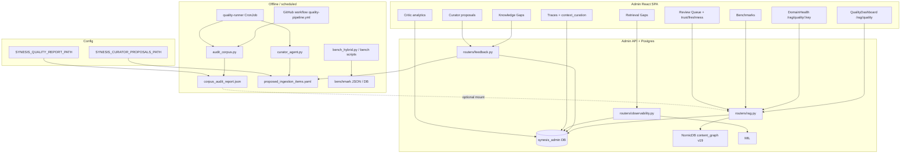
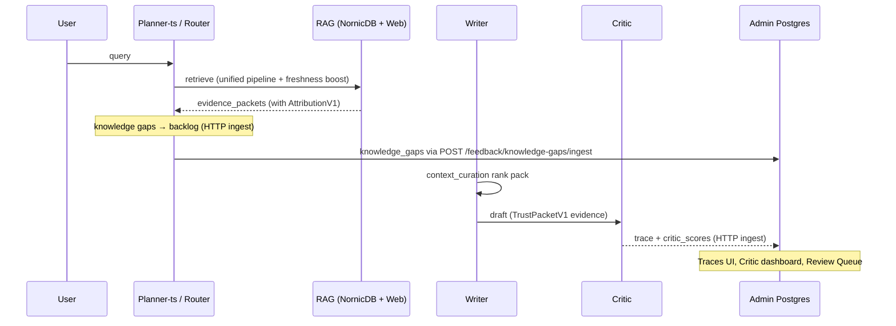

# Admin Quality & RAG Feedback

This document is the **source of truth** for how corpus quality, retrieval gaps, and model/critic signals surface in the **Synesis admin SPA**. The **chat** runtime is **planner-ts** (TypeScript) only.

**Related:** offline tooling and CI in [QUALITY_PIPELINE.md](QUALITY_PIPELINE.md); trust envelope and attribution in [SECURITY.md](SECURITY.md); indexer schema and pipeline in [INDEXERS.md](INDEXERS.md).

---

## Product goal: closed feedback loops

| Signal | What it tells you | Primary admin surface |
|--------|-------------------|------------------------|
| **Corpus / domain health** | Indexed volume, authority mix, freshness per taxonomy domain | **RAG → Quality** (`/rag/quality`) |
| **Retrieval benchmarks** | Hybrid search regression vs fixed queries | **RAG → Benchmarks** |
| **Runtime "we don't know"** | Router/planner marked incomplete knowledge | **Feedback → Knowledge Gaps** (Postgres) |
| **Post-retrieval validation** | Re-query RAG for open gaps | **Observability → Retrieval Gaps** (`/observability/retrieval-gaps`) |
| **Evidence starvation / pack** | High-confidence chunks dropped from writer context | **Tracing → trace detail → Writer context budgeting** |
| **Critic / quality of answer** | Approvals, scores, failure modes over traces | **Pipeline → Critic** |
| **Proposed new sources** | Curator agent YAML (file-backed) | **Feedback → Curator** |
| **Trust attribution** | Provenance, scan status, authority tier, review trace per evidence source | **RAG → Review Queue** (schema v20 graph fields) |
| **Document freshness** | Recency distribution across corpus, stale source detection | **RAG → Quality** (freshness_pct), **Review Queue** (freshness score) |

**Hallucinated URLs / unsupported citations** are tracked in **trace** `critic_scores` (e.g. `hallucinated_urls_count`) and Critic analytics — there is not yet a dedicated "hallucination inbox" page; use **Traces** + **Pipeline → Critic** as the front door.

---

## Architecture (data flow)



---

## Runtime feedback loop (planner-ts)



Planner-ts delivers all telemetry via **HTTP ingest** to admin endpoints — no direct Postgres client. Traces, knowledge gaps, and critic scores flow through `POST /api/v1/traces/ingest` and `POST /api/v1/feedback/knowledge-gaps/ingest`.

---

## Implemented UI routes (sidebar)

| Area | Route | Backend |
|------|-------|---------|
| Quality summary | `/rag/quality` | `GET /api/v1/rag/quality` |
| Quality refresh | button | `POST /api/v1/rag/quality/refresh` (now computes real freshness_pct) |
| Domain detail | `/rag/quality/:key` | `GET /api/v1/rag/quality/domains/{key}` |
| Benchmarks | `/rag/benchmarks` | `GET /api/v1/rag/benchmarks`, `POST .../benchmarks/run`, history |
| Corpus | `/rag/corpus` | `GET /api/v1/rag/corpus` |
| Review queue | `/rag/review` | `GET/POST /api/v1/rag/review*` — trust fields, freshness sort, domain filter ([`rag.py`](../base/admin/app/routers/rag.py)) |
| Ingestion queue | `/rag/ingestion` | `GET/POST /api/v1/ingestion/*` ([`ingestion.py`](../base/admin/app/routers/ingestion.py)) |
| User feedback | `/feedback` | `GET /api/v1/feedback` (planner + mirrored Open WebUI), `POST .../sync-openwebui`, `PATCH .../workspace` ([`feedback.py`](../base/admin/app/routers/feedback.py)) |
| Knowledge gaps (feedback) | `/feedback/knowledge-gaps` | `GET /api/v1/feedback/knowledge-gaps` |
| Curator proposals | `/feedback/curator` | `GET /api/v1/feedback/curator`, approve/reject |
| Retrieval gaps + validate | `/observability/retrieval-gaps` | `GET/POST .../observability/knowledge-gaps*` |
| Traces | `/traces`, `/traces/:id` | trace store + `context_curation` on record |
| Critic | `/pipeline/critic` | Postgres aggregates from traces |

All JSON is behind the same auth as the SPA (`/api/v1/...`). Suitable for **scripts** using an admin API token.

---

## How quality numbers are produced

1. **`GET /rag/quality`** — Reads **`quality_snapshots`** (latest rows per domain) when present; otherwise falls back to **`corpus_audit_report.json`** at `SYNESIS_QUALITY_REPORT_PATH`.
2. **`POST /rag/quality/refresh`** — Recomputes health from the **NornicDB** domain hierarchy (chunk counts per domain → strong/adequate/weak/empty). Now also computes **real `freshness_pct`** from `effective_at_epoch` / `crawl_timestamp` (chunks with freshness score ≥ 0.5 count as fresh).
3. **`GET /rag/quality/domains/{key}`** — Prefers **audit JSON** scorecard for that domain; if missing, returns the latest **`QualitySnapshot`** row shaped for the UI (inventory; MRR/hit rate from audit only when JSON exists).

So: **rich metrics** (hit rate, MRR, dead-weight samples) require the **offline audit** (or CI/CronJob) writing JSON **or** future work to persist full scorecards in Postgres.

---

## Offline / automation (keep using these)

- **Makefile / `benchmarks/` / `tools/curator/`** — See [QUALITY_PIPELINE.md](QUALITY_PIPELINE.md).
- **`.github/workflows/quality-pipeline.yml`** — Scheduled + `workflow_dispatch` (needs self-hosted runner or equivalent).
- **`base/quality-runner/`** — In-cluster CronJob pattern.

**Recommendation:** Periodically run **corpus audit** and sync the report into the cluster (ConfigMap/volume) **or** extend admin to **POST import** JSON into DB — not implemented today.

---

## CLI / local "front door"

1. **Authenticated HTTP** — Same endpoints as the SPA; use org API tokens from **Account → API Tokens** (if enabled in your deployment).
2. **Port-forward** NornicDB + admin DB + admin service as in [QUALITY_PIPELINE.md](QUALITY_PIPELINE.md) prerequisites.
3. **Tests** — `base/admin/tests/test_quality_smoke.py` exercises every admin quality/feedback endpoint.

---

## Integration runbook (end-to-end verification)

Use these steps to verify the feedback loops work end-to-end in a running cluster:

### 1. Traces flow: planner-ts → admin

```bash
# Send a test chat and confirm a trace appears
curl -X POST $ADMIN_URL/api/v1/traces/test \
  -H "Authorization: Bearer $TOKEN"
# Should return {"status":"pass","trace_id":"..."}
```

### 2. Knowledge gaps flow: planner-ts → feedback UI

```bash
# Trigger a request about a topic not in your corpus
# Then check for new open gaps:
curl "$ADMIN_URL/api/v1/feedback/knowledge-gaps?status=open" \
  -H "Authorization: Bearer $TOKEN"
```

### 3. Quality wiring health

```bash
curl "$ADMIN_URL/api/v1/dashboard/quality-wiring" \
  -H "Authorization: Bearer $TOKEN"
# Verify: nornic_ok=true, traces_total > 0, quality_snapshots > 0
```

### 4. Audit import via quality-runner

```bash
# Manual: run audit locally, import results
python benchmarks/corpus/audit_corpus.py --output /tmp/audit.json
curl -X POST "$ADMIN_URL/api/v1/rag/quality/import-report" \
  -H "Authorization: Bearer $TOKEN" \
  -H "Content-Type: application/json" \
  -d @/tmp/audit.json
# Confirm: domain detail at /rag/quality/:key now shows MRR/hit-rate
```

### 5. Hallucination filter

```bash
curl "$ADMIN_URL/api/v1/traces?min_hallucinated_urls=1" \
  -H "Authorization: Bearer $TOKEN"
# Returns only traces where critic flagged hallucinated URLs
```

### 6. Review queue trust attribution

```bash
curl "$ADMIN_URL/api/v1/rag/review?status=flagged&sort=freshness" \
  -H "Authorization: Bearer $TOKEN"
# Returns chunks with freshness_score, scan_signals, review_trace_id
```

---

## Implemented wiring

| Feature | Status |
|---------|--------|
| **Single source domain detail** — full audit scorecards persisted in `quality_snapshots.raw_scorecard` (JSONB column) via `POST /api/v1/rag/quality/import-report`. | Done |
| **Quality-runner CronJob** — `base/quality-runner/cronjob.yaml` runs `audit_corpus.py` nightly, POSTs results to admin import endpoint. | Done |
| **Hallucination filter** — trace list supports `?min_hallucinated_urls=1` API filter + UI toggle button. | Done |
| **Benchmark import** — `POST /api/v1/rag/benchmarks/import` accepts full regression results, separate from the inline lightweight probe. | Done |
| **Quality wiring health** — `GET /api/v1/dashboard/quality-wiring` shows NornicDB, DB table counts, file presence, and last-trace age. | Done |
| **Latest-per-domain SQL** — uses `row_number()` window function instead of SQLAlchemy `distinct()`. | Done |
| **Smoke tests** — `base/admin/tests/test_quality_smoke.py` hits every quality/feedback endpoint. | Done |
| **planner-ts hallucination count** — `hallucinated_urls_count` emitted in `critic_scores` on traces via cited-vs-evidence URL comparison. | Done |
| **planner-ts knowledge gap ingest** — router emits gaps via `POST /api/v1/feedback/knowledge-gaps/ingest` when evidence confidence is below threshold. | Done |
| **planner-ts context curation (lightweight)** — `context_curation` blob on traces with budget/evidence-pack stats for `TraceDetail`. | Done |
| **Knowledge gap HTTP ingest endpoint** — `POST /api/v1/feedback/knowledge-gaps/ingest` in admin accepts service-token-auth gaps from any runtime. | Done |
| **Trust attribution on review queue** — `scan_signals`, `review_trace_id`, `effective_at_epoch`, `crawl_timestamp`, and authz metadata returned per chunk; freshness score computed server-side. | Done |
| **Review queue sort pivots** — `?sort=freshness\|authority\|scan_status` and `?domain=` filter. | Done |
| **HITL review_trace_id** — vet/reject/bulk actions generate and persist trace IDs for audit traceability. | Done |
| **Quality refresh freshness** — `POST /rag/quality/refresh` computes real `freshness_pct` from NornicDB timestamps (exponential decay, 90-day half-life). | Done |
| **Shared freshness scoring** — `@synesis/context-trust` `freshnessScore`/`freshnessBoost` shared across planner-ts and admin. | Done |

---

## TODO — planner-ts migration and RAG quality extensions

### P0 — Close existing gaps in planner-ts feedback

| Item | Context | Effort |
|------|---------|--------|
| **Full context curation with ranking/exclusion** | Current `buildContextCuration` in `app.ts` emits stats only (`packets_in`, `packets_kept`, `excluded_count=0`). There is no evidence ranking, token-budget-aware packing, or low-quality exclusion — all evidence packets pass through to the writer. Implement ranking by composite score (relevance × authority boost × freshness) and exclude evidence that would exceed the writer token budget, recording exclusion reasons on the trace. | Medium |
| **Evidence sufficiency scoring** | Router/critic has no explicit metric for "did retrieval give us enough to answer?" beyond the binary knowledge-gap threshold. Add an `evidence_sufficiency` float (0–1) on traces computed from: number of evidence packets, max confidence, authority distribution, and freshness coverage. Surface in Traces UI and Critic dashboard. | Small |
| **Citation hit rate on traces** | Track what fraction of evidence packets actually get cited in the writer's output. Currently hallucinated URLs are counted, but the inverse — good evidence that was retrieved but never used — is invisible. Emit `citation_hit_rate` (cited sources / total sources) on traces. | Small |

### P1 — Actionable quality signals

| Item | Context | Effort |
|------|---------|--------|
| **Authority distribution per domain** | Quality refresh computes `authority_mix` but the UI doesn't surface it prominently. Domains that are 90% `external` with no `vetted` or `canonical` content are reliability risks. Add authority distribution bars to Domain Health and flag domains below a configurable `vetted+canonical` threshold. | Small |
| **Stale source detection + alerts** | The freshness scoring infrastructure exists but there's no alert when an entire domain goes stale (all chunks below freshness 0.2). Add a `stale_domain_alert` to quality refresh that flags domains where ≥80% of chunks are stale, surfacing them in the Quality dashboard with a "needs recrawl" indicator. | Small |
| **Freshness-aware domain health** | Currently domain health is purely chunk-count-based (empty/weak/adequate/strong). Incorporate `freshness_pct` and `authority_mix` into the health grade — a domain with 500 stale external-only chunks is not "strong". Define a composite health score: `chunk_count_score × (0.5 + 0.3 × freshness_pct/100 + 0.2 × vetted_ratio)`. | Medium |
| **Knowledge gap → curator automation** | Knowledge gaps accumulate in Postgres but require manual curator action to propose new sources. Connect the gap backlog to the curator agent: when a domain accumulates ≥N open gaps, auto-generate a curator proposal from the gap queries. | Medium |
| **Per-domain retrieval benchmarks** | Current benchmarks are global (5 canned queries). The offline `bench_hybrid.py` supports domain-scoped queries, but results aren't partitioned in the UI. Add domain tags to benchmark `per_query` results and surface per-domain MRR/recall trends in Domain Health. | Medium |

### P2 — Systemic RAG improvements

| Item | Context | Effort |
|------|---------|--------|
| **Critic feedback → retrieval tuning loop** | Critic evaluations (approval rate, evidence gaps, hallucination counts) are stored but not fed back to retrieval parameters. Build an offline analyzer that correlates critic failures with retrieval characteristics (domain, authority, freshness) and recommends parameter adjustments (e.g. increase `freshnessWeight` for domains where stale evidence correlates with critic rejections). | Large |
| **Trend charts from historical snapshots** | `quality_snapshots` and `BenchmarkResult` tables accumulate history, but the UI shows only the latest. Add time-series views: domain health over time, MRR trends, freshness trajectory, knowledge gap open/close rates. | Medium |
| **Embedding drift detection** | When the embedding model is changed or updated, existing corpus quality may degrade silently. Add a canary benchmark that runs a fixed set of golden queries against the live index after schema-sync and alerts on MRR/recall regression exceeding a threshold. | Medium |
| **Evidence-to-answer traceability** | Attribution metadata (`review_trace_id`, `source_uri`, `authority_tier`) reaches the LLM prompt via `TrustPacketV1`, but there's no reverse path: given an answer, which evidence packets contributed and were they cited? Build a trace-level evidence lineage view that maps each cited source back to its `AttributionV1` fields and HITL review status. | Large |
| **Curator proposals → DB queue** | Curator proposals currently live in a YAML file. Move to a Postgres-backed queue shared with the ingestion pipeline so approvals flow directly into `ingestion_items` without manual YAML editing. | Medium |
| **Retrieval gap auto-close** | When new content is indexed that covers an open knowledge gap (detected by embedding similarity between gap query and new chunks), auto-close the gap and link to the ingestion item that resolved it. | Medium |
| **Cross-domain coverage analysis** | Some queries span multiple taxonomy domains (e.g. "deploy a GPU model on Kubernetes" touches both `ml` and `infrastructure`). The current quality model is per-domain. Add a cross-domain coverage heuristic that identifies frequent multi-domain query patterns from traces and flags domain pairs with weak intersection coverage. | Large |
| **Scan signal trend analysis** | `scan_signals` captures which injection patterns trigger at index time. Track signal frequency over time by domain/source to detect: (a) sources that consistently trigger scans (possible content hygiene issue), (b) new patterns emerging in recently crawled content (possible attack trend). Surface in Security Events dashboard. | Medium |

---

## Design principles

1. **Admin SPA is the default UI** — React + TanStack Query; no parallel server-rendered quality app.
2. **Postgres for operational feedback** — traces, gaps, benchmarks, snapshots; files are bootstrap/CI only.
3. **DRY APIs** — Prefer one JSON shape for scorecards in DB and file import.
4. **No silent mismatch** — List vs detail both resolved (snapshot fallback added for domain detail when audit JSON absent).
5. **Shared scoring** — Freshness and trust scoring live in `@synesis/context-trust` so all consumers (planner, admin, future Yarn MCP) use identical formulas.
6. **Attribution end-to-end** — Every evidence source carries `AttributionV1` from ingestion through retrieval to LLM prompt, enabling full traceability.
