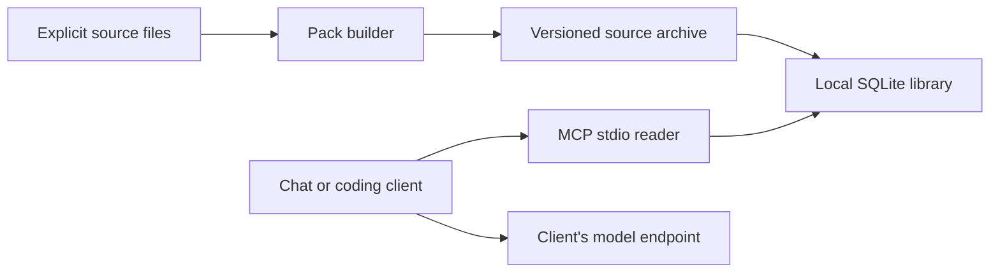

# Architecture

Synesis packages selected source text into immutable, versioned archives and exposes local evidence through a CLI and four read-only MCP tools. The client owns model requests, conversation history, planning, execution and approvals.

## Components

- [The Node core](../packages/synesis-mcp/) owns format validation, source identity, indexing, search, reads and explicit storage operations.
- [Saved-HTML preparation](../tools/prepare-html/) is an optional Python command. It produces reviewable Markdown and records the original file hash.
- [The trial kit](TRIAL.md) prepares matching source snapshots and verifies local/MCP access. People assess actual task outcomes.

The CLI and MCP reader use the same library implementation. SQLite stores source text and a rebuildable FTS5 index; no database daemon is required. The archive is canonical JSON compressed with gzip, with explicit versions, source hashes and attribution. See the [source-pack contract](SOURCE_PACKS.md).

## Boundaries

MCP is a client-launched stdio subprocess. It opens one explicit absolute library path read-only. Pack discovery, source listing, search and reads cannot select another root or mutate the library. Building, importing, exporting, deleting, rebuilding and backing up are explicit CLI operations.

A library belongs to its local OS user. Every source in that library is accessible to each client configured to read it. Separate libraries separate intended source access. Source text remains untrusted data; the client is responsible for how it uses that text. See [security boundaries](SECURITY.md).

Source builds select regular UTF-8 files inside an explicit root. Selection is deliberate, not recursive discovery. Input/output limits and immutable identities prevent accidental unbounded reads and version reassignment. Checksums detect byte changes, not publisher identity or factual accuracy.

## Scope

Search is lexical, with exact path and optional symbol matches. The reader makes no model calls and requires no embeddings. Model protocols, serving optimizations, multimodal capabilities, tools and context management stay with the client and provider.

The package runs locally from a checkout or a locally built tarball. It has no hosted API, network listener, registry publication workflow or always-on service requirement. Dependency installation and the user's model/client can have their own network and cost requirements.

## Evidence and decisions

Automated checks cover real SQLite operations, format and root limits, Unicode evidence, backup/restore, MCP subprocess behavior, saved-HTML conversion and trial snapshot integrity. These checks do not establish better answers, lower total task cost or general model compatibility.

The product question is whether a curated collection's combined version/search/citation interface saves useful work compared with normal file tools. The [trial](TRIAL.md) measures selection, setup, update and correction effort alongside task completion.

Add a preparation format, semantic index or hosted interface only for an observed need that simpler existing tools do not satisfy. If the local interface does not earn its setup and maintenance effort, use those tools instead.
