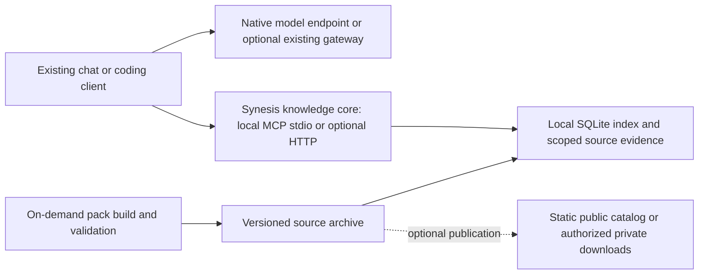

# Architecture review and decision record

Synesis should become a small, optional knowledge tool for existing chat and coding clients. Portable, inspectable SynPacks are its strongest remaining product hypothesis. Operating another general model platform is not justified by the current adoption, maintenance capacity or cost constraints.

**Direction selected: knowledge-first, local by default; hosted retrieval optional.** This is an economic and maintenance decision based on the code, current alternatives and the maintainer's requirements. It is not a measured claim that this design improves model task success. The local source-pack CLI and MCP reader are implemented as of September 10, 2026. Hosted retrieval, product-fit evidence and broader platform removal remain outstanding. The local package is usable from a checkout; no registry release is claimed.

The maintainer confirmed on September 9, 2026 that **there is no running deployment because it was too expensive to keep running**. Restoring that deployment is not a prerequisite for this work. The earlier requirement to restore it before selecting an architecture was unnecessary and is withdrawn. Historical infrastructure cannot serve as a live baseline, and its absence is not an outage to repair.

## Decisions and constraints

| Decision | Reason and consequence |
| --- | --- |
| Stop treating the broad platform as the product. | One maintainer and one adopter need useful outcomes with little idle infrastructure. Preserve useful code, not the existing service map. |
| Remove mandatory Planner/Yarn interception from the target. | Native clients own planning, tools, context, execution, cwd and approvals. Do not merge two agent controllers into a larger controller. |
| Start with a local pack builder/reader and MCP stdio. | A client can launch the reader when needed; no Synesis cloud service is required to use downloaded packs. The process may remain alive for the client session. |
| Use one embedded SQLite storage implementation initially. | Local sources and read-heavy, single-machine operation do not require a database daemon. PostgreSQL is a reconsideration option if actual concurrency requirements demand it, not a second supported backend. |
| Make hosted knowledge an optional mode of the same core. | One API process with local persistent storage; bounded ingestion work runs on demand. No separate permanent worker is required by default. |
| Delegate model serving, general gateways and chat UI. | Start with direct native model endpoints. An existing gateway is optional when shared billing/routing is actually required. |
| Build source-only packs without inference. | Embeddings, reranking, generated cards and semantic edges must justify their own quality and build/refresh costs before becoming optional additions. |
| Fix forward. | No old-format importers, configuration aliases, dual writes, migration tooling or permanent comparison adapters. |

The earlier 4-vCPU/8-GB target remains an **upper acceptance envelope**, excluding inference and an optional UI, rather than a minimum machine to provision. A stopped local reader has no Synesis compute process; disk storage, distribution, model use and any deliberately hosted service still have costs. No automatic cloud scale-to-zero behavior or monthly dollar saving has been measured or promised.

## Repository findings

The [inventory](../evals/architecture/inventory.json) records the baseline commit and methodology. Default Compose contains six services; the inspected Helm defaults enable sixteen workloads and eighteen replicas with 23.3125 GiB of declared memory requests. This excludes other infrastructure and inference. Requests are configuration, not measured consumption or a cloud bill. The code establishes deployment complexity; the maintainer establishes that its operating cost was unacceptable. It does not identify which individual service caused the bill.

| Finding | Evidence | Action |
| --- | --- | --- |
| Chat and coding implement overlapping lifecycles. | Planner/Yarn auth, middleware, context, model and provider directories in the inventory. | Consolidate knowledge contracts, not agent loops; delegate the model boundary. |
| Responses streaming is buffered compatibility output. | [Responses route](../base/yarn-ts/src/routes/responses-routes.ts) invokes Chat with streaming disabled, then synthesizes events. | Retire that translation from the target. Direct native endpoints preserve their own semantics. |
| Planner normalization loses non-text content. | [API schemas](../base/planner-ts/src/api-schemas.ts), messageContentToText. | Do not put this path in front of modern multimodal clients. Accepting a schema is not implementing its capability. |
| Rate-limit implementations diverge. | Both services' middleware/user-rate-limit.ts files. | Use one selected model gateway if needed, plus separate knowledge-resource limits. Do not duplicate gateway accounting in a knowledge service. |
| Timeout responses do not necessarily stop work. | [Graph runner](../base/planner-ts/src/graph.ts) races a timeout against node execution. | Retained jobs need cancellation and publication ownership; a timeout flag is not cancellation. |
| Default behavioral controls add policy beyond protocol compatibility. | Yarn task intake, plan graph, prompt steering and execution governor configuration. | Omit them from the new path; retain an intervention only for a reproducible current failure and with a retirement condition. |
| Retrieval evaluation rewards enrichment mechanically. | [Evaluator](../base/admin/app/services/rag_eval_harness.py) awarded points for cards, producer-reported quality and unspecified checks. | **Fixed in this change:** keep enrichment as diagnostics, score only configured expectations, reject unscorable cases and remove missing-card warnings. Tests compare equivalent evidence with/without enrichment. |
| Knowledge packaging assumes derived graph/vector materialization. | [SynPack reference](SYNPACKS.md), indexer and NornicDB retrieval. | Make source identity the portable contract; rebuild search indexes locally. Generated records cannot become authoritative evidence. |
| Repository guidance encodes obsolete topology. | Constitution, graph-state and ML-boundary rules under .cursor/rules. | **Fixed in this change:** remove Python graph assumptions and mandatory per-capability inference services; retain concrete state, authorization and dependency boundaries. |

This is a broad architecture inventory with targeted source inspection, not a complete security assessment or proof that every route has been reviewed. Dynamic route registration and hidden dependencies require checking when extracting or deleting their owning components.

## Proposed product and process boundaries

The first usable slice is [one TypeScript CLI/library](../packages/synesis-mcp/) for pack validation, indexing, source reading and MCP registration. It replaces the Planner-backed MCP entry point and depends only on the MCP SDK, Zod and built-in Node modules. The [source-pack guide](SOURCE_PACKS.md) specifies the format, explicit-root rules, immutable identities and local access boundary. Reuse Python extraction handlers as bounded optional build tools where they save work; do not require the existing indexer image or Python ML stack merely to read a pack. Reuse the same query and authorization functions in stdio and HTTP modes. A second implementation in another language, transport-specific policy copies and an extensible database framework would recreate the maintenance problem.

The source archive contains a manifest, source revision/content hashes, explicit version, normalized evidence, original locator/line mapping, attribution and redistribution metadata. The SQLite index is rebuildable derived data, not the only copy of the source or a required uploaded database. Core operations are pack discovery/version resolution, search, bounded source read, validation and explicit build/import/delete. Pagination and retrieval budgets should be explicit. Version selection must be visible; “latest” is mutable and must resolve to a recorded snapshot.

Start with lexical search, exact paths/symbols and source reads. This is a baseline, not a claim that lexical retrieval matches semantic search. Cross-language questions, paraphrases, PDF/table extraction and large document sets are known validation needs. Optional embeddings need an identified failure cohort, a pinned embedding profile and a cost cap. SQL relationships can represent deterministic links; a generated graph does not justify a graph database by itself.

[SQLite's deployment guidance](https://www.sqlite.org/whentouse.html) supports embedded local storage and warns about concurrent writers and network filesystems. Consequently the hosted target is one machine with local durable disk and serialized writes. It does not promise horizontal replicas or high availability. If those become actual requirements, replace the selected store rather than maintain SQLite/PostgreSQL/NornicDB parity. [FTS5](https://www.sqlite.org/fts5.html) supplies full-text ranking and configurable tokenization; tokenization and retrieval quality still require corpus-specific checks.

[MCP defines stdio as a client-launched subprocess and Streamable HTTP as a separate server transport](https://modelcontextprotocol.io/specification/2025-11-25/basic/transports). Use stdio for local clients and HTTP only where a client or shared deployment needs it. The transport does not make tool access safe by itself.

## Capabilities to preserve, delegate or retire

These are target dispositions. The local MCP entry point and its setup instructions have been replaced. The two hosted MCP services, their Admin assistant loop and UI controls, and their deployment/build wiring have been deleted. The exploratory front door/PostgreSQL adapter is retired, and automatic platform image/live-evaluation workflows are removed or manual. The broader Planner/Yarn service implementations have not yet been deleted.

| Capability | Target disposition | Contract or explicit limitation |
| --- | --- | --- |
| GPU inference, model weights, sparse attention, MTP/speculation and serving caches | Delegate | Serving runtime owns architecture-specific optimization. No proxy inference about a model's memory reliability from its name. |
| OpenAI Chat/Responses, Anthropic Messages and multimodal/reasoning payloads | Direct native endpoint; optional existing gateway | Endpoint/harness compatibility remains version-specific. No lowest-common-denominator transcript conversion. |
| Routing, failover, provider secrets, prices, billing and quotas | Optional general gateway | Select only when needed; verify OSS/paid feature boundaries and native protocol fidelity. No second model/provider catalog in Synesis. |
| Embeddings, reranking, files, batches, image/audio and realtime model APIs | Delegate | Knowledge tools do not advertise implementing these APIs. An existing endpoint must supply a needed capability. |
| Planning, classification, critic/rewrite loops, governors and completion gates | Retire from the default path | Optional named workflows need evidence of incremental value. No assumption that extra model calls constitute safety. |
| Cwd/project roots, shell execution, tool approvals and sandboxing | Client-owned | Local pack input roots are explicit; remote services do not infer the client's filesystem. Untrusted build/execution code stays outside credential-bearing processes. |
| Harness/model shims, ACP adapters and transcript compaction | Retire interception requirement | Keep useful compatibility documentation and conformance fixtures. Native harnesses own their tools and context; proven endpoint defects belong in narrowly scoped upstream/client fixes where possible. |
| Session memory and durable agent events | Delegate to client/session provider | Preserve immutable knowledge sources, not an additional universal conversation store. Do not claim automatic cross-client conversation memory. |
| Source search, exact lookup, citations and bounded reads | Retain in one core | Version and provenance accompany results; source text is data, not tool policy. Reading more evidence must be possible without generated summaries. |
| SynPack creation, verification, public/private distribution and offline use | Retain for a bounded product-fit trial | Reproducible identity, corruption detection, attribution, freshness and explicit publication permission. Checksums prove integrity, not publisher trust or correctness. |
| Graph traversal, generated cards, query expansion and learned feedback | Omit initially | Add only the specific operation required by demonstrated tasks. No enrichment-presence or intervention-count proxy for success. |
| Connectors, extraction, refresh, review and deletion | Extract useful handlers; run bounded jobs | Idempotent work, cancellation, transactional publication, original-source mapping and deletion of active derived records. No automatic background refresh fleet. |
| Database, Redis, NornicDB, Keycloak and OpenFGA services | Remove as mandatory dependencies | Embedded store plus explicit local grants; optional external identity for hosted access. Permission outcomes remain required even when implementations change. |
| Global/org/tenant/user/session and document permissions | Retain effective restrictions for hosted content | Identity-derived grants, deny by default, expiry and revocation across discovery/search/read/export/jobs. No request-body principal or trusted org header from an arbitrary caller. |
| Knowledge MCP and administrative MCP | One registration/auth core with distinct scopes | A search token cannot mutate sources, administer accounts or download an entire private pack. Local stdio uses the launching user's explicit accessible inputs. |
| Web search/fetch, code checking, AST tools and vision | Existing tools or optional isolated jobs | Egress limits and isolation where required. Do not merge unsafe execution into the knowledge API to save a container. |
| Admin provider UI and broad operations dashboard | Retire from the target | A focused pack/job/permission view is optional after the CLI proves useful. Reuse native client and gateway UIs for their responsibilities. |
| Traces, security records, evals and diagnostics | Retain bounded standard records | Redaction, useful failure diagnostics and retention; no compulsory observability fleet or raw private prompts in repository artifacts. |
| Compose, Helm, Terraform/operator and cluster bootstrap | Replace with local command and one optional hosted recipe | Fresh installation and measured resource use; no legacy deployment variants or Kubernetes requirement for trying the project. |

Private distribution needs a stronger boundary than filtering search results. A downloadable pack must be authorized in its entirety, or materialized as a fresh authorized subset with its own identity. An uploaded archive cannot grant its publisher's preferred access to other users. Deleting or revoking hosted access cannot retract copies already downloaded; offline private packs rely on the recipient's device protections. Mixed-permission sources, derivative records, cached results and backup retention all need explicit handling before hosted private access ships. The local reader uses a private OS-user library instead; it does not claim this hosted authorization contract.

## Current alternatives and model research

| Existing option | Relevant overlap | Implication for Synesis |
| --- | --- | --- |
| [LM Studio](https://lmstudio.ai/docs/developer), [vLLM](https://docs.vllm.ai/en/latest/serving/online_serving/openai_compatible_server/) | Local/hosted inference with multiple API surfaces. | Serving and model selection alone are not a product distinction. Confirm endpoint limitations for the actual runtime/model pair. |
| [LiteLLM](https://docs.litellm.ai/docs/), [Bifrost](https://docs.getbifrost.ai/overview) | General gateways with routing, credentials, usage and other shared controls. | Do not write another gateway by default. Neither has been selected or benchmarked here; paid/OSS requirements can decide whether either is appropriate. |
| [Open WebUI](https://docs.openwebui.com/features/workspace/knowledge/), [AnythingLLM](https://docs.anythingllm.com/installation-desktop/overview), [Onyx](https://docs.onyx.app/welcome) | Knowledge-enabled chat and document workflows, with different local/team deployment assumptions. | An adopter wanting a finished chat application may be better served by one of these. Do not recreate their entire UI/connector surface. |
| [Context7](https://context7.com/docs/overview) | Version-specific documentation via MCP; its documentation also references private repository access. | Neither versioned docs nor private content alone distinguishes SynPacks. Test local/offline, reproducible artifacts and cross-client evidence reuse as the narrower hypothesis. |
| Native files, repository search and client tools | Existing accessible source evidence without Synesis indexing. | This is the cheapest first comparison. If pack retrieval adds no needed capability, use the files directly. |

The gateway choice can remain **none**. There is no reason to build and operate Bifrost and LiteLLM comparisons before a concrete gateway requirement exists. Likewise, the [PostgreSQL/pgvector prototype](https://github.com/pgvector/pgvector) established a possible storage route; it is not a reason to keep a database daemon or undertake an exhaustive database contest.

Anthropic's [Managed Agents engineering account](https://www.anthropic.com/engineering/managed-agents) describes decoupling execution, session state and harness control, and preserving retrievable events beyond the current context window. Apply the boundaries where Synesis owns a responsibility; do not copy a managed-agent service topology into a single-user knowledge tool. Its reported improvements are not Synesis measurements.

The [harness evolution study](https://arxiv.org/abs/2607.03691) and [scaffold comparison](https://arxiv.org/abs/2607.22585) support evaluating pinned model/harness pairs and completed-task cost rather than attributing everything to a model architecture. They do not prove all modern models are homogeneous, or that every old workaround is now unnecessary. The practical default is native behavior, reproducible failure cases and narrow optional changes. The [model compatibility guide](model-compatibility.md) covers Qwen3.8, DeepSeek and architecture/serving distinctions; sparse attention and learned n-grams do not warrant a mandatory second planner or proxy transcript rewrite.

[MCP security guidance](https://modelcontextprotocol.io/docs/2025-11-25/tutorials/security/security_best_practices) informs credential isolation, token audience, session and egress boundaries. Authorization, bounded resource use, cancellation and source integrity are concrete safety responsibilities; a semantic classifier or a reassuring trust label cannot replace them.

Sources reviewed through **September 9, 2026**. Later-2026 behavior is unknown. These are primary documentation and research references, not replicated product benchmarks or guarantees about all versions.

## Evidence available without a deployment

The [evidence instructions](../evals/architecture/README.md) describe current checks and historical measurements. Current implementation and verification include:

- A source-pack builder with explicit file/root selection, preserved UTF-8 evidence, attribution, stable digests, bounded decompression and rejection of old/ambiguous formats.
- One SQLite library with atomic immutable imports, lexical/path/symbol retrieval, exact-version reads, Unicode continuation offsets, export, deletion, FTS rebuilding and backup/restore. A minimal identity record prevents reassigning deleted versions to new content.
- Four read-only MCP tools using the official stdio transport. Real client/subprocess tests cover negotiation, closed arguments, different cwd, no backend credentials and shutdown. The library is opened read-only for MCP; tools cannot select another filesystem root or library.
- Node 24 and 26 tests, plus a standalone package-install check independent of repository workspace imports. No Python runtime, PostgreSQL, model endpoint or credentials are required by the package.
- A [source navigation smoke result](../evals/architecture/local-smoke.json) over ten selected repository files. Source search and pinned reads locate the expected evidence. Native file reads also locate it: this is not evidence of retrieval superiority or a model-quality improvement.
- A [public capability trial](../evals/architecture/README.md#public-capability-trial) against Git archives/ripgrep and the official MCP filesystem server. Five probes recover two real documentation versions across two SDK sessions in both readers. This establishes overlap, not differentiation: native snapshots already provide offline versioned evidence and cwd-independent reuse. Actual private/user tasks and chat/coding harnesses remain untested.
- Corrected retrieval scoring in the retained admin evaluator, current repository guidance and offline paired-result analysis. Missing trials limit empirical claims, not cost/maintenance decisions.

The temporary HTTP/front-door/PostgreSQL service, alternate Python pack builder and screening runner have been retired instead of becoming a second stack. Their [PostgreSQL](../evals/architecture/postgres-smoke.json) and [Python/SQLite](../evals/architecture/sqlite-smoke.json) results remain historical small-corpus observations. They use different runtimes, tokenizers and concurrency and are not comparable timings or current reproducible benchmarks.

The current check has no live model outcomes, realistic hosted ACL testing, semantic-retrieval comparison, complete ingestion/connector path or full resource acceptance test. A small source-navigation sample demonstrates a functioning artifact and transport, not product-market fit.

## Cost and evaluation policy

A system that is not affordable to leave running fails an adoption requirement even if it has a higher benchmark score. Track idle cost separately from work cost:

- **Idle:** reserved machines/GPUs, persistent storage, backups, load balancers, identity services and monitoring.
- **Work:** source acquisition, extraction/indexing, optional enrichment, refresh, retrieval, model calls, egress and failed/repeated work.
- **Maintenance:** dependency/security updates, deployment variants, credentials and time spent correcting results or operating the system. Report hours separately; only monetize them with an explicit rate.

For a stated evaluation period, total cost per successful task includes allocated idle cost plus all work costs, including failed tasks. Zero successes makes that ratio undefined. Unknown inputs remain unknown. Low usage makes idle cost especially important; an API-only token comparison cannot establish total-cost savings. No historical bill or workload was supplied, so this review does not invent a dollar break-even point.

Use staged, bounded checks instead of funding the old stack:

1. **Offline contracts now:** reproducibility, archive limits, identity/version resolution, root confinement, bounded reads, deletion, malformed input, restart and backup behavior. No model endpoint required.
2. **Cheap product-fit screen:** compare native files/search or an established knowledge tool with source-only packs on actual public and private needs. Inspect retrieved evidence before spending on model runs. Stop if the required capability is already satisfied.
3. **Only when making task-quality claims:** use temporary local inference or metered API access, fixed budgets and actual current model/harness revisions. Run the same task/corpus/client with and without the proposed knowledge or intervention; the old deployment is optional historical evidence, not a required participant.
4. **Broader claims need broader evidence:** the proposed 60-task suite (20 public, 20 private, 10 coding, 10 research; two OSS families and two coding harnesses) remains a starting coverage policy. It is not completed, statistically powered by fiat, or a prerequisite for building the local reader. Screening questions are not held-out tasks; prompt-only coding questions are not agent execution.

For added behavioral complexity, the previous five-percentage-point success or twenty-percent complete-cost improvement thresholds remain candidate retention criteria, with paired uncertainty and protocol/security checks. They are project thresholds, not literature-established constants. Descriptive bootstrap intervals, especially saturated small samples, do not prove general non-regression. A concrete required capability can justify code independently of a score increase; document its need and cheapest adequate implementation.

## Implementation sequence and exit points

| Step | Deliverable and completion evidence | Work deliberately excluded |
| --- | --- | --- |
| 1. Establish constraints and correct the evaluation | This decision record, inventory, source/HTTP/storage checks, corrected enrichment scoring and current repository guidance. **Implemented at the experiment level.** | Reviving a cluster, paid model calls or declaring the redesign complete. |
| 2. Ship the smallest useful local artifact | **Implemented:** source-pack schema/CLI, SQLite library and official MCP stdio; explicit versions, citations, bounded reads, corruption/root checks, shutdown, rebuilding and backup/restore. Local tests and package installation are verified; no registry publication is claimed. | A model proxy, web UI, vector service or remote identity stack. |
| 3. Test whether the artifact deserves to exist | **Started:** pinned public Git/filesystem-MCP comparison shows overlapping capabilities. Real public/private user workflows, actual clients, setup/update effort and corrections remain to be observed. The current result justifies no hosted build or quality claim. | An exhaustive contest among every model, gateway and database. |
| 4. Add shared hosting only if needed | Same core over authenticated HTTP/MCP; scoped discovery/search/read/export and mutations; durable bounded jobs, revocation, retention, restart/backup tests. One small-machine deployment with measured cold start, peak RAM, disk use and concurrent reader/writer behavior. | Horizontal replicas, universal session memory, multiple storage backends and a broad admin console. |
| 5. Complete the fix-forward cutover in the repository | **Started:** optional HTML extraction is available; hosted MCP services and their Admin assistant loop are deleted. Continue extracting useful handlers/fixtures and deleting superseded Planner/Yarn/controller services and their deployment/config/docs/CI paths. Rewrite the main setup guide around commands that actually work. Verify a fresh install without old databases/config or service DNS. | Migrations, aliases, dual-write modes or indefinite maintenance of the architecture lab. |

The artifact trial in step 3 is a deliberate stop point before building another platform. If existing tools satisfy the needed outcomes, retire Synesis rather than complete steps 4–5 as a replacement service. If only pack production/distribution is useful, publish a builder/reader and stop there. If shared retrieval earns its footprint, retain that narrow service. A universal model gateway or planner does not return merely because useful code remains in the repository.

The local artifact and an optional saved-HTML preparation command are implemented. The command reuses the indexer's converter without its service dependencies and records the original file identity alongside derived Markdown. Hosted ingestion/deletion and the full resource/quality tests remain outstanding. The main README and MCP guides use the working local path. Existing Compose/Helm material describes code awaiting extraction/removal, not installation requirements for the reader. Old image builds and deployment-dependent evaluations no longer run automatically; the package artifact workflow builds the local CLI without publishing images or a registry release.

The Crawl4AI dependency path has been [removed](../.github/SECURITY.md#removed-crawler-dependency-path), taking the retained indexer's resolved environment from 114 to 49 packages. NLTK, the unused model client and the browser runtime are absent from its lockfile. Static HTTP retains sitemap/link/robots handling, checks every redirect against the crawl policy, and bounds response sizes. JavaScript execution and the automatic browser fallback are retired; rendered HTML must be saved explicitly. Length-based converter selection and line-deletion heuristics have also been removed. These are dependency and behavior changes, not measured deployment-cost or retrieval-quality gains.

The hosted MCP cutover removes `base/synesis-mcp` and `base/admin-mcp-ts`, their workspace/image/Compose/Helm/Kustomize entries, and Admin MCP catalog/health/assistant routes and controls. There are no redirect aliases or replacement remote endpoints. Native clients own planning and model calls; the four local read-only knowledge tools retain their existing contract. The remaining Planner/Yarn/Admin platform is still pending removal and is not a second supported MCP mode. Shared catalog/argument conformance checks remain while Yarn still uses that code; the unused hosted registration implementation has been deleted.
