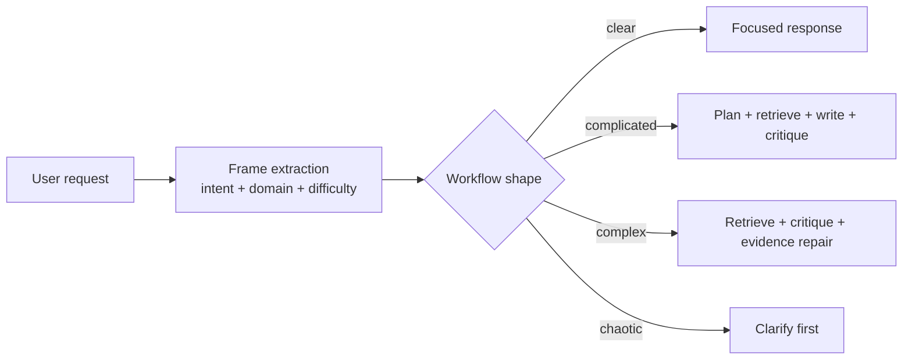
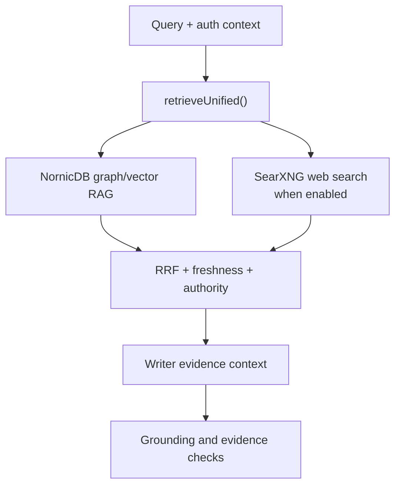
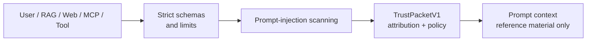
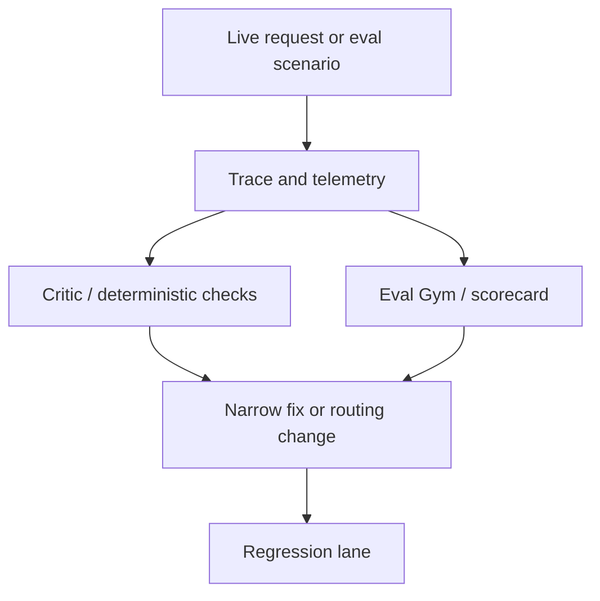
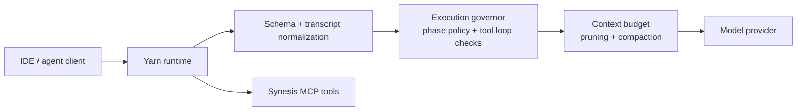

# Design Theory

Synesis is built on a simple thesis: useful AI systems need more than model calls. They need a control plane that helps humans and models share context, retrieve evidence, enforce trust boundaries, evaluate outcomes, and improve over time.

This document captures the guiding hypotheses behind the platform. The canonical bibliography lives in [Awesome Papers And Primary References](AWESOME_PAPERS.MD); this page explains how those ideas show up in the current codebase and product shape.

## Core Hypotheses

| Hypothesis | Design consequence | Current surfaces |
| --- | --- | --- |
| AI systems are joint cognitive systems, not autonomous oracles. | Ask for clarification when the frame is weak; expose traces, citations, assumptions, and review state. | Planner clarify-first, Admin traces, RAG review queues, Open WebUI status events |
| Complexity should change the workflow. | Clear tasks can be direct; complicated and complex tasks need planning, retrieval, critique, and sometimes user input. | `entry-classifier.ts`, `domain-profile.ts`, `llm-planner.ts`, planner pipeline |
| Retrieval is a governance mechanism, not just search. | Evidence carries provenance, authority, freshness, authorization, and review metadata. | NornicDB graph RAG, SynPacks, `retrieveUnified()`, Admin review |
| Trust has to be structural. | Untrusted user, web, RAG, MCP, and tool content is wrapped and scanned instead of handled by prompt convention. | `TrustPacketV1`, strict Zod schemas, scanner packages, security events |
| Quality improves through feedback loops. | Critic checks, eval lanes, scorecards, and telemetry become part of the platform, not separate scripts. | Planner critic, Yarn Eval Gym, request forensics, feedback sync |
| Model fleets need architecture-aware mediation. | Different models receive different context, compaction, evidence, and active-state treatment. | Planner/Yarn architecture mediation, model registry, provider diagnostics |
| Coding agents need operational governance. | Tool loops, verification churn, path drift, and context growth are controlled by runtime policy. | Yarn execution governor, transcript pruning, tool collapse, MCP allowlists |
| Operators need visible controls. | Model routing, provider keys, security events, RAG review, traces, and scaling are first-class UI/API concerns. | Admin UI, Helm chart, observability docs, security posture docs |

These hypotheses are intentionally practical. They are not claims that Synesis has solved AI reliability. They are the engineering bets that shape where controls live and what the platform tries to make observable.

## Research Lineage

Use [AWESOME_PAPERS.MD](AWESOME_PAPERS.MD) as the source of truth for paper links. The most relevant sections are:

- [Security and prompt injection](AWESOME_PAPERS.MD#security-and-prompt-injection): Spotlighting, Prompt Fencing, CaMeL, TrustRAG, SD-RAG, instruction hierarchy, OWASP LLM Top 10.
- [RAG and retrieval](AWESOME_PAPERS.MD#rag-and-retrieval): RAG, HyDE, adaptive retrieval, L-RAG, RRF, multi-source fusion.
- [Critic, judges, and evaluation](AWESOME_PAPERS.MD#critic-judges-and-evaluation): RAG evaluation, rubrics, LLM-as-judge limits, deterministic verification.
- [Sensemaking, cognition, and design theory](AWESOME_PAPERS.MD#sensemaking-cognition-and-design-theory): human-AI collaborative sensemaking plus classical systems theory references.
- [Routing and taxonomy](AWESOME_PAPERS.MD#routing-and-taxonomy): concept-based routing and interpretable task classification.
- [Context, attention, and long prompts](AWESOME_PAPERS.MD#context-attention-and-long-prompts): Lost in the Middle and long-context placement concerns.
- [Agent coding and interfaces](AWESOME_PAPERS.MD#agent-coding-and-interfaces-selected-non-arxiv): SWE-agent, Codex, Aider, OpenHands, and practical coding-agent loop patterns.

[SYSTEMS_THEORY.md](SYSTEMS_THEORY.md) preserves the deeper classical framing around Hollnagel, Woods, Klein, Cynefin, information foraging, topic mixtures, and faceted search. This document is the shorter product-and-architecture bridge.

## Design Patterns

### 1. Sensemaking Before Action

Synesis treats a request as a frame to understand before acting on it. The planner builds intent, difficulty, domain profile, and Cynefin-style complexity signals before deciding whether to answer directly, plan, retrieve, critique, or ask a clarifying question.

Implementation anchors:

- `base/planner-ts/src/nodes/entry-classifier.ts`
- `base/planner-ts/src/nodes/domain-profile.ts`
- `base/planner-ts/src/nodes/llm-planner.ts`
- `base/planner-ts/src/pipeline.ts`

The practical goal is cost and quality control: do not spend a full writer/critic loop on a frame that is too ambiguous to answer well.

### 2. Evidence-Governed Generation

The planner is designed around evidence before synthesis. Retrieval is not just “find some chunks”; it is a governance path that attaches scope, authority, freshness, review status, and citation material before the model writes.

Implementation anchors:

- `base/planner-ts/src/retrieval/unified.ts`
- `base/planner-ts/src/retrieval/rag-client.ts`
- `base/planner-ts/src/retrieval/web-search.ts`
- `base/planner-ts/src/nodes/writer-compose.ts`
- `base/planner-ts/src/nodes/critic-evaluator.ts`

Related docs: [RAG](RAG.md), [SynPacks](SYNPACKS.md), [Web Search](WEB_SEARCH.md), [Admin Quality UI](ADMIN_QUALITY_UI.md).

### 3. Structural Trust Boundaries

Synesis assumes untrusted data will try to behave like instructions. User text, RAG chunks, web pages, MCP responses, and tool results are data, not authority. They are scanned, bounded, attributed, and wrapped before they enter model context.

Implementation anchors:

- `packages/synesis-context-trust/src/trust-packet.ts`
- `packages/synesis-context-trust/src/scanner.ts`
- `base/yarn-ts/src/security/transcript-trust.ts`
- `packages/synesis-mcp-tools/src/knowledge-schemas.ts`
- `packages/synesis-mcp-tools/src/web-search-schemas.ts`

Related docs: [Security](SECURITY.md), [Yarn Context Trust](coder/YARN_TS_CONTEXT_TRUST.md).

### 4. Critic And Evaluation As Feedback Loops

Synesis uses critics and evals to make quality observable. The planner critic checks grounding and evidence use; Yarn Eval Gym turns agent behavior into repeatable scenarios, scorecards, and training material.

Implementation anchors:

- `base/planner-ts/src/nodes/critic-evaluator.ts`
- `base/planner-ts/src/nodes/critic-routing.ts`
- `base/yarn-ts/src/eval/`
- `base/yarn-ts/src/eval/harness-scorecard.ts`
- `docs/coder/EVAL_GYM.md`

The design is deliberately not “trust the judge blindly.” LLM-as-judge output is paired with deterministic contracts, scorecards, scenario replay, and human review.

### 5. Governed Coding Agents

Yarn exists because coding-agent traffic has different failure modes than ordinary chat: repeated tool loops, accidental broad edits, context bloat, path drift, and false completion claims. The runtime mediates those behaviors without requiring every client to implement the same safeguards.

Implementation anchors:

- `base/yarn-ts/src/governance/execution-governor.ts`
- `base/yarn-ts/src/pipeline/route-context-admission.ts`
- `base/yarn-ts/src/security/transcript-trust.ts`
- `base/yarn-ts/src/mcp/index.ts`
- `base/yarn-ts/src/state/session-store.ts`

Related docs: [Coder Runtime](coder/README.md), [Execution Governor](coder/GOVERNOR_HARNESS.md), [Eval Gym](coder/EVAL_GYM.md).

### 6. Architecture-Aware Model Mediation

Synesis does not assume every model uses context the same way. Long-context, MoE, hybrid attention, speculative decoding, and compression-sensitive models may need different prompt placement, evidence manifests, active-state replay, or compaction policy.

Implementation anchors:

- `packages/synesis-upper-harness/src/architecture-profile.ts`
- `base/yarn-ts/src/providers/model-architecture-profile.ts`
- `base/planner-ts/src/context/architecture-mediation.ts`
- `base/yarn-ts/src/routes/diagnostics-routes.ts`

Related docs: [Model Architecture Awareness](model-architecture-awareness.md), [Planner Architecture Mediation](chat/PLANNER_ARCHITECTURE_MEDIATION.md), [Public Model Offerings](chat/PUBLIC_MODEL_OFFERINGS.md).

## Why This Belongs Beyond The README

The top-level README should stay exciting and quick to scan. The heavier theory belongs here:

- why Synesis is an AI control plane rather than a chatbot;
- why chat, coding agents, RAG, MCP, admin operations, and security share infrastructure;
- why taxonomy, retrieval, critic checks, and trust envelopes are platform primitives;
- why the system favors self-hosted, forkable, operator-visible architecture;
- why model heterogeneity is a design assumption, not an exception.

In short: Synesis is built for teams that want AI behavior to be inspectable, governable, and improvable across chat and coding workflows.

## Codebase Map

| Design concern | Primary implementation | Supporting docs |
| --- | --- | --- |
| Complexity-aware routing | `base/planner-ts/src/nodes/entry-classifier.ts`, `domain-profile.ts`, `pipeline.ts` | [Planner Workflow](chat/WORKFLOW_PLANNER.MD), [Systems Theory](SYSTEMS_THEORY.md) |
| Clarify-first behavior | `base/planner-ts/src/nodes/llm-planner.ts` | [Planner Workflow](chat/WORKFLOW_PLANNER.MD) |
| Graph-native retrieval | `base/planner-ts/src/retrieval/`, `base/rag/indexer/` | [RAG](RAG.md), [SynPacks](SYNPACKS.md) |
| Trust envelopes | `packages/synesis-context-trust/`, `base/yarn-ts/src/security/` | [Security](SECURITY.md), [Yarn Context Trust](coder/YARN_TS_CONTEXT_TRUST.md) |
| Strict tool schemas | `packages/synesis-mcp-tools/src/*schemas.ts`, `base/yarn-ts/src/schemas.ts` | [Security](SECURITY.md), [MCP Quickstart](clients/MCP_QUICKSTART.md) |
| Planner critic | `base/planner-ts/src/nodes/critic-evaluator.ts`, `critic-routing.ts` | [Critic Research](CRITIC_RESEARCH.md) |
| Coder governance | `base/yarn-ts/src/governance/`, `base/yarn-ts/src/pipeline/` | [Coder Runtime](coder/README.md), [Eval Gym](coder/EVAL_GYM.md) |
| Model mediation | `packages/synesis-upper-harness/`, `base/planner-ts/src/context/architecture-mediation.ts`, `base/yarn-ts/src/providers/` | [Model Architecture Awareness](model-architecture-awareness.md) |
| Operator visibility | `base/admin/`, telemetry packages, Helm chart | [Observability](OBSERVABILITY.md), [Helm Install](HELM_INSTALL.md), [Scaling](SCALING.md) |

## Guardrails For Future Design

1. Prefer shared platform controls over one-off prompt tricks.
2. Treat external content as data, never authority.
3. Make ambiguity visible instead of hiding it behind confident prose.
4. Preserve provenance and authorization metadata through retrieval and generation.
5. Add evals or scorecards when changing agent behavior.
6. Keep operator-facing controls documented and observable.
7. Keep paper links centralized in [AWESOME_PAPERS.MD](AWESOME_PAPERS.MD); topic docs should explain implementation, not become duplicate bibliographies.

## Related Documents

- [Awesome Papers And Primary References](AWESOME_PAPERS.MD)
- [Systems Theory](SYSTEMS_THEORY.md)
- [Security](SECURITY.md)
- [RAG](RAG.md)
- [Workflow Planner](chat/WORKFLOW_PLANNER.MD)
- [Coder Runtime](coder/README.md)
- [Eval Gym](coder/EVAL_GYM.md)
- [Comparison Notes](COMPARISON.md)
