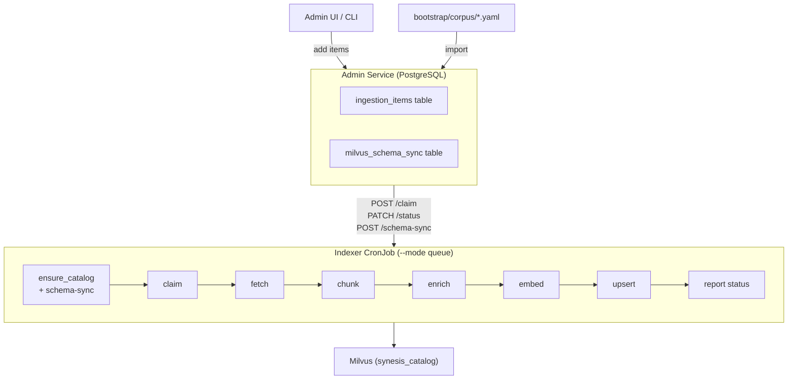
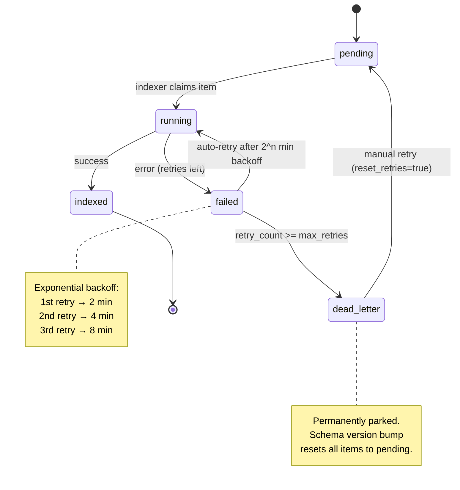

# Synesis RAG Indexer

Synesis uses a **single queue-driven indexer** that claims work from a PostgreSQL-backed ingestion queue (the admin service's `ingestion_items` table). Content is added via the admin UI, the bootstrap API, or bulk YAML import. The indexer processes whatever is pending — no ConfigMaps or per-handler CronJobs required.

## Architecture



One container image (`base/rag/indexer/`) with handler plugins for each document type. The queue runner (`queue_runner.py`) claims items one at a time via `SELECT ... FOR UPDATE SKIP LOCKED`, processes them through the existing pipeline, and reports status back to the admin API.

## Item Lifecycle



| Status | Meaning | What happens next |
|--------|---------|-------------------|
| `pending` | Waiting to be processed | Claimed by next indexer run |
| `running` | Claimed by an indexer | Processing in progress |
| `indexed` | Successfully processed | Chunks in Milvus, item complete |
| `failed` | Processing error (retries left) | Auto-retried on next indexer run after backoff |
| `dead_letter` | Exceeded max retries (default 3) | Permanently parked — won't be retried automatically |

**Auto-retry with exponential backoff:** Failed items are automatically re-claimed by the indexer after a backoff delay of `2^retry_count` minutes (2 min, 4 min, 8 min). Pending items are always prioritized over retries.

**Dead letter recovery:** Items in `dead_letter` can be manually revived via the admin UI or API:
```bash
curl -X POST http://synesis-admin:8000/api/v1/ingestion/items/{item_id}/retry?reset_retries=true \
  -H "Authorization: Bearer $TOKEN"
```

**Error tracking:** Each failed item stores the specific error in `error_message` (e.g. "httpx.ConnectError: Connection refused", "yaml.YAMLError: ...") so you can diagnose failures from the admin UI.

## Milvus Schema Sync

The admin DB tracks the last-known Milvus schema version in the `milvus_schema_sync` table. When the indexer bumps the schema (e.g. v6 → v7):

1. **Indexer** calls `ensure_synesis_catalog()` — detects version mismatch, drops the old collection, recreates with new schema
2. **Indexer** reports the new version via `POST /api/v1/ingestion/schema-sync`
3. **Admin service** compares stored vs. reported version — if different, resets **all** `indexed`, `failed`, and `dead_letter` items back to `pending` with `retry_count = 0`
4. **Next indexer run** processes everything fresh with the new schema

This means schema bumps are fully automatic — no manual intervention to re-import. Dead-letter items also get a fresh start since the new handler code may fix the original failure.

```
base/rag/indexer/
├── app/
│   ├── cli.py              # CLI entrypoint (--mode queue | --mode yaml)
│   ├── queue_runner.py     # Queue client: claim, process, report, schema-sync
│   ├── pipeline.py         # Orchestration: fetch → parse → chunk → enrich → embed → upsert
│   ├── schema.py           # Milvus collection schema v7 (synesis_catalog)
│   ├── chunking.py         # Heading-aware split with overlap
│   ├── enrichment.py       # Keyword extraction, context_prefix, optional LLM summary
│   ├── embed_client.py     # Batch embedding via TEI
│   ├── milvus_writer.py    # Idempotent upsert with content-hash dedup
│   └── handlers/           # Handler plugins (auto-discovered)
│       ├── github_code.py       # 25+ languages via tree-sitter-language-pack
│       ├── structured_data.py   # YAML/JSON/TOML/XML/HCL format-aware chunking
│       ├── generic_text.py      # Catch-all paragraph-boundary chunking
│       ├── github_markdown.py
│       ├── web_page.py
│       ├── html_document.py
│       ├── pdf_document.py
│       ├── openapi_spec.py
│       ├── arxiv_paper.py
│       ├── markdown_file.py
│       ├── seed_corpus.py
│       └── license_spdx.py
├── cronjob-queue.yaml      # Single CronJob manifest
├── Dockerfile
├── requirements.txt
└── kustomization.yaml
```

## Queue Mode vs Legacy YAML Mode

| Mode | Flag | Source of work | Use case |
|------|------|----------------|----------|
| **Queue** (primary) | `--mode queue` | Admin DB `ingestion_items` | Production — content managed via UI/API |
| **YAML** (legacy) | `--mode yaml --sources file.yaml` | Local YAML file | Local development, one-off imports |

Queue mode is the default for the deployed CronJob. YAML mode remains available for local development.

## Handler Types

### Code (tree-sitter AST — 25+ languages)

| Handler | Source Type | What It Does |
|---------|-----------|--------------|
| `github_code` | GitHub repos | Shallow-clones repos, AST-aware chunking via tree-sitter-language-pack. Also routes `.yaml`/`.json`/`.xml`/`.toml`/`.tf` files to structured_data handler. |

**Supported languages:** Python, Go, Rust, JavaScript, TypeScript, Java, C, C++, C#, Ruby, PHP, Bash/Shell, Lua, Kotlin, Scala, Swift, SQL, R, Elixir, Haskell, Perl, Dockerfile, Makefile, Protobuf, HCL/Terraform.

Each language has configured `top_level` and `nested` AST node types for semantic chunking (functions, classes, methods, structs, etc.).

### Structured Data (format-aware chunking)

| Handler | Source Type | What It Does |
|---------|-----------|--------------|
| `structured_data` | URLs / local | YAML, JSON, TOML, XML, HCL — splits at semantic boundaries |

Format-specific chunking:
- **YAML**: Splits on `---` document separators. Kubernetes manifests get `kind/name` as heading. Ansible playbooks split per task/play.
- **JSON**: Arrays split per element; objects split at top-level keys.
- **XML**: Element-tree split at child elements (Maven POMs, config files).
- **TOML**: Split per top-level table.
- **HCL/Terraform**: Split per `resource`/`data`/`module`/`variable`/`output` block.

### Documents

| Handler | Source Type | What It Does |
|---------|-----------|--------------|
| `github_markdown` | GitHub repos | Fetches .md files via GitHub API, heading-aware chunking with heading_path tracking |
| `html_document` | URLs | BeautifulSoup + Markdownify conversion, heading-aware chunking |
| `web_page` | URLs | Crawl4AI-based web crawling, HTML→Markdown conversion, heading-aware chunking |
| `pdf_document` | URLs | PyMuPDF text extraction plus structured table markdown, section-based splitting |
| `markdown_file` | Local paths | Reads local .md files, heading-aware chunking |
| `arxiv_paper` | arXiv IDs | Fetches PDFs from arXiv, extracts and chunks |

### Specialized

| Handler | Source Type | What It Does |
|---------|-----------|--------------|
| `openapi_spec` | URLs | Parses OpenAPI 3.x / Swagger 2.0 into endpoint-level chunks |
| `license_spdx` | SPDX sources | License data from three authoritative sources plus compatibility rules |
| `seed_corpus` | JSON files | Batch import from JSON URL lists (legacy format) |
| `generic_text` | URLs | Catch-all for unrecognized formats — paragraph-boundary chunking with overlap |

## Adding Content

### Via Admin UI (recommended)

Navigate to **RAG Pipeline > Ingestion Queue** in the admin dashboard:

- **Single item** — enter a URI, select handler and domain, submit
- **Bulk paste** — one URI per line
- **Upload YAML** — normalized bootstrap format (see below)

### Via Bootstrap API

```bash
curl -X POST http://synesis-admin:8000/api/v1/ingestion/bootstrap \
  -F "file=@bootstrap/corpus/docs.yaml" \
  -H "Authorization: Bearer $TOKEN"
```

Deduplication is automatic — existing URIs are skipped (`ON CONFLICT (uri) DO NOTHING`).

### Bootstrap YAML Format

All files in `bootstrap/corpus/` use a normalized schema that maps 1:1 to `ingestion_items` rows:

```yaml
items:
  - uri: "https://example.com/docs"
    handler: html_document
    title: "Example Documentation"
    domain: architecture
    authority: vetted
    origin_type: curated
    tags: [cloud, architecture]
    priority: 0
    config: {}
```

See [bootstrap/README.md](../bootstrap/README.md) for full schema details and the `convert.py` migration tool.

## Running the Indexer

### Deploy the CronJob

```bash
./scripts/deploy-indexer.sh            # Apply the CronJob manifest
./scripts/deploy-indexer.sh --run      # Also trigger a one-shot run now
```

### Monitor

```bash
oc logs -n synesis-rag -l synesis.io/indexer-group=queue -f
```

### Run Locally (development)

```bash
cd base/rag/indexer

# Queue mode (needs admin service running)
python -m app --mode queue --admin-url http://localhost:8000

# YAML mode (legacy, for local testing)
python -m app --mode yaml --sources sources-docs.yaml
python -m app --mode yaml --sources sources-code.yaml --enrich full
```

## Post-Migration Import

After deploying the admin service (Alembic migrations run automatically), import all bootstrap data:

```bash
# Import all bootstrap corpus files
for f in bootstrap/corpus/*.yaml; do
  curl -X POST http://synesis-admin:8000/api/v1/ingestion/bootstrap \
    -F "file=@$f" -H "Authorization: Bearer $TOKEN"
done

# Or use the admin UI: RAG Pipeline > Ingestion Queue > Upload YAML
```

Items enter the queue as `pending`. Run the indexer to process them:

```bash
./scripts/deploy-indexer.sh --run
```

## Schema (synesis_catalog)

Single Milvus collection with `authority` as partition key and HNSW index on embeddings.

| Field | Type | Purpose |
|-------|------|---------|
| `chunk_id` | VARCHAR(64) | Primary key (SHA256 content hash) |
| `doc_id` | VARCHAR(128) | Document identifier for grouped operations |
| `chunk_index` | INT64 | Position within document |
| `text` | VARCHAR(8192) | Chunk content |
| `context_prefix` | VARCHAR(512) | Contextual sentence prepended before embedding (Contextual Retrieval) |
| `chunk_summary` | VARCHAR(1024) | 1-2 sentence neutral description (optional, LLM-generated) |
| `heading_path` | VARCHAR(512) | Document structure breadcrumb ("Arch > Retrieval > BM25") |
| `section` | VARCHAR(256) | Immediate section heading |
| `document_name` | VARCHAR(256) | Source document name (for citation) |
| `source_type` | VARCHAR(32) | Source category (github, web, local, spdx) |
| `handler` | VARCHAR(32) | Handler that produced this chunk |
| `domain` | VARCHAR(64) | Taxonomy domain ID |
| `tags` | VARCHAR(512) | Comma-separated tags |
| `keywords` | VARCHAR(512) | KeyBERT-extracted keywords |
| `origin_type` | VARCHAR(32) | Provenance: internal, external, curated |
| `authority` | VARCHAR(32) | Trust tier: canonical, vetted, community, external (partition key) |
| `source_url` | VARCHAR(512) | Citation URL |
| `scan_status` | VARCHAR(16) | Injection scan result: clean, flagged, vetted, rejected |
| `content_format` | VARCHAR(32) | Source format: python, yaml, json, hcl, xml, markdown, etc. |
| `symbol_type` | VARCHAR(64) | Semantic unit type: function, class, k8s_deployment, hcl_resource, etc. |
| `approval_status` | VARCHAR(16) | HITL status: auto_approved, pending, approved, rejected |
| `embedding` | FLOAT_VECTOR(384) | all-MiniLM-L6-v2 embedding |

## Enrichment Pipeline

Every chunk passes through a two-tier enrichment pipeline before embedding:

**Tier 1 (always, zero cost):**
- `context_prefix`: Template-based from document_name + heading_path
- `keywords`: KeyBERT extraction via keyword-service (up to 8 terms per chunk)

**Tier 2 (optional, uses synesis-general LLM):**
- `chunk_summary`: 1-2 sentence neutral description via LLM
- Enhanced `context_prefix`: LLM-generated contextual sentence

## Idempotency

The indexer uses **content-hash chunk IDs** and `existing_chunk_ids()` to skip re-embedding unchanged content. On re-run:

- **Same source data** → existing chunks skipped, only new/changed chunks embedded and upserted
- **Upsert by primary key** → same chunk_id overwrites in place (no duplicates)
- **Content hash tracking** → `ingestion_items.content_hash` detects when source content changes
- Use `--force` to re-embed everything (e.g., after embedding model change)

## HITL Review Queue

Chunks with `scan_status = "flagged"` or `approval_status = "pending"` appear in the admin UI's **RAG Pipeline > Review Queue**. Reviewers can:

- **Approve** individual chunks or bulk-select and approve all
- **Reject** individual chunks or bulk-reject (sets `approval_status = "rejected"` — excluded from RAG retrieval)
- See **flag reasons** (injection scan pattern matches) and metadata badges (`content_format`, `symbol_type`, `domain`)

Approval status flows:
- `auto_approved` — vetted/canonical sources pass through automatically
- `pending` — flagged by injection scanning, awaiting human review
- `approved` — manually approved by reviewer
- `rejected` — excluded from retrieval (stays in Milvus for audit trail)

## Configuration

| Setting | Default | Description |
|---------|---------|-------------|
| `SYNESIS_ADMIN_URL` | `http://synesis-admin.synesis-admin.svc.cluster.local:8000` | Admin API for queue mode |
| `GITHUB_TOKEN` | (secret) | GitHub PAT for private repos and higher API rate limits |
| `SYNESIS_GENERAL_URL` | cluster-internal | LLM endpoint for Tier 2 enrichment (chunk_summary) |

### Ingestion item defaults

| Field | Default | Description |
|-------|---------|-------------|
| `max_retries` | 3 | Attempts before dead_letter escalation |
| `priority` | 0 | Higher = claimed first (use for urgent re-imports) |
| `authority` | vetted | Trust tier for new items |

### Schema version

Current Milvus schema: **v8** (defined in `base/rag/indexer/app/schema.py`)

To bump the schema: increment `SCHEMA_VERSION` in `schema.py`, add/remove fields in `CATALOG_FIELDS` and `catalog_entity()`. On next indexer run, the collection is automatically dropped, recreated, and all ingestion items are reset for re-indexing.

#### v8 fields (added over v7)

| Field | Type | Purpose |
|-------|------|---------|
| `language` | VARCHAR(32) | Programming or content language (python, go, english) |
| `repo_path` | VARCHAR(256) | Repository identifier (owner/repo) |
| `module_path` | VARCHAR(256) | File path within the repository |
| `symbol_name` | VARCHAR(128) | Function/class/resource name |
| `artifact_kind` | VARCHAR(32) | High-level kind: code, docs, config, api_spec, architecture |

These enable MCP agents and LLM retrieval to target specific languages, repositories, or artifact types via Milvus filter expressions.

### Verification runbook (post schema bump / reset)

After a schema version bump or forced corpus reset, follow these steps to confirm the system is healthy.

#### 1. Confirm schema-sync state

```bash
# Via admin API
curl -s $ADMIN_URL/api/v1/ingestion/schema-sync | jq
# Expected: schema_version=8, last_reset_at is recent
```

#### 2. Verify ingestion items were reset

```bash
curl -s "$ADMIN_URL/api/v1/ingestion/stats" | jq
# Expected: pending > 0, indexed = 0 (immediately after reset)
# After reindex completes: pending ≈ 0, indexed = previous total
```

#### 3. Watch indexer progress

```bash
# In synesis-rag namespace logs
oc logs -f deployment/synesis-indexer -n synesis-rag | grep -E 'schema|indexer_'
# Expected: "indexer_collection_created" with version=8, then "indexer_fetch_start" messages
```

#### 4. Verify Milvus corpus

```bash
curl -s "$ADMIN_URL/api/v1/rag/corpus" | jq '.row_count'
# Expected: 0 immediately after reset, grows as indexer runs
# After full reindex: approximately equal to previous corpus size
```

#### 5. Check planner Milvus connectivity

```bash
# In synesis-planner namespace logs
oc logs deployment/synesis-planner -n synesis-planner | grep -E 'milvus_reconnect|closed.channel'
# Expected: no recurring closed-channel errors
# If reconnect events appear, they should be single-line warnings (not full tracebacks)
```

#### 6. Confirm review queue consistency

The review queue should only show chunks from the current collection. After a schema bump, old scan/approval statuses are purged with the collection. New chunks enter as `unscanned` / `auto_approved` and flow through the injection scanner on reindex.

#### 7. Validate v8 metadata in corpus

```bash
# Query a few chunks to confirm new fields are populated
curl -s "$ADMIN_URL/api/v1/rag/corpus/sample?fields=language,artifact_kind,repo_path,module_path,symbol_name" | jq
# Expected: code chunks show language=python, artifact_kind=code, repo_path=owner/repo, etc.
```

---

Back to [README](../README.md) | See also: [RAG Pipeline](RAG.md), [Taxonomy Shaping](TAXONOMY_SHAPING.md), [Bootstrap Data](../bootstrap/README.md)
