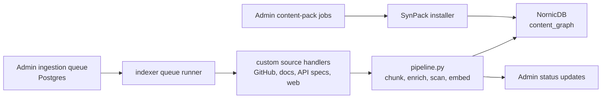

# Knowledge Indexers

The Synesis indexer is the production ingestion path for RAG content. It claims
work from the Admin ingestion queue, installs hosted SynPack archives, fetches
and normalizes custom sources, chunks and enriches content, embeds text with
TEI/BGE-M3, scans for prompt-injection signals, and writes graph nodes plus
relationships into **NornicDB**.

Curated Synesis-maintained corpora should be built and distributed as
**SynPack v2** archives. Use Admin queue bootstrap files for custom
organization-specific loads, experiments, or one-off documents.

## Current Architecture



The direct queue runner is the normal production path:

```bash
./scripts/deploy-indexer.sh
./scripts/deploy-indexer.sh --run
```

Staged jobs may still be used for large source sets, but they write the same
NornicDB graph shape and must not compete with the direct queue runner for the
same pending corpus.

SynPack jobs use the same indexer image in `--mode content-packs` or
`--mode synpack` command paths. The legacy in-image `sources-*.yaml` catalogs
have been retired; the image defaults to `--mode queue`.

## Graph Schema

Current schema version: **v19** in
[`base/rag/indexer/app/schema.py`](../base/rag/indexer/app/schema.py).

Each chunk is written as a `ContentNode` with:

- text and embedding fields
- source, pack, version, branch, commit, and temporal metadata
- authority, scan status, approval status, and review trace metadata
- org, tenant, owner, session, ACL, and authz object metadata
- code metadata such as language, repo path, module path, symbol name, imports, and calls

The writer also creates related `Document`, `File`, and `Symbol` nodes when
source metadata is present. Scope and ACL metadata are copied onto these
structural nodes so graph expansion cannot leak unauthorized neighbors.

## Authorization Metadata

Indexer output includes fields used by planner-side hardening:

| Field | Purpose |
|-------|---------|
| `visibility_scope` | `global`, `org`, `tenant`, `user`, or `session` |
| `org_id` / `tenant_id` / `owner_user_id` / `conversation_id` | Structural scope predicates |
| `acl_mode` | `open`, `restricted`, or `private` |
| `acl_groups` | Backward-compatible CSV representation |
| `acl_group_ids` | Exact-match group IDs for Cypher predicates |
| `authz_object_id` | Stable OpenFGA object reference, usually `rag_doc:<doc_id>` |

Planner retrieval derives caller scope from authentication state, not request
payloads. In `SYNESIS_RAG_AUTHZ_MODE=enforce`, restricted/private or non-global
rows are additionally checked through OpenFGA `can_read`.

## Code Graph

All code ingestion benefits from deterministic graph extraction:

1. AST-aware chunking captures symbols and source spans where available.
2. Import and call references are extracted into `import_refs` and `call_refs`.
3. The graph writer creates `File` and `Symbol` nodes.
4. Deterministic edges are added:
   - `CONTAINS` for document/file/chunk hierarchy
   - `DEFINES` for chunk-to-symbol relationships
   - `IMPORTS` and `CALLS` for resolved code references
5. SynPacks can add LLM enrichment, but LLMs are not required
   for graph construction.

This means ordinary GitHub code ingestion and managed packs both improve
retrieval with the same graph-native context.

## Handler Responsibilities

| Handler | Responsibility |
|---------|----------------|
| `github_code.py` | Repository code fetch, AST-aware chunking, code graph signals |
| documentation handlers | Markdown/HTML/docs chunking and source metadata |
| API spec handlers | OpenAPI and structured reference extraction |
| `synpack.py` / `language_pack.py` / `platform_pack.py` | Managed SynPack v2 archives, language/domain pack configs, platform pack configs, lock files, optional enrichment |

Handlers should produce deterministic metadata first. Optional services such as
preprocess, spam scoring, entity extraction, or LLM enrichment are env-gated and
must not be required for a successful basic ingest.

## Custom And Intranet Ingestion

Synesis-maintained reusable content should be packaged as SynPack v2. Use the
Admin ingestion queue for organization-specific loads: intranet docs, private
runbooks, internal repos, PDFs, one-off OpenAPI specs, and temporary discovery
experiments.

The copyable example is
[`examples/ingestion/custom-ingestion-items.example.yaml`](../examples/ingestion/custom-ingestion-items.example.yaml).
It uses the Admin bootstrap shape:

- top-level `items`
- per-item `uri`, `handler`, `title`, `domain`, `authority`, `origin_type`,
  `tags`, `visibility_scope`, `acl_mode`, and optional org/tenant scope
- per-item `config` for handler-specific fetch settings
- per-item metadata such as `corpus_class`, `languages`, `artifact_kind`,
  `content_profile`, `freshness_sla_days`, `scope_tags`, and
  `constraint_kind`

Accepted handlers come from `GET /api/v1/ingestion/handlers`. Common custom
load handlers are:

| Handler | Use |
|---|---|
| `web_page` | Multi-page docs sites with sitemap/robots support |
| `html_document` | Single HTML page |
| `markdown_file` | Direct Markdown URL |
| `github_code` | Repository source code |
| `github_markdown` | Repository docs or wiki-style markdown |
| `openapi_spec` | OpenAPI/Swagger YAML or JSON |
| `pdf_document` | Direct PDF URL |
| `structured_data` | YAML/JSON/TOML/XML reference data |
| `generic_text` | Plain text files |

Classify custom loads with the same fields the indexer and planner understand:

| Field | Supported values / guidance |
|---|---|
| `corpus_class` | `coder_enriched`, `general`, or `hybrid` |
| `constraint_kind` | `hard`, `guiding`, or `advisory` |
| `authority` | `canonical`, `vetted`, `community`, or `untrusted` |
| `origin_type` | `curated`, `official`, `community`, or `generated` |
| `visibility_scope` | `global`, `org`, `tenant`, `user`, or `session` |
| `acl_mode` | `open`, `restricted`, or `private` |
| `artifact_kind` | Short operator-defined class such as `docs`, `code`, `api_spec`, `runbook`, or `changelog` |
| `content_profile` | Short operator-defined profile such as `reference`, `conceptual`, `procedural`, or `troubleshooting` |

Use `coder_enriched` for source code, API references, compiler/runtime errors,
toolchain docs, platform standards, and implementation runbooks. Use `general`
for broader business/domain knowledge. Use `hybrid` when Planner, Yarn/Coder,
and MCP callers should all consider the content useful.

Scope intranet content deliberately:

- `visibility_scope: global` only for content safe for every tenant/user.
- `visibility_scope: org` with `org_id` for organization-wide private docs.
- `visibility_scope: tenant` with `org_id` and `tenant_id` for tenant-bound
  docs.
- `acl_mode: restricted` or `private` requires `acl_groups`; retrieval
  enforcement also requires matching `rag_doc:*` OpenFGA grants when
  `SYNESIS_RAG_AUTHZ_MODE=enforce`.

Validate before import:

```bash
curl -sS -X POST "$SYNESIS_ADMIN_URL/api/v1/ingestion/bootstrap/validate" \
  -H "Authorization: Bearer $SYNESIS_ADMIN_TOKEN" \
  -F file=@examples/ingestion/custom-ingestion-items.example.yaml
```

Import after validation:

```bash
curl -sS -X POST "$SYNESIS_ADMIN_URL/api/v1/ingestion/bootstrap" \
  -H "Authorization: Bearer $SYNESIS_ADMIN_TOKEN" \
  -F file=@examples/ingestion/custom-ingestion-items.example.yaml
```

The same file can also be imported through the Admin UI ingestion bootstrap
flow. After import, queue items are claimed by the indexer CronJob or by a
manual indexer run.

## Lifecycle

| Status | Meaning |
|--------|---------|
| `pending` | Admin accepted the ingestion item; indexer may claim it |
| `processing` | Claimed by an indexer run |
| `indexed` | Graph nodes/edges were written successfully |
| `failed` | Retryable failure recorded |
| `dead_letter` | Exhausted retries or invalid configuration |

Queue items carry effective scope fields computed by Admin RBAC. The indexer
validates those fields before writing:

- `org`, `tenant`, `user`, and `session` scopes require `org_id`.
- `tenant` requires `tenant_id`.
- `user` and `session` require `owner_user_id`.
- `session` requires `conversation_id`.
- `restricted` and `private` ACL modes require at least one ACL group.

## Schema Changes

When adding retrieval-visible fields:

1. Increment `SCHEMA_VERSION` in `base/rag/indexer/app/schema.py`.
2. Update `catalog_entity()` and tests.
3. Mirror returned fields in `base/planner-ts/src/retrieval/rag-client.ts` and `types.ts`.
4. Update Admin API/UI result shapes if the field is operator-facing.
5. Re-run or requeue ingestion so existing graph nodes are backfilled.

The NornicDB writer owns graph constraints and indexes through
`ensure_schema()`, including the vector index, authz object index, and core
content-node indexes.

## Operations

Verify NornicDB:

```bash
oc rollout status deployment/synesis-nornicdb -n synesis-rag
oc logs deployment/synesis-nornicdb -n synesis-rag --tail=100
```

Run one indexer pass:

```bash
./scripts/deploy-indexer.sh --run
```

Import custom ingestion items:

```bash
curl -sS -X POST "$SYNESIS_ADMIN_URL/api/v1/ingestion/bootstrap" \
  -H "Authorization: Bearer $SYNESIS_ADMIN_TOKEN" \
  -F file=@examples/ingestion/custom-ingestion-items.example.yaml
```

Build or install maintained content as SynPack v2:

```bash
./scripts/synpack-helper.py prepare --language go
./scripts/synpack-helper.py enrich --language go --request-limit 1000
./scripts/synpack-helper.py finalize --language go --embedder-url http://localhost:8082/v1
```

Check planner retrieval config:

```bash
oc get deploy synesis-planner-ts -n synesis-planner -o jsonpath='{.spec.template.spec.containers[0].env}'
```

The important defaults are:

- `SYNESIS_NORNIC_URI=bolt://synesis-nornicdb.synesis-rag.svc.cluster.local:7687`
- `SYNESIS_NORNIC_DATABASE=nornic`
- `SYNESIS_NORNIC_VECTOR_INDEX=embeddings`
- `SYNESIS_EMBEDDER_URL=http://embedder.synesis-rag.svc.cluster.local:8080/v1`
- `SYNESIS_RAG_AUTHZ_MODE=audit` until `rag_doc:*` OpenFGA grants are populated

See also: [RAG](RAG.md), [NornicDB Operations](NORNICDB_OPERATIONS.md), [SynPacks](SYNPACKS.md).
