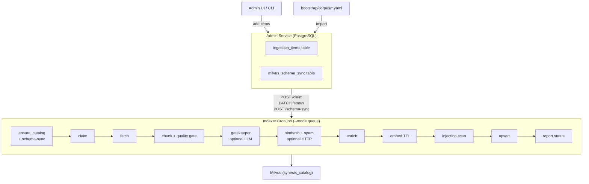
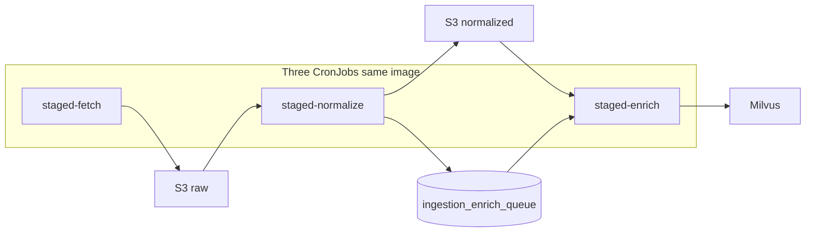
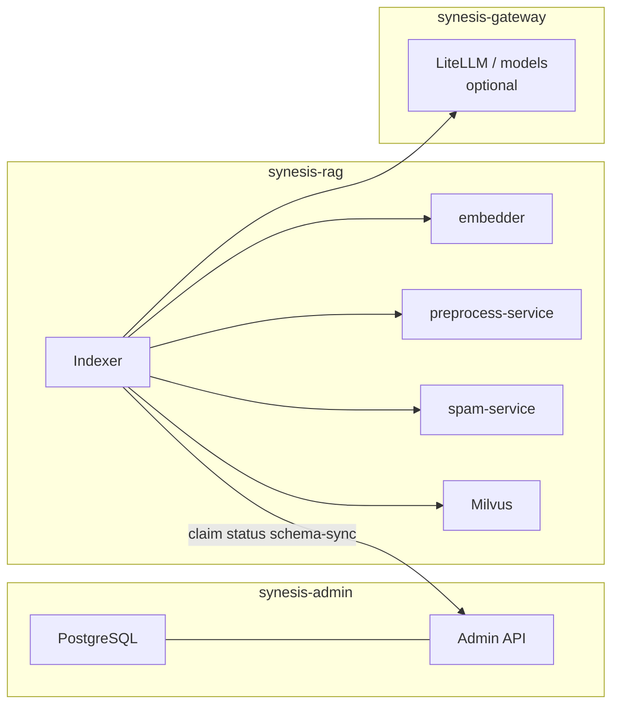
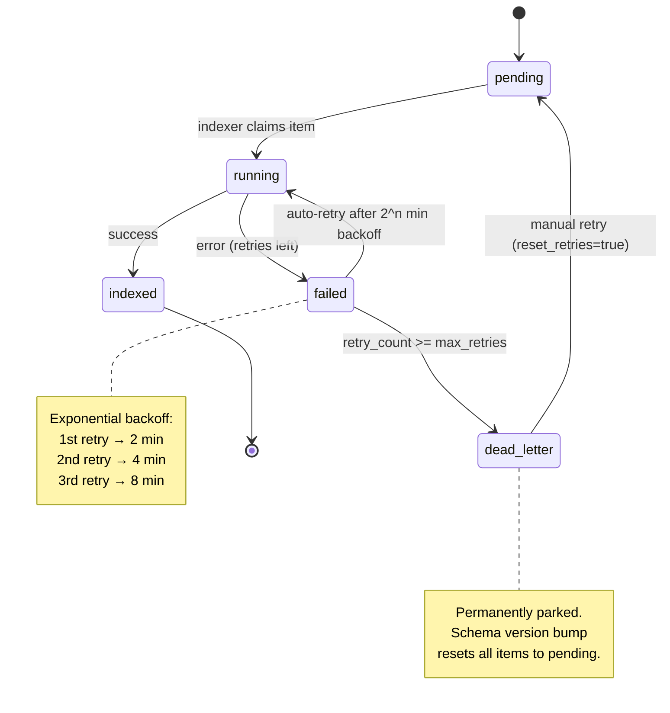

# Synesis RAG Indexer

Synesis uses a **single queue-driven indexer** that claims work from a PostgreSQL-backed ingestion queue (the admin service's `ingestion_items` table). Content is added via the admin UI, the bootstrap API, or bulk YAML import. By default the indexer processes **all** pending rows in priority order. For a **narrow slice** (e.g. Go-only bootstrap), set **`SYNESIS_INDEXER_QUEUE_DOMAIN`** (and optionally **`SYNESIS_INDEXER_QUEUE_TAG`**) on the queue job; the admin **`POST /api/v1/ingestion/items/claim`** endpoint accepts matching `domain` / `tag` query parameters. To **clear pending work** before a focused import, **`POST /api/v1/ingestion/items/purge-pending`** (platform admin) deletes pending rows; optional **`release_stale_running_minutes`** resets stuck `running` leases. The helper script **`scripts/go-first-rag-load.sh`** automates purge → enqueue `lang-go.yaml` → one-shot job with **`SYNESIS_INDEXER_QUEUE_DOMAIN=go`**. For very large corpora, prefer the **staged S3 pipeline** (`staged-fetch` → `staged-normalize` → `staged-enrich`) so fetches land in S3 and later stages can be retried without re-fetching (see sections below).

**Related docs:** Semantic ingestion / v9 design bar — [`plans/semantic_rag_ingestion_v9.md`](plans/semantic_rag_ingestion_v9.md). Cost levers — [`RAG_INGESTION_COST.md`](RAG_INGESTION_COST.md). Format extractors and enrichment boundaries — [`INGESTION_ENRICHMENT.md`](INGESTION_ENRICHMENT.md). Trust envelope and attribution — [`SECURITY.md`](SECURITY.md).

## Architecture



One container image (`base/rag/indexer/`) with handler plugins for each document type. The queue runner (`queue_runner.py`) claims items one at a time via `SELECT ... FOR UPDATE SKIP LOCKED`, processes them through the existing pipeline, and reports status back to the admin API.

### Staged S3 pipeline (optional)

**How it runs:** this path uses **three separate CronJobs** in `synesis-rag`, all using the **same indexer image** with different `--mode` arguments. They are **not** one combined job:

| CronJob (manifest) | Container args | What it does |
|--------------------|----------------|--------------|
| `synesis-indexer-staged-fetch` | `--mode staged-fetch` | Claims `ingestion_items` (`pending` → `running` → `staged_raw`), runs handler **fetch only**, writes **raw** objects to S3, registers **`ingestion_documents`**. |
| `synesis-indexer-staged-normalize` | `--mode staged-normalize` (+ batch flags) | Claims docs with `raw_status=done`, reads S3 raw, writes **normalized** `.md` + `.json` to S3, enqueues **`ingestion_enrich_queue`**, advances parent items toward **`staged_norm`**. |
| `synesis-indexer-staged-enrich` | `--mode staged-enrich` (+ optional `--enrich full`) | Claims enrich jobs, reads normalized markdown from S3, runs chunk → gate → gatekeeper → enrich → TEI embed → Milvus upsert; marks jobs done and parent **`indexed`** when all child docs finish. |

The **direct** path remains a **fourth** CronJob, `synesis-indexer-queue`, with `--mode queue` (fetch → Milvus in one shot). **Only one of these paths should consume `pending` ingestion items** for a given corpus: either keep **`synesis-indexer-queue` suspended** and use the three staged jobs, or the opposite.



**Admin API surface (per phase):**

| Phase | CLI mode | Admin API | Writes |
|-------|-----------|-----------|--------|
| Fetch | `--mode staged-fetch` | `POST /api/v1/ingestion/staged/items/claim-fetch`, `POST .../documents/register`, `PATCH .../items/{id}/status` | `s3://…/raw/…`, rows in `ingestion_documents` |
| Normalize | `--mode staged-normalize` | `POST .../documents/claim-normalize`, `PATCH .../documents/{id}/normalize-result` | `s3://…/normalized/{v}/…`, `ingestion_enrich_queue` |
| Enrich | `--mode staged-enrich` | `POST .../enrich/claim`, `PATCH .../enrich/{job_id}/status` | Milvus upsert (same schema as direct queue) |

#### Switching from direct queue to the three-phase approach

1. **Migrate admin DB** — apply Alembic through **`021_ingestion_staged`** (creates `ingestion_documents`, `ingestion_enrich_queue`).
2. **Create S3 bucket + IAM/IRSA** — grant the indexer service account `s3:GetObject` / `s3:PutObject` on that bucket (and optional prefix). Out of tree for this repo.
3. **Suspend the direct indexer** so it does not compete for `pending` items:
   - `oc patch cronjob synesis-indexer-queue -n synesis-rag -p '{"spec":{"suspend":true}}'`
   - (Or keep it suspended in your overlay; dev overlay often already suspends it.)
4. **Deploy / patch staged CronJobs** with bucket env:
   - `./scripts/deploy-indexer.sh --s3-bucket <your-bucket>`
   - Optionally set **`SYNESIS_INGESTION_S3_PREFIX`**, **`AWS_REGION`** on each staged CronJob if needed.
5. **Configure enrich** (optional LLM / gatekeeper / `--enrich full`) on **`synesis-indexer-staged-enrich`** the same way you would on `synesis-indexer-queue` (embedder URL, gatekeeper envs, GPU tolerations — see manifest comments in `cronjob-staged-enrich.yaml`).
6. **Unsuspend in pipeline order** when you are ready to process work:
   - First **`synesis-indexer-staged-fetch`** (drains `pending` → `staged_raw`).
   - Then **`synesis-indexer-staged-normalize`** (raw → normalized + enrich queue).
   - Then **`synesis-indexer-staged-enrich`** (GPU/Milvus).  
   All three can stay enabled on a schedule once bootstrapped; normalize and enrich will simply find no work until the prior stage produces rows.
7. **Monitor** Admin → Ingestion Queue: statuses **`staged_raw`** → **`staged_norm`** → **`indexed`**; stats tiles for doc rows and enrich queue depth.

#### Switching back to direct queue only

1. **Suspend** all three staged CronJobs (`staged-fetch`, `staged-normalize`, `staged-enrich`).
2. **Unsuspend** `synesis-indexer-queue`.
3. Ensure **no items** are stuck in `staged_raw` / `staged_norm` / `enrich_queued` if you expect the direct indexer to handle them — otherwise reset or finish the staged pipeline first (or re-queue items as `pending` after cleaning staged rows if you intentionally abandon S3 state).

**Requirements:** **`SYNESIS_INGESTION_S3_BUCKET`** (and optional **`SYNESIS_INGESTION_S3_PREFIX`**) on staged workers; AWS credentials via IRSA or env. **Do not** run **`queue`** and **`staged-fetch`** on the same **`pending`** items concurrently.

**Deploy:** `./scripts/deploy-indexer.sh --s3-bucket <name>` patches the staged CronJobs. Base manifests: `base/rag/indexer/cronjob-staged-*.yaml` (default **`suspend: true`**). GPU tolerations for enrich: uncomment in `cronjob-staged-enrich.yaml` or patch in your overlay.

**Item statuses:** `staged_raw` → `staged_norm` → … → `indexed` (parent item is **`indexed`** when every child document has completed enrich). Intermediate states are visible in Admin → Ingestion Queue.

**Manual one-shot runs (debug):** create a Job from a CronJob, e.g.  
`oc create job test-fetch --from=cronjob/synesis-indexer-staged-fetch -n synesis-rag` (same pattern for normalize / enrich).

### Ingestion topology and dependent services

All of the following run in Kubernetes unless you are doing local YAML mode. **Namespace** is the primary boundary; only the services listed as “indexer” callers are required for a minimal ingest path.

| Service / store | Namespace | Who calls it | Role in the loop |
|-----------------|-----------|--------------|------------------|
| Admin API + PostgreSQL | `synesis-admin` | Indexer CronJob | Queue claim, status, run telemetry, `schema-sync`, optional **reset-catalog** |
| **Indexer** | `synesis-rag` | — | Orchestrates handlers → `pipeline.py` → Milvus upsert |
| **Milvus** | `synesis-rag` | Indexer | `synesis_catalog` collection (schema **v13**) |
| **embedder** (TEI) | `synesis-rag` | Indexer | `POST /v1/embeddings` for chunk vectors |
| **preprocess-service** | `synesis-rag` | Indexer (optional) | `simhash64` + optional `html_document` jusText clean; ClusterIP + NetworkPolicy (indexer pods only) |
| **spam-service** | `synesis-rag` | Indexer (optional) | `spam_score` per chunk; ClusterIP + NetworkPolicy (indexer pods only) |
| OpenAI-compatible LLM (e.g. **LiteLLM** in `synesis-gateway`) | `synesis-gateway` (typical) | Indexer (optional) | Semantic **gatekeeper** `chat/completions`; also Tier-2 enrichment in YAML/`--llm-url` flows |

**Not on the indexer hot path (query / other features):** **keyword-service** and **gliner-service** are used by the **planner** and related retrieval tooling, not by `pipeline.py` today. Redis in `synesis-rag` backs planner/session workloads, not the indexer claim loop.

Optional HTTP steps are **off** until you set the corresponding base URL env vars on the indexer (see **Configuration** below).



### Pipeline stage order (reference)

Exact implementation: `base/rag/indexer/app/pipeline.py`.

1. **Catalog** — `ensure_synesis_catalog`; report schema version to admin when needed.  
2. **Claim** — dequeue one `ingestion_items` row.  
3. **Fetch** — handler-specific (`web_page`, `github_code`, …).  
4. **Optional HTML clean** — for `html_document` only: preprocess `clean_html` when `SYNESIS_INDEXER_PREPROCESS_URL` + `SYNESIS_INDEXER_PREPROCESS_CLEAN_HTML` (jusText path; handler skips trafilatura when `preprocess_clean=justext`).  
5. **Chunk** — handler `parse_and_chunk` + **chunk quality gate** (`content_gate`).  
6. **Semantic gatekeeper** — optional per-document LLM (`gatekeeper.py`); may drop whole documents; fills v9 metadata + merged keywords.  
7. **Signals** — optional **simhash** + **spam** batches → `simhash64`, `spam_score`.  
8. **Enrich** — template `context_prefix`; optional LLM chunk summary when enrichment full mode + LLM URL.  
9. **Embed** — TEI batch embeddings.  
10. **Injection scan** — `scan_chunk_text_detailed`; produces `scan_status` + `scan_signals` (pattern IDs matched); may set `approval_status` pending.  
11. **Upsert** — Milvus batch upsert; report **indexed** / **failed** to admin.

## Item Lifecycle



| Status | Meaning | What happens next |
|--------|---------|-------------------|
| `pending` | Waiting to be processed | Claimed by next indexer run |
| `running` | Claimed by an indexer | Processing in progress |
| `indexed` | Successfully processed | Chunks in Milvus, item complete |
| `failed` | Processing error (retries left) | Auto-retried on next indexer run after backoff |
| `dead_letter` | Exceeded max retries (default 3) | Permanently parked — won't be retried automatically |

**Auto-retry with exponential backoff:** Failed items are automatically re-claimed by the indexer after a backoff delay of `2^retry_count` minutes (2 min, 4 min, 8 min). Pending items are always prioritized over retries.

**Dead letter recovery:** Items in `dead_letter` can be manually revived via the admin UI or API:
```bash
curl -X POST http://synesis-admin.synesis-admin.svc:8080/api/v1/ingestion/items/{item_id}/retry?reset_retries=true \
  -H "Authorization: Bearer $TOKEN"
```

**Error tracking:** Each failed item stores the specific error in `error_message` (e.g. "httpx.ConnectError: Connection refused", "yaml.YAMLError: ...") so you can diagnose failures from the admin UI.

## Milvus Schema Sync

The admin DB tracks the last-known Milvus schema version in the `milvus_schema_sync` table. When the indexer bumps the schema (e.g. v12 → v13):

1. **Indexer** calls `ensure_synesis_catalog()` — detects version mismatch, drops the old collection, recreates with new schema
2. **Indexer** reports the new version via `POST /api/v1/ingestion/schema-sync`
3. **Admin service** compares stored vs. reported version — if different, resets **all** `indexed`, `failed`, and `dead_letter` items back to `pending` with `retry_count = 0`
4. **Next indexer run** processes everything fresh with the new schema

This means schema bumps are fully automatic — no manual intervention to re-import. Dead-letter items also get a fresh start since the new handler code may fix the original failure.

**Manual catalog wipe (admin):** `POST /api/v1/ingestion/milvus/reset-catalog` with JSON body `{"confirm":"DELETE_SYNESIS_CATALOG","reset_queue":true}` (admin auth required). Drops `synesis_catalog`, sets `milvus_schema_sync` to uninitialized, and optionally resets all indexed/failed/dead-letter items to `pending`. The **Ingestion Queue** UI includes the same flow under **Danger zone** (admin role).

```
base/rag/indexer/
├── app/
│   ├── cli.py              # CLI entrypoint (--mode queue | --mode yaml)
│   ├── queue_runner.py     # Queue client: claim, process, report, schema-sync
│   ├── pipeline.py         # fetch → chunk+gate → gatekeeper → simhash/spam → enrich → embed → scan → upsert
│   ├── schema.py           # Milvus collection schema v13 (synesis_catalog)
│   ├── gatekeeper.py       # Optional document-level LLM labels (structured JSON)
│   ├── preprocess_client.py # Optional preprocess-service: simhash, jusText HTML clean
│   ├── spam_client.py      # Optional spam-service: P(spam) per chunk
│   ├── chunking.py         # Heading-aware split with overlap
│   ├── enrichment.py       # context_prefix; optional LLM chunk summary (Tier 2)
│   ├── embed_client.py     # Batch embedding via TEI
│   ├── milvus_writer.py    # Idempotent upsert with content-hash dedup
│   └── handlers/           # Handler plugins (auto-discovered)
│       ├── github_code.py       # 25+ languages via tree-sitter-language-pack
│       ├── structured_data.py   # YAML/JSON/TOML/XML/HCL format-aware chunking
│       ├── generic_text.py      # Catch-all paragraph-boundary chunking
│       ├── github_markdown.py
│       ├── web_page.py
│       ├── html_document.py
│       ├── pdf_document.py
│       ├── openapi_spec.py
│       ├── arxiv_paper.py
│       ├── markdown_file.py
│       ├── seed_corpus.py
│       └── license_spdx.py
├── cronjob-queue.yaml      # CronJob (image placeholder; use overlays/jobs* via deploy-indexer.sh)
├── Dockerfile
├── requirements.txt
└── kustomization.yaml
```

## Queue Mode vs Legacy YAML Mode

| Mode | Flag | Source of work | Use case |
|------|------|----------------|----------|
| **Queue** (primary) | `--mode queue` | Admin DB `ingestion_items` | Production — content managed via UI/API |
| **YAML** (legacy) | `--mode yaml --sources file.yaml` | Local YAML file | Local development, one-off imports |

Queue mode is the default for the deployed CronJob. YAML mode remains available for local development.

### Connectivity, auth, and NetworkPolicy (OpenShift)

Queue mode needs **three** things to work reliably:

1. **Internal service token** — The indexer CronJob sets `SYNESIS_ADMIN_SERVICE_TOKEN` from the **`synesis-internal-service-auth`** secret (key `token`) in **`synesis-rag`**. That value **must match** the **`SYNESIS_INTERNAL_SERVICE_TOKEN`** env on **synesis-admin** (same secret in `synesis-admin`). Run **`ensure_internal_service_auth`** from [`scripts/deploy.sh`](scripts/deploy.sh) to generate/sync the secret across namespaces, or copy the secret manually. If the env is empty (`optional: true` on the CronJob), the indexer calls the admin API **without** a Bearer token and receives **401** on `claim` / `runs` / `schema-sync`.

2. **Milvus** — Default client URI is `http://synesis-milvus.synesis-rag.svc.cluster.local:19530` (see `milvus_writer.py`). No extra Milvus token is required for the default standalone image unless you enabled auth separately.

3. **NetworkPolicy** — [`base/rag/indexer/network-policy.yaml`](../base/rag/indexer/network-policy.yaml) selects pods with **`app.kubernetes.io/name=synesis-indexer`** and allows **egress** to: **`synesis-admin:8080`**, **`synesis-rag`** on **19530** (Milvus) and **8080** (embedder, preprocess, spam, …), **`synesis-gateway:4000`** (optional LiteLLM/gatekeeper), **DNS (53)**, and **80/443** (web fetch + S3). It is included from the indexer Kustomize bundle (`overlays/jobs*`). **Admin** ingress (`base/admin/network-policy.yaml`) already allows **TCP 8080** from any peer (no `from` restriction), so indexer → admin is permitted.

**Quick checks after deploy:**

```bash
# Same token bytes in both namespaces (should be non-empty)
oc get secret synesis-internal-service-auth -n synesis-admin -o jsonpath='{.data.token}' | wc -c
oc get secret synesis-internal-service-auth -n synesis-rag -o jsonpath='{.data.token}' | wc -c

oc get networkpolicy synesis-indexer-egress -n synesis-rag -o yaml
```

Then run a one-shot queue job and **`oc logs job/…`**: you should see `queue_runner_start`, `queue_run_created`, and either `queue_item_claimed` or `queue_empty` — not repeated `401` / `403` from httpx.

## Handler Types

### Code (tree-sitter AST — 25+ languages)

| Handler | Source Type | What It Does |
|---------|-----------|--------------|
| `github_code` | GitHub repos | Shallow-clones repos, AST-aware chunking via tree-sitter-language-pack. Also routes `.yaml`/`.json`/`.xml`/`.toml`/`.tf` files to structured_data handler. |

**Supported languages:** Python, Go, Rust, JavaScript, TypeScript, Java, C, C++, C#, Ruby, PHP, Bash/Shell, Lua, Kotlin, Scala, Swift, SQL, R, Elixir, Haskell, Perl, Dockerfile, Makefile, Protobuf, HCL/Terraform.

Each language has configured `top_level` and `nested` AST node types for semantic chunking (functions, classes, methods, structs, etc.).

### Structured Data (format-aware chunking)

| Handler | Source Type | What It Does |
|---------|-----------|--------------|
| `structured_data` | URLs / local | YAML, JSON, TOML, XML, HCL — splits at semantic boundaries |

Format-specific chunking:
- **YAML**: Splits on `---` document separators. Kubernetes manifests get `kind/name` as heading. Ansible playbooks split per task/play.
- **JSON**: Arrays split per element; objects split at top-level keys.
- **XML**: Element-tree split at child elements (Maven POMs, config files).
- **TOML**: Split per top-level table.
- **HCL/Terraform**: Split per `resource`/`data`/`module`/`variable`/`output` block.

### Documents

| Handler | Source Type | What It Does |
|---------|-----------|--------------|
| `github_markdown` | GitHub repos | Fetches .md files via GitHub API, heading-aware chunking with heading_path tracking |
| `html_document` | URLs | Default: trafilatura → markdown + heading-aware chunking; optional **jusText** main text via preprocess-service when `SYNESIS_INDEXER_PREPROCESS_CLEAN_HTML` (see Configuration) |
| `web_page` | URLs | Crawl4AI-based web crawling, HTML→Markdown conversion, heading-aware chunking |
| `pdf_document` | URLs | PyMuPDF text extraction plus structured table markdown, section-based splitting |
| `markdown_file` | Local paths | Reads local .md files, heading-aware chunking |
| `arxiv_paper` | arXiv IDs | Fetches PDFs from arXiv, extracts and chunks |

### Specialized

| Handler | Source Type | What It Does |
|---------|-----------|--------------|
| `openapi_spec` | URLs | Parses OpenAPI 3.x / Swagger 2.0 into endpoint-level chunks |
| `license_spdx` | SPDX sources | License data from three authoritative sources plus compatibility rules |
| `seed_corpus` | JSON files | Batch import from JSON URL lists (legacy format) |
| `generic_text` | URLs | Catch-all for unrecognized formats — paragraph-boundary chunking with overlap |

## Adding Content

### Via Admin UI (recommended)

Navigate to **RAG Pipeline > Ingestion Queue** in the admin dashboard:

- **Single item** — enter a URI, select handler and domain, submit
- **Bulk paste** — one URI per line
- **Upload YAML** — normalized bootstrap format (see below)

### Via Bootstrap API

```bash
curl -X POST http://synesis-admin.synesis-admin.svc:8080/api/v1/ingestion/bootstrap \
  -F "file=@bootstrap/corpus/docs.yaml" \
  -H "Authorization: Bearer $TOKEN"
```

Deduplication is automatic — existing URIs are skipped (`ON CONFLICT (uri) DO NOTHING`).

### Bootstrap YAML Format

All files in `bootstrap/corpus/` use a normalized schema that maps 1:1 to `ingestion_items` rows:

```yaml
items:
  - uri: "https://example.com/docs"
    handler: html_document
    title: "Example Documentation"
    domain: architecture
    authority: vetted
    origin_type: curated
    tags: [cloud, architecture]
    priority: 0
    config: {}
```

See [bootstrap/README.md](../bootstrap/README.md) for the corpus file layout (`cloud.yaml`, `arxiv.yaml`, `llm.yaml`, `foundations.yaml`, `lifestyle.yaml`, `developer.yaml`, plus `docs`, `code`, etc.) and normalized item schema.

## Running the Indexer

### Deploy the CronJob

`deploy-indexer.sh` applies **`oc apply -k`** on a Kustomize overlay so the container image is a real pull spec (default **`overlays/jobs`** → `ghcr.io/supernovae/synesis/indexer:latest`). Applying `base/rag/indexer/cronjob-queue.yaml` alone leaves `synesis-indexer:latest`, which the cluster cannot pull.

```bash
./scripts/deploy-indexer.sh            # Apply overlay (default: overlays/jobs)
./scripts/deploy-indexer.sh --run      # Also trigger a one-shot run now

# Optional: staging/prod overlays (image tag / schedule differ)
SYNESIS_INDEXER_OVERLAY="$PWD/overlays/jobs-prod" ./scripts/deploy-indexer.sh --run
```

### Monitor

```bash
oc logs -n synesis-rag -l synesis.io/indexer-group=queue -f
```

### Troubleshooting

- **`httpx.ConnectTimeout` when calling the admin API** — The admin `Service` listens on **port `8080`**, not `8000` (`base/admin/service.yaml`). Set `SYNESIS_ADMIN_URL` to `http://synesis-admin.synesis-admin.svc.cluster.local:8080` (or your Route URL with the correct path/port). A wrong port typically hangs until the HTTP client times out; it is not an auth error.

### Indexer ↔ admin authentication

Control-plane endpoints used by indexer workers now require **either**:
- a valid `platform_admin` bearer token, or
- a shared internal service token (`SYNESIS_INTERNAL_SERVICE_TOKEN` on admin, `SYNESIS_ADMIN_SERVICE_TOKEN` on workers).

Keep `NetworkPolicy` restrictions in place; token auth is defense in depth, not a replacement for network isolation.

### `html_document` vs `web_page` (single page vs doc slice)

| Handler | Behaviour |
|---------|-----------|
| `html_document` | One HTTP GET on `uri` / `config.url` — best for **blog posts**, release notes, single articles. |
| `web_page` | Crawl4AI fetch; **sitemap-first** discovery, **`robots.txt`** crawl-delay + `can_fetch`, then same-host **BFS** fallback. Bounded by `max_pages`, `max_depth`, `allowed_prefixes`. |

`web_page` `config` (queue item or `sources.yaml`):

| Field | Default | Purpose |
|-------|---------|---------|
| `discovery` | `sitemap_first` | `sitemap_first` \| `sitemap_only` \| `bfs` |
| `sitemap_urls` | (from robots + `/sitemap.xml` guesses) | Extra sitemap entry points |
| `follow_links` | `true` | BFS follow internal links when sitemap path is empty or exhausted |
| `max_depth` | `5` | BFS depth from seed |
| `max_pages` | `100` | Cap on successfully indexed pages per queue item |
| `respect_robots` | `true` | Honor `robots.txt` allow + **Crawl-delay** (and `min_request_interval` floor) |
| `min_request_interval` | `0.4` | Minimum seconds between fetches |
| `allowed_prefixes` | `[]` | Full URLs (e.g. `https://docs.python.org/3/tutorial/`) or path prefixes — **must** match for sitemap URLs too (fixed in content gate) |

**Bootstrap corpus:** run `python3 scripts/classify-bootstrap-web-sources.py` to tag likely blogs (`corpus_blog`) and convert documentation seeds from `html_document` → `web_page` with generated `allowed_prefixes`. Re-run when you add many new `html_document` URLs.

### Run Locally (development)

```bash
cd base/rag/indexer

# Queue mode (needs admin service running)
python -m app --mode queue --admin-url http://localhost:8080

# YAML mode (legacy, for local testing)
python -m app --mode yaml --sources sources-docs.yaml
python -m app --mode yaml --sources sources-code.yaml --enrich full
```

## Post-Migration Import

After deploying the admin service (Alembic migrations run automatically), import all bootstrap data:

```bash
# Import all bootstrap corpus files (sorted order — or use ./scripts/load-bootstrap.sh)
while IFS= read -r f; do
  curl -X POST http://synesis-admin.synesis-admin.svc:8080/api/v1/ingestion/bootstrap \
    -F "file=@$f" -H "Authorization: Bearer $TOKEN"
done < <(find bootstrap/corpus -maxdepth 1 -name '*.yaml' -type f | LC_ALL=C sort)

# Or use the admin UI: RAG Pipeline > Ingestion Queue > Upload YAML
# Or: ./scripts/load-bootstrap.sh -a http://synesis-admin.synesis-admin.svc:8080
```

Items enter the queue as `pending`. Run the indexer to process them:

```bash
./scripts/deploy-indexer.sh --run
```

## Schema (synesis_catalog)

Single Milvus collection with `authority` as partition key and HNSW index on embeddings. Current schema version: **v13** (defined in `base/rag/indexer/app/schema.py`).

#### Core fields

| Field | Type | Purpose |
|-------|------|---------|
| `chunk_id` | VARCHAR(64) | Primary key (SHA256 content hash) |
| `doc_id` | VARCHAR(128) | Document identifier for grouped operations |
| `chunk_index` | INT64 | Position within document |
| `text` | VARCHAR(8192) | Chunk content (english analyzer for BM25) |
| `context_prefix` | VARCHAR(512) | Contextual sentence prepended before embedding (Contextual Retrieval) |
| `chunk_summary` | VARCHAR(1024) | 1-2 sentence neutral description (optional, LLM-generated) |
| `heading_path` | VARCHAR(512) | Document structure breadcrumb ("Arch > Retrieval > BM25") |
| `section` | VARCHAR(256) | Immediate section heading |
| `document_name` | VARCHAR(256) | Source document name (for citation) |
| `source_type` | VARCHAR(32) | Source category (github, web, local, spdx) |
| `handler` | VARCHAR(32) | Handler that produced this chunk |
| `domain` | VARCHAR(64) | Taxonomy domain ID |
| `tags` | VARCHAR(512) | Comma-separated tags |
| `keywords` | VARCHAR(512) | Comma-separated terms (gatekeeper merge when enabled) |
| `origin_type` | VARCHAR(32) | Provenance: internal, external, curated |
| `authority` | VARCHAR(32) | Trust tier: canonical, vetted, community, external (partition key) |
| `source_url` | VARCHAR(512) | Citation URL |
| `scan_status` | VARCHAR(16) | Injection scan result: clean, flagged, vetted, rejected |
| `content_format` | VARCHAR(32) | Source format: python, yaml, json, hcl, xml, markdown, etc. |
| `symbol_type` | VARCHAR(64) | Semantic unit type: function, class, k8s_deployment, hcl_resource, etc. |
| `approval_status` | VARCHAR(16) | HITL status: auto_approved, pending, approved, rejected |
| `embedding` | FLOAT_VECTOR(384) | all-MiniLM-L6-v2 embedding |
| `sparse_text` | SPARSE_FLOAT_VECTOR | BM25 auto-populated from `text` via Milvus Function |

## Enrichment Pipeline

Every surviving chunk is **enriched** (template context) before embedding. This is separate from the **semantic gatekeeper** (document-level LLM earlier in the pipeline) and from **preprocess/spam** HTTP calls (metadata signals on each chunk row).

**Tier 1 (always, zero cost):**
- `context_prefix`: Template-based from document_name + heading_path
- `keywords`: Often empty in queue mode; when the **semantic gatekeeper** is enabled, gatekeeper keywords are merged into the Milvus `keywords` field

**Tier 2 (optional, uses synesis-general LLM):**
- `chunk_summary`: 1-2 sentence neutral description via LLM
- Enhanced `context_prefix`: LLM-generated contextual sentence  
- Used in YAML / `--enrich full` / `--llm-url` style runs; queue mode typically relies on Tier 1 unless you wire a cluster LLM URL into those paths

**Other metadata written at upsert:** gatekeeper-driven `content_type`, scores, `index_decision`, `entities_json`, etc. (v9); optional `simhash64` / `spam_score` from microservices; `scan_status` + `scan_signals` from injection scan (v13); hashes and `crawl_timestamp` — see field tables below.

## Idempotency

The indexer uses **content-hash chunk IDs** and `existing_chunk_ids()` to skip re-embedding unchanged content. On re-run:

- **Same source data** → existing chunks skipped, only new/changed chunks embedded and upserted
- **Upsert by primary key** → same chunk_id overwrites in place (no duplicates)
- **Content hash tracking** → `ingestion_items.content_hash` detects when source content changes
- Use `--force` to re-embed everything (e.g., after embedding model change)

## HITL Review Queue

Chunks with `scan_status = "flagged"` or `approval_status = "pending"` appear in the admin UI's **RAG Pipeline > Review Queue**. Reviewers can:

- **Approve** individual chunks or bulk-select and approve all
- **Reject** individual chunks or bulk-reject (sets `approval_status = "rejected"` — excluded from RAG retrieval)
- See **flag reasons** (injection scan pattern matches), **scan signals** (named pattern IDs from `scan_chunk_text_detailed`), and metadata badges (`content_format`, `symbol_type`, `domain`)
- **Sort** the queue by freshness (newest first), authority tier, or scan status severity
- **Filter** by domain for focused review of specific knowledge areas

**Freshness indicators:** Each chunk in the review queue displays a computed freshness score (0.0–1.0, exponential decay with 90-day half-life) derived from `effective_at_epoch` or `crawl_timestamp`. Visual labels: Fresh (≥0.8), Recent (≥0.5), Aging (≥0.2), Stale (<0.2).

**Review traceability:** Every vet/reject action generates a `review_trace_id` stored in Milvus alongside the chunk. This ID links the HITL decision to the admin audit log and is carried through to the planner's `AttributionV1` metadata on evidence packets, enabling end-to-end traceability from ingestion through retrieval to LLM prompts. See [`SECURITY.md`](SECURITY.md) for the full attribution pipeline.

Approval status flows:
- `auto_approved` — vetted/canonical sources pass through automatically
- `pending` — flagged by injection scanning, awaiting human review
- `approved` — manually approved by reviewer (with `review_trace_id`)
- `rejected` — excluded from retrieval (stays in Milvus for audit trail, with `review_trace_id`)

## Configuration

| Setting | Default | Description |
|---------|---------|-------------|
| `SYNESIS_ADMIN_URL` | `http://synesis-admin.synesis-admin.svc.cluster.local:8080` | Admin API for queue mode (Service port matches deployment) |
| `SYNESIS_ADMIN_SERVICE_TOKEN` | — | Shared internal service token for worker control-plane calls to admin (`Authorization: Bearer ...`) |
| `GITHUB_TOKEN` | (secret) | GitHub PAT for private repos and higher API rate limits |
| `SYNESIS_GENERAL_URL` | cluster-internal | LLM endpoint for Tier 2 enrichment (chunk_summary) — YAML/`--llm-url` mode |
| `SYNESIS_INDEXER_GATEKEEPER_ENABLE` | `false` | Set `true` to run document-level semantic gatekeeper |
| `SYNESIS_INDEXER_GATEKEEPER_URL` | — | OpenAI-compatible API base URL **including** `/v1` (e.g. `http://litellm-proxy:4000/v1`) |
| `SYNESIS_INDEXER_GATEKEEPER_MODEL` | `synesis-general` | Model id for `/v1/chat/completions` |
| `SYNESIS_INDEXER_GATEKEEPER_API_KEY` | — | Optional `Authorization: Bearer` value |
| `SYNESIS_INDEXER_GATEKEEPER_TIMEOUT` | `120` | HTTP timeout (seconds) |
| `SYNESIS_INDEXER_GATEKEEPER_SKIP_AUTHORITY` | `canonical,vetted` | Comma-separated `authority` values that skip the gatekeeper (inherit defaults) |
| `SYNESIS_INDEXER_PREPROCESS_URL` | — | If set (base URL including `/v1`), indexer calls **simhash** for every chunk and fills `simhash64` |
| `SYNESIS_INDEXER_PREPROCESS_CLEAN_HTML` | `false` | If `true` and URL set, `html_document` sources run **jusText** main-text extraction before chunking (skips trafilatura in the handler) |
| `SYNESIS_INDEXER_SPAM_URL` | — | If set (base URL including `/v1`), indexer fills `spam_score` (0..1) per chunk via **spam-service** |

**RAG microservices** (namespace `synesis-rag`, ClusterIP): [`preprocess-service`](../base/rag/preprocess-service/) (CPU, `synesis-base-api`) exposes `POST /v1/simhash/batch` and `POST /v1/clean_html`. [`spam-service`](../base/rag/spam-service/) (CPU, `synesis-base-ml` + small DistilBERT) exposes `POST /v1/spam/batch`. Both ship with **NetworkPolicy** allowing ingress only from pods labeled `app.kubernetes.io/name: synesis-indexer`. Mount optional `synesis-hf-token` on spam-service for private models or faster Hub auth.

Design notes: [docs/plans/semantic_rag_ingestion_v9.md](plans/semantic_rag_ingestion_v9.md), cost levers: [docs/RAG_INGESTION_COST.md](RAG_INGESTION_COST.md), trust model: [docs/SECURITY.md](SECURITY.md).

### Ingestion item defaults

| Field | Default | Description |
|-------|---------|-------------|
| `max_retries` | 3 | Attempts before dead_letter escalation |
| `priority` | 0 | Higher = claimed first (use for urgent re-imports) |
| `authority` | vetted | Trust tier for new items |

### Schema version

Current Milvus schema: **v13** (defined in `base/rag/indexer/app/schema.py`). **Planner-ts** retrieval (`base/planner-ts/src/retrieval/rag-client.ts` `OUTPUT_FIELDS`) and **admin** (`base/admin/app/services/milvus_service.py` `recreate_synesis_catalog_v12`) must stay aligned.

To bump the schema: increment `SCHEMA_VERSION` in `schema.py`, update `EXPECTED_FIELDS`, `CATALOG_FIELDS`, and `catalog_entity()`. Mirror the same fields in planner-ts `rag-client.ts` and admin `milvus_service.py`. On next indexer run, the collection is automatically dropped, recreated, and ingestion items are reset via schema-sync (or use manual reset above).

#### v8 fields (retained)

| Field | Type | Purpose |
|-------|------|---------|
| `language` | VARCHAR(32) | Programming or content language (python, go, english) |
| `repo_path` | VARCHAR(256) | Repository identifier (owner/repo) |
| `module_path` | VARCHAR(256) | File path within the repository |
| `symbol_name` | VARCHAR(128) | Function/class/resource name |
| `artifact_kind` | VARCHAR(32) | High-level kind: code, docs, config, api_spec, architecture |

#### v9 fields (semantic ingestion + MCP)

| Field | Type | Purpose |
|-------|------|---------|
| `content_type` | VARCHAR(64) | tutorial, reference, blog, marketing, changelog, code, … |
| `quality_score` | FLOAT | 0..1 from gatekeeper; `-1` unset |
| `technical_depth` | FLOAT | 0..1; `-1` unset |
| `domain_relevance` | FLOAT | 0..1; `-1` unset |
| `index_decision` | VARCHAR(16) | `index`, `skip`, `review` — documents with `skip` are not upserted |
| `spam_score` | FLOAT | `spam-service` when `SYNESIS_INDEXER_SPAM_URL` is set (0..1); `-1` unset / disabled |
| `simhash64` | VARCHAR(24) | 64-bit simhash as decimal string when preprocess URL set; empty if disabled |
| `dup_cluster_id` | VARCHAR(64) | Reserved for dedupe |
| `topic_id` | VARCHAR(64) | Reserved for offline topic backfill (not populated by indexer today) |
| `topic_keywords` | VARCHAR(512) | Reserved for offline topic labels (see optional BERTopic below) |
| `crawl_timestamp` | INT64 | Unix epoch seconds (best-effort from handler metadata) |
| `entities_json` | VARCHAR(4096) | JSON array of `{name,type}` from gatekeeper |
| `section_boundaries_json` | VARCHAR(2048) | JSON array of section outline strings |
| `raw_content_hash` | VARCHAR(64) | Integrity / dedupe helper |
| `clean_content_hash` | VARCHAR(64) | SHA-256 of chunk text (hex) |
| `enrichment_profile` | VARCHAR(64) | e.g. `v9_gatekeeper`, `v9_skip_authority`, `v9_default` |

#### v10 fields (multi-tenant isolation)

| Field | Type | Purpose |
|-------|------|---------|
| `visibility_scope` | VARCHAR(16) | `global`, `org`, `tenant` — three-tier access model |
| `org_id` | VARCHAR(64) | Keycloak organization ID for org-scoped content |
| `tenant_id` | VARCHAR(64) | Sub-org workspace ID for tenant-scoped content |

Fail-closed: non-global chunks require org/tenant match at retrieval time.

#### v11 fields (per-document ACL)

| Field | Type | Purpose |
|-------|------|---------|
| `acl_mode` | VARCHAR(16) | `open`, `restricted`, `private` |
| `acl_groups` | VARCHAR(1024) | Comma-separated group IDs for restricted/private docs |

Open: visible to anyone matching visibility_scope. Restricted: additionally requires caller to hold at least one listed group. Private: exact group match only.

#### v12 fields (personal/session uploads)

| Field | Type | Purpose |
|-------|------|---------|
| `owner_user_id` | VARCHAR(64) | User who uploaded the content |
| `conversation_id` | VARCHAR(128) | Session binding for conversation-scoped corpora |
| `upload_batch_id` | VARCHAR(64) | Batch identifier for grouped uploads |
| `upload_mode` | VARCHAR(24) | Upload type (direct, api, bulk) |
| `is_ephemeral` | BOOL | Whether content has TTL enforcement |
| `expires_at_epoch` | INT64 | Unix epoch for automatic expiration |

#### v13 fields (trust attribution)

| Field | Type | Purpose |
|-------|------|---------|
| `scan_signals` | VARCHAR(1024) | Comma-separated injection pattern IDs from `scan_chunk_text_detailed` |
| `review_trace_id` | VARCHAR(128) | Links to HITL review event in admin; set on vet/reject actions |
| `effective_at_epoch` | INT64 | Content date (epoch seconds) extracted from document — used for freshness pivots |

These fields complete the ingestion→retrieval→planner attribution pipeline. At retrieval time, planner-ts maps them into `AttributionV1` objects within `TrustPacketV1` evidence envelopes. The admin review queue uses `effective_at_epoch` and `crawl_timestamp` for freshness scoring, and writes `review_trace_id` on every vet/reject action for audit traceability. See [`SECURITY.md`](SECURITY.md) for the full trust model.

**Gatekeeper (optional):** one structured LLM call **per document** (excerpt built from chunks). Labels apply to all chunks from that document. Gatekeeper **keywords** are merged into the stored `keywords` field when present. Retrieval can filter on `content_type` and `index_decision` via `build_metadata_filter()` in the planner.

### Optional: topic modeling (BERTopic) — deferred

Milvus **v9** includes `topic_id` and `topic_keywords` for future **offline** or **CronJob** workflows. The indexer **does not** run BERTopic on the hot path.

**Intended pattern (when built):** a batch Job in `synesis-rag` reads chunk text from Milvus (or an export), fits a topic model (e.g. BERTopic + UMAP), then **batch upserts** the two fields. Model/version changes imply **re-backfill**, not synchronous ingestion.

Design rationale and checklist: [docs/plans/semantic_rag_ingestion_v9.md](plans/semantic_rag_ingestion_v9.md) (BERTopic section).

### Verification runbook (post schema bump / reset)

After a schema version bump or forced corpus reset, follow these steps to confirm the system is healthy.

#### 1. Confirm schema-sync state

```bash
# Via admin API
curl -s $ADMIN_URL/api/v1/ingestion/schema-sync | jq
# Expected: schema_version=13 (after indexer reports), last_reset_at is recent
```

#### 2. Verify ingestion items were reset

```bash
curl -s "$ADMIN_URL/api/v1/ingestion/stats" | jq
# Expected: pending > 0, indexed = 0 (immediately after reset)
# After reindex completes: pending ≈ 0, indexed = previous total
```

#### 3. Watch indexer progress

```bash
# In synesis-rag namespace logs
oc logs -f deployment/synesis-indexer -n synesis-rag | grep -E 'schema|indexer_'
# Expected: "indexer_collection_created" with version=13, then "indexer_fetch_start" messages
```

#### 4. Verify Milvus corpus

```bash
curl -s "$ADMIN_URL/api/v1/rag/corpus" | jq '.row_count'
# Expected: 0 immediately after reset, grows as indexer runs
# After full reindex: approximately equal to previous corpus size
```

#### 5. Check planner Milvus connectivity

```bash
# In synesis-planner namespace logs
oc logs deployment/synesis-planner -n synesis-planner | grep -E 'milvus_reconnect|closed.channel'
# Expected: no recurring closed-channel errors
# If reconnect events appear, they should be single-line warnings (not full tracebacks)
```

#### 6. Confirm review queue consistency

The review queue should only show chunks from the current collection. After a schema bump, old scan/approval statuses are purged with the collection. New chunks enter as `unscanned` / `auto_approved` and flow through the injection scanner on reindex. Previous `review_trace_id` values are cleared; new HITL decisions generate fresh trace IDs.

#### 7. Validate v8/v9/v13 metadata in corpus

```bash
# Query a few chunks to confirm fields are populated
curl -s "$ADMIN_URL/api/v1/rag/corpus/sample?fields=language,artifact_kind,content_type,index_decision,quality_score,enrichment_profile,scan_signals,effective_at_epoch" | jq
# Expected: code chunks show language=python, artifact_kind=code; with gatekeeper enabled, content_type and scores appear
# v13: scan_signals populated for scanned chunks, effective_at_epoch > 0 when content date extractable
```

---

## Enrichment Model Configuration

The indexer's optional LLM enrichment (`--enrich full`) uses a configurable model for chunk summarization and metadata extraction.

### Environment Variables

| Variable | Default | Description |
|----------|---------|-------------|
| `SYNESIS_INDEXER_ENRICHMENT_MODEL` | `synesis-general` | Model name sent in the OpenAI-compatible API request |
| `SYNESIS_INDEXER_ENRICHMENT_TIMEOUT` | `30` | HTTP timeout in seconds per LLM call |
| `SYNESIS_INDEXER_LLM_URL` | (none) | Base URL for the OpenAI-compatible endpoint (passed via `--llm-url`) |

### Admin Model Registry

The `indexer-enrich` role is available in the admin Models UI. Configuring a deployment for this role makes the model/endpoint visible and manageable alongside router, coder, and general tiers.

### Using Groq (fast + low cost)

For large corpus ingestion, a fast external API can reduce processing time:

```bash
export SYNESIS_INDEXER_ENRICHMENT_MODEL="llama-3.3-70b-versatile"
export SYNESIS_INDEXER_ENRICHMENT_TIMEOUT="15"
# Pass the Groq-compatible endpoint URL
python -m app.main --mode queue --enrich full --llm-url "https://api.groq.com/openai/v1"
```

Set `GROQ_API_KEY` in the indexer deployment for authentication.

### Using a local vLLM spot instance

```bash
export SYNESIS_INDEXER_ENRICHMENT_MODEL="your-served-model-name"
export SYNESIS_INDEXER_ENRICHMENT_TIMEOUT="30"
python -m app.main --mode queue --enrich full --llm-url "http://vllm-svc.synesis-rag.svc.cluster.local:8080/v1"
```

### Cost estimation

Enrichment makes one LLM request per chunk. Typical prompt size: ~400 tokens input, ~100 tokens output. For a 10,000-chunk corpus:

- **vLLM (local):** infrastructure cost only (~$0 marginal)
- **Groq (Llama 3.3 70B):** ~$0.003/1K input tokens → ~$12 for 10K chunks
- **OpenAI (GPT-4o-mini):** ~$0.15/1M input tokens → ~$0.60 for 10K chunks

---

Back to [README](../README.md) | See also: [RAG Pipeline](RAG.md), [Security & Trust](SECURITY.md), [Semantic ingestion plan](plans/semantic_rag_ingestion_v9.md), [Taxonomy Shaping](TAXONOMY_SHAPING.md), [Bootstrap Data](../bootstrap/README.md)
