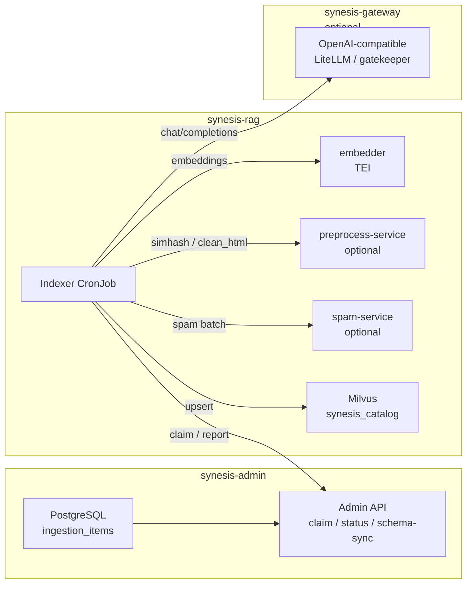

# Ingestion Enrichment and Corporate Corpus Formats

This doc describes how **richer content extraction** (tables, figures, office formats) fits into the pipeline, when an optional extraction service pays off, and how to support corporate corpuses (docs, PDFs, ADRs, Google/Microsoft exports) with open-source tooling.

It is **not** the primary reference for queue mode, Milvus schema, or the v9 semantic-ingestion upgrade — see the doc map below.

## Doc map: RAG ingestion vs content-format enrichment

| Topic | Document |
|--------|----------|
| **Queue mode, lifecycle, handlers, Milvus v9 fields, ops** | [`INDEXERS.md`](INDEXERS.md) — canonical operations guide |
| **Semantic ingestion design (gatekeeper, economics, microservice split)** | [`plans/semantic_rag_ingestion_v9.md`](plans/semantic_rag_ingestion_v9.md) |
| **Token/cost levers** | [`RAG_INGESTION_COST.md`](RAG_INGESTION_COST.md) |
| **Retrieval / planner side (hybrid search, keyword-service at query time)** | [`RAG.md`](RAG.md) |
| **This file** | Optional **future** indexer-side services (figure description, office extract, table-in-image) that improve **chunk text** before embedding |

## Current ingestion topology (how services fit the loop)

Production ingestion is **queue-driven**: the indexer CronJob in **`synesis-rag`** claims rows from **PostgreSQL** in **`synesis-admin`**, runs `pipeline.py`, and upserts into **Milvus**. Optional HTTP dependencies are **env-gated** (URLs unset → step skipped).

**Stage order inside the indexer** (see [`INDEXERS.md`](INDEXERS.md) for env vars and field details):

1. Ensure catalog + schema sync → claim item from admin  
2. Fetch → optional **jusText** HTML clean (`html_document` only, if preprocess URL + `SYNESIS_INDEXER_PREPROCESS_CLEAN_HTML`)  
3. Parse / chunk → chunk **quality gate**  
4. Optional **semantic gatekeeper** (document-level LLM → v9 labels, may drop whole docs)  
5. Optional **simhash** + **spam** HTTP batches → `simhash64`, `spam_score` on each chunk row  
6. **Enrich** (template `context_prefix`; optional Tier-2 LLM summary in YAML/`--enrich full` paths)  
7. **Embed** via TEI → **injection scan** → **Milvus upsert**

The **planner** (query path) uses Milvus, **keyword-service**, embedder, etc.; it does not run the ingestion loop above. Corporate **format** enrichment ideas in the rest of this doc would add new `base/rag/*` services the **indexer** calls, same pattern as preprocess/spam.

## Does enrichment need frontend or prompt changes?

**No.** The planner injects retrieved chunk **text** into the context block (see `context_formatter.format_context_block` and `unified_retrieval.format_unified_context`). Any enrichment that improves chunk text—markdown tables, figure descriptions, office-doc content—is already useful:

- Better chunks → better retrieval → better answers.
- The model cites by `document_name` and `source_url`; no change needed.
- The frontend shows model output and citations; it does not need to “show enriched data” specially. Enrichment is invisible to the UI; its value is in the quality of the context the model sees.

Optional future step: if we add metadata (e.g. `has_table: true`) to chunks, the frontend could use it to render tables in citation cards. That would require passing metadata through the pipeline and updating the UI. Not required for enrichment to pay off.

## What we do today

| Content | Web/HTML | PDF | How planner uses it |
|--------|----------|-----|----------------------|
| **Tables** | Trafilatura `include_tables=True` → markdown tables; chunking preserves them; gate rescues table chunks. | PyMuPDF `page.find_tables()` → `to_markdown()` appended per page (pdf_document, seed_corpus, arxiv). | Chunk `text` contains markdown table; model reads and cites. |
| **Charts / diagrams** | No pixel-level interpretation. | No image extraction. | We rescue chunks that reference “Figure N”, “Table N”, “Fig. 1” (`figure_ref`); surrounding caption/context is indexed as supporting evidence. |
| **Images** | Trafilatura does not turn `` into descriptions. | Not extracted. | Caption + figure reference only. |

So: **tables are brought in as markdown** (HTML via trafilatura, PDF via PyMuPDF). Charts/diagrams are **caption + reference only** unless we add a vision or chart-description step.

## Enrichment microservices (open-source, no third-party APIs)

Adding small indexer-side microservices keeps the app image light (per the ML service boundary rule) and lets you add heavy or optional steps without bloating the main container.

### 1. Figure / chart description service (optional)

- **Input:** Image bytes (e.g. extracted from PDF or HTML).
- **Output:** Short text description, e.g. “Bar chart: revenue 2020 2M, 2021 2.5M, 2022 3M.”
- **Implementation:** Run a local vision model (e.g. LLaVA, Qwen-VL) or a chart-specific model in a dedicated service; indexer calls it via HTTP and appends the description to the chunk or creates a “Figure N: &lt;description&gt;” chunk. All open-source; no third-party API.
- **Value:** RAG can answer “what does the chart show?” from text; today we only have caption + “see Figure 3.”

### 2. Office / native-format extraction service (optional)

- **Input:** `.docx`, `.xlsx`, `.pptx`, or Google-export formats (e.g. exported HTML/Markdown).
- **Output:** Markdown (and optionally structured blocks for tables/slides).
- **Implementation:** Use `python-docx`, `openpyxl`, `python-pptx` (or similar) in a small service; indexer sends file bytes or URL, receives markdown. Handles corporate docs that are only available as Office or Google exports.
- **Value:** Ingest ADRs, design docs, and internal guides that live in Google Docs / Microsoft Word without requiring manual “export to Markdown” steps.

### 3. Table-in-image extraction (optional)

- **Input:** Image of a table (e.g. screenshot in a doc).
- **Output:** Markdown table.
- **Implementation:** Use img2table, OpenCV-based table detection, or a vision model in a dedicated service. Indexer calls it for images that look like tables.
- **Value:** Tables that appear only as figures in PDFs or docs become searchable markdown.

All of the above can be implemented as separate containers under `base/rag/` (e.g. `figure-service`, `office-extract`), with the indexer calling them only when configured (e.g. per-source or per-handler flags). No change to planner or frontend required for the enrichment to improve answers.

## Corporate corpus formats

Typical sources and how we handle them today vs. with optional enrichment:

| Format | Current handling | Optional improvement |
|--------|------------------|----------------------|
| **PDFs** | PyMuPDF text + **table markdown** (find_tables → to_markdown). | Figure-description service for chart/figure images. |
| **HTML / web** | Trafilatura markdown + normalize_doc_markdown; tables preserved. | — |
| **Markdown** | github_markdown, markdown_file handlers; heading-aware chunking. | — |
| **ADRs** (Markdown in repo) | github_markdown. | — |
| **ADRs** (PDF/Word) | pdf_document or office-extract service. | Office service for .docx. |
| **Google Docs** | Export to HTML/Markdown then ingest as web_page or markdown. | Office-extract service that consumes exported HTML/Markdown or (if we add it) Google Drive API. |
| **Microsoft Word** | Not ingested natively. | Office-extract service (.docx → markdown). |
| **Excel / slides** | Not ingested. | Office-extract service (.xlsx/.pptx → markdown or structured text). |

Recommendation: add an **office-extract** microservice when you need to ingest .docx/.xlsx/.pptx or exported Google content at scale. Use **figure-description** when “what does this chart say?” is a common query and captions are insufficient. PyMuPDF table extraction is already implemented and needs no extra service.

## Summary

- **Operations and v9 ingestion:** use [`INDEXERS.md`](INDEXERS.md) + [`plans/semantic_rag_ingestion_v9.md`](plans/semantic_rag_ingestion_v9.md); this doc focuses on optional **content-format** extractors.
- **Enrichment pays off without frontend or prompt changes:** better chunk text improves retrieval and answers.
- **Tables:** HTML via trafilatura; PDF via PyMuPDF `find_tables()` → markdown in pdf_document, seed_corpus, and arxiv handlers.
- **Charts/diagrams:** Caption + “Figure N” rescue only; optional figure-description microservice for full interpretation.
- **Corporate formats:** Use markdown/HTML exporters where possible; add an open-source office-extract microservice for .docx/.xlsx/.pptx and richer Google Docs ingestion when needed.
