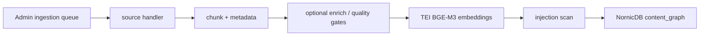

# Ingestion Enrichment

This page describes optional enrichment around the canonical queue-driven
indexer. For the operational source of truth, see [INDEXERS.md](INDEXERS.md).

Production ingestion is queue-driven: the indexer CronJob in `synesis-rag`
claims rows from Admin/Postgres, runs source handlers and `pipeline.py`, embeds
content with TEI/BGE-M3, scans chunks, and upserts nodes and edges into
NornicDB. Synesis-maintained reusable corpora should ship as SynPack v2
archives; queue bootstrap files are for custom organization loads and
experiments.

Optional enrichment services remain env-gated. If a URL or token is absent, the
pipeline should skip that enrichment and still write deterministic graph nodes
when source content is valid.

## Current Enrichment Contract

- Prefer deterministic metadata from handlers and source configs.
- Treat LLM enrichment as additive hints, not required schema construction.
- Preserve provenance, authority, freshness, and review metadata.
- Preserve scope metadata and ACL metadata exactly as Admin computed it.
- Keep code graph extraction deterministic: symbols, imports, and calls are
  extracted before any LLM enrichment.

## Query Path

The planner does not run ingestion. It queries NornicDB through
`retrieveUnified()`, expands graph context, applies authz predicates to seeds
and neighbors, and merges RAG evidence with web evidence when enabled.

## Related Docs

- [INDEXERS.md](INDEXERS.md) — queue mode, graph schema, scope validation, operations
- [RAG.md](RAG.md) — retrieval path and authorization
- [SYNPACKS.md](SYNPACKS.md) — managed SynPack v2 build and install workflow
- [SECURITY.md](SECURITY.md) — trust envelopes, scan status, and prompt-injection controls
