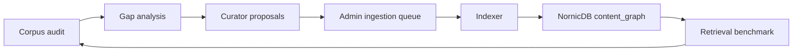

# Synesis Quality Pipeline

End-to-end corpus quality management: audit, benchmark, curate, ingest, and
verify against the current NornicDB-backed RAG stack.

## Architecture



Admin UI mapping: [ADMIN_QUALITY_UI.md](ADMIN_QUALITY_UI.md).

## Components

| Tool | Location | Purpose | Output |
|------|----------|---------|--------|
| **Corpus Audit** | `benchmarks/corpus/audit_corpus.py` | Per-domain coverage scoring, dead-weight detection, gap analysis | `corpus_audit_report.json` |
| **LLM Judge** | `benchmarks/corpus/llm_judge.py` | LLM-rated relevance labels for retrieval benchmarks | `relevance_labels_llm.json` |
| **Chunking Benchmark** | `benchmarks/corpus/bench_chunking.py` | Chunk size/overlap parameter sweep | `results_chunking.json` |
| **Retrieval Benchmark** | `benchmarks/retrieval/bench_hybrid.py` | Graph/vector retrieval regression test | `results_hybrid.json` |
| **Enrichment Benchmark** | `benchmarks/retrieval/bench_enrichment.py` | A/B test for context prefix and enrichment impact | `results_enrichment.json` |
| **Curator Agent** | `tools/curator/curator_agent.py` | Discover sources for weak domains via SearXNG + LLM review | `proposed_sources.yaml` |
| **Admin Quality UI** | `base/admin/app/routers/rag.py`, `feedback.py`, React SPA | Dashboards, gaps, curator, benchmarks | `/rag/quality`, `/feedback/*` |
| **Quality CronJob** | `base/quality-runner/` | Scheduled audit + curator pattern | ConfigMap / persisted reports |

## Feedback Loop

1. **Audit** — Score taxonomy domains against the current content graph.
2. **Identify gaps** — Weak and empty domains surface in Admin quality views.
3. **Curate** — Generate proposed high-quality sources.
4. **Review** — Approve or reject proposals in Admin.
5. **Ingest** — Queue-driven indexer chunks, enriches, embeds, scans, and writes NornicDB graph nodes/edges.
6. **Verify** — Re-run audit and retrieval benchmarks to confirm improvements.

## Local Prerequisites

Use port-forwarding when running tools outside the cluster:

```bash
oc port-forward svc/synesis-nornicdb 7687:7687 -n synesis-rag
oc port-forward svc/embedder 8082:8080 -n synesis-rag
oc port-forward svc/synesis-planner-ts 8080:8080 -n synesis-planner
oc port-forward svc/searxng 8888:8080 -n synesis-search
```

## Running Locally

`scripts/quality-check.sh` defaults `UV_CACHE_DIR` and `UV_TOOL_DIR` to a
temporary directory when they are unset, so sandboxed runs do not depend on a
writable user-level uv cache. Override those variables if you need a persistent
cache.

```bash
make bench-corpus-audit
make bench-corpus-audit-llm
make bench-llm-judge
make bench-retrieval
make bench-retrieval-llm
```

Retrieval tooling should target:

- `SYNESIS_NORNIC_URI=bolt://localhost:7687`
- `SYNESIS_NORNIC_DATABASE=nornic`
- `SYNESIS_NORNIC_VECTOR_INDEX=embeddings`
- `SYNESIS_EMBEDDER_URL=http://localhost:8082/v1`

## CI / Scheduled Runs

The quality pipeline can run as a scheduled or manual workflow:

```bash
gh workflow run quality-pipeline.yml -f audit=true -f curator=true
gh run list --workflow=quality-pipeline.yml --limit 3
```

Requirements: a self-hosted runner with `oc` access to the cluster, or workflow
steps that create in-cluster jobs.

## Troubleshooting

- Verify NornicDB rollout and Bolt connectivity.
- Confirm the `embeddings` vector index exists.
- Confirm the indexer has populated `content_graph`.
- Confirm `SYNESIS_RAG_AUTHZ_MODE` is `audit` unless `rag_doc:*` OpenFGA grants are populated for protected rows.
- Confirm the embedder URL is reachable and returns BGE-M3 embeddings.

See also: [RAG](RAG.md), [INDEXERS.md](INDEXERS.md), [ADMIN_QUALITY_UI.md](ADMIN_QUALITY_UI.md).
