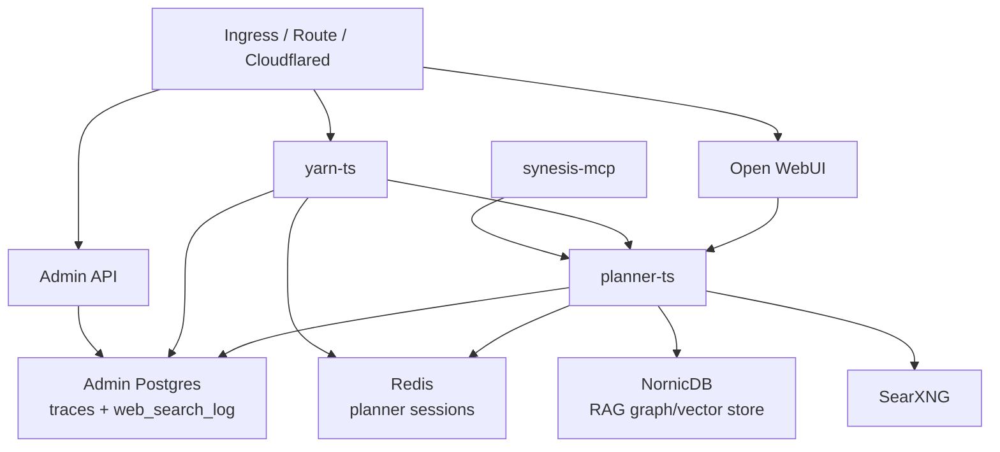
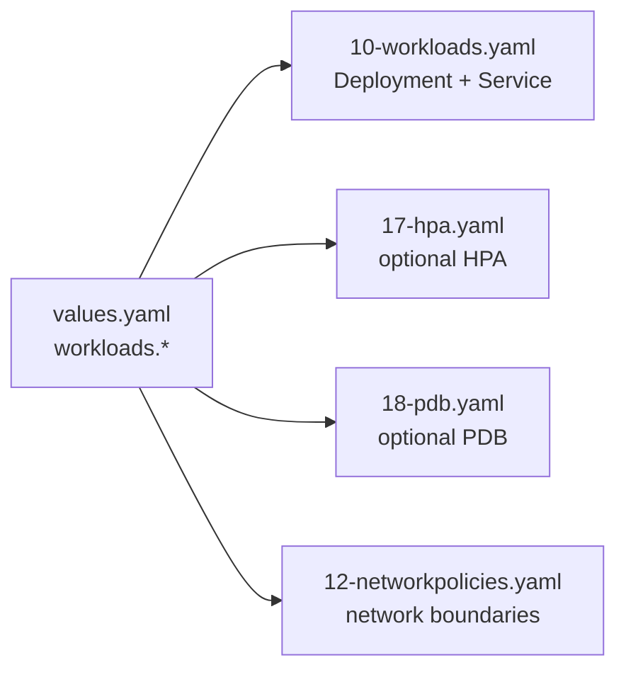
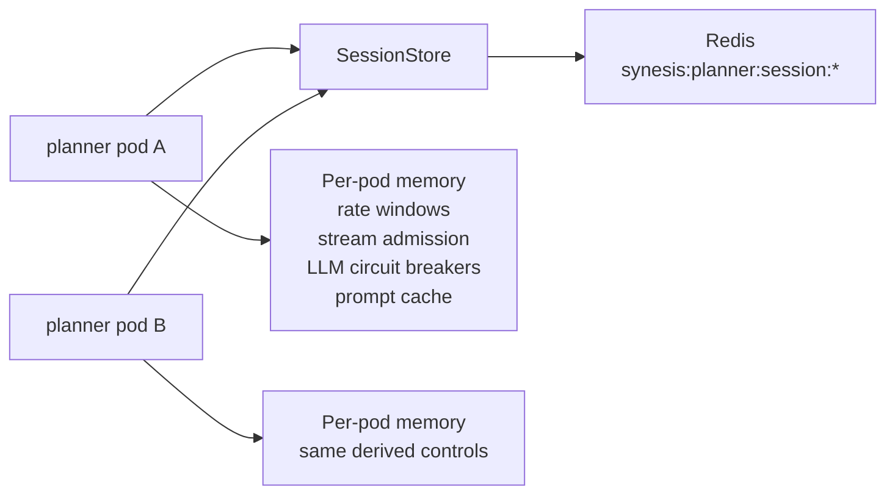
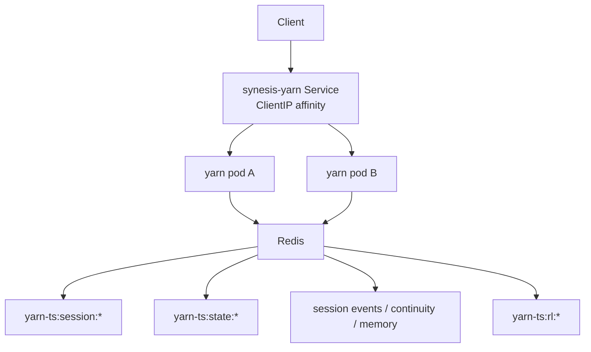
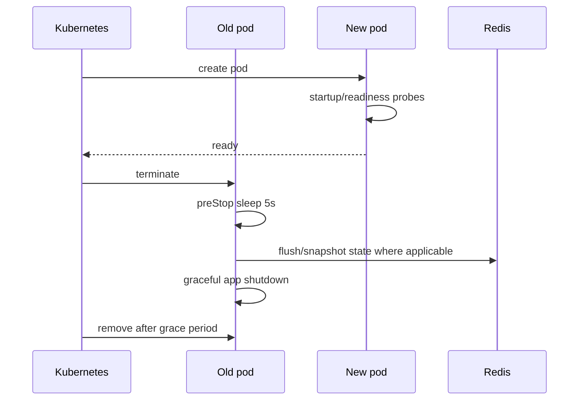

# Scaling

Synesis scales through Kubernetes Deployments rendered by the Helm chart plus service-specific state handling. The two latency-sensitive application services, `planner-ts` and `yarn-ts`, externalize durable session state to Redis so rolling updates, HPA events, and pod rescheduling do not lose active conversations.

This document describes the current chart model and the runtime behavior that matters when increasing replicas.

## Current Model



| Service | Default chart replicas | Durable state | Multi-replica safe? | Affinity |
| --- | ---: | --- | --- | --- |
| `planner-ts` | 2 | Redis `SessionData`, Admin DB logs | Yes, when `SYNESIS_PLANNER_TS_REDIS_URL` is set | Not required |
| `yarn-ts` | 1 | Redis sessions, snapshots, event/history stores, Admin DB usage/traces | Yes, when `SYNESIS_YARN_SESSION_REDIS_URL` is set | Recommended |
| `synesis-mcp` | 1 | Mostly stateless, delegates to Planner/Yarn/Admin | Yes | Not required |
| `admin` | 1 | Postgres | Horizontally possible, but keep DB migrations/startup behavior in mind | Not required |
| `open-webui` | 1 | Open WebUI DB/PVC depending on deployment | Treat as stateful unless externalized | Usually keep 1 |
| `nornicdb`, Redis, Postgres | 1 | Primary data stores | Do not scale with Deployment replicas unless the backing product supports clustering | N/A |
| Indexer/enrichment jobs | CronJobs/workers | Admin queue, object/document stores, NornicDB | Scale by worker schedule/parallelism, not chat HPA | N/A |

## Helm Controls

The chart renders Deployments and Services from `workloads.*` in `charts/synesis/values.yaml`.



Any enabled workload can use the same knobs:

```yaml
workloads:
  plannerTs:
    replicas: 2
    resources:
      requests:
        cpu: 500m
        memory: 1Gi
      limits:
        cpu: "2"
        memory: 4Gi
    autoscaling:
      enabled: false
      minReplicas: 2
      maxReplicas: 4
      targetCPUUtilizationPercentage: 70
    podDisruptionBudget:
      enabled: false
      minAvailable: 1
```

Notes:

- `replicas` is rendered on the Deployment. When HPA is enabled, the HPA controller owns the live replica count after creation.
- HPA is CPU-utilization based today and requires CPU requests.
- `autoscaling.behavior` is supported and passed through to the HPA when set.
- PDBs are opt-in per workload.
- `sessionAffinity` is rendered on the Service when present. Yarn defaults to `ClientIP` affinity in both base manifests and chart values.

## Planner

Planner session state is externalized through `SYNESIS_PLANNER_TS_REDIS_URL`.



Persisted state:

- Full planner `SessionData`.
- Conversation history and checkpoint state.
- Pending clarification state.
- Last-seen timestamp and TTL.
- CAS-protected updates with `SYNESIS_PLANNER_TS_REDIS_CAS_MAX_RETRIES`.

Per-pod state:

- User and global request rate-limit windows.
- Streaming admission counters and queue.
- LLM circuit breakers.
- Prompt/capability caches.

Current chart defaults:

| Setting | Default |
| --- | --- |
| `workloads.plannerTs.replicas` | `2` |
| CPU/memory request | `500m` / `1Gi` |
| CPU/memory limit | `2` / `4Gi` |
| `SYNESIS_PLANNER_TS_REDIS_SESSION_TTL_S` | `14400` |
| `SYNESIS_PLANNER_TS_SESSION_MAX_SESSIONS` | `5000` |
| `SYNESIS_PLANNER_TS_STREAM_MAX_CONCURRENT` | `50` per pod |
| `SYNESIS_PLANNER_TS_STREAM_QUEUE_MAX` | `100` per pod |
| `SYNESIS_PLANNER_TS_STREAM_QUEUE_WAIT_MS` | `30000` |

Total streaming capacity is roughly:

```text
planner replicas * SYNESIS_PLANNER_TS_STREAM_MAX_CONCURRENT
```

Use ingress or Cloudflare rate limits for strict global request limits. Planner application rate limits are intentionally per-process.

## Yarn

Yarn persists core state to Redis and keeps derived optimization caches in memory.



Persisted state includes:

| Redis key family | Purpose |
| --- | --- |
| `yarn-ts:session:{key}` | Session accounting, metadata, continuity, CAS version |
| `yarn-ts:state:{key}` | Transcript, governor counters, artifact edit turns, failure signatures, pruning watermark |
| `yarn-ts:artrep:{id}` | Optional artifact payload replica |
| `yarn-ts:rl:{userId}` | Redis-backed request rate limiting |
| `yarn-ts:continuity:{userId}` | Cross-session continuity |
| session event/history/memory keys | Diagnostics, summaries, memory tools, and replay-oriented state |

In-memory derived state includes structural indexes, file snapshots, dedupe caches, some governor helpers, and circuit breakers. These rebuild from traffic after pod migration. Correctness should survive migration; cache warmth and duplicate suppression may degrade briefly.

Current chart defaults:

| Setting | Default |
| --- | --- |
| `workloads.yarn.replicas` | `1` |
| CPU/memory request | `500m` / `1Gi` in chart, `100m` / `768Mi` in base manifest |
| CPU/memory limit | `2` / `2Gi` |
| Service affinity | `ClientIP`, `10800` seconds |
| `SYNESIS_YARN_MAX_CONCURRENT_STREAMS` | `50` per pod |
| `SYNESIS_YARN_STREAM_QUEUE_MAX_DEPTH` | `100` per pod |
| `SYNESIS_YARN_STREAM_QUEUE_WAIT_TIMEOUT_MS` | `30000` |
| `SYNESIS_YARN_RATE_LIMIT_MAX_REQUESTS` | `30` |
| `SYNESIS_YARN_RATE_LIMIT_WINDOW_MS` | `60000` |

Yarn request rate limiting uses Redis sorted sets when Redis is available and falls back to in-memory limits if Redis operations fail. Check `/health/telemetry` for the active limiter backend.

## MCP

`synesis-mcp` is designed to be horizontally scalable because it delegates durable work to Planner, Yarn, Admin, and shared stores. The base manifests include an HPA/PDB example:

| Manifest | Default |
| --- | --- |
| `base/synesis-mcp/hpa.yaml` | min `2`, max `10`, CPU `70%`, conservative scale behavior |
| `base/synesis-mcp/pdb.yaml` | `minAvailable: 1` |

In Helm, configure it under `workloads.mcpTs.autoscaling` and `workloads.mcpTs.podDisruptionBudget`.

## Stateful Services

Do not scale these by simply increasing Deployment replicas:

- Redis: shared cache/session store.
- Postgres: Admin data, traces, usage, queues, migrations.
- NornicDB: graph/vector store.
- Open WebUI: keep single-replica unless its database/uploads/session storage are externalized and tested for concurrency.

For these, use the backing product’s HA or managed-service story rather than generic Kubernetes replica count.

## Worker And Ingestion Scaling

RAG ingestion scales differently from chat traffic.

- Queue/staged indexer jobs are CronJobs and queue consumers.
- `concurrencyPolicy: Forbid` prevents overlapping schedules for the same CronJob.
- Throughput is mainly controlled by queue depth, schedule frequency, worker resource requests, and staged fetch/normalize/enrich split.
- GPU enrichment workers should be scaled around model memory and queue latency, not chat HPA settings.

See [Knowledge Indexers](INDEXERS.md) and [RAG](RAG.md) for ingestion-specific controls.

## Lifecycle



Chart defaults for planner and Yarn:

- `terminationGracePeriodSeconds: 60`
- `preStop: sleep 5`
- rolling update `maxSurge: 0`, `maxUnavailable: 1` where configured in values/base manifests
- readiness probes on `/health/readiness`
- liveness probes on `/health`

Planner readiness checks Redis only when Redis is configured. Yarn readiness checks Redis through its session store and returns `503` when Redis is unreachable.

## Capacity Planning

Use these as starting points, then tune from metrics:

| Capacity item | Planner | Yarn |
| --- | --- | --- |
| Primary bottleneck | LLM/provider latency, retrieval, stream slots | Long-running streams, tool loops, transcript size |
| Safe first scale target | 2-4 replicas | 1-3 replicas with affinity |
| Stream capacity | `replicas * 50` by default | `replicas * 50` by default |
| Redis session footprint | tens to hundreds of KB per active session | hundreds of KB per active session depending on transcript/artifacts |
| HPA metric | CPU utilization | CPU utilization |

Redis sizing estimate:

```text
(active planner sessions * avg planner session KB)
+ (active yarn sessions * avg yarn state KB)
+ 20% overhead
```

Because Yarn stores richer snapshots, size Yarn sessions conservatively and monitor Redis memory after load tests.

## Operations

Check configured scaling:

```bash
helm get values synesis -n <release-namespace>
kubectl get deploy,hpa,pdb -A | rg 'synesis|planner|yarn|mcp'
kubectl top pods -A | rg 'synesis'
```

Enable planner HPA in values:

```yaml
workloads:
  plannerTs:
    replicas: 2
    autoscaling:
      enabled: true
      minReplicas: 2
      maxReplicas: 4
      targetCPUUtilizationPercentage: 70
    podDisruptionBudget:
      enabled: true
      minAvailable: 1
```

Enable Yarn HPA with affinity:

```yaml
workloads:
  yarn:
    replicas: 1
    autoscaling:
      enabled: true
      minReplicas: 1
      maxReplicas: 3
      targetCPUUtilizationPercentage: 70
    podDisruptionBudget:
      enabled: true
      minAvailable: 1
    sessionAffinity:
      type: ClientIP
      timeoutSeconds: 10800
```

Validate after rollout:

```bash
kubectl -n synesis-planner get deploy/synesis-planner-ts hpa pdb
kubectl -n synesis-yarn get deploy/synesis-yarn svc/synesis-yarn hpa pdb
kubectl -n synesis-yarn get deploy/synesis-mcp hpa pdb
```

## Troubleshooting

### Session state is missing after pod migration

1. Confirm Redis URLs are set: `SYNESIS_PLANNER_TS_REDIS_URL` and `SYNESIS_YARN_SESSION_REDIS_URL`.
2. Check readiness: `kubectl describe pod ...` and look for Redis readiness failures.
3. Inspect planner `/debug/retrieval-config` and Yarn `/health/telemetry` where available.
4. Check TTLs and whether the session naturally expired.

### HPA is not scaling

1. Confirm `autoscaling.enabled=true`.
2. Check `kubectl get hpa -A`.
3. Confirm `metrics-server` works with `kubectl top pods`.
4. Ensure CPU requests exist for the target workload.
5. Check HPA events for missing metrics or maxReplicas ceilings.

### Rate limits look higher than expected

- Planner limits are per pod; use ingress/Cloudflare limits for strict global request caps.
- Yarn limits should be Redis-backed. If `/health/telemetry` reports memory backend, investigate Redis connectivity.

### Streams queue or time out

1. Check active/queued stream metrics and request logs.
2. Increase replicas or per-pod stream caps only after checking upstream model/provider capacity.
3. Keep queue wait time bounded so clients receive a clear retry response instead of hanging.

### Pod termination loses work

1. Check whether the pod exceeded `terminationGracePeriodSeconds`.
2. Look for stuck Redis/Admin DB flushes.
3. For Yarn, inspect usage writer and session event queue metrics.
4. For workers, confirm idempotent queue claim/retry behavior rather than relying on pod lifetime.
