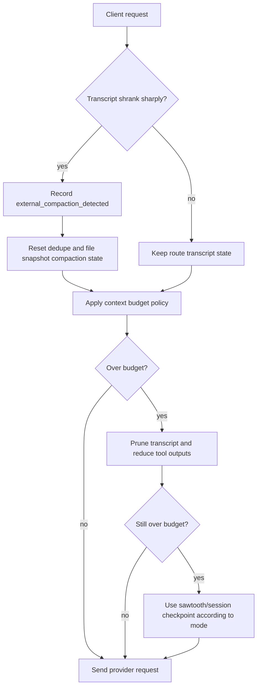

# Session And Frame Compaction

Synesis has several independent compaction paths. This document is the
operator reference for the current split between chat session memory, Yarn
coder context management, and client-owned transcript compaction.

## Current Scope

| Surface | Primary code | Default | Purpose |
|---|---|---|---|
| Planner chat session memory | `base/planner-ts/src/config.ts`, `docs/chat/CONVERSATION_MEMORY.md` | Planner-controlled | Preserves selected chat continuity for OpenAI-style chat sessions. |
| Yarn context budget manager | `base/yarn-ts/src/pipeline/*provider-preparation.ts`, `base/yarn-ts/src/reduction/context-retention.ts` | Enabled | Keeps outbound model prompts under the configured context budget. |
| Yarn sawtooth checkpoints | `base/yarn-ts/src/state/session-lifecycle.ts`, `base/yarn-ts/src/context/sawtooth-manager.ts` | Minimal mode | Consolidates Synesis session state after long tool trajectories. |
| Transcript pruning | `base/yarn-ts/src/reduction/transcript-pruning.ts`, `base/yarn-ts/src/reduction/tool-result-reducer.ts` | Enabled | Replaces old or oversized tool results with bounded stubs and optional artifact handles. |
| Client compaction detection | `base/yarn-ts/src/pipeline/claude-messages-route-preparation.ts`, `base/yarn-ts/src/pipeline/openai-route-transcript-stabilization.ts` | Enabled by route logic | Detects large incoming transcript drops and resets dedupe/file snapshot state. |
| Model compaction sensitivity | `base/yarn-ts/src/context/compaction-sensitivity.ts`, `docs/coder/COMPACTION_SENSITIVITY.md` | Model-profile based | Adjusts compaction/reducer behavior for models that are sensitive to aggressive summarization. |

The old planner-only structured checkpoint design has moved out of this
document. Planner chat memory is now documented in
`docs/chat/CONVERSATION_MEMORY.md`.

## Design Rules

1. Client harnesses own their own transcript compaction.
2. Yarn compaction defaults to `minimal` so Claude Code, Cursor, Codex, and
   similar clients can manage their visible context without Synesis fighting the
   client.
3. Synesis may still compact its own server-side session state, tool outputs,
   and file snapshots to keep requests bounded and recoverable.
4. Lossy server-side reductions should keep recovery handles where possible.
5. Aggressive compaction is opt-in for raw API clients or clients with weak
   context management.

The `/v1/claude/commands/execute` compatibility command for `compact` applies
to Synesis session state only. It does not rewrite a Claude Code client
summary. Incoming client-side compaction is treated as an external transcript
change: Synesis detects the drop, resets dedupe state, and records the
compaction event.

## Yarn Configuration

These are existing Yarn environment variables. The Helm chart and base
deployment set the safe defaults explicitly so operators can override them in
one place.

| Variable | Default | Recommended production setting | Notes |
|---|---:|---:|---|
| `SYNESIS_YARN_CONTEXT_BUDGET_ENABLED` | `true` | `true` | Enables proactive budget management before provider calls. |
| `SYNESIS_YARN_CONTEXT_BUDGET_COMPACTION_MODE` | `minimal` | `minimal` | Use `aggressive` only for clients that do not manage context well. |
| `SYNESIS_YARN_CONTEXT_BUDGET_CEILING_TOKENS` | `0` | `0` | `0` means use the route hard-token admission ceiling. |
| `SYNESIS_YARN_CONTEXT_BUDGET_OUTPUT_RESERVE` | `10000` | `10000` | Reserved from the context ceiling for model output. |
| `SYNESIS_YARN_SAWTOOTH_CHECKPOINT_TOOL_CALLS` | `12` | `12` | In `minimal` mode, automatic checkpoint thresholds are relaxed before compaction. |
| `SYNESIS_YARN_TRANSCRIPT_PRUNE_ENABLED` | `true` | `true` | Keeps stale tool results from dominating the prompt. |
| `SYNESIS_YARN_TRANSCRIPT_PRUNE_KEEP_TURNS` | `5` | `5` | Recent turns retained at higher fidelity. |
| `SYNESIS_YARN_TRANSCRIPT_PRUNE_KEEP_TOOL_RESULTS` | `25` | `25` | Recent tool results retained at full fidelity. |
| `SYNESIS_YARN_TRANSCRIPT_PRUNE_BUDGET_CHARS` | `60000` | `80000` in manifests | Character budget for pruned transcript content. |
| `SYNESIS_YARN_TRANSCRIPT_PRUNE_STUB_MAX_CHARS` | `400` | `400` | Maximum content included in a replacement stub. |
| `SYNESIS_YARN_TRANSCRIPT_PRUNE_ASSISTANT_CONDENSE_CHARS` | `2000` | `2000` | Maximum retained assistant text when condensing old turns. |
| `SYNESIS_YARN_TRANSCRIPT_PRUNE_ARTIFACT_RETENTION_ENABLED` | `true` | `true` | Stores superseded tool bytes in the artifact store and includes recovery handles. |
| `SYNESIS_YARN_COMPACTION_FALLBACK_MAX_CHARS` | `8000` | `8000` | Bounds fallback text if structured compaction fails. |
| `SYNESIS_YARN_CONVERSATION_MEMORY_ENABLED` | `false` | `false` | Durable Yarn cross-session memory remains opt-in. |
| `SYNESIS_YARN_ARTIFACT_RETRIEVAL_ENABLED` | `false` | `false` | Keeps artifact retrieval tooling disabled unless explicitly needed. |

## Recommended Profiles

| Profile | Use case | Settings |
|---|---|---|
| Client-owned context | Claude Code, Cursor, Codex, or other harnesses with their own compaction | Keep `SYNESIS_YARN_CONTEXT_BUDGET_COMPACTION_MODE=minimal`, transcript pruning enabled, artifact retention enabled, conversation memory disabled. |
| Weak client or raw API | Clients that keep appending full transcripts and do not compact themselves | Set `SYNESIS_YARN_CONTEXT_BUDGET_COMPACTION_MODE=aggressive` after testing with the target model and workflow. |
| Diagnostics | Investigating suspected context loss | Temporarily lower thresholds in a non-production environment or enable bounded debug protocol. Do not leave verbose prompt/tool logging enabled in production. |

## Operational Behavior



In `minimal` mode, Yarn avoids early heavy compaction and relies on safe
dedupe, pruning, and provider admission limits first. In `aggressive` mode,
Yarn applies heavier reductions earlier.

## Validation

Run the focused Yarn tests after changing compaction behavior:

```bash
npm test --workspace synesis-yarn-ts -- compaction-sensitivity.test.ts sawtooth-manager.test.ts openai-route-transcript-stabilization.test.ts claude-command-compat.test.ts transcript-pruning.test.ts tool-result-reducer.test.ts
```

Run repository doc validation after changing this document or references:

```bash
python3 scripts/check-doc-reference-integrity.py
git diff --check
```
