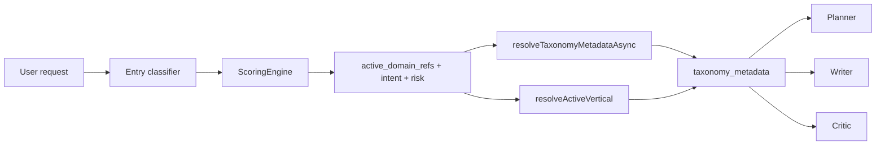

# Synesis Intent Taxonomy

Synesis uses a YAML-driven taxonomy and plugin weight system to classify user
requests, select domain context, and shape planner/writer/critic behavior
without adding another model call. The goal is broad practical coverage for
common internet-facing assistant work: software, infrastructure, science,
business, creative, health, legal, lifestyle, learning, hobbies, and safety.

## Current Coverage

Current repository state:

| Area | Status |
|------|--------|
| Taxonomy entries | 191 entries across 28 top-level categories |
| Plugin weight files | 42 files in `base/planner-ts/config/plugins/weights/` |
| Domain keyword entries | 225 routing entries targeting 169 unique taxonomy keys |
| Orphan domain targets | 0 verified by `taxonomy-config-integrity.test.ts` |
| High-complexity calibration | All entries with `complexity >= 0.8` have `calibration_guidance` |
| Regulated/advisory overlays | 13 entries carry writer and critic regulated-domain blocks |

The "95%" target is not a promise that every niche domain has a bespoke
playbook. In Synesis it means the common, high-value domains are represented,
domain routing has no obvious holes, high-complexity answers receive calibration
guidance, and high-stakes answers receive explicit limits.

## Terminology

| Term | Meaning |
|------|---------|
| Taxonomy | Domain metadata in `taxonomy_prompt_config.yaml`: path, complexity, persona, depth, style, calibration, regulated blocks, and retrieval hints. |
| Ontology merge | Planner-ts merge layer that combines intent weights, domain keywords, pairings, overrides, and vertical prompt plugins into one scoring snapshot. |
| Domain keyword | A zero-weight topic detector. It routes to taxonomy/RAG/vertical context but does not increase task complexity by itself. |
| Calibration guidance | Practical answer guidance for evidence strength, assumptions, uncertainty, estimates, and scope limits. |
| Regulated domain | A high-stakes or regulated topic that needs explicit writer and critic guardrails. |

## Source Files

| File | Purpose |
|------|---------|
| `base/planner-ts/config/taxonomy_prompt_config.yaml` | Canonical planner taxonomy config. |
| `bootstrap/taxonomy/taxonomy_prompt_config.yaml` | Bootstrap seed copy; kept byte-for-byte in sync with the canonical config. |
| `charts/synesis/files/admin/taxonomy_prompt_config.yaml` | Helm/Admin seed copy; kept byte-for-byte in sync with the canonical config. |
| `base/planner-ts/config/intent_weights.yaml` | Core scoring thresholds, complexity/risk/brevity weights, and baseline domain keywords. |
| `base/planner-ts/config/plugins/weights/*.yaml` | Vertical and compliance overlays for niche routing, risk pairings, and vertical prompt blocks. |
| `base/planner-ts/src/taxonomy/taxonomy-prompt-factory.ts` | Typed resolver and sanitizer for taxonomy metadata. |
| `base/planner-ts/src/ontology/merge-plugins.ts` | Plugin merge and sanitization for scoring/vertical configs. |

## Runtime Flow



1. The entry classifier analyzes the current request and recent context.
2. `ScoringEngine` applies deterministic YAML-derived weights and pairings.
3. Domain keywords populate `active_domain_refs`; they do not add complexity on
   their own.
4. `resolveTaxonomyMetadataAsync()` selects the highest-confidence taxonomy key,
   optionally performs a semantic cross-check when an embedder is configured,
   and returns a sanitized known-field metadata contract.
5. Planner, writer, critic, retrieval, and traces consume the metadata through
   typed helpers instead of reading arbitrary YAML fields.

## Complexity, Risk, and Routing

| Signal | Role |
|--------|------|
| Complexity weights | Estimate task size and whether the planner/critic should be involved. |
| Risk weights | Prevent high-risk tasks from being treated as trivial. |
| Domain keywords | Select taxonomy, vertical prompts, and domain filters. |
| Pairings | Add context-specific risk or complexity when terms co-occur. |
| Overrides | Force planning modes for explicit control tokens such as strict/manual planning. |

Important invariants:

- Single easy anchors stay small so "hello world" and simple examples remain
  fast.
- Risk >= configured high threshold prevents easy-path handling.
- Dense multi-topic prompts receive extra complexity through the scoring
  engine.
- Domain detection is intentionally separate from complexity so "what is
  Kubernetes?" does not become hard solely because the domain is Kubernetes.

## Taxonomy Metadata Contract

Planner-ts forwards only known, sanitized fields into `state.taxonomy_metadata`.
Unknown YAML keys are dropped before they can become prompt text.

```yaml
example_domain:
  path: "Category > Domain"
  complexity: 0.7
  persona: "Domain Expert"
  worker_explain_tone: "..."
  depth_instructions: "..."
  required_elements:
    - "Section"
  output_style: "architecture_document"
  output_style_guidance: "..."
  calibration_guidance: "..."
  regulated_domain: true
  writer_regulated_block: "..."
  critic_regulated_block: "..."
  critic_assistant_systems_block: "..."
  planner_decomposition_rules: "..."
  discovery_prompt: "..."
  query_expansion_hints:
    - "related term"
  preferred_web_scopes:
    - "site:example.com"
  output_controls:
    precise: true
    show_assumptions: true
    clarify_first: false
  router_summarizer_tone: "..."
```

Computed metadata includes `taxonomy_key`, blended `complexity_score`,
`persona_instructions`, `required_bullets`, candidates when multiple domains
match, and semantic cross-check traces when available.

## Prompt Shaping

| Consumer | Taxonomy use |
|----------|--------------|
| Planner | Required elements, decomposition rules, complexity, and calibration guidance. |
| Writer | Domain depth, output style, calibration guidance, regulated blocks, and traceable steering metadata. |
| Critic | Required-element coverage, regulated-domain checks, assistant-system checks, and vertical critic mode. |
| Retrieval/Web | Query expansion hints and preferred web scopes where a real retrieval/search path is active. |
| Tracing | `steering_applied` records which taxonomy blocks affected a request. |

Large model tiers may suppress some style/helper blocks to avoid over-steering.
Safety and regulated-domain blocks remain explicit where configured.

## Regulated and Advisory Coverage

The taxonomy carries explicit regulated/advisory overlays for domains where a
generic assistant answer could be mistaken for professional direction. Current
coverage includes general health, mental health, physical therapy, weight
management, first aid, personal legal, insurance, personal taxes, mortgage
finance, AI guardrails, healthcare compliance, fintech compliance, and general
legal compliance.

These overlays do not turn the model into a professional service. They keep
answers educational, require caveats where facts depend on jurisdiction or user
specifics, and give the critic concrete failure modes to flag.

## Admin and Deployment Behavior

The planner reads taxonomy YAML from `SYNESIS_TAXONOMY_PROMPT_CONFIG` when set,
or from its built-in fallback paths. Helm sets the planner path to the packaged
taxonomy config.

The Admin service has a Postgres-backed taxonomy browser/editor. It seeds from
the mounted taxonomy YAML when the table is empty and exposes sync/export
endpoints. The Admin editor currently covers core fields such as path,
complexity, persona, required elements, depth, output style guidance, and
calibration guidance. Regulated-domain blocks, web scopes, query hints, and
router summarizer tone still require YAML/sync workflow.

## Coverage Guardrails

`base/planner-ts/tests/taxonomy-config-integrity.test.ts` verifies:

- planner, bootstrap, and Helm/Admin taxonomy YAML files are synchronized;
- every domain keyword and pairing domain target points to an existing taxonomy
  key;
- every high-complexity entry has calibration guidance;
- every regulated entry has writer and critic regulated blocks.

Run the guardrail directly:

```bash
cd base/planner-ts
npm test -- tests/taxonomy-config-integrity.test.ts
```

## Adding or Updating a Domain

1. Add or update `domain_keywords.<name>` in the core weights or a plugin.
2. Point its `domain` value to a taxonomy key.
3. Add or update the matching entry in
   `base/planner-ts/config/taxonomy_prompt_config.yaml`.
4. Add `calibration_guidance` when `complexity >= 0.8`.
5. Add `regulated_domain`, `writer_regulated_block`, and
   `critic_regulated_block` for high-stakes health, legal, finance, safety,
   compliance, or professional-advice domains.
6. Sync bootstrap and Helm/Admin copies from the canonical planner config.
7. Run the integrity test and relevant planner tests.

Do not add prompt-facing YAML fields casually. New fields must be added to the
TypeScript contract, sanitized in `taxonomy-prompt-factory.ts`, and covered by
tests before any node can consume them.

## Related Docs

- [TAXONOMY_DRIVEN_INJECTION.md](TAXONOMY_DRIVEN_INJECTION.md) - detailed metadata flow and prompt injection behavior.
- [TAXONOMY_SHAPING.md](TAXONOMY_SHAPING.md) - extension points by planner role.
- [PROMPT_LAYERING_AND_CALIBRATION.md](PROMPT_LAYERING_AND_CALIBRATION.md) - L0/L1/L2 prompt layering and calibration boundaries.
- [plugins/weights/README.md](../base/planner-ts/config/plugins/weights/README.md) - plugin format.
- [WORKFLOW_PLANNER.MD](chat/WORKFLOW_PLANNER.MD) - planner graph and request flow.
