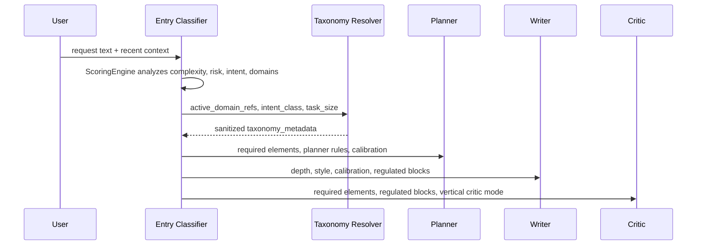

# Taxonomy-Driven Contextual Injection

This document explains how Synesis turns deterministic taxonomy metadata into
planner, writer, critic, retrieval, and tracing behavior. The active
implementation is TypeScript in `base/planner-ts/`.

## Overview

| Component | Role |
|-----------|------|
| Entry classifier | Runs deterministic scoring and emits task size, intent, risk, and `active_domain_refs`. |
| Taxonomy resolver | Maps active domain refs to a sanitized `taxonomy_metadata` contract. |
| Vertical resolver | Maps active domains and platform context to optional vertical prompt overlays. |
| Planner | Uses required elements, decomposition rules, and calibration guidance. |
| Writer | Uses depth, output style, calibration, and regulated-domain blocks. |
| Critic | Uses required-element coverage, regulated-domain checks, vertical critic mode, and assistant-system review blocks. |

No extra LLM call is used for taxonomy injection.

## Flow



## Runtime Contract

`taxonomy-prompt-factory.ts` forwards only known fields. Prompt-facing strings
are sanitized and length-limited before entering `state.taxonomy_metadata`.
Unknown YAML keys are ignored until the TypeScript contract and tests are
updated.

Supported YAML fields include:

- `path`
- `complexity`
- `persona`
- `worker_explain_tone`
- `depth_instructions`
- `discovery_prompt`
- `required_elements`
- `output_style`
- `output_style_guidance`
- `calibration_guidance`
- `regulated_domain`
- `writer_regulated_block`
- `critic_regulated_block`
- `critic_assistant_systems_block`
- `query_expansion_hints`
- `preferred_web_scopes`
- `router_summarizer_tone`
- `output_controls`
- `planner_decomposition_rules`

Computed fields include `taxonomy_key`, blended `complexity_score`,
`persona_instructions`, `required_bullets`, optional `taxonomy_candidates`, and
optional semantic validation details.

## Current Config

The canonical config is
`base/planner-ts/config/taxonomy_prompt_config.yaml`.

Current repository state:

- 191 taxonomy entries across 28 categories.
- 42 plugin weight files.
- 0 orphan domain targets.
- All `complexity >= 0.8` entries include `calibration_guidance`.
- Every `regulated_domain` entry includes writer and critic regulated blocks.

Bootstrap and Helm/Admin seed copies are kept synchronized with the planner
canonical file and checked by
`base/planner-ts/tests/taxonomy-config-integrity.test.ts`.

## Injection Points

| Field | Consumer |
|-------|----------|
| `required_elements` | Planner hints and critic coverage checks. |
| `depth_instructions` | Planner and writer depth blocks when task complexity warrants it. |
| `output_style_guidance` | Writer output structure for model tiers that use style steering. |
| `calibration_guidance` | Planner/writer guidance and trace steering records. |
| `writer_regulated_block` | Writer `REGULATED CONTEXT (taxonomy)` block. |
| `critic_regulated_block` | Dynamic critic suffix for high-stakes domains. |
| `critic_assistant_systems_block` | Critic checks for assistant-system/routing/retrieval designs. |
| `query_expansion_hints` | Retrieval query expansion helper. |
| `preferred_web_scopes` | Web-search scope helper when a real web path is active. |
| `output_controls` | Clarify/assumption/precision style contract. |
| `planner_decomposition_rules` | Domain-specific planning order. |

Taxonomy metadata is advisory unless a node explicitly consumes a field. The
known-field contract prevents arbitrary YAML text from becoming prompt
instructions accidentally.

## Example

For an AWS architecture question:

1. `domain_keywords` match AWS terms and emit `active_domain_refs=["aws"]`.
2. The resolver selects taxonomy key `aws`.
3. `taxonomy_metadata` includes service-selection requirements, preferred AWS
   docs scopes, architecture output style, and calibration guidance for region,
   quota, account policy, compliance, and traffic assumptions.
4. Planner and writer produce architecture-shaped output rather than a generic
   answer.
5. Critic can check for missing security/IAM, cost, and tradeoff coverage.

## Admin Notes

Admin stores taxonomy rows in Postgres and can seed/sync from the mounted YAML.
The current Admin editor covers core fields and `calibration_guidance`.
Regulated blocks, query hints, preferred web scopes, and router summarizer tone
still require YAML/sync workflow.

## Validation

Run:

```bash
cd base/planner-ts
npm test -- tests/taxonomy.test.ts tests/taxonomy-config-integrity.test.ts
```

Use the integrity test whenever adding a domain, editing plugin routing, or
changing deployment seed YAML.

## See Also

- [TAXONOMY.md](TAXONOMY.md)
- [TAXONOMY_SHAPING.md](TAXONOMY_SHAPING.md)
- [PROMPT_LAYERING_AND_CALIBRATION.md](PROMPT_LAYERING_AND_CALIBRATION.md)
- [`taxonomy-prompt-factory.ts`](../base/planner-ts/src/taxonomy/taxonomy-prompt-factory.ts)
- [`taxonomy.test.ts`](../base/planner-ts/tests/taxonomy.test.ts)
