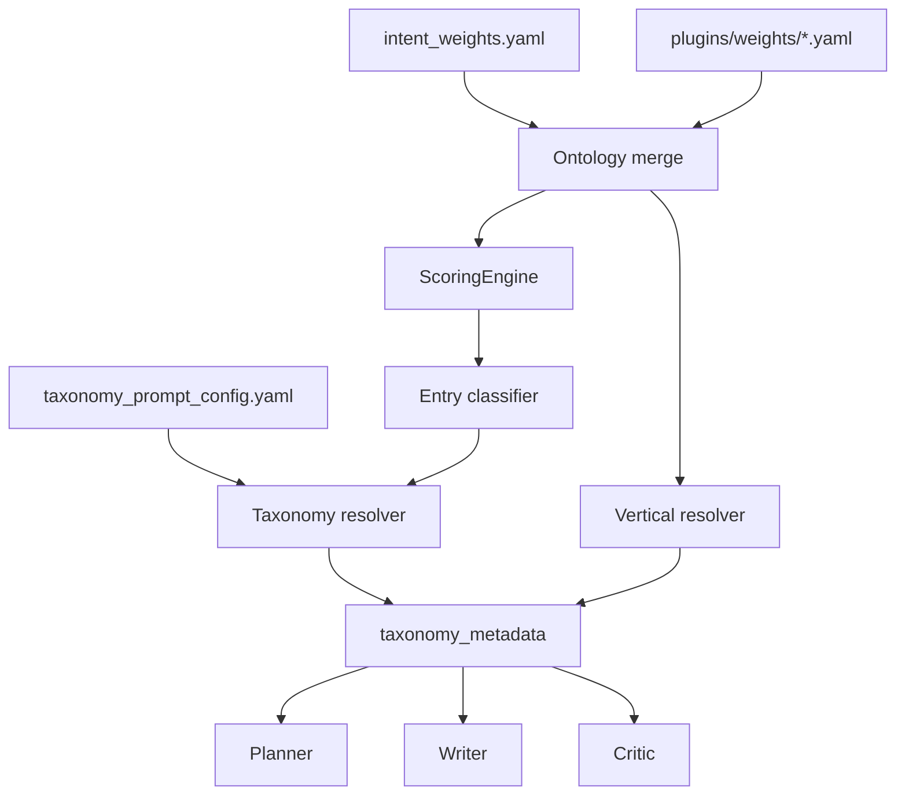

# Synesis Taxonomy and Prompt Shaping Guide

Synesis keeps universal prompts small and uses YAML metadata to shape domain,
style, retrieval, and critic behavior. This guide explains the extension points
that are active in the TypeScript planner.

## Model



The key distinction is:

- `intent_weights.yaml` and plugin weights decide what the request is about and
  how difficult/risky it is.
- `taxonomy_prompt_config.yaml` decides how the selected domain should shape
  answer depth, style, calibration, and high-stakes limits.

## Entry Classifier

The entry classifier is deterministic and uses the merged ontology snapshot
from `base/planner-ts/src/ontology/merge-plugins.ts`.

| What to change | File | Key |
|----------------|------|-----|
| Complexity scoring | `intent_weights.yaml` or plugin | `complexity_weights` |
| Risk scoring | `intent_weights.yaml` or plugin | `risk_weights` |
| Domain detection | `intent_weights.yaml` or plugin | `domain_keywords` |
| Compound triggers | plugin | `pairings` |
| Routing thresholds | `intent_weights.yaml` | `routing_thresholds` |
| Forced planning tokens | `intent_weights.yaml` or plugin | `overrides.plan_session` |

Domain keywords should normally be zero-weight routing signals. Use complexity
or risk weights only when the work itself becomes harder or more dangerous.

## Taxonomy Resolver

The resolver in
`base/planner-ts/src/taxonomy/taxonomy-prompt-factory.ts` selects a taxonomy
entry from `active_domain_refs`, sanitizes known fields, and returns
`state.taxonomy_metadata`.

| What to change | File | Key |
|----------------|------|-----|
| Domain label/tree | `taxonomy_prompt_config.yaml` | `path` |
| Baseline domain complexity | `taxonomy_prompt_config.yaml` | `complexity` |
| Persona/tone | `taxonomy_prompt_config.yaml` | `persona`, `worker_explain_tone` |
| Depth and sections | `taxonomy_prompt_config.yaml` | `depth_instructions`, `required_elements` |
| Output shape | `taxonomy_prompt_config.yaml` | `output_style`, `output_style_guidance` |
| Evidence/uncertainty framing | `taxonomy_prompt_config.yaml` | `calibration_guidance` |
| High-stakes boundaries | `taxonomy_prompt_config.yaml` | `regulated_domain`, writer/critic regulated blocks |
| Retrieval/search hints | `taxonomy_prompt_config.yaml` | `query_expansion_hints`, `preferred_web_scopes` |
| Planner ordering | `taxonomy_prompt_config.yaml` | `planner_decomposition_rules` |
| Clarification behavior | `taxonomy_prompt_config.yaml` | `output_controls` |

Do not add new prompt-facing fields without updating the TypeScript contract
and tests.

## Writer Shaping

The writer consumes taxonomy metadata through typed helpers. Depending on model
tier and task complexity, it can receive:

- `DOMAIN DEPTH` from `depth_instructions`;
- `OUTPUT STYLE` from `output_style_guidance`;
- `CALIBRATION GUIDANCE` from `calibration_guidance`;
- `REGULATED CONTEXT (taxonomy)` from `writer_regulated_block`.

Use taxonomy fields for domain-specific answer structure. Keep universal trust,
security, and safety floors in code-level prompts.

## Planner Shaping

The planner uses:

- `required_elements` as expected plan coverage;
- `planner_decomposition_rules` for domain-specific step ordering;
- `calibration_guidance` for uncertainty and assumption handling.

Example:

```yaml
protocols:
  planner_decomposition_rules: >-
    For protocol tasks, first identify discovery, handshake, and trust
    boundaries. Each step must include an interoperability check.
```

## Critic Shaping

The critic composes three layers:

| Layer | Source |
|-------|--------|
| Universal review rules | TypeScript critic prompts and routing logic |
| Intent behavior | merged intent class data |
| Domain/vertical behavior | taxonomy regulated blocks and plugin `vertical_prompt` |

For regulated entries, add both:

```yaml
regulated_domain: true
writer_regulated_block: >-
  Educational guidance only. Recommend qualified professionals for specific decisions.
critic_regulated_block: >-
  Flag personalized advice, missing caveats, or claims that exceed the available facts.
```

The integrity test requires both blocks for every `regulated_domain` entry.

## Vertical Plugins

Plugins can add domain keywords, risk/complexity weights, pairings, and optional
vertical prompt blocks. Current vertical prompt fields are defined in
`merge-plugins.ts` and consumed by `vertical-prompts.ts`.

```yaml
vertical_prompt:
  name: llm_rag
  active_domain_refs:
    - llm_rag
  worker_persona_block: >-
    VERTICAL: RAG architecture. Focus on retrieval quality, grounding,
    metadata filtering, and evaluation.
  planner_decomposition_rules: >-
    Start with corpus and permission boundaries, then indexing, retrieval,
    reranking, generation, evaluation, and operations.
  critic_mode: tiered
  critic_tiers:
    basic: >-
      Check factual accuracy and whether retrieval assumptions are explicit.
    advanced: >-
      Check chunking, metadata filters, hybrid retrieval, and grounding.
    research: >-
      Check reproducibility, eval design, ablations, and failure modes.
```

Use `worker_persona_block`, not older executor-specific names.

## Adding a Domain

1. Add or update a `domain_keywords` entry so the classifier can emit the
   taxonomy key.
2. Add the taxonomy entry with at least `path`, `complexity`, `persona`,
   `worker_explain_tone`, `depth_instructions`, and `required_elements`.
3. Add `calibration_guidance` for `complexity >= 0.8`.
4. Add regulated writer/critic blocks for high-stakes health, legal, finance,
   safety, compliance, or professional-advice domains.
5. Add query/web hints only when they point to authoritative or useful sources.
6. Sync bootstrap and Helm/Admin taxonomy copies.
7. Run:

```bash
cd base/planner-ts
npm test -- tests/taxonomy.test.ts tests/taxonomy-config-integrity.test.ts
```

## File Reference

| File | Purpose |
|------|---------|
| `base/planner-ts/config/intent_weights.yaml` | Core scoring thresholds, weights, and baseline domains. |
| `base/planner-ts/config/plugins/weights/*.yaml` | Vertical/compliance/domain overlays. |
| `base/planner-ts/config/taxonomy_prompt_config.yaml` | Canonical taxonomy metadata. |
| `bootstrap/taxonomy/taxonomy_prompt_config.yaml` | Bootstrap seed copy. |
| `charts/synesis/files/admin/taxonomy_prompt_config.yaml` | Helm/Admin seed copy. |
| `base/planner-ts/src/nodes/scoring-engine.ts` | Deterministic scoring engine. |
| `base/planner-ts/src/nodes/entry-classifier.ts` | Entry classification and taxonomy resolution. |
| `base/planner-ts/src/taxonomy/taxonomy-prompt-factory.ts` | Taxonomy resolver and prompt helpers. |
| `base/planner-ts/src/taxonomy/vertical-prompts.ts` | Vertical prompt selection and helpers. |
| `base/planner-ts/tests/taxonomy-config-integrity.test.ts` | Real-config drift and coverage guardrails. |

## Related Docs

- [TAXONOMY.md](TAXONOMY.md)
- [TAXONOMY_DRIVEN_INJECTION.md](TAXONOMY_DRIVEN_INJECTION.md)
- [PROMPT_LAYERING_AND_CALIBRATION.md](PROMPT_LAYERING_AND_CALIBRATION.md)
