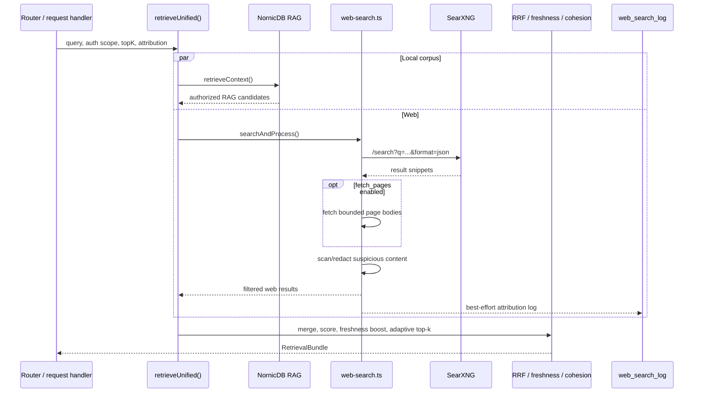
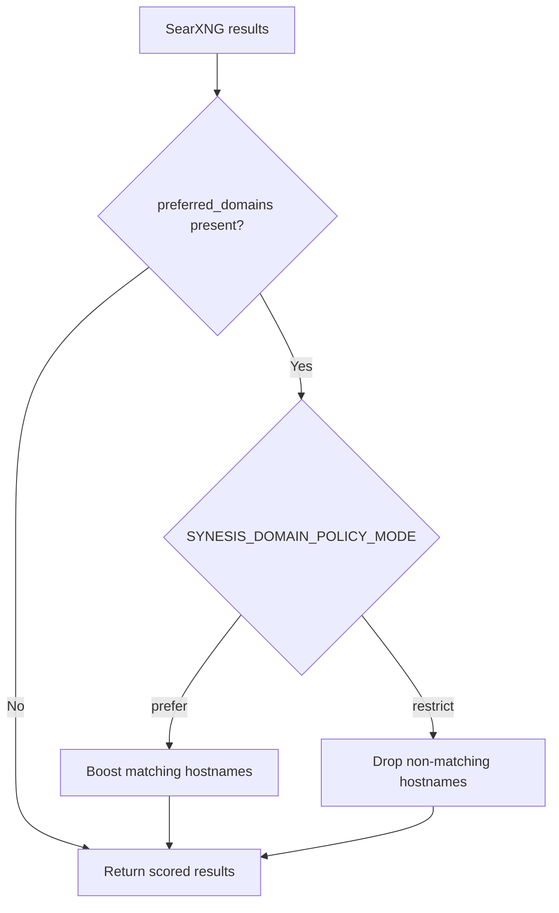
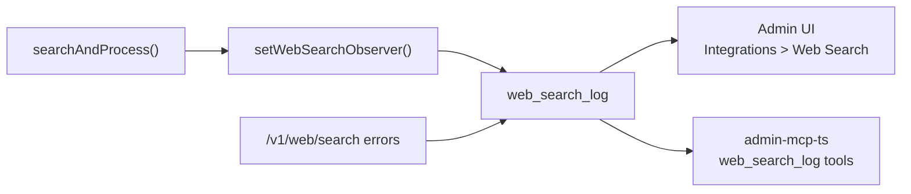

# Web Search

Synesis web search is planner-owned and SearXNG-backed. It gives RAG, Yarn, hosted MCP, and Open WebUI flows a single path for fresh external context without letting every service reach the public internet directly.

The current implementation is TypeScript-first. There is no runtime source-catalog loader. The active controls are planner configuration, the SearXNG service configuration, strict tool schemas, route authorization, attribution, and Admin observability.

## Runtime Model

```mermaid
flowchart TD
  User["User or agent request"] --> Entry{"Entry point"}
  Entry -->|Planner chat/RAG| Planner["planner-ts"]
  Entry -->|Yarn server tool| Yarn["yarn-ts"]
  Entry -->|Hosted MCP tool| MCP["synesis-mcp"]
  Entry -->|Open WebUI planner path| OpenWebUI["Open WebUI"]

  Yarn -->|"synesis_web_search / web_search"| SharedTools["@synesis/mcp-tools"]
  MCP -->|"synesis_web_search / web_search"| SharedTools
  OpenWebUI --> Planner
  SharedTools -->|"POST /v1/web/search"| Planner

  Planner -->|"internal HTTP"| SearXNG["SearXNG\nsynesis-search"]
  SearXNG --> Internet["Public search engines"]
  Planner -->|"RAG + web merge"| Writer["writer / response synthesis"]
  Planner -->|"web_search_log"| AdminDb["Admin Postgres"]
  AdminDb --> AdminUI["Admin Integrations\nWeb Search"]
```



Planner has two web-search call sites:

- `base/planner-ts/src/retrieval/unified.ts` runs web search beside NornicDB retrieval when web search is enabled, budget allows it, and the request does not opt out.
- `base/planner-ts/src/app.ts` exposes `POST /v1/web/search` for Yarn, hosted MCP, and other trusted callers.

Yarn and hosted MCP use the shared `@synesis/mcp-tools` package for `synesis_web_search`. The `web_search` alias is still accepted at tool dispatch boundaries, but `synesis_web_search` is the canonical Synesis tool name.

## Retrieval Flow



Search profiles are intentionally small:

| Profile | SearXNG parameters | Used for |
| --- | --- | --- |
| `web` | `categories=general` | Current public documentation, advisories, release notes, general web context |
| `code` | `engines=github,stackoverflow` | Code examples, issue threads, error messages, implementation references |

The profile is selected by the caller or by planner retrieval. Custom upstream engines should be configured in SearXNG itself, not through a Synesis source-catalog file.

## Security Controls

```mermaid
flowchart LR
  Input["Tool or route input"] --> Zod["Strict Zod schemas\nunknown fields rejected"]
  Zod --> Auth["Bearer auth\ninternal token or validated PAT"]
  Auth --> Bounds["Bounded query/top_k/fetch_pages/timeouts"]
  Bounds --> SearXNG["SearXNG only\ninternal service URL"]
  SearXNG --> Scan["scanWebContent()\nredactPatterns()"]
  Scan --> Trust["TrustPacketV1 + [W]\nuntrusted web evidence"]
  Trust --> Policy["Domain prefer/restrict\nRAG authz remains enforced"]
  Policy --> Audit["web_search_log\nsource_surface + trace IDs"]
```



Verified hardening in the current codebase:

- `POST /v1/web/search` requires an internal service token or validated `syn-` PAT before search execution.
- Planner route bodies are strict Zod objects; unknown fields are rejected with `400`.
- Shared MCP/Yarn tool input uses `packages/synesis-mcp-tools/src/web-search-schemas.ts`, which bounds `query`, `top_k`, `fetch_pages`, `max_fetch_pages`, `min_relevance`, and `preferred_domains`.
- Server attribution is validated in `packages/synesis-mcp-tools/src/search-contract.ts`; unsafe request IDs, session keys, or unknown `source_surface` values fail before the planner call.
- Search requests use timeouts. Planner-to-SearXNG calls default to 5 seconds; MCP-to-planner calls use a 30 second timeout.
- Page fetching is bounded by `max_fetch_pages`, a per-page timeout, content type checks, and a 4,000 character content cap.
- Fetched snippets and page bodies pass through `scanWebContent()` and are redacted with `redactPatterns()` when suspicious content is detected.
- Web evidence is treated as untrusted external content. In prompt assembly it is marked as web evidence (`[W]`) and wrapped by the same `TrustPacketV1` trust-envelope system documented in [Security](SECURITY.md).
- RAG authorization is separate from web search. `SYNESIS_RAG_AUTHZ_MODE=enforce` remains the Helm default, and semantic filtering is not used as an authorization boundary.
- Search delivery and logging are best effort. Search failures degrade to empty results or a degraded response instead of failing unrelated local RAG retrieval.

## Configuration

Planner web-search settings live in `base/planner-ts/src/config.ts` and Helm wires the in-cluster defaults in `charts/synesis/values.yaml`.

| Variable | Default | Helm default | Purpose |
| --- | --- | --- | --- |
| `SYNESIS_WEB_SEARCH_ENABLED` | `true` | `"true"` | Master switch. Search still requires a non-empty URL. |
| `SYNESIS_WEB_SEARCH_URL` | empty | `http://searxng.synesis-search.svc.cluster.local:8080` | Internal SearXNG base URL. Empty disables live web calls. |
| `SYNESIS_WEB_SEARCH_TIMEOUT_MS` | `5000` | planner default | Timeout for planner-to-SearXNG search calls. |
| `SYNESIS_WEB_SEARCH_MAX_RESULTS` | `5` | planner default | Default maximum SearXNG results. Direct route callers may request `top_k` up to 20. |
| `SYNESIS_WEB_BUDGET_BASE` | `1` | planner default | Lower bound for adaptive web budget in unified retrieval. |
| `SYNESIS_WEB_BUDGET_MAX` | `8` | planner default | Upper bound for adaptive web budget in unified retrieval. |
| `SYNESIS_DOMAIN_POLICY_MODE` | `prefer` | planner default | `prefer` boosts matching domains; `restrict` drops non-matching web results. |
| `SYNESIS_DOMAIN_POLICY_BOOST` | `1.4` | planner default | Score boost for preferred domains in `prefer` mode. |
| `SYNESIS_ENGINE_AUTHORITY_MAP` | `{}` | planner default | Optional JSON map from SearXNG engine name to `{ "authority": "...", "origin_type": "..." }`. |
| `SYNESIS_PLANNER_TS_ADMIN_DB_URL` | empty | secret-backed when configured | Enables Admin `web_search_log` persistence. |
| `SYNESIS_RAG_AUTHZ_MODE` | `enforce` | `enforce` | Keeps local corpus retrieval scoped by authenticated identity. |

Example `SYNESIS_ENGINE_AUTHORITY_MAP`:

```json
{
  "github": { "authority": "community", "origin_type": "external" },
  "stackoverflow": { "authority": "community", "origin_type": "external" }
}
```

## Route Contract

Trusted services call planner directly:

```http
POST /v1/web/search
Authorization: Bearer <internal-service-token-or-valid-syn-pat>
Content-Type: application/json
```

Request body:

```json
{
  "query": "Kimi K2.7 Code release notes",
  "top_k": 5,
  "profile": "web",
  "fetch_pages": false,
  "max_fetch_pages": 2,
  "min_relevance": 0.5,
  "preferred_domains": ["huggingface.co"],
  "source_surface": "yarn_mcp_http",
  "tool_name": "synesis_web_search",
  "request_id": "req-123",
  "session_key": "session-123",
  "conversation_id": "chat-123",
  "trace_id": "trace-123",
  "caller_org_id": "org-123",
  "caller_user_id": "user-123",
  "caller_tenant_ids": ["tenant-123"]
}
```

Response body:

```json
{
  "query": "Kimi K2.7 Code release notes",
  "total": 1,
  "results": [
    {
      "title": "Result title",
      "url": "https://example.com",
      "snippet": "Result snippet",
      "engine": "duckduckgo",
      "score": 1,
      "relevance": 0.7,
      "authority": "external",
      "origin_type": "external",
      "is_trusted": false
    }
  ],
  "timings": { "total_ms": 42.5 },
  "attribution_echo": {
    "source_surface": "yarn_mcp_http",
    "tool_name": "synesis_web_search"
  },
  "policy": { "action": "allow" }
}
```

Known `source_surface` values are:

- `yarn_chat`
- `yarn_mcp_http`
- `openwebui_planner`
- `planner_internal`
- `external_api`

## Domain Policy

`preferred_domains` are applied after retrieval. They are not injected into the search query string.



Use `prefer` for normal public web search. Use `restrict` only when operators want web evidence limited to specific domains supplied by the caller or planner.

## Deployment

SearXNG runs as `searxng` in `synesis-search`.

- `base/search/deployment.yaml` and `charts/synesis/values.yaml` deploy the SearXNG container.
- Planner points at the internal service URL, not a public endpoint.
- `base/search/network-policy.yaml` limits ingress to the planner namespace and allows DNS plus outbound HTTP/HTTPS for upstream search engines.
- `base/planner-ts/network-policy.yaml` allows planner egress to cluster services, including SearXNG.
- `base/search/configmap-settings.yaml` includes a development `secret_key`; production overlays should override it.

For Helm deployments, update `workloads.plannerTs.env` if the SearXNG service URL differs from the default.

## Observability

Admin web-search observability is backed by `web_search_log`.



Logged attribution includes source surface, tool name, request ID, session key, conversation ID, trace ID, caller org, caller user, and tenant IDs when the caller supplies them. Query logging uses the Admin database sink and should be treated as operational telemetry.

Related references:

- [Web Search Provenance](clients/WEB_SEARCH_PROVENANCE.md)
- [MCP Quickstart](clients/MCP_QUICKSTART.md)
- [Security](SECURITY.md)
- [RAG](RAG.md)

## Validation

Useful checks:

```bash
npm --workspace synesis-planner-ts test -- web-search-endpoint.test.ts search-route-auth.test.ts
python3 scripts/check-doc-reference-integrity.py
rg -n "SYNESIS_SEARCH_SOURCES_PATH|WEB_SEARCH_ROUTER_ENABLED|WEB_SEARCH_CRITIC_ENABLED" docs base packages charts --glob '!**/dist/**' --glob '!docs/WEB_SEARCH.md'
```

In a cluster:

```bash
oc -n synesis-planner set env deployment/synesis-planner SYNESIS_WEB_SEARCH_ENABLED=false
oc -n synesis-planner rollout restart deployment/synesis-planner
```

Disable web search by setting `SYNESIS_WEB_SEARCH_ENABLED=false` or leaving `SYNESIS_WEB_SEARCH_URL` empty. Remove or disable SearXNG only if no deployed planner configuration points at it.
