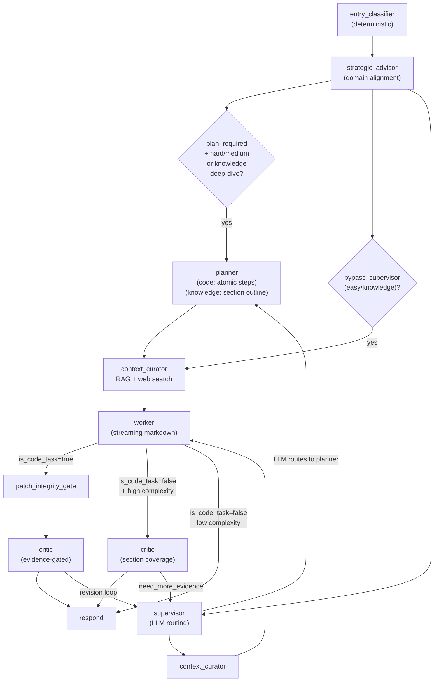

# Synesis Workflow

This document describes the LangGraph orchestration flow, routing logic, and key design invariants.

## Overview

Synesis implements a **Joint Cognitive System (JCS)** with 9 active nodes:
Entry Classifier, Strategic Advisor (Domain Aligner), Supervisor,
Planner, Context Curator, Worker (Executor), Patch Integrity Gate,
Critic, and Respond. Each node has a narrow scope; the mantra is
**Routing, not Reasoning** for the Supervisor and **Atomic
Decomposition** for the Planner.

**Output philosophy:** The Worker always produces **streaming
markdown** -- no JSON wrapper, no format bifurcation. Code tasks
include fenced code blocks; explanations are prose. The
`is_code_task` boolean controls whether code blocks are extracted
for validation.

**Sandbox and LSP are not in the default pipeline.** They remain
available as tool-accessible resources for future agent-based
self-correction loops (see [Architecture Decision: Sandbox/LSP
Decoupling](#architecture-decision-sandboxlsp-decoupling)).

## Models

| Role | Model | Hardware | Notes |
|------|-------|----------|-------|
| Router / Planner / Critic | Qwen3-8B FP8-dynamic | GPU 1 (L40S) | Shared vLLM instance, two `--served-model-name` aliases (`synesis-router`, `synesis-critic`) |
| Worker (Executor / General) | Qwen3-32B FP8 | GPU 2 (L40S) | Dense model; `enable_thinking: False` to suppress `<think>` blocks |
| Coder | Qwen3-32B FP8 | GPU 3 (L40S) | Dedicated code generation (same model, separate instance) |
| Summarizer | Qwen2.5-0.5B-Instruct | CPU | Pivot history summarization |
| Embedder | all-MiniLM-L6-v2 | CPU | RAG embedding |

## Graph Flow

There are three primary paths through the graph, selected by the
Entry Classifier based on task complexity and type:



**Path 1 — Easy/knowledge (bypass supervisor):**
Entry Classifier → Context Curator → Worker → Respond

**Path 2 — Knowledge deep-dive (plan_required + is_code_task=false):**
Entry Classifier → Planner (KNOWLEDGE_PLANNER_PROMPT) → Context Curator (+ web search) → Worker → Critic (section coverage) → Respond

**Path 3 — Code tasks (supervisor routing):**
Entry Classifier → Supervisor (LLM routing + web search) → [Planner] → Context Curator → Worker → Patch Integrity Gate → Critic → Respond

## Classification System

The Entry Classifier is **deterministic** (no LLM). It uses the
YAML-driven `ScoringEngine` with split axes:

| Axis | Purpose | Source |
|------|---------|--------|
| `complexity_score` | Steps, scope, uncertainty | `intent_weights.yaml` + plugin YAMLs |
| `risk_score` | Destructive ops, secrets, compliance | `intent_weights.yaml` + plugin YAMLs |
| `difficulty` | Normalized 0.0-1.0 | `complexity_score / (medium_max * 2)` |
| `task_size` | `easy` / `medium` / `hard` | Derived from complexity + risk |
| `is_code_task` | `true` (code) / `false` (explain) | From `intent_class` + domain |
| `intent_class` | `code_generation`, `knowledge`, `conversation`, etc. | Keyword matching against `intent_classes` |

**Token budget:** Continuous difficulty curve, not bucketed.
`budget = 512 + (4096 - 512) * difficulty^1.5`. Social
acknowledgements get 256 tokens.

**Routing thresholds** (YAML-driven):
- `bypass_supervisor_below: 0.2` -- easy tasks skip Supervisor
- `plan_required_above: 0.7` -- hard tasks get Planner
- `critic_required_above: 0.6` -- triggers full Critic review

## Routing Logic

### After Entry Classifier + Strategic Advisor

| Condition | Next Node |
|-----------|-----------|
| `pending_question_continue` | `context_curator` (if source=worker/planner) or source |
| `message_origin == "ui_helper"` | `respond` |
| `plan_required` + `task_size` in (hard, medium) or `is_code_task=false` | `planner` |
| `bypass_supervisor` (easy tasks, knowledge-downgraded) | `context_curator` |
| else | `supervisor` |

### After Supervisor

| Condition | Next Node |
|-----------|-----------|
| `error` | `respond` |
| `next_node == "planner"` | `planner` |
| `next_node == "worker"` | `context_curator` |
| else | `respond` |

**Taxonomy-driven passthroughs (no LLM):**
- `task_size == "hard"` + `plan_required` -> skip LLM, route to `planner`
- `is_code_task=false` + `!plan_required` (taxonomy) -> skip LLM, route to `worker`
- `is_code_task=false` + `plan_required` (knowledge deep-dive on critic retry) -> run LLM routing + web search

### After Planner

| Condition | Next Node |
|-----------|-----------|
| `plan_pending_approval` | `respond` (surface plan; user replies to proceed) |
| else | `context_curator` -> worker (plan auto-proceeds) |

### After Worker

| Condition | Next Node |
|-----------|-----------|
| `needs_input_question` | `respond` |
| `stop_reason == "needs_scope_expansion"` | `supervisor` |
| `stop_reason` (other) | `respond` |
| `is_code_task=false` + high complexity (>0.6) + required_elements | `critic` (depth check) |
| `is_code_task=false` (low complexity) | `respond` (direct) |
| else | `patch_integrity_gate` |

### After Patch Integrity Gate

| Condition | Next Node |
|-----------|-----------|
| `integrity_passed == false` | `context_curator` (retry Worker) |
| else | `critic` |

### After Critic

| Condition | Next Node |
|-----------|-----------|
| `error` | `respond` |
| `critic_approved` and `!need_more_evidence` | `respond` |
| `iteration >= max_iterations` | `respond` |
| `need_more_evidence` | `supervisor` |
| `!approved` and `should_continue` | `supervisor` |
| `continue_reason` in (blocked_external, needs_input) | `supervisor` |
| else | `respond` |

## Key Invariants

1. **Anemic Supervisor**: Routing only. No architecture reasoning.
   Sub-500ms target. Taxonomy-driven passthroughs skip LLM for
   easy and `is_code_task=false` cases.
2. **Taxonomy-Driven Everything**: Entry Classifier outputs
   `intent_class`, `is_code_task`, `active_domain_refs`,
   `taxonomy_metadata`, `difficulty`, and YAML-driven
   `routing_thresholds`. Taxonomy plugins provide domain keywords,
   complexity/risk weights, and vertical prompt data (worker
   persona, planner rules, critic mode).
3. **Dual Planner Prompts**: Code tasks use `PLANNER_SYSTEM_PROMPT`
   (atomic steps with files and verification commands). Knowledge
   deep-dives use `KNOWLEDGE_PLANNER_PROMPT` (section outlines
   mapped from the user's explicit requests). Protocol tasks:
   first step = discovery/WebFinger only.
4. **Evidence-Gated Critic**: For code: `approved=false` requires
   `blocking_issue` with valid `evidence_refs`. For knowledge
   deep-dives: Critic validates section coverage against taxonomy
   `required_elements`, checks for hallucinated constraints the
   user did not request, and flags vague recommendations.
5. **Unified Markdown Output**: Worker always produces markdown.
   No JSON wrapper. Code is in fenced blocks; `code_extractor.py`
   extracts blocks for validation. `is_code_task` controls whether
   extraction happens.
6. **Monotonic Retry** (`state.retry`): Failures, decisions,
   diversification_history only append. At `max_iterations`, force
   PASS and emit `carried_uncertainties_signal`.
7. **Continuous Token Budgets**: Difficulty-based curve (not
   bucketed). Social acknowledgements get minimal budget (256
   tokens). Thinking budgets scale with `task_size`.
8. **No fixed sandbox/LSP pipeline stages**: Sandbox and LSP are
   decoupled from the default graph edges. The default code path
   is Worker -> PatchIntegrityGate -> Critic -> Respond. Sandbox
   and LSP remain as tool-accessible resources for future
   agent-based self-correction loops.

## Adaptive Rigor

Rigor scales with `task_size`. Decouples general utility from
engineering rigor.

| Task Size | Critic Mode | Respond Output | RAG | Status |
|-----------|-------------|----------------|-----|--------|
| **easy** | Advisory (no LLM) | Code/markdown + one line | disabled | "Generating..." |
| **medium** | Advisory (no LLM) | Code/markdown + explanation | light (generic) | "Generating..." |
| **hard** | Full JCS Critic | Decision Summary, Safety Analysis | normal | "Architecting solution..." |

- **Advisory Mode** (easy/medium): Critic skips LLM.
  `approved=true` if code compiles/runs. No What-If analysis.
- **Full Critic** (hard only): Full JCS analysis with What-Ifs.
  Evidence-gated blocking.
- **Tiered Critic** (lifestyle, LLM RAG/prompting/evaluation):
  basic -> advanced -> research tiers from taxonomy plugin YAML.
- **Vertical Persona Injection**: Taxonomy plugins inject
  domain-specific Worker persona blocks, Planner decomposition
  rules, and Critic mode overrides. Compliance requirements
  (FIPS, HIPAA, PCI-DSS, air-gap) are injected as **conditional
  considerations** — they activate only when the user's context
  signals them (e.g., "GovCloud" triggers FIPS, "healthcare"
  triggers HIPAA), not by default.
- **Knowledge Deep-Dive**: Engineering domains (cloud, kubernetes,
  databases, software_architecture, etc.) in `deep_dive_domains`
  route through Planner → Context Curator (with web search) →
  Worker → Critic for structured, section-by-section generation
  with quality review.

## Streaming Architecture

All responses stream via SSE (`text/event-stream`) through the
OpenAI-compatible `/v1/chat/completions` endpoint.

| Path | Mechanism | Reasoning |
|------|-----------|-----------|
| `is_code_task=false` | Worker returns `direct_stream_request` dict; `main.py` calls executor via raw OpenAI SDK | Preserves `reasoning_content` (LangChain drops it) |
| `is_code_task=true` | Worker calls LLM via LangChain `ainvoke`; code extracted from markdown post-hoc | Full response needed for code extraction |

**Status events**: Pipeline phases emit as SSE `event: status`
with `{"type":"status","data":{"description":"...","done":false}}`
payloads. Open WebUI renders these in a collapsible "Thinking" UI.

**Knowledge-specific statuses**: When `is_code_task=false`, the
pipeline emits context-aware messages:
- "Searching for context..." (supervisor)
- "Building response outline..." (planner)
- "Searching the web..." (when web search returns results)
- "Gathering context..." (context curator)
- "Generating response..." (worker)
- "Reviewing quality..." (critic)

**Code task statuses** (tier-matched):
- Easy: "Analyzing..." → "Generating code..."
- Medium: "Generating code..."
- Hard: "Complex task detected..." → "Architecting solution..."

**Deduplication**: Consecutive identical status descriptions are
suppressed to prevent duplicate phase indicators.

## Architecture Decision: Sandbox/LSP Decoupling

**Decision**: Sandbox and LSP are removed from the default graph
edges. They remain as tool-accessible resources for future
agent-based self-correction loops.

**Rationale**: The fixed pipeline (Worker -> Sandbox -> LSP ->
Critic) imposed mandatory latency on every code task, even when
the code was trivially correct. Research on LLM self-correction
shows that agent-based dynamic tool selection outperforms fixed
pipelines.

**Current code path** (default):
```
Worker -> PatchIntegrityGate -> Critic -> Respond
```

PatchIntegrityGate provides deterministic safety checks (secrets,
network, workspace boundaries, import integrity, AST syntax) in
<10ms. The Critic operates in Advisory mode for easy/medium tasks
(no LLM call) and Full JCS mode for hard tasks.

**Future self-correction loop** (planned):
```
Worker -> PatchIntegrityGate -> Critic -> [exception?]
    -> Agent selects tool: compile -> ruff -> sandbox -> LSP
    -> Re-try with enriched context
```

### Research References

The following research informed this architecture decision:

1. **Graduated Escalation** (LLMLOOP pattern): Start with the
   cheapest validation (compile/parse), escalate to static
   analysis, then sandbox execution, then mutation testing. Each
   level costs more but catches deeper issues. Most code passes
   early stages.
   - Ref: Chen et al., "Teaching Large Language Models to
     Self-Debug" (2023), arXiv:2304.05128

2. **Agent-Based Dynamic Tool Selection**: LLM agents that
   dynamically choose which validation tools to invoke outperform
   fixed pipelines by 15-30% on code repair benchmarks.
   - Ref: InspectCoder (2024) -- multi-agent code review with
     dynamic tool selection
   - Ref: CodeCureAgent (2024) -- repair agent with graduated
     tool escalation

3. **Static Analysis Effectiveness**: Ruff, mypy, and AST-based
   checks catch 60-80% of common Python issues without execution.
   Sandbox adds latency but only catches runtime-specific bugs.
   - Ref: Beller et al., "Analyzing the State of Static Analysis"
     (2016), IEEE TSE

4. **Client-Side Code Formatting**: Code formatting (black, ruff
   format, prettier) is best delegated to the client/IDE rather
   than performed server-side. The LLM should focus on correctness,
   not style.
   - Ref: Industry consensus -- VS Code, Cursor, and JetBrains
     all apply formatters on save/paste

5. **Dynamic Reasoning Quota Allocation (DRQA)**: Adaptive
   computation budgets for LLM reasoning, allocating more thinking
   tokens to harder problems. Synesis implements this via
   continuous difficulty-based token budgets.
   - Ref: Xu et al., "DRQA: Dynamic Reasoning Quota Allocation"
     (2025), arXiv:2502.17268

6. **RouteLLM and Adaptive Routing**: Research on routing prompts
   to different-capability models based on estimated difficulty.
   Synesis uses taxonomy-driven scoring instead of a separate
   routing model.
   - Ref: Ong et al., "RouteLLM: Learning to Route LLMs with
     Preference Data" (2024), arXiv:2406.18665

7. **Plan-and-Solve Prompting**: Decomposing complex tasks into
   subtasks before generation improves accuracy by 3-15% on
   reasoning benchmarks. Synesis implements this via the planner
   node creating structured outlines for deep-dive knowledge
   tasks (taxonomy domains with complexity > 0.6).
   - Ref: Wang et al., "Plan-and-Solve Prompting: Improving
     Zero-Shot Chain-of-Thought Reasoning by Large Language
     Models" (2023), arXiv:2305.04091

8. **Skeleton-of-Thought**: Generating a response outline first,
   then filling sections produces better structure and enables
   parallel generation. Synesis uses the planner's section
   outline (KNOWLEDGE_PLANNER_PROMPT) to guide the worker's
   structured generation for knowledge deep-dives.
   - Ref: Ning et al., "Skeleton-of-Thought: Large Language
     Models Can Do Parallel Decoding" (2023), arXiv:2307.15337

9. **Self-Refine**: Iterative self-feedback without additional
   training data improves open-ended generation quality on 7
   diverse tasks. Synesis implements this via the critic node's
   review loop, which validates section coverage against taxonomy
   required_elements and checks for hallucinated constraints.
   - Ref: Madaan et al., "Self-Refine: Iterative Refinement
     with Self-Feedback" (2023), arXiv:2303.17651

### What Changed

| Before | After |
|--------|-------|
| Worker -> PatchGate -> Sandbox -> [LSP] -> Critic | Worker -> PatchGate -> Critic |
| `/test` command for user-triggered sandbox | Removed (sandbox is internal-only) |
| `force_sandbox` state field | Removed |
| `needs_sandbox` boolean | Renamed to `is_code_task` |
| Evidence gate required `lsp` or `sandbox` refs | Accepts `static_analysis`, `syntax`, `spec`, `code_smell`, `lsp`, `sandbox` |
| Sandbox/LSP nodes registered in graph | Removed from graph edges; code remains for future tool use |

## Planner: When, Why, and Performance

**When Planner runs:**
1. **Code tasks**: `task_size=hard` + `plan_required` (multi-step,
   protocol-heavy). Uses `PLANNER_SYSTEM_PROMPT` with atomic steps,
   file manifests, and verification commands.
2. **Knowledge deep-dives**: `is_code_task=false` + domain in
   `deep_dive_domains` + `complexity > 0.6` ->
   `plan_required=true`. Uses `KNOWLEDGE_PLANNER_PROMPT` which
   creates section outlines (not file plans) based on the user's
   explicitly requested deliverables and taxonomy `required_elements`.
3. **Simple knowledge**: `plan_required=false` -> bypass Supervisor
   -> Context Curator -> Worker -> Respond (no Planner).

**Deep-dive engineering domains** (trigger Planner for knowledge):
`cloud`, `kubernetes`, `databases`, `networking`, `web_backend`,
`web_frontend`, `ml_ops`, `embedded`, `software_architecture`,
`protocols` — all with `complexity >= 0.7` and rich `required_elements`.

**Taxonomy shaping:** Taxonomy plugin YAMLs inject
`planner_decomposition_rules` per domain. For software architecture:
"Map each user-requested section to a plan step. Do NOT invent
requirements the user did not ask for." For protocols: "FIRST step
= discovery/handshake only."

**Web search for knowledge deep-dives:** Context Curator runs web
search for `is_code_task=false` + `plan_required=true` tasks,
providing the Worker with current web context alongside RAG results.

**Performance levers:**
1. **Routing:** Taxonomy sets `is_code_task=false` for (intent,
   domain) -> `plan_required=false`; simple document tasks never
   hit Planner. Only deep-dive domains trigger the full pipeline.
2. **max_tokens:** 1024 for Planner/Critic vs 2048+ for Worker.
3. **Prefix caching:** Router and Critic share a vLLM runtime with
   `--enable-prefix-caching`.

## Configuration System

All classification, routing, and prompt injection is driven by
YAML config -- no hardcoded if/else chains.

| File | Purpose |
|------|---------|
| `intent_weights.yaml` | Core complexity/risk weights, intent classes, routing thresholds |
| `plugins/weights/*.yaml` | Industry-specific keywords, weights, pairings, and vertical prompt data |
| `taxonomy_prompt_config.yaml` | Domain -> persona, tone, depth instructions, required_elements, discovery_prompt. 100+ domains including 10 engineering domains with deep guidance. `deep_dive_domains` list triggers Planner for knowledge tasks. |
| `intent_prompts.yaml` | Intent -> Critic behavior overlay (hallucination-sensitive, evidence-required, etc.) |
| `prompt_taxonomy.yaml` | Pivot summarizer routing, vertical aliases |

**Plugin system:** Drop a YAML into `plugins/weights/` to add an
industry vertical. Plugin loader merges complexity/risk/domain
keywords, pairings, and vertical prompt blocks at startup.

## See Also

- [nodes.md](nodes.md) -- Node flow with full prompts per role
- [TAXONOMY.md](TAXONOMY.md) -- Intent taxonomy, output path, critic policy
- [TAXONOMY_DRIVEN_INJECTION.md](TAXONOMY_DRIVEN_INJECTION.md) -- Taxonomy metadata, Planner deep-dive, depth block injection
- [critic_policy_spec.json](../base/planner/critic_policy_spec.json) -- Critic policy engine spec
- [intent_weights.yaml](../base/planner/intent_weights.yaml) -- EntryClassifier complexity/risk weights
- [plugins/weights/README.md](../base/planner/plugins/weights/README.md) -- Industry plugin format
