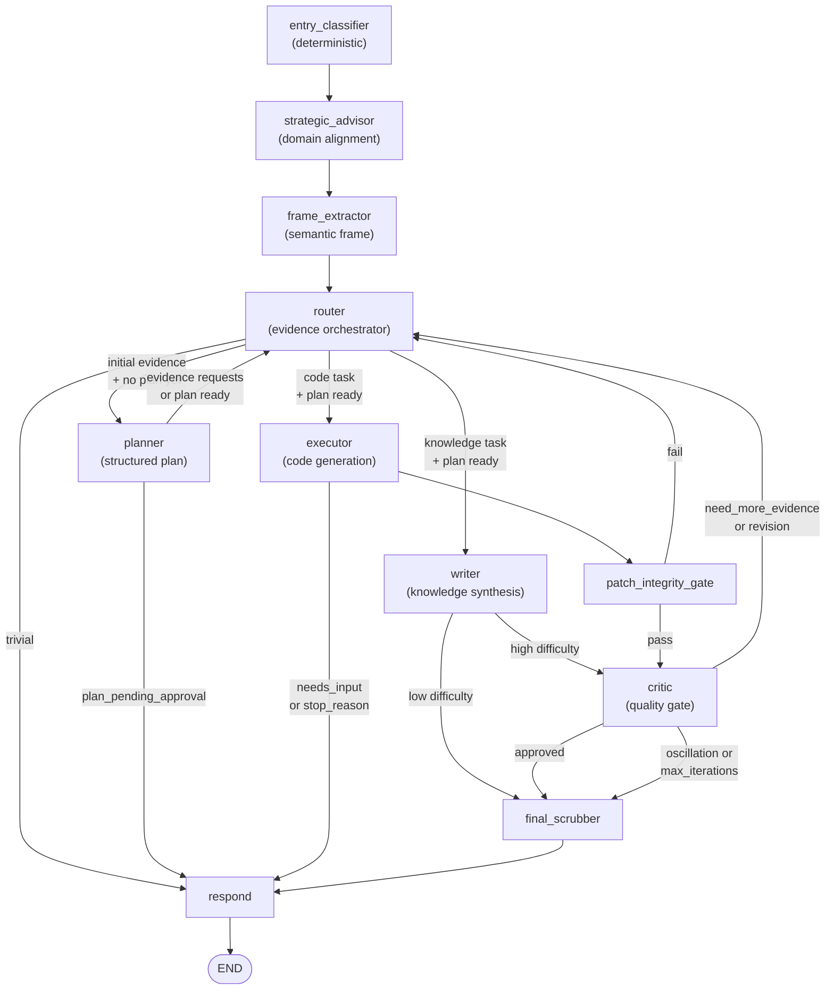

# Synesis Workflow

This document describes the LangGraph orchestration flow, routing logic, and key design invariants.

## Overview

Synesis implements a **Router-Governed Evidence Architecture** with 11 active nodes:
Entry Classifier, Strategic Advisor, Frame Extractor, **Router**,
Planner, Executor, Writer, Patch Integrity Gate, Critic,
Final Scrubber, and Respond.

The **Router is the single retrieval orchestrator**. No other node
touches retrieval backends (RAG, web search, unified retrieval).
All evidence flows through structured **Evidence Packets** — downstream
agents (Planner, Executor, Writer, Critic) consume evidence but never
retrieve it directly.

**Output philosophy:** The Executor produces code tasks; the Writer
produces knowledge responses. Both output **streaming markdown** — no
JSON wrapper, no format bifurcation. Code tasks include fenced code
blocks; explanations are prose. The `is_code_task` boolean controls
routing between Executor (code) and Writer (knowledge).

**Sandbox and LSP are not in the default pipeline.** They remain
available as tool-accessible resources for future agent-based
self-correction loops (see [Architecture Decision: Sandbox/LSP
Decoupling](#architecture-decision-sandboxlsp-decoupling)).

## Models

| Role | Model | Hardware | Notes |
|------|-------|----------|-------|
| Router / Planner | Qwen3-8B FP8 | GPU 0 (L40S) | Fast routing, query generation, plan decomposition |
| General (Executor / Writer) | Qwen3-32B FP8 | GPU 1 (L40S) | Code generation, knowledge synthesis |
| Coder | Qwen3-Coder-30B-A3B FP8 | GPU 2 (L40S) | Dedicated code generation for IDE clients (direct vLLM) |
| Critic | DeepSeek R1-Distill-32B FP8 | GPU (L40S) | Quality review with configurable thinking budget |
| Summarizer | Qwen2.5-0.5B-Instruct | CPU | Pivot history summarization |
| Embedder | all-MiniLM-L6-v2 | CPU | RAG embedding + semantic index |

**Config mapping:**

| Config field | Env var | Used by |
|---|---|---|
| `router_model_url` | `SYNESIS_ROUTER_MODEL_URL` | Router (query generation, summarization, refinement), Planner |
| `general_model_url` | `SYNESIS_GENERAL_MODEL_URL` | Executor, Writer |
| `critic_model_url` | `SYNESIS_CRITIC_MODEL_URL` | Critic |

## Graph Flow

All requests enter through the same pipeline: Entry Classifier →
Strategic Advisor → Frame Extractor → Router. The Router then
orchestrates evidence gathering and routes to the appropriate
downstream node.


```mermaid
flowchart TD
    EC["entry_classifier\n(deterministic)"] --> SA["strategic_advisor\n(domain alignment)"]
    SA --> FE["frame_extractor\n(semantic frame)"]
    FE --> RT["router\n(evidence orchestrator)"]

    RT -->|"initial evidence\n+ no plan yet"| PL["planner\n(structured plan)"]
    RT -->|"code task\n+ plan ready"| EX["executor\n(code generation)"]
    RT -->|"knowledge task\n+ plan ready"| WR["writer\n(knowledge synthesis)"]
    RT -->|"trivial"| RS["respond"]

    PL -->|"evidence requests\nor plan ready"| RT
    PL -->|"plan_pending_approval"| RS

    EX --> PIG["patch_integrity_gate"]
    EX -->|"needs_input\nor stop_reason"| RS

    WR -->|"high difficulty"| CR["critic\n(quality gate)"]
    WR -->|"low difficulty"| FS["final_scrubber"]

    PIG -->|"pass"| CR
    PIG -->|"fail"| RT

    CR -->|"approved"| FS
    CR -->|"need_more_evidence\nor revision"| RT
    CR -->|"oscillation or\nmax_iterations"| FS

    FS --> RS
    RS --> END([END])
```

**Path 1 — Trivial / UI helper:**
Entry → Router → Respond

**Path 2 — Knowledge tasks:**
Entry → Router (initial evidence) → Planner → Router (section evidence) → Writer → [Critic] → Final Scrubber → Respond

**Path 3 — Code tasks:**
Entry → Router (initial evidence) → Planner → Router (section evidence) → Executor → Patch Integrity Gate → Critic → [Final Scrubber] → Respond

### Streaming Behavior

During SSE streaming, the router and planner emit rich status messages describing
what was searched and planned (e.g., "Searched: Kubernetes deployment strategies (2 web + 3 docs)",
"Plan ready: 5 sections").

**Background critic mode** (`SYNESIS_CRITIC_BACKGROUND=true`): The SSE stream closes
immediately after the writer/executor finishes streaming content. The graph continues
running the critic, scrubber, and respond nodes silently. When disabled (default),
the critic runs inline and the user waits for it to complete before the stream closes.

### Critic Optimization

The document-path critic has several optimizations to reduce latency:

- **Deterministic pre-check**: For lenient-difficulty tasks, skips the LLM critic entirely if all deliverables have headings and word count is proportional
- **Skeleton mode**: Sends headings + first 200 chars per section instead of the full response text
- **Lenient strip**: Omits CRAG assessment, failure mode vocabulary, and scoring rubric for low-difficulty tasks
- **Unified rubric**: Frame rubric and decision ledger merged into one block

## Router-Governed Evidence Architecture

The Router is a **LangGraph node** (deterministic orchestrator), not an LLM persona.
It invokes LLMs for specific sub-tasks but owns all system-level logic:

```
Router Node
├── generate_query_variants()  → LLM calls (3 variants: direct, HyDE, conceptual expansion)
├── _multi_query_retrieve()    → parallel retrieval for all variants, RRF merge
├── retrieve()                 → RAG / web search backends (with preferred_web_scopes)
├── summarize()                → LLM call (summarization prompt, guided JSON)
├── refine_query()             → LLM call (refinement prompt)
├── dedupe()                   → deterministic deduplication
├── parallel_dispatch()        → asyncio.gather for independent requests
└── produce evidence packet    → deterministic assembly
```

### Multi-Query Expansion

Each evidence request produces up to 3 query variants (configurable via `router_multi_query_enabled`):

| Variant | Purpose | Example |
|---------|---------|---------|
| **Direct** | Balanced recall/precision reformulation of the evidence request | "internal coding assistant architecture RAG retrieval design" |
| **HyDE** | Hypothetical document embedding — generates a 2-3 sentence answer, embeds it for vector search | "An internal coding assistant retrieves company documentation using vector embeddings..." |
| **Conceptual expansion** | Expands with taxonomy hints, synonyms, and frame technologies | "coding assistant ADR architecture decision record system design microservices..." |

All variants are retrieved in parallel. Results are merged via **Reciprocal Rank Fusion** before summarization. This dramatically improves recall on domain-specific documents (ADRs, RFCs, design proposals) that use different vocabulary than the user query.

**Taxonomy-driven enrichment**: When a domain has `query_expansion_hints` in `taxonomy_prompt_config.yaml`, those terms are injected into the conceptual expansion variant. When `preferred_web_scopes` are defined (e.g. `site:martinfowler.com`), they're appended to web search queries. Frame-extracted `technologies` are also injected into the expansion variant.

### Retrieval Discipline

Only the Router may perform retrieval (RAG or web search). Rules:

1. Retrieval balances recall and precision — queries include related concepts and synonyms
2. Results are summarized into Evidence Packets before passing downstream
3. Planner may *request* evidence but cannot retrieve it
4. Critic may *flag* insufficient evidence but cannot retrieve it
5. Executor and Writer may *consume* evidence but cannot retrieve it
6. Retrieval is bounded: `MAX_DOCS_PER_QUERY=5`, `MAX_SNIPPETS_PER_PACKET=20`, `MAX_SUMMARY_TOKENS=2000` per packet
7. Low-confidence packets (`<0.4`) include retrieval notes and trigger refinement

### Router Mode Detection

The Router detects its mode from state:

| Mode | Trigger | Behavior |
|------|---------|----------|
| `initial` | No `execution_plan` and no `evidence_requests` | Build initial evidence from user task |
| `section_evidence` | `evidence_requests` present from Planner | Retrieve evidence for specific plan sections |
| `refinement` | `need_more_evidence` from Critic | Refine queries and re-retrieve |

### Confidence-Gated Refinement

When an evidence packet scores below `LOW_CONFIDENCE_THRESHOLD` (0.4),
the Router automatically:
1. Calls `refine_query()` to generate a more specific query
2. Re-retrieves with the refined query
3. Re-summarizes into a new evidence packet
4. Repeats up to `MAX_REFINEMENT_ROUNDS` (2)

### Evidence Packets

All evidence flows as structured packets between nodes:

```json
{
  "query": "string",
  "sources": [
    {
      "uri": "string",
      "type": "doc | code | wiki | web | repo | api",
      "metadata": { "path": "string", "timestamp": "string", "tags": ["string"] }
    }
  ],
  "snippets": [
    { "text": "string", "relevance": 0.0, "source_uri": "string" }
  ],
  "summary": "string",
  "confidence": 0.0,
  "retrieval_notes": "string",
  "section_id": "int | null"
}
```

Evidence packets are stored in `state["evidence_packets"]` with a
`_merge_evidence_packets` reducer that deduplicates by `(query, section_id)` —
refinement loops update rather than accumulate stale evidence.

### Hybrid Retrieval Cache

The Router includes a two-layer cache to prevent redundant retrieval
("RAG blasting") during back-and-forth between Router and Critic:

**Layer 1 — Exact match:** Dictionary keyed by normalized query string.

**Layer 2 — Semantic match:** `NumpySemanticIndex` stores query
embeddings mapped to evidence packets. New queries check semantic
similarity before hitting retrieval backends.

**Cache rules:**
- TTL: 24 hours (configurable via `retrieval_cache_ttl`)
- Eviction: LRU + TTL
- Semantic similarity threshold: 0.85
- Evidence confidence threshold: 0.6
- Structured query bypass: file paths, K8s objects, Terraform identifiers,
  service names, and error messages skip semantic lookup (regex detection)
- Cache entries store summarized evidence packets, not raw retrieval
- Critic-driven invalidation: when the anti-oscillation detector finds
  repeated complaints for the same `section_id`, that cache entry is
  purged via `cache.invalidate_by_section()`

**Backend:** `NumpySemanticIndex` (default, zero external deps). Pluggable
for FAISS or Milvus via the `SemanticIndex` protocol.

## Classification System

The Entry Classifier is **deterministic** (no LLM). It uses the
YAML-driven `ScoringEngine` with split axes:

| Axis | Purpose | Source |
|------|---------|--------|
| `complexity_score` | Steps, scope, uncertainty | `intent_weights.yaml` + plugin YAMLs |
| `risk_score` | Destructive ops, secrets, compliance | `intent_weights.yaml` + plugin YAMLs |
| `difficulty` | Normalized 0.0-1.0 | `complexity_score / (medium_max * 2)` |
| `task_size` | `easy` / `medium` / `hard` | Derived from complexity + risk |
| `is_code_task` | `true` (code) / `false` (text, default) | Semantic intent classifier (embedding similarity) |
| `intent_class` | `code_generation`, `knowledge`, `conversation`, etc. | Keyword matching against `intent_classes` |

**Text-first classification**: The system defaults to
`is_code_task=false` and `intent_class="general"`. Code is the
minority class with high-salience features (language names, action
verbs like "implement"/"debug"/"refactor"). The ScoringEngine
detects code via 7 explicit `code_intents` classes; everything
else stays on the text path. This follows One-Class Classification
theory — define the minority class (code), default to majority
(text). See the plan document for research references (Bayesian
Decision Theory, Feature Salience Asymmetry, OCC).

**Code detection layers:**
1. **ScoringEngine intent**: Primary. 7 code intent classes with
   word-boundary keyword matching.
2. **Semantic intent classifier**: Embedding-based code/knowledge
   disambiguation via cosine similarity against route embeddings.
   The classifier embeds the user query with `all-MiniLM-L6-v2`
   and compares against pre-computed mean embeddings for CODE_OUTPUT
   and KNOWLEDGE_DISCUSSION utterance routes.
3. **Inherently-document safety net**: Intent classes with
   `inherently_document: true` always classify as knowledge.
4. **Coding client bias**: IDE contexts (Cursor, Claude Code) with
   `general` intent assume code.

**Token budget:** Continuous difficulty curve, not bucketed.
`budget = 512 + (4096 - 512) * difficulty^1.5`. Social
acknowledgements get 256 tokens.

**Routing thresholds** (YAML-driven):
- `plan_required_above: 0.7` — hard tasks get Planner
- `critic_required_above: 0.6` — triggers full Critic review
- `critic_skip_below_difficulty` — trivial tasks skip Critic

## Routing Logic

### After Entry Classifier + Strategic Advisor + Frame Extractor

| Condition | Next Node |
|-----------|-----------|
| `pending_question_continue` | `router` |
| `message_origin == "ui_helper"` | `respond` |
| else | `router` |

All requests go through the Router. The Router decides what happens next.

### After Router

| Condition | Next Node |
|-----------|-----------|
| `error` | `respond` |
| `next_node == "planner"` | `planner` |
| `next_node == "executor"` | `executor` |
| `next_node == "writer"` | `writer` |
| `next_node == "respond"` | `respond` |
| default | `planner` |

### After Planner

| Condition | Next Node |
|-----------|-----------|
| `plan_pending_approval` | `respond` (surface plan; user replies to proceed) |
| `evidence_requests` present | `router` (gather section evidence) |
| else | `router` (router decides next step) |

### After Executor

| Condition | Next Node |
|-----------|-----------|
| `needs_input_question` | `respond` |
| `stop_reason` (any) | `respond` |
| `is_code_task=false` | `respond` |
| else | `patch_integrity_gate` |

### After Writer

| Condition | Next Node |
|-----------|-----------|
| `difficulty < critic_skip_below_difficulty` | `final_scrubber` |
| else | `critic` |

### After Patch Integrity Gate

| Condition | Next Node |
|-----------|-----------|
| `integrity_passed == false` | `router` (re-retrieve evidence) |
| else | `critic` |

### After Critic

| Condition | Next Node |
|-----------|-----------|
| `error` | `respond` |
| oscillation score > threshold | `final_scrubber` (force-terminate with best draft) |
| `critic_approved` and `!need_more_evidence` | `final_scrubber` |
| `iteration >= max_iterations` | `final_scrubber` |
| `need_more_evidence` | `router` |
| `!approved` and `should_continue` | `router` |
| else | `respond` |

## Key Invariants

1. **Router owns all retrieval**: Only the Router touches RAG, web
   search, or unified retrieval. Downstream nodes consume evidence
   packets. This prevents retrieval dilution and ensures discipline.
2. **Evidence Packets are the data contract**: All inter-node evidence
   flows as structured packets with query, sources, snippets, summary,
   confidence, and retrieval notes. No raw retrieval results leak downstream.
3. **Taxonomy-Driven Everything**: Entry Classifier outputs
   `intent_class`, `is_code_task`, `active_domain_refs`,
   `taxonomy_metadata`, `difficulty`, and YAML-driven
   `routing_thresholds`. Taxonomy plugins provide domain keywords,
   complexity/risk weights, and vertical prompt data (executor
   persona, planner rules, critic mode).
4. **Dual Planner Prompts**: Code tasks use `PLANNER_SYSTEM_PROMPT`
   (atomic steps with files and verification commands). Knowledge
   tasks use `KNOWLEDGE_PLANNER_PROMPT` (section outlines mapped
   from the user's explicit requests).
5. **Evidence-Gated Critic**: `approved=false` requires
   `blocking_issue` with valid `evidence_refs`. The Critic validates
   against evidence packets and flags unsupported claims. Missing
   evidence triggers `need_more_evidence` → Router re-retrieval.
6. **Unified Markdown Output**: Executor and Writer produce markdown.
   No JSON wrapper. Code is in fenced blocks; `code_extractor.py`
   extracts blocks for validation. `is_code_task` controls routing.
7. **Monotonic Retry** (`state.retry`): Failures, decisions,
   diversification_history only append. At `max_iterations`, force
   PASS (degraded).
8. **Continuous Token Budgets**: Difficulty-based curve (not
   bucketed). Social acknowledgements get minimal budget (256
   tokens). Thinking budgets scale with `task_size`.
9. **No fixed sandbox/LSP pipeline stages**: Sandbox and LSP are
   decoupled from the default graph edges. The default code path
   is Executor → PatchIntegrityGate → Critic → Respond.
10. **Immutable Frame**: `SemanticFrame` is set-once via `_set_once_dict`
    reducer. No downstream node can overwrite the frame after
    `frame_extractor` sets it.
11. **Decision Ledger**: Executor and Writer consume structured
    `DecisionEntry` objects from the planner (append-only ledger),
    not raw planner prose. Critic validates draft against ledger.
12. **Hybrid Cache Stability**: The retrieval cache prevents
    evidence oscillation. Critic-driven invalidation purges bad
    entries; semantic matching prevents redundant retrieval for
    similar queries.

## Anti-Oscillation Framework

Prevents style drift, grounding loss, and decision oscillation across nodes
while preserving flexibility for justified overrides. Controls are deterministic
(pure functions), not prompt-based.

### Immutable Frame Lifecycle

`SemanticFrame` is extracted by `frame_extractor` and written to state via the
`_set_once_dict` reducer. Once set, no downstream node can overwrite it. All
nodes (planner, executor, writer, critic) read the same immutable frame.

### Decision Ledger

The planner emits structured `DecisionEntry` objects (append-only via
`_append_only_ledger` reducer). Each entry records what was chosen, what was
rejected, and why. The executor and writer consume the ledger directly
instead of raw planner prose. The critic validates the draft against ledger
entries and flags contradictions.

```
frame_extractor → semantic_frame (set-once)
planner → decision_ledger (append-only) + style_contract_locked (set-once)
executor / writer ← reads decision_ledger + style_contract_locked
critic ← validates draft against decision_ledger + style_contract_locked
```

### Style Contract

Locked at planning time by `_derive_style_contract()`, derived from the
semantic frame and difficulty. Contains `verbosity_target`, `direct_answer_first`,
`citation_required`, and `max_section_paragraphs`. Executor and Writer
are bound to this contract; deviations are flagged by `validate_style_compliance`.

### Critique Register

Tracks critique items by `item_id` with forward-only status transitions
(`open` → `resolved` → `settled`) via the `_merge_critique_register` reducer.
Reopening a settled item requires new `evidence_ref` and increments
`reopen_count`. This prevents the critic from endlessly reopening decisions.

### Retrieval Churn Detection

The anti-oscillation scorer tracks retrieval churn by monitoring
`critique_register` entries where the critic repeatedly flags evidence
issues for the same `section_id`. When a section accumulates 2+ complaints,
the hybrid retrieval cache entry for that section is invalidated via
`cache.invalidate_by_section()`, preventing "bad evidence sneaking back in."

### Override Flow

Changing a frozen decision requires an explicit `OverrideRequest`:

1. Node emits `OverrideRequest` with `target_decision_id`, `override_reason`, and `override_scope`
2. Narrow scope (`this_section`) with substantive reason → auto-approved, logged to `override_log`
3. Broad scope (`all_sections`, `permanent`) → requires critic confirmation
4. All overrides are append-only in `override_log` (audit trail)

### Oscillation Detection

A deterministic scorer (no LLM calls) runs after the critic in `route_after_critic`.
Scores five dimensions:

| Dimension | What it detects |
|-----------|-----------------|
| Style | Draft verbosity contradicts `style_contract_locked` |
| Decision | Same `decision_id` overridden 2+ times in `override_log` |
| Retrieval | Repeated critic complaints for same section triggering cache invalidation |
| Section churn | Many fingerprint changes without corresponding critique items |
| Unsupported overrides | `override_log` entries without approval or reason |

When `total_score > oscillation_threshold` (default 0.7), the retry loop
force-terminates with the best available draft.

### Monotonic Revision Rules

Enforced by deterministic validators wrapped around nodes via `validated_node()`:

| Rule | Validator |
|------|-----------|
| No section removal | `validate_required_sections` |
| No decision change without override | `validate_decision_drift` |
| No style drift | `validate_style_compliance` |
| No citation drop | `validate_citation_preservation` |
| Open critiques must be resolved | `validate_critique_resolutions` |
| Role-source alignment | `validate_role_source_match` |

### Validator Integration

Validators are wired as pre/post checks via the `validated_node()` wrapper in
`graph.py`, not as separate graph nodes:

- **Executor**: pre=[`validate_decision_drift`, `validate_style_compliance`], post=[`validate_required_sections`, `validate_citation_preservation`]
- **Critic**: post=[`validate_critique_resolutions`]

Pre-violations are injected into the node's context as warnings. Post-violations
are written to `critique_register` as open items for the next iteration.

## Adaptive Rigor

Rigor scales with `task_size`. Decouples general utility from
engineering rigor.

| Task Size | Critic Mode | Respond Output | RAG | Status |
|-----------|-------------|----------------|-----|--------|
| **easy** | Advisory (no LLM) | Code/markdown + one line | disabled | "Generating..." |
| **medium** | Advisory (no LLM) | Code/markdown + explanation | light (generic) | "Generating..." |
| **hard** | Full JCS Critic | Decision Summary, Safety Analysis | normal | "Architecting solution..." |

- **Advisory Mode** (easy/medium): Critic skips LLM.
  `approved=true` if code compiles/runs. No What-If analysis.
- **Full Critic** (hard only): Full JCS analysis with What-Ifs.
  Evidence-gated blocking.
- **Vertical Persona Injection**: Taxonomy plugins inject
  domain-specific Executor persona blocks, Planner decomposition
  rules, and Critic mode overrides.

## Critic: Universal Principles + Dynamic Rubric

The critic uses a **two-part evaluation** architecture inspired by G-Eval
(NeurIPS 2023) and RRD (arxiv 2602.05125). Instead of hardcoded domain-specific
layers, the critic applies 5 universal principles and generates a per-query
dynamic rubric using taxonomy metadata as hints.

### Part A: Universal Quality Principles (always applied)

| # | Principle | Catches |
|---|-----------|---------|
| 1 | Does the response answer the main question directly and early? | `buried_lead`, `non_answer` |
| 2 | Does it address each stated requirement? | `partial_answer`, `format_miss` |
| 3 | Is every specific claim either evidenced or labeled as an assumption? | `false_precision`, `unsupported_claim` |
| 4 | Is the scope proportional to stated constraints? | `architecture_theater`, over-engineering |
| 5 | Could someone act on this answer as written? | `non_actionable_answer`, `leaked_reasoning` |

### Part B: Dynamic Rubric (generated per-query)

Instead of hardcoded domain checks, the critic generates 3-5 evaluation
criteria for THIS specific query using:
- The user task and stated requirements
- Taxonomy hints (domain, complexity, typical elements, depth guidance)
- **Evidence packets** from the Router (confidence, sources, coverage)

The critic scores each generated criterion 1-10.

### Taxonomy-as-Hints Contract

Taxonomy metadata is provided to the critic as domain context, **not** as
mandatory evaluation criteria:

```
taxonomy_prompt_config.yaml
  -> required_elements, depth_instructions, persona
    -> passed to critic as "taxonomy_hints" dict
      -> critic uses hints to GENERATE per-query evaluation criteria
        -> critic scores against GENERATED criteria, not raw taxonomy
```

### Score-Based Approval

The critic produces weighted scores (0-10) across 6 dimensions:

| Dimension | Weight | Catches |
|-----------|--------|---------|
| `task_faithfulness` | 0.25 | Did the response answer what was asked? |
| `constraint_compliance` | 0.20 | Does it respect stated constraints (budget, timeline, team size)? |
| `coverage` | 0.25 | Are all deliverables and requirements addressed? |
| `judgment_quality` | 0.10 | Are recommendations concrete and justified? |
| `grounding` | 0.10 | Are claims supported by evidence or labeled as assumptions? |
| `evidence_utilization` | 0.10 | Does the response incorporate evidence packets rather than generating from general knowledge? |

Approval thresholds:
- `weighted_overall >= 7.0` and no critical failure modes → **approved**
- `weighted_overall >= 5.0` with repair instructions → **approved with suggestions**
- `weighted_overall < 5.0` or critical failure modes → **rejected**, route to Router for more evidence

**Depth gate**: For high-difficulty tasks (>= 0.7), ANY section flagged with `insufficient_depth` or `evidence_underuse` is blocking if the response is under 3000 characters. For difficulty >= 0.6, 2+ flagged sections is blocking.

**Deterministic evidence citation rate check**: Before LLM scoring, the critic computes what fraction of evidence packet URIs appear in the response. If < 30% at difficulty >= 0.6, an `evidence_underuse` failure mode is injected automatically.

Config: `critic_approval_threshold` (default 7.0), `critic_retry_threshold` (default 5.0).

### Evidence-Aware Feedback

When the critic rejects, it can set `need_more_evidence=true` and populate
`evidence_requests` in state with descriptions of what evidence is missing.
The Router picks these up and performs targeted retrieval.

## Streaming Architecture

All responses stream via SSE (`text/event-stream`) through the
OpenAI-compatible `/v1/chat/completions` endpoint.

| Path | Mechanism | Reasoning |
|------|-----------|-----------|
| Text mode (`is_code_task=false`) | Writer returns `direct_stream_request` dict; `main.py` calls executor via raw OpenAI SDK | Preserves `reasoning_content` (LangChain drops it) |
| Code mode (`is_code_task=true`) | Executor calls LLM via LangChain `ainvoke`; code extracted from markdown post-hoc | Full response needed for code extraction |

**Phase-based status**: Nodes are grouped into user-facing phases:

| Phase | Nodes | Description |
|-------|-------|-------------|
| **Planning...** | entry_classifier, strategic_advisor, frame_extractor, planner | Fast (~2s total) |
| **Researching...** | router | Evidence gathering, refinement |
| **Working...** | executor | Code generation |
| **Writing...** | writer, final_scrubber, respond | Knowledge synthesis, final assembly |
| **Reviewing...** | patch_integrity_gate, critic | Quality review |

Only phase transitions emit new status events. During long-running phases
(>5s), elapsed-time heartbeats update the status (e.g., "Researching... (15s)")
so the user knows the system hasn't stalled.

## Architecture Decision: Sandbox/LSP Decoupling

**Decision**: Sandbox and LSP are removed from the default graph
edges. They remain as tool-accessible resources for future
agent-based self-correction loops.

**Current code path** (default):
```
Executor -> PatchIntegrityGate -> Critic -> Respond
```

PatchIntegrityGate provides deterministic safety checks (secrets,
network, workspace boundaries, import integrity, AST syntax) in
<10ms. The Critic operates in Advisory mode for easy/medium tasks
(no LLM call) and Full JCS mode for hard tasks.

## Planner: When, Why, and Performance

**When Planner runs:**
1. **Code tasks**: `task_size=hard` + `plan_required` (multi-step,
   protocol-heavy). Uses `PLANNER_SYSTEM_PROMPT` with atomic steps,
   file manifests, and verification commands.
2. **Knowledge deep-dives**: `is_code_task=false` + `difficulty`
   above `plan_required_above` threshold (default 0.7).
   Uses `KNOWLEDGE_PLANNER_PROMPT` which creates section outlines
   based on the user's explicitly requested deliverables.
3. **Simple knowledge**: `plan_required=false` → Router gathers
   evidence → Writer → Respond (no Planner).

**Evidence requests:** When the Planner identifies evidence gaps or
`open_questions` in the plan, it populates `evidence_requests` in
state. The Router picks these up on the next pass and performs
targeted retrieval for each section.

**Taxonomy shaping:** Taxonomy plugin YAMLs inject
`planner_decomposition_rules` per domain.

**Performance levers:**
1. **Routing:** Text mode is the default; simple text tasks never hit Planner.
2. **max_tokens:** 1024 for Planner/Critic vs 2048+ for Executor/Writer.
3. **Prefix caching:** Router and Critic share a vLLM runtime with
   `--enable-prefix-caching`.

## Configuration System

All classification, routing, and prompt injection is driven by
YAML config — no hardcoded if/else chains.

| File | Purpose |
|------|---------|
| `intent_weights.yaml` | Core complexity/risk weights, intent classes, routing thresholds |
| `plugins/weights/*.yaml` | Industry-specific keywords, weights, pairings, and vertical prompt data |
| `taxonomy_prompt_config.yaml` | Domain → persona, tone, depth instructions, required_elements, query_expansion_hints, preferred_web_scopes, output_style_guidance. Difficulty thresholds drive Planner routing for knowledge tasks. |
| `intent_prompts.yaml` | Intent → Critic behavior overlay (hallucination-sensitive, evidence-required, etc.) |

**Plugin system:** Drop a YAML into `plugins/weights/` to add an
industry vertical. Plugin loader merges complexity/risk/domain
keywords, pairings, and vertical prompt blocks at startup.

## Security: Untrusted Data Sandboxing

Synesis treats all external data as **untrusted** and applies a defense-in-depth
strategy. The goal: external data informs responses but can never hijack model behavior.

### Defense Layers

**Layer 1 — Pattern Scanning** (`injection_scanner.py`): Tier 1 (core) + Tier 2 (web-extended) regex patterns covering instruction override, role hijacking, chat-template injection, and output control. Applied at every untrusted data entry point.

**Layer 2 — Trust Boundary Delimiters** (Spotlighting + Prompt Fencing): All content injected into prompts is wrapped in XML-style trust boundary tags with provenance metadata (`<context source="..." trust="untrusted">`).

**Layer 3 — Datamarking** (Spotlighting): Per-token provenance prefixes: `[W]` for web, `[R:canonical]` / `[R:vetted]` / `[R:community]` / `[R:external]` for RAG with authority tiers.

**Layer 4 — Instruction Hierarchy** (CaMeL-inspired): Every system prompt (Router, Executor, Planner, Critic, Writer) includes a mandatory TRUST POLICY section.

**Layer 5 — Output Guardrail**: Post-generation check (`scan_model_output()`) detects signs of injection compliance.

### Data Flow

```
User Input ──[scan]──> API Entry Gate
Web/RAG ──[scan + delimit + datamark]──> Prompt Assembly
System Prompt + Trust Policy ──────────> Prompt Assembly
                                         │
                                         ▼
                                    LLM (vLLM) ──[scan_model_output()]──> Client
```

## RAG Provenance and Authority Weighting

Synesis uses a **two-axis trust model** for RAG content, separating *security
trust* from *authority weight*.

| Axis | Question | Implementation |
|---|---|---|
| **Security trust** | Can this data inject instructions? | Injection scanning + trust delimiters. All RAG content is `untrusted`. |
| **Authority weight** | Should the model weight this higher? | `authority` field in Milvus + authority-boosted re-ranking + `[R:authority]` datamarks. |

### Authority Taxonomy

| Authority | Weight | Examples |
|---|---|---|
| `canonical` | 1.5x | Internal ADRs, admin policy |
| `vetted` | 1.3x | Curated runbooks, architecture whitepapers |
| `community` | 1.0x | Official project docs (OpenShift, K8s) |
| `external` | 0.7x | External GitHub repos, web-scraped docs |

### SearchProvider Protocol

Web search is abstracted behind a `SearchProvider` protocol
(`base/planner/app/search_provider.py`). The current implementation wraps
SearXNG. The `engine_authority_map` in `config.py` lets SearXNG engines
be tagged with trust tiers.

## Observability: Opik Integration

Synesis supports [Opik](https://github.com/comet-ml/opik) for LLM trace observability, evaluation annotation, and failure mode aggregation.

### What Opik Provides

- **Per-node tracing**: Every LangGraph node invocation (entry_pipeline, router, planner, executor, writer, critic) is auto-traced with inputs, outputs, and latency via the `OpikTracer` LangChain callback.
- **Critic score correlation**: Critic scores (`weighted_overall`, `task_faithfulness`, `constraint_compliance`, `coverage`, `judgment_quality`) are logged as span-level feedback on the critic node.
- **Request-level metadata**: Each completed request logs `difficulty`, `task_type`, `domain_tags`, `evidence_packet_count`, `avg_evidence_confidence`, `critic_weighted_score`, and `response_length` as trace metadata and feedback scores.
- **Annotation queues**: Opik's built-in annotation UI enables human rating of (prompt, response) pairs for critic calibration data collection.
- **Failure mode aggregation**: Filter traces by `failure_modes_detected`, `evidence_underuse` rates, and critic blocking issues.

### Configuration

| Setting | Env Var | Default | Purpose |
|---------|---------|---------|---------|
| `opik_enabled` | `SYNESIS_OPIK_ENABLED` | `false` | Master toggle; zero overhead when disabled |
| `opik_url` | `OPIK_URL_OVERRIDE` | `http://opik-backend.synesis-opik.svc.cluster.local:5173/api` | Opik backend API URL |

When disabled: no Opik imports, no network calls, no overhead. When enabled: traces flow to the Opik server; node behavior is unchanged.

### Deployment

Opik infrastructure lives in `base/opik/` (Kustomize): single-node ClickHouse, MySQL, Redis, Opik backend + frontend. Deployed to the `synesis-opik` namespace. The dev overlay includes Opik by default with `SYNESIS_OPIK_ENABLED=true`.

```bash
oc apply -k base/opik/
```

Or deploy via `deploy.sh dev` which includes Opik in the dev profile.

### Future: Prompt Optimization

Opik's MIPRO/MetaPrompt optimizers can tune the critic prompt, query generation prompt, and summarizer prompt offline using collected traces as evaluation data. This requires calibration data (annotation queue) to be populated first.

## Research References

| Paper | Key Contribution | How We Apply It |
|---|---|---|
| CRAG ([arxiv 2401.15884](https://arxiv.org/abs/2401.15884)) | Confidence-triggered corrective retrieval | Router confidence-gated refinement loop |
| Self-RAG ([arxiv 2310.11511](https://arxiv.org/abs/2310.11511)) | Reflection tokens for adaptive retrieval | Router self-assesses retrieval quality |
| ComposeRAG ([arxiv 2506.00232](https://arxiv.org/abs/2506.00232)) | Decomposed RAG beats monolithic by 15% | Per-section evidence retrieval via Planner |
| Skeleton-of-Thought (ICLR 2024) | Outline first, expand in parallel | Planner produces skeleton; Router gathers section evidence |
| G-Eval (NeurIPS 2023) | LLM-based evaluation with generated criteria | Critic dynamic rubric generation |
| Spotlighting ([arxiv 2403.14720](https://arxiv.org/abs/2403.14720)) | Delimiting + datamarking reduces attacks >50% to <2% | Trust boundary delimiters + datamarks |
| CaMeL ([arxiv 2503.18813](https://arxiv.org/abs/2503.18813)) | Control/data flow separation | Instruction hierarchy in system prompts |
| RA-RAG ([arxiv 2410.22954](https://arxiv.org/abs/2410.22954)) | Source reliability modulates ranking | Authority-weighted boost on RRF scores |
| Plan-and-Solve ([arxiv 2305.04091](https://arxiv.org/abs/2305.04091)) | Task decomposition improves accuracy 3-15% | Planner structured outlines |
| IterKey ([arxiv 2505.08450](https://arxiv.org/abs/2505.08450)) | Iterative keyword generation for RAG | Keyword query distillation |
| CAR ([arxiv 2511.14769](https://arxiv.org/abs/2511.14769)) | Similarity-gap cliff detection | Adaptive top-K in unified retrieval |
| L-RAG ([arxiv 2601.06551](https://arxiv.org/abs/2601.06551)) | Entropy-based lazy loading | Adaptive web gating |
| Semantic Router (Aurelio Labs) | Cosine similarity over route embeddings | Embedding-based `is_code_task` classification |
| HyDE ([arxiv 2212.10496](https://arxiv.org/abs/2212.10496)) | Hypothetical Document Embeddings for zero-shot retrieval | Router HyDE query variant for improved vector recall |
| Multi-Query Retrieval (LangChain) | Multiple query reformulations with RRF merge | Router 3-variant expansion: direct, HyDE, conceptual |
| ResearchRubrics ([arxiv 2511.07685](https://arxiv.org/abs/2511.07685)) | Fine-grained rubric items for deep research evaluation | Critic `evidence_utilization` dimension, depth gate |

## See Also

- [TAXONOMY.md](TAXONOMY.md) — Intent taxonomy, output path, critic policy
- [TAXONOMY_SHAPING.md](TAXONOMY_SHAPING.md) — Taxonomy metadata, Planner deep-dive, depth block injection
- [critic_policy_spec.json](../base/planner/critic_policy_spec.json) — Critic policy engine spec
- [intent_weights.yaml](../base/planner/intent_weights.yaml) — EntryClassifier complexity/risk weights
- [plugins/weights/README.md](../base/planner/plugins/weights/README.md) — Industry plugin format
