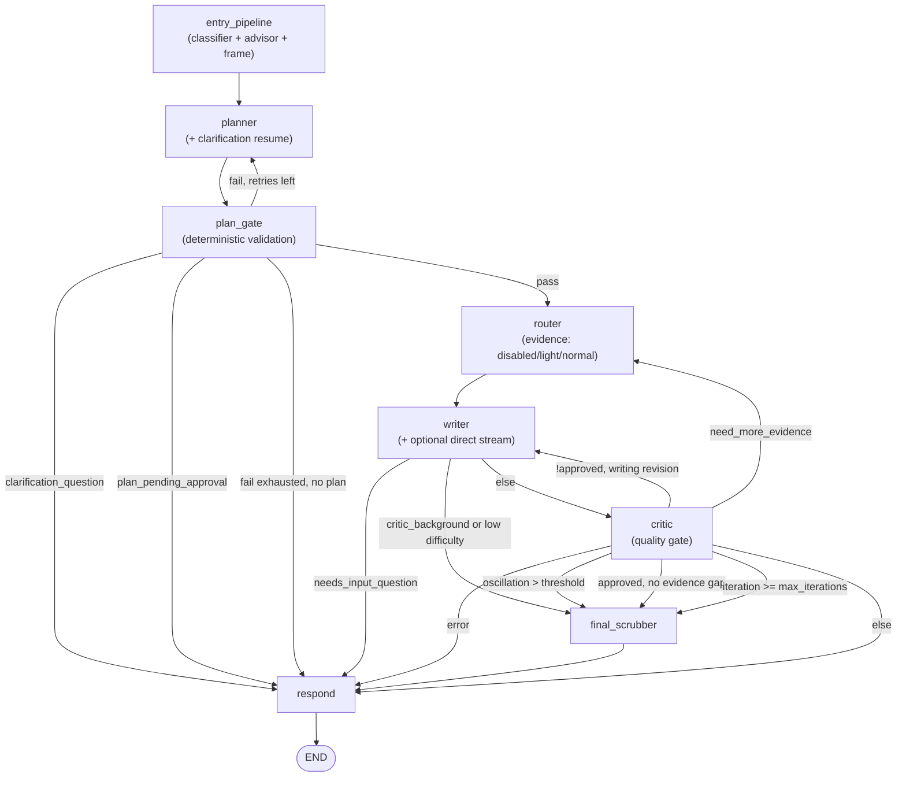

# Synesis Workflow

This document describes the LangGraph orchestration flow, routing logic, and key design invariants.

## Overview

The compiled LangGraph has **eight nodes**: `entry_pipeline`, `planner`,
`plan_gate`, `router`, `writer`, `critic`, `final_scrubber`, and `respond`.
The **entry_pipeline** node runs the Entry Classifier (deterministic scoring),
Strategic Advisor, and Frame Extractor concurrently (plus optional GLiNER /
LLM repair) — they are not separate graph vertices.

Every request follows the same canonical path through those nodes — the
Planner scales plan depth based on difficulty and deliverable count, ensuring
consistent observability and feedback loops across all prompts.

The **Router is the single retrieval orchestrator**. No other node
touches retrieval backends (RAG, web search, unified retrieval).
All evidence flows through structured **Evidence Packets** — downstream
agents (Planner, Writer, Critic) consume evidence but never
retrieve it directly.

**Two Front Doors:**

- **Planner front door** (this pipeline): Owns reasoning, RAG
  synthesis, architecture guidance, and markdown answers — including
  code snippets in fenced blocks.
- **Coder front door** (Qwen Coder via LiteLLM): Owns file edits,
  patches, and execution loops for IDE coding agents (Cursor, Claude
  Code). Accessed directly through LiteLLM, not through the planner
  pipeline.

The planner can still emit fenced code blocks in its markdown responses.
It does **not** orchestrate code execution, sandbox runs, or patch-apply
workflows — those belong to the coder front door.

## Prompt layering, taxonomy, and regulated domains

LLM instructions are composed in **three layers** (full rationale: [PROMPT_EPISTEMOLOGY.md](PROMPT_EPISTEMOLOGY.md)):

| Layer | What it is | Who controls it |
|-------|------------|-----------------|
| **L0** | Universal trust, joint-cognitive safety, and epistemic principles (calibration, scope, evidence vs inference). Includes a **thin non-bypassable floor** for high-stakes advice (e.g. no personalized medical/legal directives). | Code — not overridable from chat or from taxonomy YAML alone |
| **L1** | Node contracts: planner JSON shape, critic scoring JSON, router retrieval sub-prompts, writer markdown mechanics. | Code |
| **L2** | Taxonomy depth, output style, discipline framing, **regulated-industry overlays** (medical, legal, fintech, …), intent/vertical plugins. | Admin / deploy-time (`taxonomy_prompt_config.yaml`, DB `taxonomy_domains`, plugins) — **not** chosen by end-user prompt text |

**Escape prevention:** `taxonomy_metadata` is assigned by the **entry classifier + taxonomy resolver**, not by the user declaring a domain. Users cannot turn off a regulated overlay by asking; injection of “ignore taxonomy” is already constrained by the trust policy on untrusted context.

**Critic vs taxonomy:** The critic loads **L0 → L1** first; taxonomy and intent blocks **append** as L2. Taxonomy **expands** the rubric for matched domains; it does **not** replace universal trust or epistemics. Vertical configs (`critic_mode`, `critic_tiers`) continue to tune strictness per industry.

**Adding new verticals:** Prefer new taxonomy keys / DB rows / plugin entries with optional fields such as `regulated_domain`, `epistemic_guidance`, and regulated writer/critic overlay strings (see [PROMPT_EPISTEMOLOGY.md](PROMPT_EPISTEMOLOGY.md)) rather than hardcoding industry rules in `critic.py` / `writer.py`.

## Models

| Role | Model | Hardware | Notes |
|------|-------|----------|-------|
| Router / Planner | Qwen3-8B FP8 | GPU 0 (L40S) | Fast routing, query generation, plan decomposition |
| General (Executor / Writer) | Qwen3-32B FP8 | GPU 1 (L40S) | Code generation, knowledge synthesis |
| Coder | Qwen3-Coder-30B-A3B FP8 | GPU 2 (L40S) | Dedicated code generation for IDE clients (direct vLLM) |
| Critic | DeepSeek R1-Distill-32B FP8 | GPU (L40S) | Quality review with configurable thinking budget |
| Summarizer | Qwen2.5-0.5B-Instruct | CPU | Pivot history summarization |
| Embedder | all-MiniLM-L6-v2 | CPU | RAG embedding + semantic index |

**Config mapping:**

| Config field | Env var | Used by |
|---|---|---|
| `router_model_url` | `SYNESIS_ROUTER_MODEL_URL` | Router (query generation, summarization, refinement), Planner |
| `general_model_url` | `SYNESIS_GENERAL_MODEL_URL` | Writer |
| `critic_model_url` | `SYNESIS_CRITIC_MODEL_URL` | Critic |

## Graph Flow

All requests enter through the same pipeline and follow one canonical path.
The Planner scales its depth based on difficulty — trivial prompts get a
lightweight 1-step plan, hard prompts get full multi-step decomposition.


```mermaid
flowchart TD
    EP["entry_pipeline\n(classifier + advisor + frame)"] --> PL["planner\n(+ clarification resume)"]
    PL --> PG["plan_gate\n(deterministic validation)"]
    PG -->|"fail, retries left"| PL
    PG -->|"clarification_question"| RS["respond"]
    PG -->|"plan_pending_approval"| RS
    PG -->|"fail exhausted, no plan"| RS
    PG -->|pass| RT["router\n(evidence: disabled/light/normal)"]
    RT --> WR["writer\n(+ optional direct stream)"]
    WR -->|"needs_input_question"| RS
    WR -->|"critic_background or low difficulty"| FS["final_scrubber"]
    WR -->|else| CR["critic\n(quality gate)"]
    CR -->|error| RS
    CR -->|"oscillation > threshold"| FS
    CR -->|"approved, no evidence gap"| FS
    CR -->|"iteration >= max_iterations"| FS
    CR -->|"need_more_evidence"| RT
    CR -->|"!approved, writing revision"| WR
    CR -->|else| RS
    FS --> RS
    RS --> endNode([END])
```

**Clarification / approval (next HTTP request):** When the user answers a
planner clarification or approves a plan, conversation memory restores
pending context (`execution_plan`, `task_frame`, etc.). Routing sends
`planner_clarification` resumes to **planner** (skipping router on that hop);
other pending continuations may go to **router**. See
[CONVERSATION_MEMORY.md](CONVERSATION_MEMORY.md) and
[PLANNER_PREFIX_KV_CACHE.md](PLANNER_PREFIX_KV_CACHE.md).

### Difficulty-Based Scaling

The entry classifier sets `rag_mode` based on the continuous difficulty
score. This controls retrieval depth within the router — the pipeline
path itself is always the same:

| Difficulty | rag_mode | Planner Depth | Router Behavior | Critic |
|---|---|---|---|---|
| < 0.15 (trivial) | `disabled` | Lightweight (1 step) | No retrieval | Skipped |
| 0.15-0.29 (easy) | `disabled` | Brief outline | No retrieval | Skipped |
| 0.3-0.69 (medium) | `light` | Structured outline | 1 query, 3 docs | Lenient |
| >= 0.7 (hard) | `normal` | Full plan, section evidence | Multi-query, HyDE, 8 docs | Full |

Step count is driven by the number of deliverables extracted from the
user's prompt, not capped by difficulty. A hard task with 3 deliverables
gets 3-4 sections; an easy task with 12 deliverables gets 6-12 sections.
Difficulty controls section *depth* and retrieval intensity, not section count.

**Key behaviors by rag_mode:**

- **`disabled`**: Router returns immediately with empty evidence packets.
  No retrieval, no LLM calls for query generation. Writer answers
  from parametric knowledge only.
- **`light`**: Router issues a single evidence request (main question
  only, no per-deliverable fan-out). No HyDE or conceptual expansion
  variants. Doc cap reduced to 3. No refinement rounds.
- **`normal`**: Full multi-query retrieval (direct + HyDE + conceptual
  expansion), per-deliverable evidence requests, up to 2 refinement
  rounds, section-level evidence gathering.

### Streaming Behavior

During SSE streaming, the router and planner emit rich status messages describing
what was searched and planned (e.g., "Searched: Kubernetes deployment strategies (2 web + 3 docs)",
"Plan ready: 5 sections").

**Background critic mode** (`SYNESIS_CRITIC_BACKGROUND=true`): The SSE stream closes
immediately after the writer finishes streaming content. The graph continues
running the critic, scrubber, and respond nodes silently. When disabled (default),
the critic runs inline and the user waits for it to complete before the stream closes.

### Critic Optimization

The document-path critic has several optimizations to reduce latency:

- **Deterministic pre-check**: For lenient-difficulty tasks, skips the LLM critic entirely if all deliverables have headings and word count is proportional
- **Skeleton mode**: Sends headings + first 200 chars per section instead of the full response text
- **Lenient strip**: Omits CRAG assessment, failure mode vocabulary, and scoring rubric for low-difficulty tasks
- **Unified rubric**: Frame rubric and decision ledger merged into one block

## Router-Governed Evidence Architecture

The Router is a **LangGraph node** (deterministic orchestrator), not an LLM persona.
It invokes LLMs for specific sub-tasks but owns all system-level logic.

The Router respects the `rag_mode` state signal set by the Entry Classifier:

| rag_mode | Behavior |
|---|---|
| `disabled` | Immediate return with empty evidence. Zero LLM calls, zero retrieval. |
| `light` | Single evidence request (main question only). Direct query only (no HyDE, no expansion). Doc cap = 3. No refinement rounds. |
| `normal` | Full pipeline: multi-query expansion, per-deliverable fan-out, up to 2 refinement rounds. |

```
Router Node
├── [rag_mode check]           → short-circuit if disabled; light-mode constraints if light
├── batch_generate_queries()   → single LLM call generates queries for ALL evidence requests
├── generate_query_variants()  → HyDE + conceptual expansion on top of batch base query [normal only]
├── _multi_query_retrieve()    → parallel retrieval for all variants, RRF merge
├── retrieve()                 → RAG / web search backends (with preferred_web_scopes)
├── summarize()                → LLM call (summarization prompt, guided JSON)
├── refine_query()             → LLM call (refinement prompt) [normal only]
├── dedupe()                   → deterministic deduplication
├── parallel_dispatch()        → asyncio.gather for independent requests (uses batch base queries)
└── produce evidence packet    → deterministic assembly
```

### Multi-Query Expansion

Each evidence request produces up to 3 query variants (configurable via `router_multi_query_enabled`):

| Variant | Purpose | Example |
|---------|---------|---------|
| **Direct** | Balanced recall/precision reformulation of the evidence request | "internal coding assistant architecture RAG retrieval design" |
| **HyDE** | Hypothetical document embedding — generates a 2-3 sentence answer, embeds it for vector search | "An internal coding assistant retrieves company documentation using vector embeddings..." |
| **Conceptual expansion** | Expands with taxonomy hints, synonyms, and frame technologies | "coding assistant ADR architecture decision record system design microservices..." |

All variants are retrieved in parallel. Results are merged via **Reciprocal Rank Fusion** before summarization. This dramatically improves recall on domain-specific documents (ADRs, RFCs, design proposals) that use different vocabulary than the user query.

**Taxonomy-driven enrichment**: When a domain has `query_expansion_hints` in `taxonomy_prompt_config.yaml`, those terms are injected into the conceptual expansion variant. When `preferred_web_scopes` are defined (e.g. `site:martinfowler.com`), they're appended to web search queries. Frame-extracted `technologies` are also injected into the expansion variant.

### Multi-Source Federation

Web search is not a single monolithic call. The router fans out queries across multiple **search sources** defined in `search_sources.yaml` in parallel via `asyncio.gather`. Source selection is driven by three mechanisms:

1. **Always-on** sources (e.g. `web_general`) included in every fan-out
2. **Taxonomy-driven** sources activated when domain tags or task types match (e.g. `code_general` for programming domains)
3. **Prompt-driven** sources activated by explicit user keywords (e.g. "include jira", "search github")

Each source maps to SearXNG engine parameters and carries trust metadata (`authority`, `origin_type`) and a `weight` multiplier for RRF fusion. Internal sources can be weighted higher than external web results. Results are tagged with `source_id` end-to-end for provenance — visible in evidence packets, context blocks, and user-facing citations.

See [Web Search & Multi-Source Federation](WEB_SEARCH.md) for the full catalog schema and configuration.

### Retrieval Discipline

Only the Router may perform retrieval (RAG or web search). Rules:

1. Retrieval balances recall and precision — queries include related concepts and synonyms
2. Results are summarized into Evidence Packets before passing downstream
3. Planner may *request* evidence but cannot retrieve it
4. Critic may *flag* insufficient evidence but cannot retrieve it
5. Executor and Writer may *consume* evidence but cannot retrieve it
6. Retrieval is bounded: `MAX_DOCS_PER_QUERY=5`, `MAX_SNIPPETS_PER_PACKET=20`, `MAX_SUMMARY_TOKENS=2000` per packet
7. Low-confidence packets (`<0.4`) include retrieval notes and trigger refinement

### Router Mode Detection

The Router detects its mode from state:

| Mode | Trigger | Behavior |
|------|---------|----------|
| `initial` | No `execution_plan` and no `evidence_requests` | Build initial evidence from user task |
| `section_evidence` | `evidence_requests` present from Planner | Retrieve evidence for specific plan sections |
| `refinement` | `need_more_evidence` from Critic | Refine queries and re-retrieve |

### Confidence-Gated Refinement

When an evidence packet scores below `LOW_CONFIDENCE_THRESHOLD` (0.4),
the Router automatically:
1. Calls `refine_query()` to generate a more specific query
2. Re-retrieves with the refined query
3. Re-summarizes into a new evidence packet
4. Repeats up to `MAX_REFINEMENT_ROUNDS` (2)

### Evidence Packets

All evidence flows as structured packets between nodes:

```json
{
  "query": "string",
  "sources": [
    {
      "uri": "string",
      "type": "doc | code | wiki | web | repo | api",
      "metadata": { "path": "string", "timestamp": "string", "tags": ["string"] }
    }
  ],
  "snippets": [
    { "text": "string", "relevance": 0.0, "source_uri": "string" }
  ],
  "summary": "string",
  "confidence": 0.0,
  "retrieval_notes": "string",
  "section_id": "int | null"
}
```

Evidence packets are stored in `state["evidence_packets"]` with a
`_merge_evidence_packets` reducer that deduplicates by `(query, section_id)` —
refinement loops update rather than accumulate stale evidence.

### Hybrid Retrieval Cache

The Router includes a two-layer cache to prevent redundant retrieval
("RAG blasting") during back-and-forth between Router and Critic:

**Layer 1 — Exact match:** Dictionary keyed by normalized query string.

**Layer 2 — Semantic match:** `NumpySemanticIndex` stores query
embeddings mapped to evidence packets. New queries check semantic
similarity before hitting retrieval backends.

**Cache rules:**
- TTL: 24 hours (configurable via `retrieval_cache_ttl`)
- Eviction: LRU + TTL
- Semantic similarity threshold: 0.85
- Evidence confidence threshold: 0.6
- Structured query bypass: file paths, K8s objects, Terraform identifiers,
  service names, and error messages skip semantic lookup (regex detection)
- Cache entries store summarized evidence packets, not raw retrieval
- Critic-driven invalidation: when the anti-oscillation detector finds
  repeated complaints for the same `section_id`, that cache entry is
  purged via `cache.invalidate_by_section()`

**Backend:** `NumpySemanticIndex` (default, zero external deps). Pluggable
for FAISS or Milvus via the `SemanticIndex` protocol.

## Classification System

The Entry Classifier is **deterministic** (no LLM). It uses the
YAML-driven `ScoringEngine` with split axes:

| Axis | Purpose | Source |
|------|---------|--------|
| `complexity_score` | Steps, scope, uncertainty | `intent_weights.yaml` + plugin YAMLs |
| `risk_score` | Destructive ops, secrets, compliance | `intent_weights.yaml` + plugin YAMLs |
| `difficulty` | Normalized 0.0-1.0 | `complexity_score / (medium_max * 2)` |
| `task_size` | `easy` / `medium` / `hard` | Derived from complexity + risk |
| `is_code_task` | `true` (code) / `false` (text, default) | Semantic intent classifier (embedding similarity) |
| `intent_class` | `code_generation`, `knowledge`, `conversation`, etc. | Keyword matching against `intent_classes` |

**Text-first classification**: The system defaults to
`is_code_task=false` and `intent_class="general"`. Code is the
minority class with high-salience features (language names, action
verbs like "implement"/"debug"/"refactor"). The ScoringEngine
detects code via 7 explicit `code_intents` classes; everything
else stays on the text path. This follows One-Class Classification
theory — define the minority class (code), default to majority
(text). See the plan document for research references (Bayesian
Decision Theory, Feature Salience Asymmetry, OCC).

**Code detection layers:**
1. **ScoringEngine intent**: Primary. 7 code intent classes with
   word-boundary keyword matching.
2. **Semantic intent classifier**: Embedding-based code/knowledge
   disambiguation via cosine similarity against route embeddings.
   The classifier embeds the user query with `all-MiniLM-L6-v2`
   and compares against pre-computed mean embeddings for CODE_OUTPUT
   and KNOWLEDGE_DISCUSSION utterance routes.
3. **Inherently-document safety net**: Intent classes with
   `inherently_document: true` always classify as knowledge.
4. **Coding client bias**: IDE contexts (Cursor, Claude Code) with
   `general` intent assume code.

**Token budget:** Continuous difficulty curve, not bucketed.
`budget = 512 + (4096 - 512) * difficulty^1.5`. Social
acknowledgements get 256 tokens.

**Routing thresholds** (YAML-driven):
- `plan_required_above: 0.7` — hard tasks get Planner
- `critic_required_above: 0.6` — triggers full Critic review
- `critic_skip_below_difficulty` — trivial tasks skip Critic

## Routing Logic

### After Entry Pipeline

| Condition | Next Node |
|-----------|-----------|
| `pending_question_continue` and `pending_question_source == "planner_clarification"` | `planner` |
| `pending_question_continue` (other sources, e.g. needs_input / router) | `router` |
| `message_origin == "ui_helper"` | `respond` |
| else (all requests) | `planner` |

### Planner → Plan Gate (unconditional)

### After Plan Gate

| Condition | Next Node |
|-----------|-----------|
| gate failed, retries left | `planner` (with repair feedback) |
| `clarification_question` | `respond` |
| `plan_pending_approval` | `respond` |
| gate failed, no retries, no plan | `respond` |
| else | `router` |

### After Router

| Condition | Next Node |
|-----------|-----------|
| `error` | `respond` |
| `next_node == "writer"` | `writer` |
| `next_node == "planner"` | `planner` |
| default | `planner` |

### After Writer

| Condition | Next Node |
|-----------|-----------|
| `critic_background` enabled | `final_scrubber` |
| `difficulty < critic_skip_below_difficulty` | `final_scrubber` |
| else | `critic` |

### After Critic

| Condition | Next Node |
|-----------|-----------|
| `error` | `respond` |
| oscillation score > threshold | `final_scrubber` (force-terminate with best draft) |
| `critic_approved` and `!need_more_evidence` | `final_scrubber` |
| `iteration >= max_iterations` | `final_scrubber` |
| `need_more_evidence` | `router` (targeted re-retrieval for evidence gaps) |
| `!approved` and `should_continue` | `writer` (direct revision for writing-quality issues) |
| else | `respond` |

**Critic routing split**: Writing-quality rejections (style, depth, consistency) go directly to the writer — bypassing the router avoids redundant re-retrieval when the evidence is already sufficient. Evidence-gap rejections (missing sources, thin coverage) go to the router for targeted re-retrieval via `evidence_requests`.

## Key Invariants

1. **Router owns all retrieval**: Only the Router touches RAG, web
   search, or unified retrieval. Downstream nodes consume evidence
   packets. This prevents retrieval dilution and ensures discipline.
2. **Evidence Packets are the data contract**: All inter-node evidence
   flows as structured packets with query, sources, snippets, summary,
   confidence, and retrieval notes. No raw retrieval results leak downstream.
3. **Taxonomy-Driven Everything**: Entry Classifier outputs
   `intent_class`, `active_domain_refs`,
   `taxonomy_metadata`, `difficulty`, and YAML-driven
   `routing_thresholds`. 190 taxonomy entries define persona,
   depth, output style, epistemic guidance, and planner rules.
   All raw YAML fields are forwarded via `dict(node_cfg)` overlay
   in `resolve_taxonomy_metadata()` — new fields added to YAML are
   automatically available downstream. Taxonomy config is compiled
   at startup with Pydantic schema validation.
4. **Single Planner Prompt**: The knowledge planner prompt creates
   section outlines driven by the user's deliverables. Step count
   scales with deliverable count; difficulty controls depth per section.
5. **Plan Gate Validation**: After the Planner, a deterministic
   Plan Gate validates schema, section presence, and hallucination
   guardrails before evidence retrieval. Failed gates route back
   to the Planner with specific repair feedback.
6. **Evidence-Gated Critic**: `approved=false` requires
   `blocking_issue` with valid `evidence_refs`. The Critic validates
   against evidence packets and flags unsupported claims. Missing
   evidence triggers `need_more_evidence` → Router re-retrieval.
7. **Unified Markdown Output**: The Writer produces markdown.
   No JSON wrapper. Code is in fenced blocks.
8. **Monotonic Retry** (`state.retry`): Failures, decisions,
   diversification_history only append. At `max_iterations`, force
   PASS (degraded).
9. **Continuous Token Budgets**: Difficulty-based curve (not
   bucketed). Social acknowledgements get minimal budget (256
   tokens). Thinking budgets scale with `task_size`.
10. **Immutable Frame**: `SemanticFrame` is set-once via `_set_once_dict`
    reducer. No downstream node can overwrite the frame after
    `frame_extractor` sets it.
11. **Decision Ledger**: The Writer consumes structured
    `DecisionEntry` objects from the planner (append-only ledger),
    not raw planner prose. Critic validates draft against ledger.
12. **Hybrid Cache Stability**: The retrieval cache prevents
    evidence oscillation. Critic-driven invalidation purges bad
    entries; semantic matching prevents redundant retrieval for
    similar queries.

## Anti-Oscillation Framework

Prevents style drift, grounding loss, and decision oscillation across nodes
while preserving flexibility for justified overrides. Controls are deterministic
(pure functions), not prompt-based.

### Entry Pipeline Internals

The `entry_pipeline` node runs classifier, strategic advisor, and frame extractor concurrently. For complex prompts where GLiNER's first pass misses critical fields (e.g. `main_question`), a second-pass LLM repair call runs via `ChatOpenAI(streaming=True)`. The streaming flag ensures that LangChain emits `on_chat_model_stream` events during the LLM call, keeping the SSE event iterator active. This prevents the heartbeat poll from seeing a silent window and allows the pipeline to complete normally.

**Clarification resume** still executes the full entry pipeline before the planner; the draft plan is reused inside the planner (see `docs/PLANNER_PREFIX_KV_CACHE.md`). Inference-side **prefix / KV cache** on static system prompts is the preferred way to keep repeat turns cheap and fast before considering skip-entry optimizations—validate cached-prefill metrics and billing in your deployment.

### Immutable Frame Lifecycle

`SemanticFrame` is extracted by `frame_extractor` and written to state via the
`_set_once_dict` reducer. Once set, no downstream node can overwrite it. All
nodes (planner, writer, critic) read the same immutable frame.

### Decision Ledger

The planner emits structured `DecisionEntry` objects (append-only via
`_append_only_ledger` reducer). Each entry records what was chosen, what was
rejected, and why. The writer consumes the ledger directly
instead of raw planner prose. The critic validates the draft against ledger
entries and flags contradictions.

```
frame_extractor → semantic_frame (set-once)
planner → decision_ledger (append-only) + style_contract_locked (set-once)
writer ← reads decision_ledger + style_contract_locked
critic ← validates draft against decision_ledger + style_contract_locked
```

### Style Contract

Locked at planning time by `_derive_style_contract()`, derived from the
semantic frame and difficulty. Contains `verbosity_target`, `direct_answer_first`,
`citation_required`, and `max_section_paragraphs`. Executor and Writer
are bound to this contract; deviations are flagged by `validate_style_compliance`.

### Critique Register

Tracks critique items by `item_id` with forward-only status transitions
(`open` → `resolved` → `settled`) via the `_merge_critique_register` reducer.
Reopening a settled item requires new `evidence_ref` and increments
`reopen_count`. This prevents the critic from endlessly reopening decisions.

### Retrieval Churn Detection

The anti-oscillation scorer tracks retrieval churn by monitoring
`critique_register` entries where the critic repeatedly flags evidence
issues for the same `section_id`. When a section accumulates 2+ complaints,
the hybrid retrieval cache entry for that section is invalidated via
`cache.invalidate_by_section()`, preventing "bad evidence sneaking back in."

### Override Flow

Changing a frozen decision requires an explicit `OverrideRequest`:

1. Node emits `OverrideRequest` with `target_decision_id`, `override_reason`, and `override_scope`
2. Narrow scope (`this_section`) with substantive reason → auto-approved, logged to `override_log`
3. Broad scope (`all_sections`, `permanent`) → requires critic confirmation
4. All overrides are append-only in `override_log` (audit trail)

### Oscillation Detection

A deterministic scorer (no LLM calls) runs after the critic in `route_after_critic`.
Scores six dimensions:

| Dimension | Weight | What it detects |
|-----------|--------|-----------------|
| Style | 0.20 | Draft verbosity contradicts `style_contract_locked` |
| Decision | 0.25 | Same `decision_id` overridden 2+ times in `override_log` |
| Retrieval | 0.10 | Repeated critic complaints for same section triggering cache invalidation |
| Section churn | 0.20 | Many fingerprint changes without corresponding critique items |
| Unsupported overrides | 0.05 | `override_log` entries without approval or reason |
| Content drift | 0.20 | Duplicate H1 headings (concatenation symptom), unguided rewrites, and repair instruction oscillation (same section targeted with different fixes across iterations) |

When `total_score > oscillation_threshold` (default 0.7), the retry loop
force-terminates with the best available draft.

### Monotonic Revision Rules

Enforced by deterministic validators wrapped around nodes via `validated_node()`:

| Rule | Validator |
|------|-----------|
| No section removal | `validate_required_sections` |
| No decision change without override | `validate_decision_drift` |
| No style drift | `validate_style_compliance` |
| No citation drop | `validate_citation_preservation` |
| Open critiques must be resolved | `validate_critique_resolutions` |
| Role-source alignment | `validate_role_source_match` |

### Validator Integration

Validators are wired as pre/post checks via the `validated_node()` wrapper in
`graph.py`, not as separate graph nodes:

- **Critic**: post=[`validate_critique_resolutions`]

Pre-violations are injected into the node's context as warnings. Post-violations
are written to `critique_register` as open items for the next iteration.

## Frame extraction, domain profile, and clarification (sensemaking)

Ambiguity and “what stack are we talking about?” are handled **after frame extraction**, using a **domain profile** and **frame coherence** — not via the retired “intent anchors” env/API (`SYNESIS_ANCHOR_*` does not exist). Overview:

1. **Frame extractor** produces a structured **semantic frame** (technologies, deliverables, constraints, hints).
2. **Frame normalizer** builds a **`DomainProfile`**: weighted domains + **`frame_coherence`** = `focused` | `composite` | `diffuse` (see `schemas.py`, `frame_normalizer.py`).
3. **Focused** — one domain clearly dominates; the router may **pre-seed a cohesion lock** from YAML **conflict groups** (`cohesion_groups.yaml` / `get_conflict_groups()` in `cohesion.py`) so retrieval does not fan out across mutually exclusive vendors for a single-target question.
4. **Composite** — multiple domains are genuinely in play; **broad, diversified retrieval**; **no** early vendor lock.
5. **Diffuse** — the frame is unclear (**Cynefin complex**); the planner can run a **guided clarification / probe** (Phase 2a in `planner_node.py`) so the system **asks** instead of assuming.

**Topic frame** (what to search for) is built separately from raw technology keywords so evidence follows **user intent**, not only tool names — see [SENSEMAKING_REFERENCES.md](SENSEMAKING_REFERENCES.md).

**Historical / naming:** Older docs referred to “intent anchors” as a separate tiered resolver. That implementation was removed; the **goals** (avoid silent wrong assumptions, reduce mixed-evidence thrash) live in the sensemaking path above. [INTENT_ANCHORS.md](INTENT_ANCHORS.md) is a short **redirect and “what not to configure”** note, not a live config guide.

## Cohesion Lock Engine

Reduces mixed-topic answers (e.g., blending unrelated cloud platforms in one focused architecture reply). The lock can appear **before** or **after** retrieval depending on whether the **domain profile** supplied a **pre-seeded** lock.

### How it works (current)

1. **Domain-profile pre-seeding (focused frames only)** — In `router.py`, when `frame_coherence == "focused"` and the dominant domain weight is high enough, the router builds a **`CohesionLock`** from **conflict groups** and attaches **`_preseeded_lock`** to evidence requests. On consolidated retrieve paths, **`cohesion_filter`** may run **before** packet synthesis, dropping off-topic hits early.
2. **Post-retrieval lock** — When no pre-seeded lock is in play, **Phase 5b-style** detection can still infer a dominant entity from retrieved documents (metadata / LLM fallback), then filter and compress as before.
3. **Micro-critique** — Evaluates documents against the active lock; non-matching docs are filtered.
4. **Contextual compression** — Strips off-topic sentences from survivors.
5. **LongContextReorder** — Places lock-matching material where attention is strongest.

**Composite** and **diffuse** profiles deliberately **avoid** aggressive pre-seeding so the system does not invent a single vendor when the user’s prompt is multi-domain or underspecified.

### State fields

| Field | Type | Purpose |
|-------|------|---------|
| `cohesion_lock` | `dict` / `CohesionLock` | Dominant entity + lock metadata |
| `cohesion_filtered_docs` | `list[Document]` | Documents passing micro-critique |
| `domain_profile` | `DomainProfile` (in task frame) | Weights + `frame_coherence`; drives pre-seed behavior |

### Impact

For a **clear, single-domain** question, evidence stays on one coherent topic. For **composite** prompts, multiple domains remain in play. For **diffuse** prompts, **clarification** is preferred over guessing — see [DESIGN_THEORY.md](DESIGN_THEORY.md) and [SENSEMAKING_REFERENCES.md](SENSEMAKING_REFERENCES.md).

## Query Normalization Pipeline

Deterministic typo correction and preprocessing that runs before the
Entry Classifier's ScoringEngine. No LLM calls, no network — stdlib
only (~1-5ms on the hot path).

### Pipeline Stages

1. **Preprocessing**: Normalize whitespace, Unicode punctuation, zero-width
   characters. Preserve case-sensitive/code-like spans.
2. **Tokenization**: Split input into word tokens. Mark tokens adjacent to
   path separators (`/`, `\`) as path-protected.
3. **Protected token detection**: Tokens matching structural patterns are
   never corrected: camelCase, snake_case, kebab-case, URLs, emails,
   file paths, version numbers, CLI flags, ALL_CAPS constants, dunder names.
4. **Suspicious flagging**: Remaining tokens are flagged only if a specific
   heuristic fires: repeated characters (`ruuuning`), keyboard transposition
   match, or high-similarity close match (≥0.85) to a domain lexicon term.
   Morphological variants (plurals, gerunds) of known words are not flagged.
5. **Candidate generation**: For each suspicious token, generate corrections
   via edit-distance matching, transposition swaps, and repeated-char
   deduplication against the compiled domain lexicon.
6. **Scoring**: Score candidates using edit distance ratio + domain vocabulary
   prior - ambiguity penalty. Accept only when score ≥ confidence threshold.

### Domain Lexicon

Compiled once at startup from existing configs:
- `intent_weights.yaml` `domain_keywords`
- `taxonomy_prompt_config.yaml` `query_expansion_hints`
- Common English vocabulary (~1500 words)

Multi-word phrases are split into individual tokens for token-level matching.

### State

| Field | Type | Set by | Consumed by |
|-------|------|--------|-------------|
| `query_normalization` | `dict` | Entry Classifier | Router, observability |
| `query_normalization.original_query` | `str` | Entry Classifier | Router (RRF variant) |
| `query_normalization.selected_query` | `str` | Entry Classifier | ScoringEngine input |
| `query_normalization.changed_tokens` | `tuple[str]` | Entry Classifier | Logging |
| `query_normalization.protected_tokens` | `tuple[str]` | Entry Classifier | Logging |

### Retrieval-Aware Validation

When correction happens and `search_both=true` (default), the Router
adds the original (uncorrected) query as an additional retrieval variant.
RRF merge ensures the best results from both are used — if the original
query retrieves better, its results dominate.

### Config

| Setting | Env var | Default | Purpose |
|---------|---------|---------|---------|
| `query_normalizer_enabled` | `SYNESIS_QUERY_NORMALIZER_ENABLED` | `true` | Enable/disable |
| `query_normalizer_max_corrected_tokens` | `SYNESIS_QUERY_NORMALIZER_MAX_CORRECTED_TOKENS` | `3` | Max tokens to correct |
| `query_normalizer_edit_distance_cutoff` | `SYNESIS_QUERY_NORMALIZER_EDIT_DISTANCE_CUTOFF` | `0.7` | Candidate generation threshold |
| `query_normalizer_confidence_threshold` | `SYNESIS_QUERY_NORMALIZER_CONFIDENCE_THRESHOLD` | `0.6` | Min score to accept correction |
| `query_normalizer_search_both` | `SYNESIS_QUERY_NORMALIZER_SEARCH_BOTH` | `true` | Search original + corrected via RRF |

Additional protected patterns and jargon terms are configurable via
`query_normalizer_config.yaml`.

## Adaptive Rigor

Rigor scales with the continuous `difficulty` score. The pipeline path
is always the same; difficulty controls depth within each node.

| Difficulty | Retrieval | Planner Depth | Critic Mode | Path Cost |
|---|---|---|---|---|
| < 0.15 (trivial) | None | Lightweight (1 step) | Skipped | ~2 LLM calls |
| 0.15-0.29 (easy) | None | Brief outline | Skipped | ~2 LLM calls |
| 0.3-0.39 (medium-low) | Light (1 query, 3 docs) | Structured outline | Lenient rubber-stamp | ~3-4 LLM calls |
| 0.4-0.69 (medium) | Light (1 query, 3 docs) | Structured outline | Lenient rubber-stamp | ~4-5 LLM calls |
| >= 0.7 (hard) | Full (multi-query, HyDE, 8 docs, refinement) | Full plan + section evidence | Full critic with scoring rubric | ~8-12 LLM calls |

- **Trivial/Easy** (diff < 0.3): Lightweight plan, no retrieval, critic
  skipped. Writer answers from parametric knowledge. Fastest path.
- **Medium** (diff 0.3-0.69): Light retrieval (single query, 3 docs).
  Planner produces structured outline. Critic runs in lenient mode.
- **Hard** (diff >= 0.7): Full multi-query retrieval with HyDE and
  conceptual expansion, Planner multi-step decomposition with
  section-level evidence gathering, full critic with scoring rubric.
- **Background critic mode** (`critic_background=true`): When enabled,
  the SSE stream closes after the Writer finishes. The critic runs
  silently in the background.
- **Vertical Persona Injection**: Taxonomy plugins inject
  domain-specific Planner decomposition rules and Critic mode overrides.

## Critic: Universal Principles + Dynamic Rubric

The critic uses a **two-part evaluation** architecture inspired by G-Eval
(NeurIPS 2023) and RRD (arxiv 2602.05125). Instead of hardcoded domain-specific
layers, the critic applies 5 universal principles and generates a per-query
dynamic rubric using taxonomy metadata as hints.

### Part A: Universal Quality Principles (always applied)

| # | Principle | Catches |
|---|-----------|---------|
| 1 | Does the response answer the main question directly and early? | `buried_lead`, `non_answer` |
| 2 | Does it address each stated requirement? | `partial_answer`, `format_miss` |
| 3 | Is every specific claim either evidenced or labeled as an assumption? | `false_precision`, `unsupported_claim` |
| 4 | Is the scope proportional to stated constraints? | `architecture_theater`, over-engineering |
| 5 | Could someone act on this answer as written? | `non_actionable_answer`, `leaked_reasoning` |

### Part B: Dynamic Rubric (generated per-query)

Instead of hardcoded domain checks, the critic generates 3-5 evaluation
criteria for THIS specific query using:
- The user task and stated requirements
- Taxonomy hints (domain, complexity, typical elements, depth guidance)
- **Evidence packets** from the Router (confidence, sources, coverage)

The critic scores each generated criterion 1-10.

### Taxonomy-as-Hints Contract

Taxonomy metadata is provided to the critic as domain context. For
high-complexity domains (complexity >= 0.8), `required_elements` are
promoted to soft mandates — flagged as `insufficient_depth` if missing.
For lower complexity, they remain advisory hints.

```
taxonomy_prompt_config.yaml
  -> required_elements, depth_instructions, persona, epistemic_guidance
    -> passed to critic as "taxonomy_hints" dict
      -> complexity >= 0.8: required_elements are "Expected sections" (soft mandate)
      -> complexity < 0.8: required_elements are "Typical elements" (advisory)
      -> critic uses hints to GENERATE per-query evaluation criteria
        -> critic scores against GENERATED criteria
```

### Score-Based Approval

The critic produces weighted scores (0-10) across 6 dimensions:

| Dimension | Weight | Catches |
|-----------|--------|---------|
| `task_faithfulness` | 0.25 | Did the response answer what was asked? |
| `constraint_compliance` | 0.20 | Does it respect stated constraints (budget, timeline, team size)? |
| `coverage` | 0.25 | Are all deliverables and requirements addressed? |
| `judgment_quality` | 0.10 | Are recommendations concrete and justified? |
| `grounding` | 0.10 | Are claims supported by evidence or labeled as assumptions? |
| `evidence_utilization` | 0.10 | Does the response incorporate evidence packets rather than generating from general knowledge? |

Approval thresholds:
- `weighted_overall >= 7.0` and no critical failure modes → **approved**
- `weighted_overall >= 5.0` with repair instructions → **approved with suggestions**
- `weighted_overall < 5.0` or critical failure modes → **rejected**, route to Router for more evidence

**Depth gate**: For high-difficulty tasks (>= 0.7), ANY section flagged with `insufficient_depth` or `evidence_underuse` is blocking if the response is under 3000 characters. For difficulty >= 0.6, 2+ flagged sections is blocking.

**Deterministic evidence citation rate check**: Before LLM scoring, the critic computes what fraction of evidence packet URIs appear in the response. If < 30% at difficulty >= 0.6, an `evidence_underuse` failure mode is injected automatically.

Config: `critic_approval_threshold` (default 7.0), `critic_retry_threshold` (default 5.0).

### Evidence-Aware Feedback

When the critic rejects, it classifies repairs into two categories:

1. **Evidence gaps** (keywords: "evidence", "insufficient", "thin", "ungrounded"):
   Sets `need_more_evidence=true` and populates `evidence_requests` with
   descriptions of missing evidence. The Router picks these up for targeted
   re-retrieval.

2. **Writing quality** (depth, consistency, structure): Routes directly
   to the Writer with `repair_instructions` (prioritized action list) and
   `requirement_coverage` (gap analysis). The Writer consumes these in
   `_build_revision_context()` to produce targeted fixes without redundant
   re-retrieval.

Both paths increment `iteration_count` so the Writer always receives
revision context on subsequent passes.

## Streaming Architecture

All responses stream via SSE (`text/event-stream`) through the
OpenAI-compatible `/v1/chat/completions` endpoint.

| Path | Mechanism | Reasoning |
|------|-----------|-----------|
| Trivial / easy, no retrieval | Writer returns `direct_stream_request`; `main.py` streams via raw OpenAI SDK | Fast time-to-first-token; preserves `reasoning_content` when the model emits it |
| Full graph (default hard path) | LangGraph `astream_events` in `main.py`; writer streaming through the graph | Phase status, pipeline trace; final chunk carries usage / `finish_reason` (e.g. `length` if truncated) |

**Phase-based status**: Nodes are grouped into user-facing phases:

| Phase | Nodes | Description |
|-------|-------|-------------|
| **Planning...** | entry_classifier, strategic_advisor, frame_extractor, planner, plan_gate | Fast (~2s total) |
| **Researching...** | router | Evidence gathering, refinement |
| **Writing...** | writer, final_scrubber, respond | Knowledge synthesis, final assembly |
| **Reviewing...** | critic | Quality review |

Only phase transitions emit new status events. During long-running phases
(>5s), elapsed-time heartbeats update the status (e.g., "Researching... (15s)")
so the user knows the system hasn't stalled.

## Architecture Decision: Two Front Doors

**Decision**: The planner pipeline is the text/knowledge front door.
Code editing/execution is owned by the coder front door (Qwen Coder
via LiteLLM → IDE agents).

The planner still emits fenced code blocks in markdown responses but
does not orchestrate code execution, sandbox runs, or patch workflows.

**Canonical flow:**
```
Entry → Planner → PlanGate → Router → Writer → [Critic] → FinalScrubber → Respond
```

## Architecture Decision: Patch Integrity as MCP Service

Integrity check logic lives in `integrity_core.py` — a framework-agnostic
module with pure check functions. It is exposed as the `synesis_patch_integrity`
MCP tool for coder agents that need deterministic safety checks (secrets,
network, workspace boundaries, import integrity, AST syntax, dangerous commands).

**MCP contract:**

```
POST /mcp/tools/call
{
  "name": "synesis_patch_integrity",
  "arguments": {
    "code": "...",
    "language": "python",
    "patch_ops": [{"path": "...", "op": "modify", "text": "..."}],
    "files_touched": ["..."],
    "target_workspace": "/workspace",
    "commands": ["pytest"]
  }
}
→ {"passed": true/false, "failures": [{"category": "...", "evidence": "...", "remediation": "..."}]}
```

## Architecture Decision: Sandbox/LSP Decoupling

**Decision**: Sandbox and LSP are removed from the default graph
edges. They remain as tool-accessible resources for future
agent-based self-correction loops.

## Planner: Scaling and Performance

**The Planner runs on every request.** Section count is driven by the
number of deliverables from frame extraction; difficulty controls depth
per section and retrieval intensity:

| Difficulty | Section Depth | Evidence |
|---|---|---|
| < 0.15 (trivial) | Concise, brief | None |
| 0.15-0.29 (easy) | Clear, organized | None |
| 0.3-0.69 (medium) | Structured | Light (1 query, 3 docs) |
| >= 0.7 (hard) | Detailed, with tradeoff analysis | Full (multi-query, HyDE) |

A simple question gets 1 section regardless of difficulty. A request with
12 deliverables gets as many sections as needed for full coverage — the
planner is not capped. For dense plans (10+ sections), the planner notes
in its reasoning that this is a comprehensive topic.

This ensures every prompt gets taxonomy labeling, observability, and
feedback loop data — even trivial ones. The Plan Gate validates each
plan before evidence retrieval begins.

**Evidence requests:** When the Planner identifies evidence gaps or
`open_questions` in the plan, it populates `evidence_requests` in
state. The Router picks these up on the next pass and performs
targeted retrieval for each section.

**Taxonomy shaping:** Taxonomy plugin YAMLs and `taxonomy_prompt_config.yaml`
inject `planner_decomposition_rules` per domain. The `taxonomy_key` is used
as a fallback when the vertical name doesn't match the taxonomy key.

**Writer prompt injection:** The Writer injects taxonomy-driven blocks
into the system prompt, gated by difficulty to prevent scaffolding
overload on easy tasks:

| Block | Source field | Difficulty gate | Purpose |
|---|---|---|---|
| `DOMAIN DEPTH` | `depth_instructions` | complexity > 0.55 | Concrete depth guidance |
| `OUTPUT STYLE` | `output_style_guidance` | always | Format/structure hints |
| `DISCOVERY` | `discovery_prompt` | difficulty >= 0.4 | "Gotchas", "Challenge Yourself", etc. Scoped to the cohesion entity when a cohesion lock is active to prevent frame violations. |
| `EPISTEMIC DISCIPLINE` | `epistemic_guidance` | difficulty >= 0.5 | Facts/assumptions/recommendations |
| `DOMAIN COVERAGE CHECKLIST` | `required_elements` | difficulty >= 0.5 | Domain-mandated topics (secondary to the Document Outline). Ensures coverage without overriding the plan structure. |
| `SECTION DEPTH` | (hardcoded) | difficulty >= 0.7 | Paragraph depth enforcement. Adjusts to concise variant when `verbosity_target == "concise"` to avoid conflicting length signals. |
| `REVISION CONTEXT` | (built from state) | `iteration_count >= 1` | Injects reviewer feedback, prioritized repair actions, requirement gaps, settled decisions, and revision rules. Prevents stateless rewrites. |

Trivial/easy tasks (difficulty < 0.4) receive only the persona tone and
output style — no discovery prompts, no required section mandates, no
epistemic scaffolding. This keeps simple answers direct and concise.

**Evidence budget:** Compiled evidence is trimmed to `evidence_budget_chars`
(default 24,000) before injection into the Writer prompt. A safety guard
caps evidence at `(compiler_model_context * 4) - (writer_budget_max * 4) - 8000`
characters to ensure evidence never starves the output budget. With
`compiler_model_context=65536` (tuned for OpenRouter models like Qwen3-32B
at 128K and DeepSeek-R1 at 64K), this prevents token-budget fading while
making full use of available context.

**Performance levers:**
1. **Difficulty-based routing:** Trivial tasks skip the Router entirely
   (~1 LLM call). Easy tasks hit the Router but skip retrieval. Medium
   tasks get light retrieval (single query, 3 docs). Only hard tasks
   get the full multi-query + Planner pipeline.
2. **max_tokens:** 1024 for Planner/Critic vs 2048+ for Executor/Writer.
3. **Prefix caching:** Router and Critic share a vLLM runtime with
   `--enable-prefix-caching`.
4. **Light-mode retrieval:** Single direct query (no HyDE LLM call, no
   expansion LLM call), 3-doc cap, zero refinement rounds. Cuts
   retrieval LLM calls from ~5-8 to 1-2 for medium tasks.

## Configuration System

All classification, routing, and prompt injection is driven by
YAML config — no hardcoded if/else chains.

| File | Purpose |
|------|---------|
| `intent_weights.yaml` | Core complexity/risk weights, intent classes, routing thresholds |
| `plugins/weights/*.yaml` | Industry-specific keywords, weights, pairings, and vertical prompt data (41 plugins) |
| `taxonomy_prompt_config.yaml` | 190 domain entries: persona, depth, epistemic_guidance, output_style_guidance, required_elements, query_expansion_hints, preferred_web_scopes, planner_decomposition_rules |
| `intent_prompts.yaml` | Intent → Critic behavior overlay (hallucination-sensitive, evidence-required, etc.) |

**Plugin system:** Drop a YAML into `plugins/weights/` to add an
industry vertical. Plugin loader merges complexity/risk/domain
keywords, pairings, and vertical prompt blocks at startup.

### Startup Compilation and Validation

At service startup (`lifespan()` in `main.py`), the following runs in order:

1. **ScoringEngine singleton** — precompiles all keyword regex patterns
2. **Taxonomy config load** — parses `taxonomy_prompt_config.yaml`, pre-builds
   the filtered taxonomy index (`_cached_taxonomies`), and caches in module globals
3. **Intent config linter** — validates `intent_weights.yaml` structure (thresholds,
   weights, pairings, overrides)
4. **Taxonomy config linter** — Pydantic-based validation of all 190 entries:
   required fields (`path`, `complexity`), type checks, complexity range (0.0-1.0),
   duplicate path detection, orphan domain detection (cross-refs routing YAML),
   alias collision detection (`query_expansion_hints` overlap)
5. **Retrieval cache warm** — background task to warm the hybrid retrieval cache

After startup, per-request taxonomy lookup is O(1) dict access — no YAML parsing,
no disk I/O, no regex compilation on the hot path.

### Taxonomy Field Passthrough

`resolve_taxonomy_metadata()` forwards **all** raw YAML fields from the taxonomy
entry via `dict(node_cfg)`, then overlays computed fields (`complexity_score`,
`persona_instructions`, `required_bullets`, `taxonomy_key`). This means any new
field added to `taxonomy_prompt_config.yaml` (e.g., `epistemic_guidance`) is
automatically available in `state["taxonomy_metadata"]` without code changes.

## Security: Untrusted Data Sandboxing

Synesis treats all external data as **untrusted** and applies a defense-in-depth
strategy across 8 layers. The goal: external data informs responses but can never
hijack model behavior. Even human-vetted documents remain wrapped as untrusted in
prompts — vetting boosts ranking, not trust.

Full details: [docs/SECURITY.md](SECURITY.md)

### Defense Layers

**Layer 1 — Pattern Scanning** (`injection_scanner.py`): Tier 1 (core) + Tier 2 (web-extended) regex patterns covering instruction override, role hijacking, chat-template injection, and output control. Applied at every untrusted data entry point: user input, web results (production path in `unified_retrieval.py`), knowledge submission, and RAG chunks at index time.

**Layer 2 — Trust Boundary Delimiters** (Spotlighting + Prompt Fencing): All content injected into prompts is wrapped in XML-style trust boundary tags with provenance metadata (`<context source="..." trust="untrusted">`). Applied consistently in planner, writer, critic, and router summarizer.

**Layer 3 — Datamarking** (Spotlighting): Per-token provenance prefixes: `[W]` for web, `[R:canonical]` / `[R:vetted]` / `[R:community]` / `[R:external]` for RAG with authority tiers.

**Layer 4 — Instruction Hierarchy** (CaMeL-inspired): Every system prompt (Router summarizer, Executor, Planner, Critic, Writer) includes a mandatory TRUST POLICY section that instructs the model to treat delimited content as data only.

**Layer 5 — Sandwich Defense**: After each untrusted content block, a trusted reminder reinforces the trust boundary. This "trusted-untrusted-trusted" pattern re-anchors model attention on system instructions after processing external data.

**Layer 6 — State Sanitization**: User-influenced state values (persona labels, plan step actions) are length-capped, injection-scanned, and sanitized before inclusion in downstream prompts.

**Layer 7 — Index-Time RAG Scanning**: Chunks are scanned during indexing (not at query time) and assigned a `scan_status` field (`clean`/`flagged`/`unscanned`). The Admin UI review queue surfaces flagged chunks for human vetting or rejection.

**Layer 8 — Output Guardrail**: Post-generation check (`scan_model_output()`) detects signs of injection compliance.

### Data Flow

```
User Input ──[scan_user_input()]──> API Entry Gate
RAG Chunks ──[scan_chunk_text() at index time]──> Milvus (scan_status field)
Web Results ──[scan_web_content() + reduce]──> unified_retrieval
                                                  │
System Prompt + Trust Policy ─────────────────────┤
Trust Delimiters (<context trust="untrusted">) ───┤──> Prompt Assembly
Sandwich Reminder ────────────────────────────────┤
                                                  │
                                                  ▼
                                    LLM (vLLM) ──[scan_model_output()]──> Client
```

## RAG Provenance and Authority Weighting

Synesis uses a **two-axis trust model** for RAG content, separating *security
trust* from *authority weight*.

| Axis | Question | Implementation |
|---|---|---|
| **Security trust** | Can this data inject instructions? | Injection scanning + trust delimiters. All RAG content is `untrusted`. |
| **Authority weight** | Should the model weight this higher? | `authority` field in Milvus + authority-boosted re-ranking + `[R:authority]` datamarks. |

### Authority Taxonomy

| Authority | Weight | Examples |
|---|---|---|
| `canonical` | 1.5x | Internal ADRs, admin policy |
| `vetted` | 1.3x | Curated runbooks, architecture whitepapers |
| `community` | 1.0x | Official project docs (OpenShift, K8s) |
| `external` | 0.7x | External GitHub repos, web-scraped docs |

### SearchProvider Protocol

Web search is abstracted behind a `SearchProvider` protocol
(`base/planner/app/search_provider.py`). The current implementation wraps
SearXNG. The `engine_authority_map` in `config.py` lets SearXNG engines
be tagged with trust tiers.

## LiteLLM, spend logs, and prompt-cache tokens

**LiteLLM Proxy** (when enabled with spend tracking / logging to its database):
Upstream providers that return **OpenAI-style usage** may include nested fields such as
`prompt_tokens_details.cached_tokens` (and provider-specific equivalents). Newer LiteLLM
versions store the **full usage object** in spend logs so you can analyze cache hits and
billing-tier splits — **if** the provider populates those fields. Self-hosted **vLLM** may
not expose the same keys as OpenAI/Anthropic; treat cache metrics as **deployment-specific**
and confirm against your model server and LiteLLM version.

**Synesis Postgres traces** (`SYNESIS_TRACE_DATABASE_URL`, admin UI):
Each trace stores `full_record` JSON with spans and `llm_calls`. Each `LLMCallRecord`
includes `cached_prompt_tokens` when the provider returns it (e.g. OpenAI
`prompt_tokens_details.cached_tokens`, Anthropic `cache_read_input_tokens`, LangChain
`usage_metadata.input_token_details`). The trace root also has
`total_cached_prompt_tokens` (rollup). Fields are **0 or omitted** when the provider
does not report cache usage. Planner-side estimated cost uses uncached vs cached prompt
tokens when pricing allows (`SYNESIS_MODEL_PRICING_PATH` optional `input_cached`, or
`SYNESIS_CACHED_INPUT_PRICE_MULTIPLIER` default `0.1` × input rate). Admin **Cost
Tracker** can set per-role **cached input $/M** (`model_costs.input_cached_per_million`);
nullable means the same multiplier heuristic.

**Admin performance / costs** aggregate cached tokens and `cache_hit_rate` where prompt
tokens > 0. LiteLLM spend logs remain the source of truth for proxy-level detail when
enabled.

See also [PLANNER_PREFIX_KV_CACHE.md](PLANNER_PREFIX_KV_CACHE.md).

## Observability: SynesisTracer

Synesis includes a built-in LLM tracing system (`SynesisTracer`) that persists per-request
pipeline traces to **Postgres** when `SYNESIS_TRACE_DATABASE_URL` is set (admin UI reads
the `traces` table). Without that URL, traces are not persisted to the database.

### What SynesisTracer Captures

- **Per-node span tracing**: entry_pipeline, planner, plan_gate, router, writer, critic — auto-traced via a LangChain `BaseCallbackHandler` attached to every graph invocation.
- **Per-LLM-call detail**: model name, prompt/completion token counts, optional cached prompt tokens (provider-dependent), latency, optional actual cost, and truncated prompt/completion snippets for each LLM call within a node.
- **Critic score correlation**: `weighted_overall`, `task_faithfulness`, `constraint_compliance`, `coverage`, `judgment_quality` attached to the trace record.
- **Request-level metadata**: `difficulty`, `task_type`, `domain_tags`, `evidence_packet_count`, `avg_evidence_confidence`, `critic_weighted_score`, `response_length`, `is_code_task`, `has_error`.
- **Admin UI integration**: Searchable trace list, waterfall timeline, expandable span tree with LLM call drill-down, and critic scores panel.

### Configuration

| Setting | Env Var | Default | Purpose |
|---------|---------|---------|---------|
| `trace_store_ttl_hours` | `SYNESIS_TRACE_TTL_HOURS` | `168` (7 days) | Trace retention period |
| `trace_snippet_max_chars` | `SYNESIS_TRACE_SNIPPET_MAX_CHARS` | `500` | Max chars for prompt/completion snippets |
| Cached prompt $/M (planner estimate fallback) | `SYNESIS_CACHED_INPUT_PRICE_MULTIPLIER` | `0.1` | Used when pricing JSON has no per-model `input_cached` |

The tracer persists when `SYNESIS_TRACE_DATABASE_URL` points at the admin/trace Postgres
(see deployment manifests). Redis is still used for other features (e.g. session checkpointer
when configured); it is **not** the primary trace store.

### Storage

- **Postgres** `traces` table — one row per request with `full_record` JSONB (spans, LLM calls, critic scores, metadata). Retention is operational (admin/migrations), not the tracer TTL alone.

### Future: Prompt Optimization

Collected trace data can be used for offline prompt tuning (critic, query generation, summarizer) using evaluation frameworks.

## Research References

| Paper | Key Contribution | How We Apply It |
|---|---|---|
| CRAG ([arxiv 2401.15884](https://arxiv.org/abs/2401.15884)) | Confidence-triggered corrective retrieval | Router confidence-gated refinement loop |
| Self-RAG ([arxiv 2310.11511](https://arxiv.org/abs/2310.11511)) | Reflection tokens for adaptive retrieval | Router self-assesses retrieval quality |
| ComposeRAG ([arxiv 2506.00232](https://arxiv.org/abs/2506.00232)) | Decomposed RAG beats monolithic by 15% | Per-section evidence retrieval via Planner |
| Skeleton-of-Thought (ICLR 2024) | Outline first, expand in parallel | Planner produces skeleton; Router gathers section evidence |
| G-Eval (NeurIPS 2023) | LLM-based evaluation with generated criteria | Critic dynamic rubric generation |
| Spotlighting ([arxiv 2403.14720](https://arxiv.org/abs/2403.14720)) | Delimiting + datamarking reduces attacks >50% to <2% | Trust boundary delimiters + datamarks |
| CaMeL ([arxiv 2503.18813](https://arxiv.org/abs/2503.18813)) | Control/data flow separation | Instruction hierarchy in system prompts |
| RA-RAG ([arxiv 2410.22954](https://arxiv.org/abs/2410.22954)) | Source reliability modulates ranking | Authority-weighted boost on RRF scores |
| Plan-and-Solve ([arxiv 2305.04091](https://arxiv.org/abs/2305.04091)) | Task decomposition improves accuracy 3-15% | Planner structured outlines |
| IterKey ([arxiv 2505.08450](https://arxiv.org/abs/2505.08450)) | Iterative keyword generation for RAG | Keyword query distillation |
| CAR ([arxiv 2511.14769](https://arxiv.org/abs/2511.14769)) | Similarity-gap cliff detection | Adaptive top-K in unified retrieval |
| L-RAG ([arxiv 2601.06551](https://arxiv.org/abs/2601.06551)) | Entropy-based lazy loading | Adaptive web gating |
| Semantic Router (Aurelio Labs) | Cosine similarity over route embeddings | Embedding-based `is_code_task` classification |
| HyDE ([arxiv 2212.10496](https://arxiv.org/abs/2212.10496)) | Hypothetical Document Embeddings for zero-shot retrieval | Router HyDE query variant for improved vector recall |
| Multi-Query Retrieval (LangChain) | Multiple query reformulations with RRF merge | Router 3-variant expansion: direct, HyDE, conceptual |
| ResearchRubrics ([arxiv 2511.07685](https://arxiv.org/abs/2511.07685)) | Fine-grained rubric items for deep research evaluation | Critic `evidence_utilization` dimension, depth gate |

## See Also

- [PLANNER_PREFIX_KV_CACHE.md](PLANNER_PREFIX_KV_CACHE.md) — Static planner prefix, clarification resume, cache testing
- [CONVERSATION_MEMORY.md](CONVERSATION_MEMORY.md) — Pending clarification / plan / needs_input resume
- [SECURITY.md](SECURITY.md) — Prompt injection hardening, trust model, authority hierarchy, admin review workflow
- [TAXONOMY.md](TAXONOMY.md) — Intent taxonomy, output path, critic policy
- [TAXONOMY_SHAPING.md](TAXONOMY_SHAPING.md) — Taxonomy metadata, Planner deep-dive, depth block injection
- [critic_policy_spec.json](../base/planner/critic_policy_spec.json) — Critic policy engine spec
- [intent_weights.yaml](../base/planner/intent_weights.yaml) — EntryClassifier complexity/risk weights
- [plugins/weights/README.md](../base/planner/plugins/weights/README.md) — Industry plugin format
