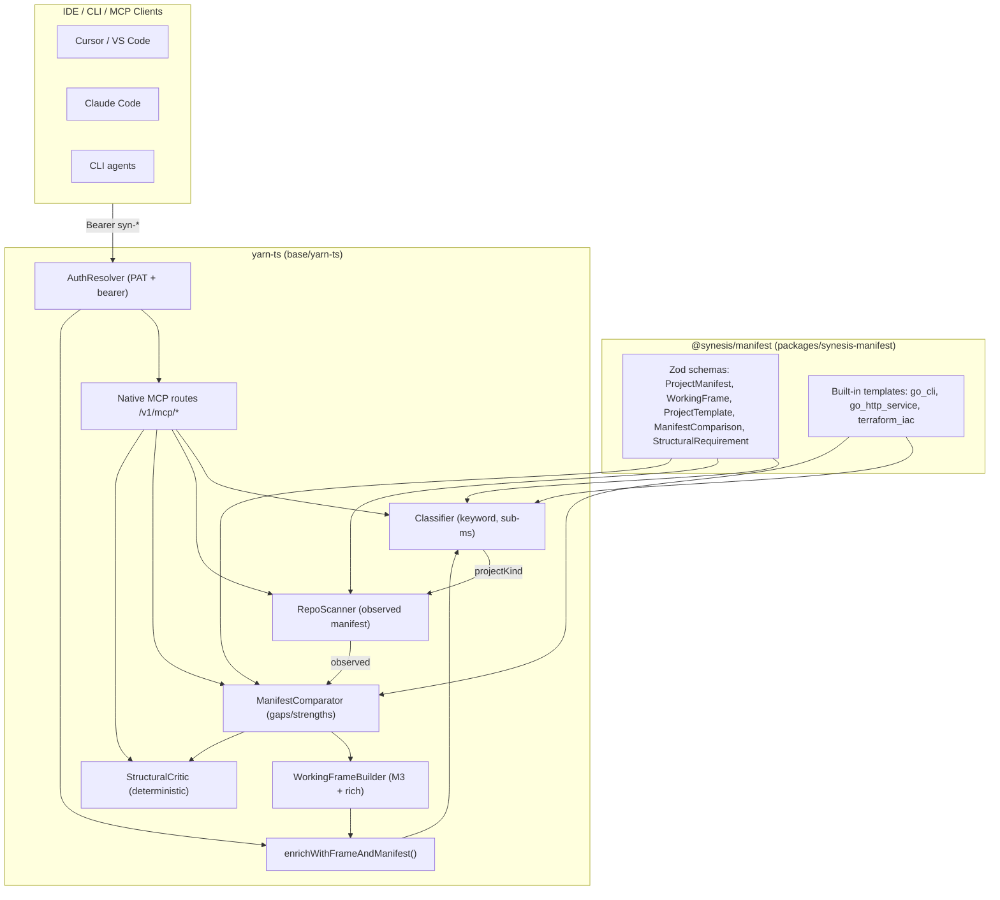

# Working Frame + Project Manifest (Milestone 3 / 3.1)

This milestone improves context admission by adding two lightweight structures
before the model call:

- `WORKING_FRAME`: what we are doing right now
- `PROJECT_MANIFEST`: what kind of project/workflow we are in

These structures reduce ambiguity and prevent avoidable exploratory turns.

## Architecture (M3.1)

## Plain-language value

Without this layer, the model repeatedly re-derives task context from raw
conversation text. That costs tokens and can produce inconsistent behavior.

With this layer:

- we provide a compact current-task frame every request
- we provide inferred project/tooling context every request
- model decisions become more stable and fewer retries are needed
- medium/large tasks get manifest-aware context with structural gap detection
- agent clients can call classification/scaffolding tools directly via MCP

## What was added

### M3 (original) — heuristic services

- `base/yarn-ts/src/frame/working-frame-service.ts`
  - builds `goal`, `constraints`, `activeFiles`, `currentPhase`,
    `pendingChecks`, and `openDecisions`
- `base/yarn-ts/src/project/project-manifest-service.ts`
  - infers language/tooling/test/lint profile from observed conversation content

### M3.1 — structured manifest pipeline + native MCP

#### Shared schema package: `@synesis/manifest`

- `packages/synesis-manifest/src/schemas.ts`
  - Zod schemas: `ProjectManifestSchema`, `WorkingFrameSchema`,
    `ProjectTemplateSchema`, `ManifestComparisonSchema`,
    `ClassificationResultSchema`, `ComplexityAssessmentSchema`,
    `StructuralRequirementSchema`, `DocumentationPatternSchema`
  - Enums: `ProjectKind`, `Complexity`, `TaskPhase`, `TaskType`, `FileStatus`
- `packages/synesis-manifest/src/templates/`
  - `go-cli.ts` — Go CLI with cobra, subcommands, flags
  - `go-http-service.ts` — Go HTTP with health, routes, graceful shutdown
  - `terraform-iac.ts` — Terraform with modules, validation, parameterization

#### Manifest services (yarn-ts)

- `base/yarn-ts/src/manifest/classifier.ts`
  - Keyword/signal-based project kind classification (sub-ms)
  - Complexity assessment: tiny / small / medium / large
  - Tiny/small tasks short-circuit — no template, no manifest overhead
- `base/yarn-ts/src/manifest/repo-scanner.ts`
  - Generates observed `ProjectManifest` from conversation file paths and text
  - Detects languages, frameworks, tools from file patterns
- `base/yarn-ts/src/manifest/comparator.ts`
  - Deterministic diff: target vs observed manifest
  - Produces `ManifestComparison` with missing files, dirs, tools, doc sections, score
- `base/yarn-ts/src/manifest/structural-critic.ts`
  - Deterministic structural checks against comparison results
  - Reports required vs recommended missing elements

#### Enhanced working frame

- `base/yarn-ts/src/frame/working-frame-service.ts`
  - `buildRich()` merges manifest context into the frame for medium/large tasks
  - `toRichSystemBlock()` emits denser `<WORKING_FRAME>` with manifest facts,
    done criteria, validation focus, and blocker tracking
  - Tiny/small tasks still use the fast M3 heuristic path

#### Native TypeScript MCP server

- `base/yarn-ts/src/mcp/` — replaces Python MCP proxy for user-workload tools
  - `tool-registry.ts` — typed tool definitions with Zod validation
  - `index.ts` — Fastify plugin with PAT auth via existing `AuthResolver`
  - Handlers:
    - `synesis_classify_project` — classify task into project kind + complexity
    - `synesis_inspect_repo` — generate observed manifest from file listing
    - `synesis_scaffold` — return target template for a project kind
    - `synesis_compare_manifest` — diff observed vs target with structural critique

### Runtime integration

- `base/yarn-ts/src/index.ts`
  - `enrichWithFrameAndManifest()` now runs the classification gate:
    - tiny/small → M3 fast path (sub-ms)
    - medium/large → classifier → scanner → comparator → rich frame builder
  - Structural critic injects `<STRUCTURAL_CRITIC>` block when required elements are missing
  - MCP routes registered as native Fastify plugin (replaces proxy stubs)

### Config knobs

Added to `base/yarn-ts/src/config.ts`:

- `SYNESIS_YARN_WORKING_FRAME_ENABLED` (M3, default: true)
- `SYNESIS_YARN_PROJECT_MANIFEST_ENABLED` (M3, default: true)
- `SYNESIS_YARN_FRAME_MAX_FILES` (M3, default: 12)
- `SYNESIS_YARN_MANIFEST_TEMPLATES_ENABLED` (M3.1, default: true)
- `SYNESIS_YARN_STRUCTURAL_CRITIC_ENABLED` (M3.1, default: true)
- `SYNESIS_YARN_MCP_TOOLS_ENABLED` (M3.1, default: true)

### Performance budget

- tiny/small tasks: < 1ms (keyword classifier + M3 heuristic frame)
- medium tasks: < 5ms (classifier + scanner + comparator + enhanced frame)
- large tasks: < 10ms (full pipeline including structural critic)
- No LLM calls in M3.1. All deterministic.

## Test coverage

- `packages/synesis-manifest/tests/schemas.test.ts` — 13 tests (schema validation, template registry)
- `base/yarn-ts/tests/manifest-classifier.test.ts` — classifier + complexity
- `base/yarn-ts/tests/manifest-scanner.test.ts` — repo scanner
- `base/yarn-ts/tests/manifest-comparator.test.ts` — comparator + structural critic
- `base/yarn-ts/tests/mcp-tools.test.ts` — MCP tool registry + all 4 handler tools

## Why this helps platform portability

This is interaction-pattern friendly and client-agnostic:

- IDE agents get better continuity across multi-turn edits
- CLI agents get tighter, phase-aware behavior with fewer redundant checks
- background/PR agents get clearer task/manifest context for deterministic plans
- MCP clients can call classification/scaffolding directly for workflow automation

It works the same regardless of client brand because it lives in core runtime.

## Expansion paths (M3.2)

1. LLM-enriched classification for ambiguous cases (right model for right job)
2. Actual filesystem repo scanning via MCP tool results (not just conversation context)
3. Domain adapter plugins (web, data, mobile, infra) as optional template packs
4. Comparison-driven repair suggestions (generate scaffold patches from gaps)
5. Model-selection finetuning — smaller models for tiny task disambiguation
6. Policy-driven frame compaction and phase transitions
7. Red Hat Developer Hub / Backstage integration for manifest source of truth
