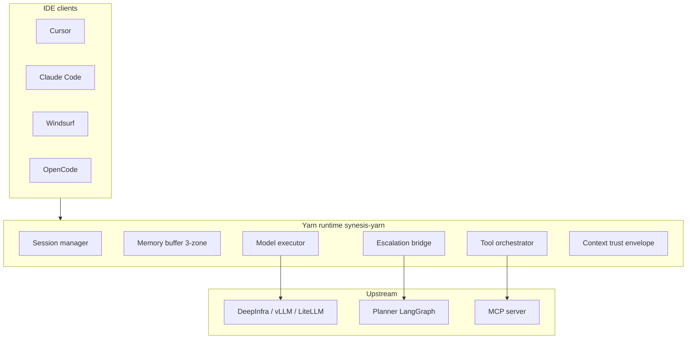
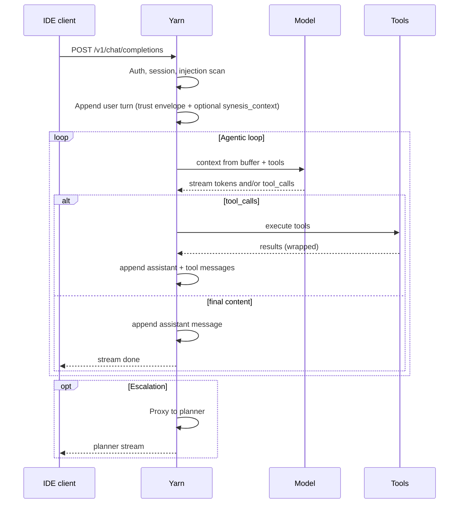

# Yarn Agent Runtime

The Yarn runtime is a fast, stateful agent execution layer for IDE clients. It exposes an OpenAI-compatible API (`/v1/chat/completions`) and handles the hot agentic loop — tool calls, memory management, and streaming — without LangChain. Complex tasks (RAG, multi-step planning) escalate to the existing planner.

## Coder model

Yarn is the **agentic shell around the coder workload**: LLM traffic is intended to use the same **coder** family as the rest of Synesis (`synesis-coder` in `models.yaml`). For **local / in-cluster** inference, the default upstream base URL is the **`synesis-coder`** vLLM service — see `model_url` in [`base/yarn/app/config.py`](../base/yarn/app/config.py) (env `SYNESIS_YARN_MODEL_URL` when using `SYNESIS_YARN_PROVIDER=local`). You may override with **DeepInfra** or another host for testing (`SYNESIS_YARN_PROVIDER`, `SYNESIS_YARN_MODEL`, etc.). The **LiteLLM** route name exposed to clients remains **`synesis-yarn`** (product surface), which is distinct from the direct **`synesis-coder`** gateway route.

## Architecture



Core components inside the Yarn process: **session** (auth, rate limits, Redis), **memory buffer** (pinned + rolling transcript), **tool orchestrator** (MCP + local tools), **model executor** (streaming, usage), **escalation bridge** (planner proxy). Incoming user turns are passed through the **context trust envelope** (optional `synesis_context`, delimiter-wrapped text for the model) — see [YARN_CONTEXT_TRUST.md](YARN_CONTEXT_TRUST.md).

## Modules

### Session Manager (`app/session/`)
- Authenticates via strict Keycloak JWT or DB-validated `syn-` PATs
- Per-session state in Redis DB 3 (`yarn:session:{user_id}:{conversation_id}`)
- Token-bucket rate limiting per session/role

### Memory Buffer (`app/memory/`)
The core differentiator. A **rolling buffer** optimized for prefix caching:

| Zone | Contents | Cache behavior |
|------|-----------|----------------|
| **Pinned** | Server system prompt, pinned tool summary, optional session replay | Stable across turns (high hit rate) |
| **Stable** | User / assistant / tool messages in order; user text is **reducer-wrapped** for trust boundaries | Grows monotonically; shared prefix with prior requests |
| **New turn** | Latest user message appended each HTTP request | Effectively the tail “delta” vs the previous snapshot |

This layout targets strong **prefix-cache** reuse on providers that cache by prompt prefix (e.g. DeepInfra cached tokens, vLLM APC). Exact hit rates depend on model, provider, and whether pinned tool text changes.

When stable history exceeds `SYNESIS_YARN_MEMORY_WINDOW_TOKENS`, **oldest stable messages are evicted** and the **compressor** (background) summarizes them into a **memory replay** pinned message, preserving long-session continuity without unbounded growth.

### Tool Orchestrator (`app/tools/`)
- Loads caller-authorized tools from admin MCP API + built-in local tools
- JSON Schema validation for arguments
- Retries on transient failure
- The `synesis_escalate` tool triggers LangChain escalation
- Tool results are wrapped for the model in bounded tags (see [YARN_CONTEXT_TRUST.md](YARN_CONTEXT_TRUST.md))

### Model Executor (`app/model/`)
Provider-agnostic transport with streaming:
- **DeepInfra** (Phase 1): `Qwen/Qwen3-Coder-480B-A35B-Instruct-Turbo`
- **Local vLLM** (Phase 2+): Direct HTTP with APC
- **LiteLLM** (fallback): Multi-provider failover

Includes circuit breaker, usage tracking (cached/uncached token split), and cost computation.

### Escalation Bridge (`app/escalation/`)
Triggers when:
- The model calls `synesis_escalate`
- Context utilization exceeds ~90% (`escalation_context_threshold`)
- Tool loop count exceeds configured max (`escalation_max_tool_loops`, default 25)

Proxies transparently to the planner's `/v1/chat/completions` and streams the response back.

## API Endpoints

| Method | Path | Description |
|--------|------|-------------|
| POST | `/v1/chat/completions` | Chat completions (streaming/non-streaming) |
| GET | `/v1/models` | List available models |
| GET | `/v1/mcp/tools` | List available tools |
| POST | `/v1/mcp/tools/call` | Execute a tool |
| GET | `/health` | Liveness check |
| GET | `/health/readiness` | Readiness check |
| GET | `/metrics` | Prometheus metrics |

## Configuration

All configuration is via environment variables with the `SYNESIS_YARN_` prefix (see [`base/yarn/app/config.py`](../base/yarn/app/config.py)).

### Token limits: two different knobs

| Concept | Env / setting | Role |
|---------|----------------|------|
| **Rolling context window** | `SYNESIS_YARN_MEMORY_WINDOW_TOKENS` (default `131072`) | Max **approximate tokens** retained in the session buffer (pinned + stable). When exceeded, old turns are evicted and summarized into replay — not silently dropped without a trace. |
| **Max completion per call** | `SYNESIS_YARN_MAX_TOKENS` (default `65536`) | Default **output** cap for each upstream completion when the client omits `max_tokens`. Large values suit big patches and long explanations; **lower** if your provider or model rejects high `max_tokens`. Clients (Cursor, CLI) can also send `max_tokens` per request. |

### Other variables

| Variable | Default | Description |
|----------|---------|-------------|
| `SYNESIS_YARN_PROVIDER` | `deepinfra` | Model backend: `deepinfra`, `local`, `litellm` |
| `SYNESIS_YARN_MODEL` | `Qwen/Qwen3-Coder-480B-A35B-Instruct-Turbo` | Model name |
| `DEEPINFRA_API_KEY` | | DeepInfra API key |
| `SYNESIS_YARN_SESSION_REDIS_URL` | `redis://localhost:6379/3` | Redis for sessions |
| `SYNESIS_YARN_MEMORY_REDIS_URL` | `redis://localhost:6379/4` | Redis for memory |
| `SYNESIS_YARN_MEMORY_PINNED_BUDGET_TOKENS` | `8192` | Reserved headroom hint for pinned zone accounting |
| `SYNESIS_YARN_PLANNER_URL` | `http://synesis-planner...` | Planner for escalation |
| `SYNESIS_YARN_MCP_URL` | `http://synesis-mcp...` | MCP server for tools |
| `SYNESIS_YARN_ADMIN_API_URL` | `http://synesis-admin-api...` | Admin API base URL for user-scoped MCP authz |
| `SYNESIS_YARN_KEYCLOAK_ISSUER_URL` | | Keycloak realm URL |
| `SYNESIS_YARN_KEYCLOAK_AUDIENCE` | *(empty)* | Optional JWT audience check (when empty, `azp` is validated) |
| `SYNESIS_YARN_KEYCLOAK_EXPECTED_AZP` | `synesis-admin` | Expected Keycloak client ID when audience check is disabled |
| `SYNESIS_YARN_ADMIN_DB_URL` | | Admin Postgres DSN for PAT lookup |
| `SYNESIS_YARN_AUTH_ALLOW_LEGACY_FALLBACK` | `false` | Allow legacy HS256 dev auth fallback |
| `SYNESIS_YARN_ENFORCE_MCP_AUTHZ` | `true` | Enforce admin-backed MCP authorization on list/call |
| `SYNESIS_YARN_TEMPERATURE` | `0.2` | Model temperature |
| `SYNESIS_YARN_LOG_LEVEL` | `info` | Log level |
| `SYNESIS_YARN_DIAGNOSTICS_ENABLED` | `true` | Enable adaptive diagnostics capture |
| `SYNESIS_YARN_DIAGNOSTICS_BASE_SAMPLE_RATE` | `0.02` | Baseline request sampling rate |
| `SYNESIS_YARN_DIAGNOSTICS_ON_FAILURE` | `true` | Always capture on failure/escalation |
| `SYNESIS_YARN_DIAGNOSTICS_TOOL_LOOP_THRESHOLD` | `8` | Force capture when tool loops look oscillatory |
| `SYNESIS_YARN_DIAGNOSTICS_SNAPSHOT_TTL_SECONDS` | `86400` | TTL for Redis diagnostics snapshots |

## Output truncation vs context pressure

| Situation | What happens | Continuity |
|-----------|----------------|------------|
| **Model hits output limit** (`max_tokens` / provider stop, often `finish_reason: length`) | Yarn streams **partial** assistant text to the client and ends the turn. | The **IDE** (Cursor, Claude Code, etc.) should start a **new user message** (“continue from where you stopped”) if you want the rest of the patch. Yarn keeps session memory so the next request still has prior turns in the buffer. Yarn does **not** auto-inject a “continue” message today. |
| **Session buffer exceeds memory window** | Oldest stable messages are **evicted** and later **compressed** into the pinned **memory replay** summary. | Long-horizon context is preserved in summarized form; not the same as dropping mid-code silently. |
| **Escalation triggers** | Request is proxied to the planner pipeline. | User sees planner-backed continuation for that escalation path. |

For large codegen, prefer a **high** `max_tokens` (server default and/or per-request) **and** rely on the client to **iterate** if the model still stops early — that matches how desktop agents normally work.

## Local Development

```bash
# 1. Copy the env template
cp .env.example .env
# Edit .env and add your DEEPINFRA_API_KEY

# 2. Start services
podman-compose up

# 3. Optional local-only fallback auth (for dev without Keycloak/PAT DB)
export SYNESIS_YARN_AUTH_ALLOW_LEGACY_FALLBACK=true
export SYNESIS_YARN_ADMIN_DB_URL=""
export SYNESIS_YARN_KEYCLOAK_ISSUER_URL=""

# 4. Test with curl
curl http://localhost:8000/v1/chat/completions \
  -H "Authorization: Bearer syn-dev-test" \
  -H "Content-Type: application/json" \
  -d '{
    "model": "synesis-yarn",
    "messages": [{"role": "user", "content": "Hello!"}],
    "stream": true
  }'
```

## OpenShift Deployment

The Yarn service is deployed via Kustomize overlays alongside other Synesis services:

```bash
# Deploy via deploy.sh (handles namespace creation, DB wiring, Keycloak)
./scripts/deploy.sh dev

# Or manually
oc apply -k overlays/dev
```

The deploy script automatically:
- Creates the `synesis-yarn` namespace
- Wires Keycloak issuer URL
- Patches admin DB URL for usage tracking

## IDE Client Configuration

### Cursor
Settings > Models > Add Custom Model:
- API Base: `https://synesis-yarn.apps.your-cluster.dev/v1`
- API Key: Your `syn-` PAT or Keycloak Bearer token
- Model: `synesis-yarn`

### Other IDE Clients
Any client that supports OpenAI-compatible endpoints works the same way.

## Agentic loop flow



## Database Tables

Two tables in the admin database (`base/admin/alembic/versions/012_yarn_sessions_usage.py`):

- **yarn_sessions**: Durable session metadata (user, provider, token totals, costs)
- **yarn_usage_log**: Per-request usage records (cached/uncached token split, latency, cost)

## Yarn Ops Dashboard

The admin dashboard includes a dedicated Yarn Ops section for monitoring
and managing the agent runtime. Ops roles (platform_admin, org_admin) land
here by default.

### Pages

| Page | Route | Description |
|------|-------|-------------|
| Overview | `/yarn` | Single-pane hub: requests, errors, escalations, cost, latency, active sessions |
| Sessions | `/yarn/sessions` | Paginated list of all Yarn sessions with drill-down detail |
| Events & Errors | `/yarn/events` | Request-level event log with error/escalation filtering |
| Performance | `/yarn/performance` | Time-series charts: requests, latency, cost, token throughput |
| Verification | `/yarn/verification` | Health probes and smoke tests for the Yarn service |

### Data Flow

1. Yarn runtime persists per-request usage rows into `yarn_usage_log` and
   upserts session aggregates into `yarn_sessions` during request finalization.
2. Admin API (`/api/v1/yarn/*`) queries these tables with RBAC scoping.
3. Frontend pages consume the API via TanStack Query hooks with auto-refresh.

### Configuration

| Variable | Default | Description |
|----------|---------|-------------|
| `SYNESIS_YARN_PERSIST_USAGE_TO_DB` | `true` | Enable/disable DB persistence from Yarn |
| `SYNESIS_YARN_URL` (admin) | `http://synesis-yarn.synesis-yarn.svc.cluster.local:8000` | Yarn service URL for health probes and diagnostics proxy |

### User Token Consumption

Regular users see their personal Yarn usage (tokens, cost, latency, errors)
on the account Usage page (`/account/usage`), powered by
`GET /api/v1/yarn/user-usage`.

## Telemetry

- **Prometheus metrics** at `/metrics`: request count, latency histogram, token counters (cached vs uncached), escalation rate, tool call success rate, circuit breaker state
- **OpenTelemetry traces**: Optional, configure via `SYNESIS_YARN_OTEL_ENDPOINT`
- **Adaptive diagnostics**: failure/waffling-triggered snapshots with low baseline sampling (see [YARN_SESSION_DEBUGGING.md](YARN_SESSION_DEBUGGING.md))

## Hardening Roadmap

- **Phase 1 (implemented):** strict PAT/Keycloak auth, removal of permissive token fallback by default, and admin-backed MCP authorization for tool listing/calls.
- **Phase 2 (implemented):** adaptive diagnostics for oscillation/waffling with failure-triggered sampling and operator snapshots for targeted debugging.
- **Context trust (implemented):** optional `synesis_context`, delimiter-wrapped user/tool text, expanded injection scanning — [YARN_CONTEXT_TRUST.md](YARN_CONTEXT_TRUST.md).

## Cost Analysis

See [YARN_COST_ANALYSIS.md](YARN_COST_ANALYSIS.md) for detailed per-request costs, caching impact, and API vs local GPU breakeven analysis.

---

Back to [README](../README.md)
