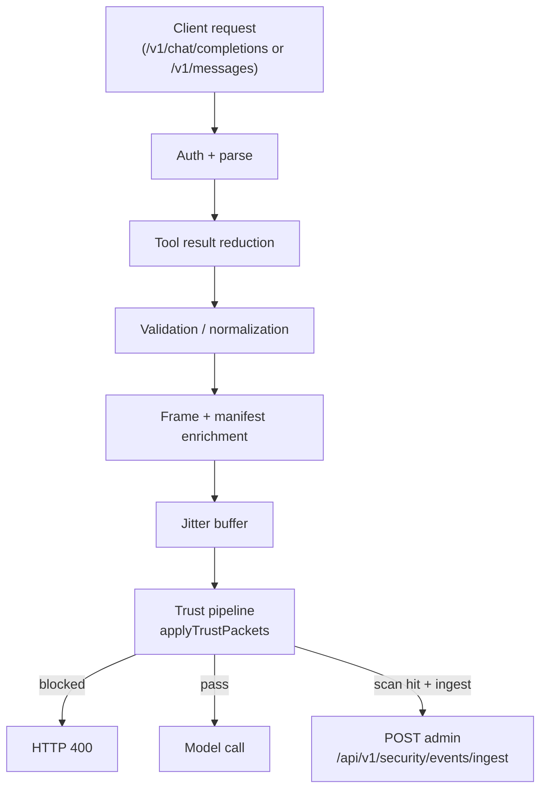

# Yarn-ts context trust and prompt-injection hardening

This document describes the trust pipeline for **yarn-ts** (`base/yarn-ts/`), the TypeScript runtime that serves OpenAI and Claude-compatible completion APIs to IDE agents (Cursor, Claude Code, Windsurf, etc.).

For the shared planner/RAG defense architecture, see [`SECURITY.md`](./SECURITY.md). For legacy Python Yarn context trust (retired), see [`docs/deprecated/YARN_CONTEXT_TRUST.md`](./deprecated/YARN_CONTEXT_TRUST.md).

## Trust tiers

| Tier | Description | Examples |
|------|-------------|----------|
| **Trusted control** | Yarn-owned system content | Stable prefix, working frame templates, project manifest structure, adapter pack schema |
| **Semi-trusted internal** | Yarn-generated summaries from prior untrusted content | Validation envelopes, reduced tool output, artifact handles, session continuity blocks |
| **Untrusted external** | All client-supplied content | User messages, assistant/tool messages from client transcript, MCP response bodies, client-supplied `system` field |

## JSON trust packets (TrustPacketV1)

All content presented to the model is wrapped in a versioned JSON envelope validated with Zod. The canonical schema lives in the shared package `@synesis/context-trust` (`packages/synesis-context-trust/`).

Key fields:

- `schema_version` (always `1`)
- `trust_level`: `"trusted"` | `"semi_trusted"` | `"untrusted"`
- `source_type`: `"user_message"` | `"tool_result"` | `"assistant_message"` | `"mcp_response"` | `"session_continuity"` | etc.
- `instruction_execution_allowed`: `boolean` — `false` for all untrusted and semi-trusted content
- `content_purpose`: `"instruction"` | `"data"` | `"summary"` | `"reference"` | `"code"` | `"context"`
- `sanitization_applied`: list of sanitization steps applied (e.g. `"truncated"`, `"stripped_control_tags"`)
- `imperative_likelihood`: `0.0`–`1.0` heuristic score for imperative/injection language
- `content`: the actual text

On the wire to the model, packets are serialized as deterministic-key-order JSON strings (one per message) for prompt-cache stability.

## Pipeline flow



The trust pipeline is a single-pass transform that:
1. Prepends `TRUST_POLICY_COMPACT` to the first system message
2. Wraps `user` and `tool` messages in `TrustPacketV1` envelopes with `trust_level: "untrusted"`
3. Wraps `assistant` messages (from client transcript) in `TrustPacketV1` with `trust_level: "semi_trusted"`
4. Runs injection scanning on `user` and `tool` content
5. On scan hit: emits a `SecurityIngestPayload` to admin, and applies the configured action (`log` / `reduce` / `block`)

## Environment variables

| Variable | Default | Description |
|----------|---------|-------------|
| `SYNESIS_YARN_TRUST_PACKET_ENABLED` | `true` | Wrap messages in JSON trust packets |
| `SYNESIS_YARN_INJECTION_SCAN_ENABLED` | `true` | Run pattern scanner on user/tool content |
| `SYNESIS_YARN_INJECTION_SCAN_ACTION` | `log` | Action on scan hit: `log`, `reduce`, or `block` |
| `SYNESIS_YARN_SECURITY_INGEST_ENABLED` | `true` | POST scan hits to admin security events ingest |

## MCP proxy trust metadata

When trust packets are enabled, the MCP proxy at `POST /v1/mcp/tools/call` adds an `X-Synesis-Trust-Metadata` response header with a JSON object indicating the response should be treated as untrusted MCP data:

```json
{
  "schema_version": 1,
  "trust_level": "untrusted",
  "source_type": "mcp_response",
  "instruction_execution_allowed": false,
  "content_purpose": "data"
}
```

Clients can use this header to apply their own trust controls when surfacing MCP results.

## Security event routing

Scanner detections are routed to the admin security console via `POST /api/v1/security/events/ingest` (service-to-service, no user auth). The `emitSecurityEvent` helper in `@synesis/context-trust` is fire-and-forget with timeout. Events appear in the admin Security UI alongside planner scanner detections for unified triage.

Yarn-specific policy events (repeat guard, consecutive tool calls) continue to write to `yarn_safety_events` via `UsageWriter.enqueueSafetyEventInsert`. Critical policy rejects can optionally also be routed to `security_events` via the same ingest API for a single operator view.

## Shared package

The trust types, scanner, normalizer, sanitizer, operational policy text, and security ingest client live in `@synesis/context-trust` (`packages/synesis-context-trust/`). Both yarn-ts and planner-ts depend on this workspace package. Container builds COPY and build the package before the app workspace, so library changes invalidate Docker layers and force image rebuilds.

## Related code

- `packages/synesis-context-trust/src/` — shared trust package
- `base/yarn-ts/src/security/transcript-trust.ts` — yarn-ts trust pipeline
- `base/yarn-ts/src/config.ts` — trust/scan env vars
- `base/planner-ts/src/security/` — thin re-exports from shared package + planner-specific `step-sanitizer.ts`
- `base/admin/app/routers/security.py` — security events ingest + console API
