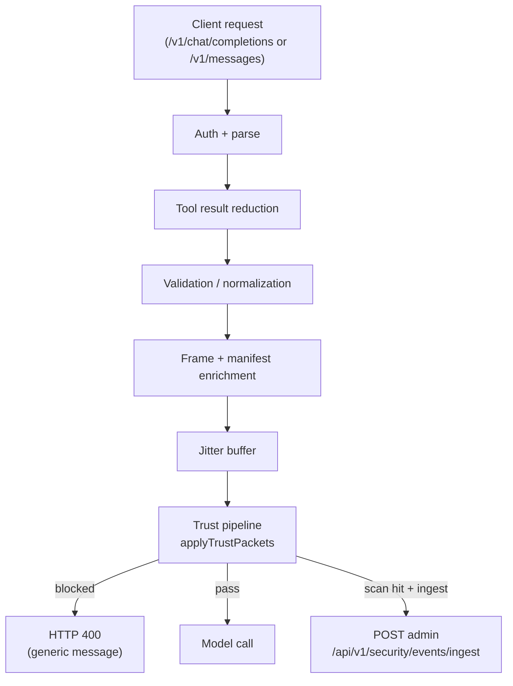

# Yarn-ts context trust and prompt-injection hardening

This document describes the trust pipeline for **yarn-ts** (`base/yarn-ts/`), the TypeScript runtime that serves OpenAI and Claude-compatible completion APIs to IDE agents (Cursor, Claude Code, Windsurf, etc.).

For the unified planner/yarn defense architecture, see [`SECURITY.md`](./SECURITY.md).

## Trust tiers

| Tier | Description | Examples |
|------|-------------|----------|
| **Trusted control** | Yarn-owned system content | Stable prefix, working frame templates, project manifest structure, adapter pack schema |
| **Semi-trusted internal** | Yarn-generated summaries from prior untrusted content | Validation envelopes, reduced tool output, artifact handles, session continuity blocks |
| **Untrusted external** | All client-supplied content | User messages, tool messages from client transcript, MCP response bodies, client-supplied `system` field |

## JSON trust packets (TrustPacketV1)

All content presented to the model is wrapped in a versioned JSON envelope validated with Zod. The canonical schema lives in the shared package `@synesis/context-trust` (`packages/synesis-context-trust/src/trust-packet.ts`).

Key fields:

- `schema_version` (always `1`)
- `trust_level`: `"trusted"` | `"semi_trusted"` | `"untrusted"`
- `source_type`: `"user_message"` | `"tool_result"` | `"mcp_response"` | `"rag_retrieval"` | etc.
- `instruction_execution_allowed`: `boolean` — `false` for all untrusted and semi-trusted content
- `content_purpose`: `"instruction"` | `"data"` | `"summary"` | `"reference"` | `"code"` | `"context"`
- `sanitization_applied`: list of sanitization steps applied
- `imperative_likelihood`: `0.0`–`1.0` heuristic score for imperative/injection language
- `attribution`: optional `AttributionV1` object (populated for evidence/retrieval content)
- `content`: the actual text

On the wire to the model, packets are serialized as deterministic-key-order JSON strings (one per message) for prompt-cache stability.

## Pipeline flow

The trust pipeline is a single-pass transform that:
1. Prepends `TRUST_POLICY_COMPACT` to the first system message
2. Wraps `user` and `tool` messages in `TrustPacketV1` envelopes with `trust_level: "untrusted"`
3. Passes `assistant` messages through unchanged (wrapping them causes model mimicry of the envelope format)
4. Runs injection scanning on `user` and `tool` content
5. On scan hit: emits a `SecurityIngestPayload` to admin, and applies the configured action (`log` / `reduce` / `block`)

## Error sanitization

When the trust pipeline blocks a request, the client receives a generic error message (`"Request could not be processed."`) that does not expose internal scan details. The internal `blockDetail` string (containing event type, confidence, pattern IDs) is routed only to:

- Internal structured logs
- Security event ingest (`POST /api/v1/security/events/ingest`)
- Session event recording (for admin triage)

This same principle applies to upstream model errors (`sanitizeUpstreamError`) and MCP tool errors.

## Environment variables

| Variable | Default | Description |
|----------|---------|-------------|
| `SYNESIS_YARN_TRUST_PACKET_ENABLED` | `true` | Wrap messages in JSON trust packets |
| `SYNESIS_YARN_INJECTION_SCAN_ENABLED` | `true` | Run pattern scanner on user/tool content |
| `SYNESIS_YARN_INJECTION_SCAN_ACTION` | `log` | Action on scan hit: `log`, `reduce`, or `block` |
| `SYNESIS_YARN_SECURITY_INGEST_ENABLED` | `true` | POST scan hits to admin security events ingest |

## Future: MCP RAG trust integration

The `TrustPacketV1` schema includes `source_type` values `mcp_response` and `rag_retrieval`, and the `AttributionV1` object supports `retrieval_channel: "mcp"`. When yarn gains direct RAG access via MCP, retrieved documents will flow through the same trust pipeline as tool results, with full attribution metadata for trust-aware behavior tuning.

## Related code

- `packages/synesis-context-trust/src/` — shared trust package (schemas, scanner, policy, ingest)
- `base/yarn-ts/src/security/transcript-trust.ts` — yarn-ts trust pipeline
- `base/yarn-ts/src/config.ts` — trust/scan env vars
- `base/yarn-ts/src/index.ts` — error sanitization, trust block handling
- `base/yarn-ts/src/mcp/index.ts` — MCP tool error sanitization
- `base/planner-ts/src/security/` — planner trust re-exports from shared package
- `base/admin/app/routers/security.py` — security events ingest + console API
