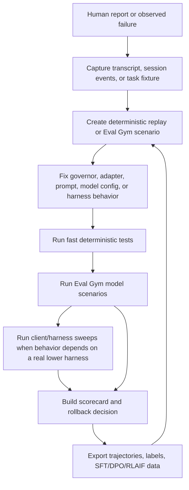
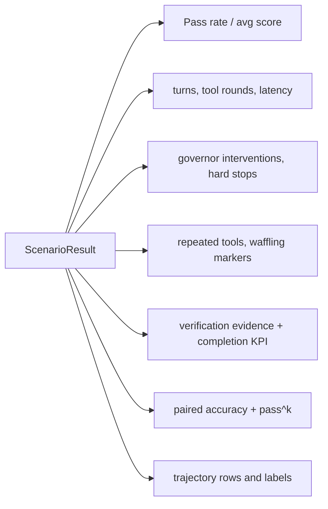
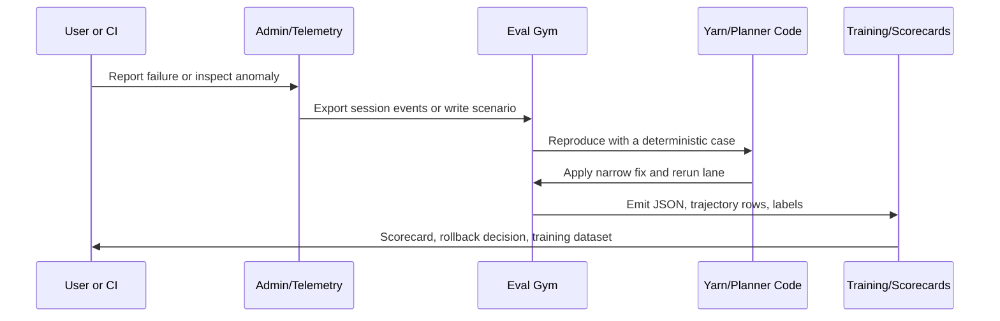

# Yarn Eval Gym

Yarn Eval Gym is the model-in-the-loop evaluation layer for the Synesis coder
runtime. It turns developer-experience failures into repeatable scenarios,
scores them, exports training material, and feeds release scorecards. Use it
with the deterministic governor tests and live lower-harness runs to build a
fast learning loop: reproduce, fix, verify, export, and keep the regression.

For the complete release/test inventory, see
[`docs/development/TESTING.md`](../development/TESTING.md). For lower-harness
task execution, see
[`base/yarn-ts/docs/harness-tester.md`](../../base/yarn-ts/docs/harness-tester.md)
and
[`base/yarn-ts/docs/governor-behavior-validation.md`](../../base/yarn-ts/docs/governor-behavior-validation.md).

## Mental Model



Eval Gym is not the only evaluation surface. Use the smallest lane that proves
the claim:

| Lane | Best for | Primary command |
|---|---|---|
| Unit/replay governor tests | Deterministic rule behavior and known transcript edges | `npm --workspace synesis-yarn-ts run test:governor:unit` |
| Eval Gym | OpenAI-compatible model scenarios with simulated tool results | `npm --workspace synesis-yarn-ts run eval:regression` |
| Eval Client Lab | Same Eval Gym scenarios across client profiles | `npm --workspace synesis-yarn-ts run eval:lab -- ...` |
| Harness Tester | Real lower-harness process, disposable workspace, validators, diffs | `npm --workspace synesis-yarn-ts run harness:tester -- ...` |
| Harness Matrix | Cross-product sweeps over tasks, harnesses, models, endpoints | `npm --workspace synesis-yarn-ts run harness:matrix -- ...` |
| Live verify | OpenAI/Claude compatibility and reducer telemetry checks | `npm --workspace synesis-yarn-ts run verify:live` |
| Scorecard/rollback | Release quality gate from eval artifacts | `npm --workspace synesis-yarn-ts run eval:scorecard` |

## Current Implementation

| Surface | Source of truth |
|---|---|
| Scenario runner and scoring | [`base/yarn-ts/src/eval/scenario-runner.ts`](../../base/yarn-ts/src/eval/scenario-runner.ts), [`turn-scorer.ts`](../../base/yarn-ts/src/eval/turn-scorer.ts) |
| Scenario registry | [`base/yarn-ts/src/eval/scenarios/index.ts`](../../base/yarn-ts/src/eval/scenarios/index.ts) |
| CLI | [`base/yarn-ts/scripts/eval-gym.ts`](../../base/yarn-ts/scripts/eval-gym.ts) |
| Eval API routes | [`base/yarn-ts/src/eval/routes.ts`](../../base/yarn-ts/src/eval/routes.ts) |
| Observer events | [`base/yarn-ts/src/eval/session-observer.ts`](../../base/yarn-ts/src/eval/session-observer.ts) |
| Training exports | [`base/yarn-ts/src/eval/training-materializer.ts`](../../base/yarn-ts/src/eval/training-materializer.ts) |
| Client-profile sweeps | [`base/yarn-ts/src/eval/client-lab.ts`](../../base/yarn-ts/src/eval/client-lab.ts) |
| Scorecards and rollout policy | [`base/yarn-ts/src/eval/harness-scorecard.ts`](../../base/yarn-ts/src/eval/harness-scorecard.ts), [`eval-rollback-policy.ts`](../../base/yarn-ts/scripts/eval-rollback-policy.ts) |

Built-in scenario categories are:

| Category | Purpose | Script |
|---|---|---|
| `governor_regression` | Known loops, false-green behavior, stale reads, plan drift, recovery momentum | `npm --workspace synesis-yarn-ts run eval:regression` |
| `power_user_canary` | Long-session and convention-heavy developer experience canaries | `npm --workspace synesis-yarn-ts run eval:canary` |
| `e2e_build` | Fresh app/build scenarios with simulated edit and verification loops | `npm --workspace synesis-yarn-ts run eval:e2e` |
| `plan_management` | Plan file and task-state continuity flows | Included in `--all` or by category |
| `recovery` | Resume/recovery scenarios | Included in `--all` or by category |
| `swe_bench` | Small local SWE-bench-style patch tasks | `npm --workspace synesis-yarn-ts run eval:swebench` |
| `abstention` | Controlled should-act/should-abstain pairs for ambiguous or unauthorized actions | `npm --workspace synesis-yarn-ts run eval:abstention` |

## Configuration

CLI runs require an OpenAI-compatible target URL and a token:

| Variable | Required | Meaning |
|---|---:|---|
| `SYNESIS_EVAL_TARGET_URL` | Yes | OpenAI-compatible base URL, for example `https://coder.example.com` or `http://localhost:8000` |
| `SYNESIS_EVAL_TARGET_KEY` | One token required | Bearer token for the target |
| `SYNESIS_TEST_PAT_TOKEN` | One token required | Alternative PAT used by Synesis dev/CI flows |
| `SYNESIS_TEST_AUTH` | One token required | Compatibility token fallback |
| `SYNESIS_EVAL_MODEL` | No | Model override for all scenarios |
| `SYNESIS_EVAL_ADMIN_URL` | No | Admin/Yarn API base for governor telemetry lookup |
| `SYNESIS_EVAL_ADMIN_TOKEN` | No | Admin/internal token for telemetry lookup |
| `SYNESIS_EVAL_TIMEOUT_MS` | No | Per-turn timeout, default `120000` |
| `SYNESIS_EVAL_BASELINE_JSON` | Budget lanes only | Baseline eval artifact for regression budget checks |

Yarn also has optional in-service eval routes and observer flags:

| Variable | Default | Meaning |
|---|---:|---|
| `SYNESIS_YARN_EVAL_API_ENABLED` | `false` | Registers `/v1/eval/*` routes when explicitly enabled |
| `SYNESIS_YARN_EVAL_OBSERVER_ENABLED` | `false` | Starts live session observer at boot |
| `SYNESIS_YARN_OPENAI_COMPAT_BASE_URL` | deployment config | Target URL accepted by in-service eval routes |
| `SYNESIS_YARN_ADMIN_API_URL` | deployment config | Admin URL accepted by in-service eval routes |
| `SYNESIS_INTERNAL_SERVICE_TOKEN` | deployment config | Internal route token required for `/v1/eval/*` calls |

Eval API routes require the internal route token. They are intended for trusted
operator workflows, not public internet exposure.

## Run All The Evals

From the repository root:

```bash
export SYNESIS_EVAL_TARGET_URL=https://coder.example.com
export SYNESIS_TEST_PAT_TOKEN=syn-...
```

Fast local gates:

```bash
npm --workspace synesis-yarn-ts run test:governor:unit
npm --workspace synesis-yarn-ts run test:governor:smoke
npm --workspace synesis-yarn-ts run test:openai-conformance
```

Model-in-loop Eval Gym lanes:

```bash
npm --workspace synesis-yarn-ts run eval:list
npm --workspace synesis-yarn-ts run eval:regression
npm --workspace synesis-yarn-ts run eval:canary
npm --workspace synesis-yarn-ts run eval:e2e
npm --workspace synesis-yarn-ts run eval:swebench
npm --workspace synesis-yarn-ts run eval:abstention
npm --workspace synesis-yarn-ts run eval -- --all --json --out eval-all.json
```

Live compatibility and reducer checks:

```bash
SYNESIS_YARN_EVAL_URL="$SYNESIS_EVAL_TARGET_URL" \
SYNESIS_TEST_PAT_TOKEN="$SYNESIS_TEST_PAT_TOKEN" \
npm --workspace synesis-yarn-ts run verify:live

SYNESIS_YARN_EVAL_URL="$SYNESIS_EVAL_TARGET_URL" \
SYNESIS_TEST_PAT_TOKEN="$SYNESIS_TEST_PAT_TOKEN" \
npm --workspace synesis-yarn-ts run verify:live:full

SYNESIS_YARN_EVAL_URL="$SYNESIS_EVAL_TARGET_URL" \
SYNESIS_TEST_PAT_TOKEN="$SYNESIS_TEST_PAT_TOKEN" \
npm --workspace synesis-yarn-ts run verify:openai-conformance
```

Client-profile sweeps over Eval Gym scenarios:

```bash
npm --workspace synesis-yarn-ts run eval:lab -- \
  --profiles raw-openai,opencode,claude-code,codex-cli,cursor \
  --category governor_regression \
  --rounds 2 \
  --out /tmp/eval-client-lab.json \
  --markdown /tmp/eval-client-lab.md \
  --allow-failures
```

Lower-harness validation with a disposable workspace:

```bash
npm --workspace synesis-yarn-ts run harness:tester -- run-suite \
  --suite tests/fixtures/harness-tester/suites/language-core.json \
  --harness opencode \
  --model qwen3-coder \
  --api-base-url "$SYNESIS_EVAL_TARGET_URL/v1" \
  --api-key "$SYNESIS_TEST_PAT_TOKEN" \
  --allow-failures
```

Harness matrix dry run:

```bash
npm --workspace synesis-yarn-ts run harness:matrix -- \
  --matrix tests/fixtures/harness-matrix/dry-run-openai-compatible.json \
  --dry-run \
  --out /tmp/synesis-harness-matrix.json \
  --markdown /tmp/synesis-harness-matrix.md \
  --artifacts-root /tmp/synesis-harness-matrix-artifacts \
  --allow-failures
```

Release-style scorecard from eval artifacts:

```bash
npm --workspace synesis-yarn-ts run eval:regression -- --json --out eval-governor-regression.json
npm --workspace synesis-yarn-ts run eval:budget -- \
  --candidate eval-governor-regression.json \
  --baseline "$SYNESIS_EVAL_BASELINE_JSON" \
  --summary-out eval-governor-budget.json
npm --workspace synesis-yarn-ts run eval:canary
npm --workspace synesis-yarn-ts run eval:scorecard -- \
  --regression eval-governor-regression.json \
  --budget eval-governor-budget.json \
  --canary eval-power-user-canary.json \
  --out-json harness-scorecard.json \
  --out-md harness-scorecard.md
npm --workspace synesis-yarn-ts run eval:rollback -- \
  --scorecard harness-scorecard.json \
  --history-in harness-scorecard-history.json \
  --history-out harness-scorecard-history.json \
  --decision-out harness-rollback-decision.json
```

CI-style bundled lanes:

```bash
npm --workspace synesis-yarn-ts run ci:governor:pr
SYNESIS_EVAL_BASELINE_JSON=baseline.json npm --workspace synesis-yarn-ts run ci:governor:nightly
SYNESIS_EVAL_BASELINE_JSON=baseline.json npm --workspace synesis-yarn-ts run ci:governor:prerelease
```

## Scenario Authoring

Add scenarios when a behavior should survive future model, prompt, governor, or
adapter changes.

```ts
import type { EvalScenario } from "../types.js";

export const focusedRegression: EvalScenario = {
  id: "focused-regression",
  name: "Focused regression",
  category: "governor_regression",
  description: "Model should make one edit before re-running verification.",
  target: {},
  systemPrompt: "You are a coding assistant.",
  turns: [{
    messages: [{ role: "user", content: "Fix the failing test in src/math.ts." }],
    simulatedToolResults: {
      Read: {
        bySignature: {
          "path:src/math.ts": "export function add(a: number, b: number) { return a - b; }",
        },
        default: "file not found",
      },
      Edit: "File updated.",
      Bash: ["FAIL test_add", "PASS test_add"],
    },
    maxToolRounds: 3,
    assertions: [
      { type: "contains_edit" },
      { type: "no_repeated_tool" },
      { type: "tool_count_lte", params: { max: 8 } },
    ],
  }],
  scoring: {
    maxTotalTurns: 2,
    requireVerificationEvidence: true,
    requireSessionCompletionKpi: true,
    failIfRules: ["verification_stall_no_edit"],
  },
};
```

Where to add scenarios:

| Scenario kind | File |
|---|---|
| Governor loop/recovery regression | [`base/yarn-ts/src/eval/scenarios/governor-regression.ts`](../../base/yarn-ts/src/eval/scenarios/governor-regression.ts) |
| Power-user canary | [`base/yarn-ts/src/eval/scenarios/power-user-canary.ts`](../../base/yarn-ts/src/eval/scenarios/power-user-canary.ts) |
| Fresh build / plan / recovery | [`base/yarn-ts/src/eval/scenarios/e2e-builds.ts`](../../base/yarn-ts/src/eval/scenarios/e2e-builds.ts) |
| Go-worker specific behavior | [`base/yarn-ts/src/eval/scenarios/golang-worker.ts`](../../base/yarn-ts/src/eval/scenarios/golang-worker.ts) |
| SWE-bench-style local tasks | [`base/yarn-ts/src/eval/scenarios/swe-bench-track.ts`](../../base/yarn-ts/src/eval/scenarios/swe-bench-track.ts) |
| Controlled act/abstain pairs | [`base/yarn-ts/src/eval/scenarios/abstention.ts`](../../base/yarn-ts/src/eval/scenarios/abstention.ts) |

Use simulated tool results to make model behavior reproducible. Prefer
signature-specific results for path or command corrections, arrays for
"first run fails, second run passes", and `default` for irrelevant tool calls.

## What To Measure



Key KPIs:

| KPI | Desired movement | Why |
|---|---:|---|
| `pass_rate` | Up | Scenarios complete expected behavior |
| `avg_score` | Up | Quality improved without only optimizing pass/fail |
| `sessionCompletionRate` | Up | Model reaches verified completion, not just no-error response |
| `medianTurnsToComplete` | Down | Faster successful loops |
| `governorInterventions` | Context-dependent | Should catch bad loops but decrease after model/prompt improvements |
| `recoveryLoopRate` | Down | Fewer repeated recovery patterns |
| `hardStopIncidence` | Down | Fewer unrecoverable loops |
| `repeated_command_anomaly_rate` | Down | Less blind retry behavior |
| `pairedAccuracy` | Up | Both the should-act and should-abstain variants must pass; one-sided safety does not inflate the result |
| `passPowK` | Up | Fraction of repeated matrix groups where every one of the configured `k` runs passed |

Treat metrics as a triage queue, not a scoreboard. A rising intervention rate
can be good when new guards catch false-green completions. It is bad when the
same valid flow is repeatedly blocked across client profiles.

Abstention is evaluated before side effects: an abstain scenario fails if the
irreversible tool is called even when the model objects afterward. Pair IDs are
complete only when both variants are present. Harness Matrix reports `passPowK`
only for groups configured with more than one round; use `--rounds` to expose
run-to-run variance rather than relying on a single successful sample.

## Learning Loop



Action paths:

| If the run shows... | First response |
|---|---|
| Governor false-positive on a valid flow | Add/adjust replay fixture, then update the rule or client profile handling |
| Repeated tool calls or verification churn | Add Eval Gym regression, inspect `allGovernorRules`, improve recovery rule or model steering |
| Client-specific breakage | Run Eval Client Lab, then Harness Tester/Matrix for the affected harness |
| Model regression after provider update | Compare candidate against baseline with `eval:budget`, then inspect scenario diffs |
| Noisy or ambiguous failure | Move it to canary with `--allow-failures` until deterministic evidence exists |
| Durable model behavior gap | Export SFT/DPO/RLAIF examples and add scorecard KPI tracking |

Training exports:

```bash
npm --workspace synesis-yarn-ts run eval -- \
  --category governor_regression \
  --export sft \
  --out eval-sft.jsonl

npm --workspace synesis-yarn-ts run eval -- \
  --category governor_regression \
  --export dpo \
  --out eval-dpo.jsonl

npm --workspace synesis-yarn-ts run eval -- \
  --category governor_regression \
  --export rlaif \
  --out eval-rlaif.jsonl
```

Admin feedback loop exports:

```bash
python scripts/feedback-loop-runner.py export \
  --run-id latest \
  --dataset_type eval_gym \
  --format jsonl \
  --out eval-gym-data.jsonl
```

The admin feedback-loop API also supports run creation, replay pipelines,
auto-labeling, critic scoring, DPO preferences, and dataset export under
`/api/v1/feedback-loop/*`.

## In-Service Eval API

Enable only for trusted deployments:

```bash
SYNESIS_YARN_EVAL_API_ENABLED=true
SYNESIS_YARN_OPENAI_COMPAT_BASE_URL=https://coder.example.com
SYNESIS_YARN_ADMIN_API_URL=https://admin.example.com
```

Routes:

| Route | Purpose |
|---|---|
| `GET /v1/eval/scenarios` | List built-in scenarios |
| `POST /v1/eval/run` | Run one scenario, a category, or all scenarios |
| `GET /v1/eval/results` | Returns instructions for querying `scenario_eval_v1` session events |
| `POST /v1/eval/observe/start` | Enable observer at runtime |
| `POST /v1/eval/observe/stop` | Disable observer |
| `GET /v1/eval/observe/status` | Inspect observer state |
| `POST /v1/eval/export` | Convert `ScenarioResult[]` to `sft`, `dpo`, or `rlaif` examples |

The route implementation normalizes configured target/admin URLs and rejects
request URLs that do not match the configured origins. This prevents the eval
API from becoming an arbitrary SSRF launcher.

## Live Observer

The observer records session events while normal users or harnesses exercise
Yarn. It is useful for discovering new failure shapes, but it should not replace
deterministic regressions.

```bash
curl -X POST "$SYNESIS_EVAL_TARGET_URL/v1/eval/observe/start" \
  -H "Authorization: Bearer $SYNESIS_INTERNAL_SERVICE_TOKEN" \
  -H "Content-Type: application/json" \
  -d '{"session_key_filter": []}'
```

Event kinds:

| Event | Producer | Use |
|---|---|---|
| `scenario_eval_v1` | Scenario runner targeting Yarn | Stored scenario result |
| `eval_transcript_v1` | Observer | Turn transcript and anomaly summary |
| `live_eval_v1` | Observer | Anomaly alert when issues are detected |
| `request_trajectory_v1` | Normal Yarn pipeline | Training signals and request trajectory |
| `execution_governor_evaluated` | Governor | Rule decisions and pause metadata |

Query through Admin:

```bash
curl "$SYNESIS_EVAL_ADMIN_URL/api/v1/feedback-loop/eval-gym/events?event_kind=live_eval_v1&limit=50" \
  -H "Authorization: Bearer $SYNESIS_EVAL_ADMIN_TOKEN"
```

## Triage Workflow

1. **Name the behavior.** Example: "OpenCode repeats `npm test` after the first failure without reading the stack trace."
2. **Pick the lane.** Use replay fixture for deterministic rules, Eval Gym for model behavior, Harness Tester for lower-harness failures.
3. **Capture evidence.** Keep prompt, tool calls, governor rules, session key, and workspace diff if available.
4. **Write the smallest reproducer.** Prefer one scenario/fixture with clear expected behavior.
5. **Make the fix.** Change only the rule, reducer, adapter, prompt, or config needed.
6. **Run the narrow lane.** Then run the adjacent lanes before promotion.
7. **Export learning material.** Produce trajectory rows or training JSONL when the behavior is model-learnable.
8. **Keep the regression.** Do not remove the scenario after fixing it.

## Troubleshooting

| Symptom | Check |
|---|---|
| `SYNESIS_EVAL_TARGET_URL is required` | Export the target OpenAI-compatible base URL before running the CLI |
| `SYNESIS_EVAL_TARGET_KEY or SYNESIS_TEST_PAT_TOKEN is required` | Provide a PAT/API key; do not rely on shell-specific aliases |
| Governor rules are empty | Set `SYNESIS_EVAL_ADMIN_URL` and `SYNESIS_EVAL_ADMIN_TOKEN`, or target a Yarn instance with session events enabled |
| Eval API returns unauthorized | Use the internal route token; `/v1/eval/*` routes are internal/operator routes |
| Non-Yarn target skips governor assertions | Expected. OpenRouter/vLLM/Ollama do not expose Synesis governor telemetry |
| Scenarios are flaky | Prefer deterministic simulated tool results, lower temperature, or move the case to canary until stable |
| Harness Tester fails before model call | Inspect harness stdout/stderr; likely adapter command, API URL, or non-interactive CLI setup |

## Related Docs

- [`GOVERNOR_HARNESS.md`](./GOVERNOR_HARNESS.md) — governor rules, phase model, and regression fixtures
- [`GOVERNOR_PAUSE_ENVELOPE.md`](./GOVERNOR_PAUSE_ENVELOPE.md) — client-facing pause semantics
- [`observability-verification-and-evals.md`](./observability-verification-and-evals.md) — admin observability and feedback loop
- [`qwen-stability-feedback-loop.md`](./qwen-stability-feedback-loop.md) — model stability improvement loop
- [`TRAJECTORY_FINETUNING.md`](./TRAJECTORY_FINETUNING.md) — using trajectories for SFT/DPO/RLAIF
- [`docs/development/TESTING.md`](../development/TESTING.md) — CI lanes and required secrets
