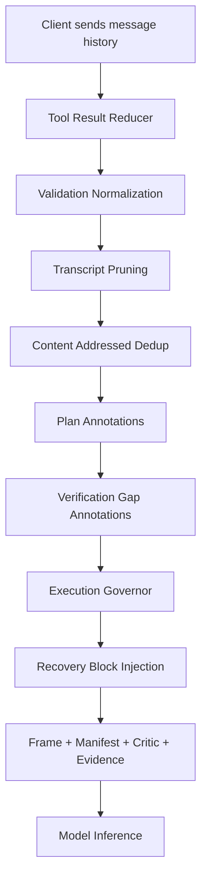

# Execution Governor Harness

The execution governor is the between-turn behavior controller in Yarn. It analyzes the trailing message history on every request, detects repetitive or unproductive agent patterns, and either pauses the loop with a recovery prompt or nudges the model toward better behavior.

**Owner:** `base/yarn-ts/src/governance/execution-governor.ts`
**Feature flag:** `SYNESIS_YARN_EXECUTION_GOVERNOR_ENABLED` (default `true`)
**Soft-fail flag:** `SYNESIS_YARN_EXECUTION_GOVERNOR_SOFT_FAIL_ENABLED` (injects recovery instead of returning an error)

## Architecture



The governor runs **after** message normalization / reduction and **before** model inference. It receives the full normalized message array and produces an `ExecutionGovernorDecision`.

When recovery escalation reaches hard stop, Yarn now emits a transport-agnostic pause contract (`synesis_governor_pause`) alongside human-readable text. See [`GOVERNOR_PAUSE_ENVELOPE.md`](./GOVERNOR_PAUSE_ENVELOPE.md) for schema and integration guidance.

## Core Data Types

```typescript
interface ExecutionGovernorDecision {
  pause: boolean;
  reason: string;
  suggestedNextStep?: string;
  matchedRules: string[];
  telemetry: {
    repeatedTestCommands: number;
    repeatedReadSearchCalls: number;
    repeatedBroadDiscoveryCalls: number;
    totalBroadDiscoveryCalls: number;
    broadTestRepeat: boolean;
    noEditEvidence: boolean;
    trailingVerificationRunLength: number;
  };
}
```

When `pause` is true and soft-fail is enabled, Yarn:
1. Generates an XML recovery block via `executionGovernorRecoveryRewriteBlock()`
2. Injects it as a system message before the last user message
3. Restricts the tool set (removes verification/discovery tools to break the loop)

## Governance Profiles

Profiles control how aggressively the governor intervenes. Set via `SYNESIS_YARN_GOVERNANCE_PROFILE`.

| Threshold | `balanced_completion` (default) | `safety_strict` | `strict_control` |
|-----------|--------------------------------|-----------------|------------------|
| `repeatedTestPauseThreshold` | 2 | 4 | 1 |
| `repeatedReadSearchPauseThreshold` | 5 | 8 | 3 |
| `totalBroadDiscoveryPauseThreshold` | 4 | 8 | 3 |
| `repeatedBroadDiscoveryPauseThreshold` | 2 | 4 | 1 |
| `broadVerificationNoticeThreshold` | 3 | 6 | 2 |
| `broadVerificationBlockThreshold` | 4 | 8 | 3 |
| `verificationStallThreshold` | 6 | 10 | 4 |
| `explorationStallThreshold` | 6 | 8 | 3 |

When a plan file was read in the event window (`hasPlanInContext`), the exploration stall threshold is lowered by 2 (minimum 2). This catches post-plan-load waffling faster.

- **`safety_strict`**: Prioritizes runaway safety over behavior policing. More retries before pause.
- **`balanced_completion`**: Production default. Soft steering with safety protections.
- **`strict_control`**: Aggressive policing for debugging and forensic runs.

## Rule Catalog

Each rule fires when specific patterns are detected in the trailing message history. Rules are evaluated in priority order; the first matching `pause: true` rule wins.

### Pause Rules (hard intervention)

| Rule | Trigger | Recovery Guidance |
|------|---------|-------------------|
| `dependency_install_replay` | Same install command repeated without code changes | Move on if install succeeded; investigate error if it failed |
| `verification_same_failure_signature_replay` | Same compile/build failure replayed without edits | Make one code fix at the reported location, then run narrow verification |
| `edit_failure_replay` | Same file edit error replayed (e.g. search string not found) | Read the file first, adjust the edit to match actual content |
| `task_creation_replay` | Same task/todo creation repeated | Stop creating tasks; execute the task instead |
| `declaration_followthrough_required` | Model declares intent ("I'll do X") but only runs verification commands | Stop narrating; execute the stated action with a tool call |
| `completion_claim_requires_task_update` | Model claims completion without calling TaskUpdate/TodoWrite | Call TaskUpdate or TodoWrite before claiming done |
| `verification_fail_repeat_block` | 2+ failing verification results with no edits between them | Stop re-running; make a code fix |
| `verbal_intent_without_action` | 3+ turns of verbal intent without corresponding tool actions | Execute one concrete tool call that advances the goal |
| `verification_stall_no_edit` | Trailing run of verification + re-read commands exceeds threshold, with repeats and no edits | Stop running build/test/read commands; make an edit or update the plan |
| `exploration_stall_no_edit` | Trailing run of search/read/glob/list commands exceeds threshold, with repeats and no edits | Stop exploring; trust plan status markers if loaded; make one concrete edit |
| `verification_truncated_output` | Verification output truncated, replayed without edits | Narrow the verification scope or fix the underlying issue |
| `no_test_files_repeat` | `[no test files]` result repeated without creating a test file | Create a test file, then run tests once |
| `broad_discovery_repeat` | Total or repeated broad discovery calls exceed threshold | Stop broad discovery; read specific files |

### Nudge Rules (soft guidance, `pause: false`)

| Rule | Trigger | Guidance |
|------|---------|----------|
| `broad_to_narrow_verification` | Broad verification commands detected | Narrow to package/file-level verification |
| `edit_before_retest` | Repeated test commands after failures without edits | Make an edit before re-testing |
| `no_repeat_without_change` | Broad test repeat with no edit evidence | Make a change before re-running |
| `git_commit_followthrough` | `git add` without subsequent `git commit` | Complete the commit |
| `verification_done_report` | Successful verification repeated without edits | Report success and proceed to next task |
| `verification_no_signal_repeat` | Verification with no signal repeated | Investigate or move on |
| `verification_already_green` | Broad verification passing but repeated | Tests pass; move to next step |
| `verification_green_repeat_block` | Broad verification passing repeated beyond threshold | Hard block on further broad verification until an edit |
| `bounded_exploration_budget` | Excessive read/search calls | Limit reads to 3 files tied to a hypothesis |
| `test_entry_contract` | Test run without discovering test config first | Inspect test conventions before running |
| `cleanup_todo_harvest` | Cleanup edits without TODO/FIXME discovery | Search for TODOs first |

## Telemetry Schema

Governor telemetry flows into four observability channels:

### 1. Session Events (Postgres `yarn_session_events`)

Every governor evaluation emits:

```json
{
  "eventKind": "execution_governor_evaluated",
  "component": "execution-governor",
  "detail": "rules=broad_to_narrow_verification,edit_before_retest pause=false",
  "metadataJson": {
    "pause": false,
    "reason": "allow",
    "matched_rules": ["broad_to_narrow_verification", "edit_before_retest"],
    "suggested_next_step": "...",
    "telemetry": {
      "repeatedTestCommands": 2,
      "repeatedReadSearchCalls": 0,
      "repeatedBroadDiscoveryCalls": 0,
      "totalBroadDiscoveryCalls": 1,
      "broadTestRepeat": true,
      "noEditEvidence": true,
      "trailingVerificationRunLength": 4
    }
  }
}
```

When soft-fail recovery fires, a second event is emitted:

```json
{
  "eventKind": "execution_governor_recovery_rewrite",
  "component": "execution-governor",
  "detail": "Rewrote loop path (verification_stall_no_edit); removed_tools=Bash,Shell"
}
```

### 2. Request Trajectory (Postgres `yarn_session_events`)

The `request_trajectory_v1` event includes a `governor` block and `training_signals`:

```json
{
  "governor": {
    "pause": true,
    "reason": "verification_stall_no_edit",
    "matched_rules": ["verification_stall_no_edit"],
    "telemetry": { ... }
  },
  "training_signals": {
    "governor_intervened": true,
    "governor_rules": ["verification_stall_no_edit"],
    "no_edit_evidence": true,
    "trailing_verification_stall": true,
    "false_green_detected": false,
    "evidence_delta": "unknown"
  }
}
```

### 3. Trace Record (Postgres `yarn_traces.full_record`)

Governor data is embedded in the `decision_ledger` and `trace_context` via `DecisionSnapshot`:

```json
{
  "decision_ledger": [{
    "path": "inference_first",
    "tier": "mid",
    "governorPause": true,
    "governorRules": ["no_test_files_repeat"],
    "governorReason": "no_test_files_repeat"
  }],
  "trace_context": {
    "governorTelemetry": {
      "repeatedTestCommands": 3,
      "noEditEvidence": true,
      "trailingVerificationRunLength": 5
    }
  }
}
```

### 4. OTEL Spans

Each governor evaluation is wrapped in a `yarn.execution_governor.evaluate` span with attributes:

| Attribute | Type | Description |
|-----------|------|-------------|
| `governor.pause` | boolean | Whether the governor paused the loop |
| `governor.reason` | string | Primary matched rule or "allow" |
| `governor.matched_rules` | string | Comma-separated matched rules |
| `governor.trailing_verification_run` | number | Length of trailing verification command sequence |
| `governor.no_edit_evidence` | boolean | Whether the trailing sequence lacks edits |

### 5. Session Metadata (Redis)

Per-session counters persisted across requests:

| Key | Type | Description |
|-----|------|-------------|
| `last_governor_pause` | boolean | Whether the last evaluation paused |
| `last_governor_rules` | string[] | Rules matched on the last evaluation |
| `governor_pause_count` | number | Running total of governor pauses in the session |

## Training Signal Mapping

Governor telemetry connects to the training pipeline defined in [qwen-stability-feedback-loop.md](qwen-stability-feedback-loop.md).

### Trajectory Data Contract Integration

| Trajectory Field | Governor Source | Usage |
|-----------------|----------------|-------|
| `failure_tags[]` | `training_signals.governor_rules` | Auto-label trajectories by failure class (e.g. `verification_stall_no_edit`) |
| `quality_signals` | `training_signals.governor_intervened`, `no_edit_evidence`, `trailing_verification_stall` | Compute quality scores; penalize governor-intervened trajectories |
| `outcome` | `governor.pause` | Sessions with high `governor_pause_count` are candidate "rejected" for DPO |

### Training Workflows

- **Negative example tagging**: Any trajectory with `governor_intervened=true` is a candidate negative for SFT filtering or the "rejected" side of DPO pairs
- **Failure class labeling**: `governor_rules` values map directly to `failure_tags[]` for granular analysis
- **Reward signal**: `governor_pause_count` per session inversely correlates with trajectory quality; usable as a soft reward for RLAIF

### Auto-Labeling Query

```sql
SELECT
  se.session_key,
  se.metadata_json->'training_signals'->>'governor_intervened' AS intervened,
  se.metadata_json->'training_signals'->'governor_rules' AS rules,
  se.metadata_json->'outcome'->>'state' AS outcome
FROM yarn_session_events se
WHERE se.event_kind = 'request_trajectory_v1'
  AND se.created_at > NOW() - INTERVAL '7 days'
  AND (se.metadata_json->'training_signals'->>'governor_intervened')::boolean = true
ORDER BY se.created_at DESC;
```

## Querying Governor Data

### All governor pauses in the last 24 hours

```sql
SELECT
  se.session_key,
  se.request_id,
  se.metadata_json->>'reason' AS reason,
  se.metadata_json->'matched_rules' AS rules,
  se.metadata_json->'telemetry' AS telemetry,
  se.created_at
FROM yarn_session_events se
WHERE se.event_kind = 'execution_governor_evaluated'
  AND (se.metadata_json->>'pause')::boolean = true
  AND se.created_at > NOW() - INTERVAL '24 hours'
ORDER BY se.created_at DESC;
```

### Governor rule frequency distribution

```sql
SELECT
  rule,
  COUNT(*) AS occurrences
FROM yarn_session_events se,
  jsonb_array_elements_text(se.metadata_json->'matched_rules') AS rule
WHERE se.event_kind = 'execution_governor_evaluated'
  AND se.created_at > NOW() - INTERVAL '7 days'
GROUP BY rule
ORDER BY occurrences DESC;
```

### Sessions with highest governor intervention rate

```sql
SELECT
  se.session_key,
  COUNT(*) FILTER (WHERE (se.metadata_json->>'pause')::boolean = true) AS pause_count,
  COUNT(*) AS total_evaluations,
  ROUND(
    COUNT(*) FILTER (WHERE (se.metadata_json->>'pause')::boolean = true)::numeric
    / NULLIF(COUNT(*), 0), 3
  ) AS pause_rate
FROM yarn_session_events se
WHERE se.event_kind = 'execution_governor_evaluated'
  AND se.created_at > NOW() - INTERVAL '7 days'
GROUP BY se.session_key
HAVING COUNT(*) >= 3
ORDER BY pause_rate DESC
LIMIT 20;
```

### Trace-level governor data

```sql
SELECT
  t.request_id,
  t.full_record->'decision_ledger'->0->>'governorPause' AS pause,
  t.full_record->'decision_ledger'->0->'governorRules' AS rules,
  t.full_record->'trace_context'->'governorTelemetry' AS telemetry
FROM yarn_traces t
WHERE t.full_record->'decision_ledger'->0->>'governorPause' IS NOT NULL
  AND t.created_at > NOW() - INTERVAL '24 hours'
ORDER BY t.created_at DESC
LIMIT 50;
```

## Plan Write Safety

Plan files (`.claude/plans/*.md`) are protected by a dedicated write-validation layer in `tool-call-governance.ts`. Every tool call that targets a plan file is intercepted before the client executes it.

### Content Shadow

A **PlanContentShadow** tracks the last-known-good plan content per session:

| Field | Type | Source |
|-------|------|--------|
| `path` | string | Extracted from `annotatePlanFileReads` |
| `contentHash` | SHA-256 (16 hex) | Computed from successful plan read content |
| `contentLength` | number | Byte length of last read |
| `todos` | `PlanTodoEntry[]` | Parsed from YAML frontmatter `todos:` block |
| `lastReadAt` | timestamp | When the shadow was last refreshed |

Stored in `session.record.metadata.plan_content_shadow`. Populated from every successful (non-stub) plan file read.

### Validation Checks

`validatePlanFileWrite` runs these checks in order, blocking on first failure:

| Check | Applies To | Rule |
|-------|-----------|------|
| **Stub/metadata rejection** | All writes | Blocks known stub phrases: "unchanged since last read", `<FILE_UNCHANGED`, `<SYNESIS_TOOL_GUARDRAIL`, "no plan file exists yet", etc. |
| **Content too short** | Full Write | Blocks if content < 20 characters |
| **Size regression** | Full Write (with shadow) | Blocks if proposed content < 30% of shadow length |
| **Structure validation** | Full Write | Requires `---` YAML frontmatter delimiter |
| **Monotonic step transitions** | Full Write (with shadow todos) | Step status can only advance: `pending → in_progress → completed`, `* → cancelled`. Regressions are blocked. |

Partial edits (`Edit` tool with `old_string`/`new_string`) skip structure and size regression checks but still block stub phrases.

### Allowed Status Transitions

```
pending → pending | in_progress | completed | cancelled
in_progress → in_progress | completed | cancelled
completed → completed (only)
cancelled → cancelled (only)
```

### Bash Heredoc Coverage

Bash commands that write to plan files via `cat >`, `tee`, or `echo >` are also intercepted. The heredoc body is extracted and validated with the same rules.

### Audit Events

Every plan write validation emits a session event:

- **`plan_file_write_allowed`** — write passed all checks
- **`plan_file_write_blocked`** — write failed validation

Metadata includes: `path`, `allowed`, `reason`, `proposedContentHash`, `shadowContentHash`.

### Recovery on Block

When a plan write is blocked, the client receives a synthetic error tool result with structured guidance:

```
[Plan write blocked: {reason}]
The proposed write to {path} was rejected because: {reason}.
Re-read the plan file with Read({path}) to get the current content, then retry your edit.
```

### Implementation Files

| File | Role |
|------|------|
| `src/planning/plan-content-shadow.ts` | Shadow types, YAML parser, monotonicity checker, content validation |
| `src/path-governance/tool-call-governance.ts` | `validatePlanFileWrite`, Bash heredoc detection, wired into `governToolCall` |
| `src/index.ts` | Shadow extraction from plan reads, audit event emission |
| `tests/plan-content-shadow.test.ts` | Unit tests for shadow module |
| `tests/path-governance.test.ts` | Integration tests for plan write governance |

## Artifact Shadow Governance

The governor now consults an **ArtifactReadShadow** for every file the model has interacted with, not just plan files. This bridges `FileSnapshotRegistry` (which already tracks per-file content hashes, completeness, and turn indices) into the governor's decision path.

### ArtifactReadShadow

| Field | Type | Description |
|-------|------|-------------|
| `canonicalPath` | string | Absolute resolved file path |
| `contentHash` | string | SHA-256 content hash from last read |
| `contentLength` | number | Byte length of last read content |
| `completeness` | `"full" \| "partial"` | Whether the model read the entire file or a line range |
| `lastReadTurn` | number | Turn index of the last real (non-stub) read |
| `lastEditTurn` | number? | Turn index of the last write/edit to this path |
| `readReturnedContent` | boolean | False when last read returned a dedup stub, not content |
| `stale` | boolean | True when file was edited after the last real read |

### Stale-Write and Stub-Content Detection

When a write/edit tool targets a file with `stale: true`, `governToolCall` blocks the write with a synthetic error directing the model to re-read. Non-plan file writes are also checked for known stub phrases (`FILE_UNCHANGED`, `SYNESIS_TOOL_GUARDRAIL`, etc.).

### Protection Parity (Plan vs Non-Plan)

| Protection | Plan files | Non-plan files |
|---|---|---|
| Content shadow (hash, length, last read) | `PlanContentShadow` | `ArtifactReadShadow` via `FileSnapshotRegistry` |
| Stub phrase blocking on write | Yes | Yes |
| Size regression check | Yes (< 30% of shadow) | No |
| Stale-read detection before write | Yes | Yes |
| Read-returned-content tracking | Yes (annotations) | Yes (`readReturnedContent` flag) |

### Implementation Files

| File | Role |
|------|------|
| `src/governance/artifact-shadow.ts` | `ArtifactReadShadow` type, `buildArtifactShadows`, `summarizeArtifactContext` |
| `src/path-governance/tool-call-governance.ts` | Stale-write detection, stub-content blocking for non-plan writes |
| `tests/artifact-shadow.test.ts` | Unit tests for shadow projection and staleness |

## Evidence Delta Tracking

The governor computes a structured **TurnEvidenceDelta** on each evaluation, replacing the previous `evidence_delta: "unknown"` placeholder in training signals.

### TurnEvidenceDelta Schema

| Field | Type | Description |
|-------|------|-------------|
| `previousFailureSignature` | string? | Normalized failure signature from the previous turn |
| `currentFailureSignature` | string? | Normalized failure signature from this turn |
| `signatureChanged` | boolean | Whether the failure signature changed between turns |
| `failureCountDelta` | number | Change in error line count (negative = improvement) |
| `seenSignatures` | `Set<string>` | All distinct failure signatures seen this session |
| `regressionDetected` | boolean | Current signature matches a previously-resolved one |

### Recovery Streak Modulation

| Condition | Streak adjustment | Rationale |
|-----------|-------------------|-----------|
| `failureCountDelta < 0` | -2 | Real progress toward green |
| `newArtifactCreated` | -1 | Test file created |
| `signatureChanged`, count same or higher | 0 (hold) | Different problem, not improvement |
| Same failure replayed | +1 | No progress |
| `regressionDetected` | +2 | Going backward |

### Training Signal Export

`training_signals.evidence_delta` now exports: `"improved"`, `"changed"`, `"stalled"`, `"regressed"`, or `"unknown"`.

### Implementation Files

| File | Role |
|------|------|
| `src/governance/evidence-delta.ts` | `TurnEvidenceDelta`, `computeEvidenceDelta`, `summarizeEvidenceDelta`, `evidenceDeltaStreakAdjustment` |
| `tests/evidence-delta.test.ts` | Unit tests for delta computation, summary, and streak adjustment |

## Transition Guards

Transition guards gate phase transitions without adding new phases to the FSM.

| Guard | Trigger | Effect |
|-------|---------|--------|
| `needs_fresh_read` | Edited file has `stale: true` | Blocks premature completion |
| `partial_context` | Edited file has `completeness: "partial"` | Warns about incomplete view |
| `needs_relevant_verification` | Verification scope doesn't intersect changed files | Blocks finalization |
| `false_green_suspected` | Green verification + irrelevant scope | Demotes `finalize` to `verify` |
| `completion_blocked` | Any blocking guard active | Prevents completion claim |

When `false_green_suspected` is active, `detectSessionPhase` demotes `finalize` back to `verify` and fires the `false_green_suspected` rule. Guards are exposed in `telemetry.activeGuards` and `training_signals.false_green_detected`.

## Known Gaps and Roadmap

| Gap | Description | Status |
|-----|-------------|--------|
| Result classification blind spots | Missing classifiers for environment blockers; `isVerificationCommand` does not cover tsc/make/bazel/mypy | Planned |
| Evidence progression tracking | `TurnEvidenceDelta` with `seenSignatures` and regression detection | **Shipped** |
| Retry budgets by failure class | No per-class counters (compile, test, env, false-green) with exhaustion triggers | Planned |
| Contradiction-triggered re-plan | No detection when plan assumes a file/module exists but it does not | Planned |
| Artifact-presence checks | `ArtifactReadShadow` with stale-write and stub-content blocking | **Shipped** |
| False-green detection | `TransitionGuard: false_green_suspected` blocks `Verify → Finalize` on irrelevant green | **Shipped** |
| Structured step-state schema | No `StepVerdict` type integrated with PlanGraph nodes | Planned |
| Targeted verification | Recovery blocks do not include the exact narrowed command from `suggestScopedVerificationCommand` | Planned |
| LLM verifier evaluation | Evaluate whether ambiguous classifications warrant a lightweight LLM verifier pass | Planned |
| Expanded telemetry export | Internal counters not fully surfaced | Planned |

## Regression Testing with Eval Gym

The [Eval Gym](EVAL_GYM.md) provides automated regression testing for
all governor rules. Each waffling pattern that has been fixed has a
corresponding scenario in `base/yarn-ts/src/eval/scenarios/governor-regression.ts`.

**Running governor regression tests:**

```bash
cd base/yarn-ts
SYNESIS_EVAL_TARGET_URL=http://yarn:8000 \
SYNESIS_TEST_PAT_TOKEN=... \
npm run eval:regression
```

**Built-in governor regression scenarios:**

| Scenario | Governor Rule Tested |
|----------|---------------------|
| `plan-load-exploration-drift` | `exploration_stall_no_edit` |
| `plan-update-amnesia-loop` | `SYNESIS_PLAN_ALREADY_UPDATED` annotation |
| `verification-stall-no-edit` | `verification_stall_no_edit` |
| `verbal-intent-without-action` | `verbal_intent_without_action` |
| `no-test-files-repeat` | `no_test_files_repeat` + `SYNESIS_VERIFICATION_GAP` |
| `broad-discovery-repeat` | `exploration_stall_no_edit` / `broad_discovery_repeat` |
| `plan-stub-overwrite` | Plan write validation (path governance) |

**After adding a new governor rule**, create a regression scenario to
prevent the rule from being accidentally disabled or weakened. See the
[Scenario Authoring Guide](EVAL_GYM.md#scenario-authoring-guide) for
step-by-step instructions.

## Related Documentation

- [GOVERNOR_STATE_GRAPH.md](./GOVERNOR_STATE_GRAPH.md) -- visual state/loop map for governor phases and escalation
- [EVAL_GYM.md](EVAL_GYM.md) -- integrated exerciser, observer, and training data pipeline
- [observability-verification-and-evals.md](observability-verification-and-evals.md) -- trace analytics and eval harness
- [qwen-stability-feedback-loop.md](qwen-stability-feedback-loop.md) -- closed-loop training pipeline and trajectory contract
- [safety-reliability-and-fail-safe.md](safety-reliability-and-fail-safe.md) -- invariants and fail-safe principles
- [HARNESS_INTAKE_PLAYBOOK.md](HARNESS_INTAKE_PLAYBOOK.md) -- mapping external patterns to Yarn implementation
- [constraint-governance.md](constraint-governance.md) -- product/policy governance model
