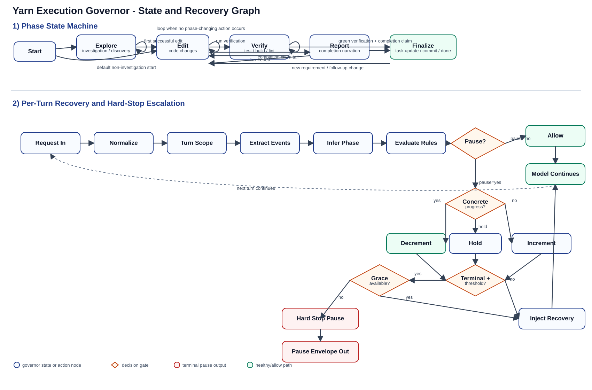
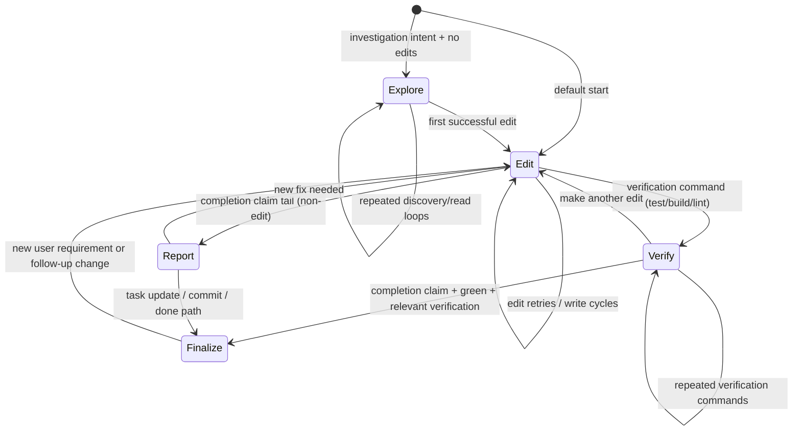
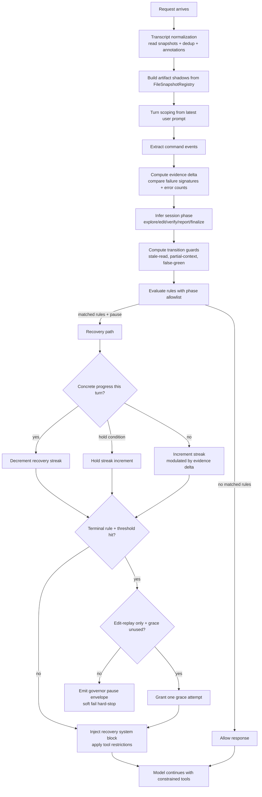
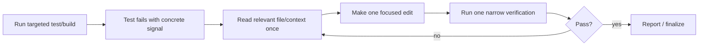
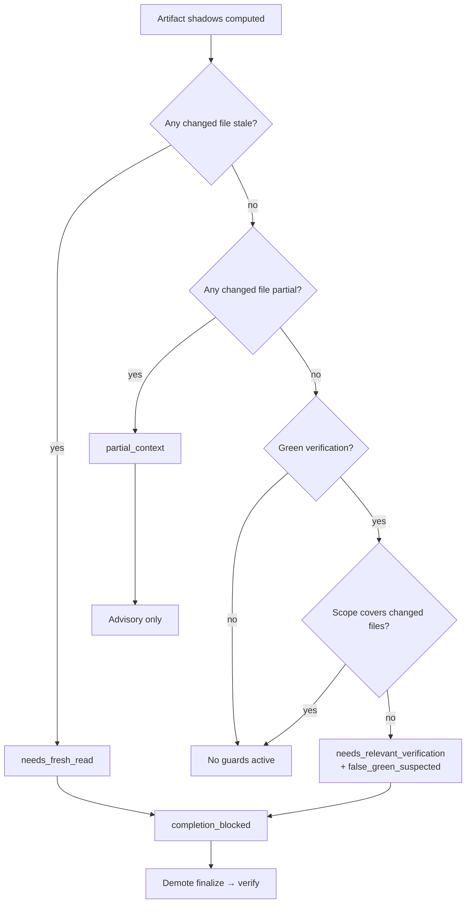

# Governor State Graph

Visual map of how the Yarn execution governor behaves across phases, loop detection, recovery rewrites, and hard-stop escalation.

Primary implementation references:

- `base/yarn-ts/src/governance/execution-governor.ts`
- `base/yarn-ts/src/governance/artifact-shadow.ts`
- `base/yarn-ts/src/governance/evidence-delta.ts`
- `base/yarn-ts/src/index.ts`

Static SVG render (for viewers that do not render Mermaid):

---

## 1) Phase State Machine

---

## 2) Per-Turn Governor Decision Pipeline

---

## 3) Expected Healthy Failure-Repair Loop

This is the target behavior when tests fail.

If the model keeps rerunning verification with no edit, governor rules like:

- `verification_fail_repeat_block`
- `verification_same_failure_signature_replay`
- `verification_churn_no_edit`

should push it back to **T4 (focused edit)**, not endless test loops.

---

## 4) Escalation Semantics (Current)

- Recovery streak is tracked per session and adjusted by progress signals.
- Evidence delta modulates streak increment: regression = +2, stalled = +1, improvement = -2.
- Hard-stop threshold is `7`.
- One-time grace exists for pure edit-replay terminal cases before final pause.
- Hard-stop emits a structured pause envelope (`synesis_governor_pause`) plus human guidance.

---

## 5) Where to Tune Behavior

- Rule matching + phase gating: `base/yarn-ts/src/governance/execution-governor.ts`
- Artifact shadow projection: `base/yarn-ts/src/governance/artifact-shadow.ts`
- Evidence delta computation: `base/yarn-ts/src/governance/evidence-delta.ts`
- Recovery streak, hard-stop grace, terminal filtering, tool restriction wiring: `base/yarn-ts/src/index.ts`
- Latest-tool progress classification: `base/yarn-ts/src/governance/recovery-progress.ts`

---

## 6) Transition Guard Decision

