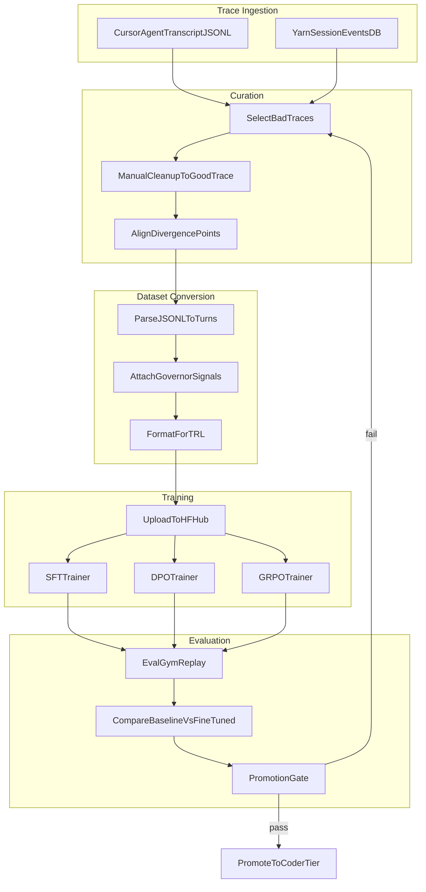

# Trajectory Fine-Tuning from Agent Traces

Fine-tuning Qwen3-Coder using real agent session traces to reduce
loop fragility, path hallucination, and unproductive retry patterns.

## Premise

The execution governor detects and intervenes on bad model behavior
at runtime. But intervention is reactive — the model has already
wasted tokens and user patience by the time a pause fires. If we
can show the model what "good" looks like at the decision points
where it currently fails, we shift correction from runtime to
weights.

We already capture the raw material:

- **Agent transcripts** (Cursor JSONL) record every tool call and result
- **`training_signals`** tag each request with governor outcomes
- **`evidence_delta`** tracks whether the model made real progress
- **Eval gym** produces synthetic scenarios with known-good outcomes

The missing piece is a pipeline that converts paired bad/good traces
into training-ready datasets for SFT and DPO.

## What Exists Today

| Component | Location | Status |
|-----------|----------|--------|
| Training materializer (SFT, DPO, RLAIF from eval gym) | `base/yarn-ts/src/eval/training-materializer.ts` | Implemented |
| Training types (`SftExample`, `DpoExample`, `RlaifExample`) | `base/yarn-ts/src/eval/types.ts` | Implemented |
| Feedback loop export API | `GET /runs/{id}/dataset?dataset_type=eval_gym` | Implemented |
| CLI export (`feedback-loop-runner.py`) | `scripts/feedback-loop-runner.py` | Implemented |
| `training_signals` on `request_trajectory_v1` | `base/yarn-ts/src/index.ts` | Implemented |
| `evidence_delta` (improved/changed/stalled/regressed) | `base/yarn-ts/src/governance/evidence-delta.ts` | Implemented |
| Governor telemetry (phase, guards, matched rules) | `base/yarn-ts/src/governance/execution-governor.ts` | Implemented |
| Cursor agent transcript capture | `agent-transcripts/<uuid>.jsonl` | Implemented |
| Trace-to-training conversion for live sessions | — | **Not implemented** |
| Paired bad/good trace alignment | — | **Not implemented** |
| Human trace editing/cleanup tooling | — | **Not implemented** |

The eval gym materializer (`training-materializer.ts`) produces
DPO pairs from governor interventions within synthetic scenarios.
What it does *not* handle is converting real production traces —
especially human-curated "bad trace / cleaned good trace" pairs —
into the same training formats.

## Trace Format

Cursor agent transcripts are JSONL with one JSON object per line:

```jsonl
{"role":"assistant","message":{"content":[
  {"type":"text","text":"I'll read the file first."},
  {"type":"tool_use","name":"Read","input":{"path":"/path/to/file.ts"}}
]}}
{"role":"user","message":{"content":[
  {"type":"text","text":"<tool_result>...file contents...</tool_result>"}
]}}
```

Each line has `role` ("user" or "assistant") and `message.content`
as an array of blocks, where each block is either `type: "text"` or
`type: "tool_use"` (with `name` and `input`).

Tool results appear as user messages (matching Claude's protocol
where tool results are returned as user-role content).

## Training Approaches

### Approach 1: SFT on Good Traces Only

**When to use:** You have 50-200 curated "good" traces showing
efficient task completion without loops or hallucination.

**Method:**
1. Take the good trace JSONL
2. Extract the multi-turn conversation (system + user/assistant alternation)
3. Flatten tool_use blocks into the assistant content as the model would emit them
4. Format as Qwen3-Coder chat template with tool definitions
5. Train with standard SFT (LoRA on attention + MLP layers)

**Strengths:** Simple, stable training. The model learns the
"shape" of productive sessions.

**Weaknesses:** Does not explicitly teach what to avoid. The model
may still fall into bad patterns not represented in training data.

**Data format (TRL `SFTTrainer`):**

```json
{
  "messages": [
    {"role": "system", "content": "...system prompt with tool definitions..."},
    {"role": "user", "content": "Add error handling to the parse function"},
    {"role": "assistant", "content": null, "tool_calls": [
      {"type": "function", "function": {"name": "Read", "arguments": "{\"path\": \"src/parser.ts\"}"}}
    ]},
    {"role": "tool", "content": "...file contents..."},
    {"role": "assistant", "content": null, "tool_calls": [
      {"type": "function", "function": {"name": "Update", "arguments": "{\"path\": \"src/parser.ts\", ...}"}}
    ]},
    {"role": "tool", "content": "File updated."},
    {"role": "assistant", "content": "Done. Added try/catch around the JSON.parse call."}
  ],
  "source": "curated_trace",
  "quality_label": "positive"
}
```

### Approach 2: DPO with Paired Bad/Good Traces

**When to use:** You have specific failure patterns (parallel test
cancellation loops, path hallucination after compaction, stale-read
retry spirals) and have manually cleaned up the trace to show what
the model *should* have done.

**Method:**
1. Identify the divergence point in the bad trace
2. Everything before the divergence is the **prompt**
3. The bad trace's assistant turn at divergence is **rejected**
4. The good trace's assistant turn at divergence is **chosen**
5. Repeat for each divergence point in the trace pair

**Strengths:** Directly teaches "prefer this over that" at exact
decision points. Much more sample-efficient than SFT for targeted
behavioral correction.

**Weaknesses:** Requires careful alignment of trace pairs. The
divergence point must be identified correctly or the signal is noise.

**Data format (TRL `DPOTrainer`):**

```json
{
  "prompt": [
    {"role": "system", "content": "..."},
    {"role": "user", "content": "Fix the failing test"},
    {"role": "assistant", "content": null, "tool_calls": [...]},
    {"role": "tool", "content": "--- FAIL: TestApply_Wildcard ..."},
  ],
  "chosen": [
    {"role": "assistant", "content": null, "tool_calls": [
      {"type": "function", "function": {"name": "Read", "arguments": "{\"path\": \"pkg/jq/jq.go\"}"}}
    ]}
  ],
  "rejected": [
    {"role": "assistant", "content": null, "tool_calls": [
      {"type": "function", "function": {"name": "Bash", "arguments": "{\"command\": \"go test ./pkg/jq/... -v\"}"}}
    ]}
  ],
  "source": "curated_trace_pair",
  "failure_tags": ["parallel_test_cancellation_loop"]
}
```

### Approach 3: GRPO with Governor Reward Signal

**When to use:** You have a large volume of traces (500+) with
governor telemetry but not enough human curation time to build
clean pairs.

**Method:**
1. Each trace step gets a reward derived from governor signals:
   - No intervention, evidence improved: +1.0
   - No intervention, evidence stalled: +0.2
   - Governor warning: -0.3
   - Governor pause: -0.7
   - Governor hard stop: -1.0
   - Recovery streak reset (real progress after intervention): +0.5
2. Train with group-relative policy optimization using these rewards
3. The model learns to maximize the reward signal across trajectories

**Strengths:** Scales with volume. Does not require manual curation.
Leverages the governor as an automatic reward model.

**Weaknesses:** Reward signal is noisy (governor can misfire).
Requires more data and compute than DPO. GRPO implementation is
more complex than SFT/DPO.

## Recommended Starting Point

Start with **DPO on 20-50 curated trace pairs** targeting the
three most common failure modes:

1. **Stale-read loop after compaction** — model reads file, gets
   `Unchanged since last read`, retries identically. Good trace:
   model re-reads with explicit range or reads a different file.

2. **Parallel tool cancellation spiral** — model launches parallel
   bash commands, one fails, siblings cancel, model retries the
   same parallel batch. Good trace: model runs the failing command
   alone first, then runs others after it passes.

3. **Path hallucination after compaction** — model loses context,
   reconstructs path incorrectly (`Users/bymiller/...` instead of
   `/Users/bymiller/...`), gets "File does not exist", retries with
   different wrong paths. Good trace: model uses relative path from
   project root or verifies cwd first.

These three patterns account for the majority of governor hard
stops in production sessions and are highly amenable to DPO because
the "good" behavior is obvious and easy to curate.

## Pipeline Architecture



## Implementation Plan

### Phase 1: Trace Converter (script)

A CLI script that reads Cursor agent transcript JSONL and produces
TRL-compatible training data.

**Input:** One or two JSONL files (bad trace, optionally good trace).

**Output:** JSONL in SFT or DPO format.

**Key operations:**
- Parse `role` + `message.content[]` blocks from Cursor format
- Convert `tool_use` blocks to OpenAI-style `tool_calls` (Qwen3-Coder
  uses OpenAI chat format for training even though inference uses XML
  that vLLM parses server-side)
- Convert tool result user messages to `role: "tool"` messages
- For DPO: accept a `--divergence-turn N` flag or auto-detect the
  first turn where bad and good traces differ
- Attach `training_signals` metadata from yarn session events if
  session ID is available
- Validate tool call argument JSON is well-formed

**Location:** `scripts/trace-to-training.ts` (TypeScript, reuses
existing types from `base/yarn-ts/src/eval/types.ts`)

### Phase 2: Curation Workflow

A lightweight process for building paired traces:

1. **Identify bad trace:** Governor hard-stopped, or user reported
   the session was unproductive. Tag with failure class.
2. **Copy to editing directory:** `training/traces/raw/<session-id>/`
3. **Edit the trace:** Create `good.jsonl` alongside `bad.jsonl`.
   Only modify turns at and after the divergence point. Keep
   everything before divergence identical.
4. **Run converter:** `npx tsx scripts/trace-to-training.ts dpo
   --bad bad.jsonl --good good.jsonl --out pair.jsonl`
5. **Validate:** Converter checks turn alignment, tool call format,
   and content hashes to ensure the prompt portion is identical.

### Phase 3: Training Run

Use TRL on Hugging Face Jobs or local GPU:

```bash
# DPO with LoRA on Qwen3-Coder
python -m trl dpo \
  --model_name_or_path Qwen/Qwen3-Coder-XXB \
  --dataset_name synesis/coder-trajectory-dpo \
  --learning_rate 5e-6 \
  --num_train_epochs 2 \
  --per_device_train_batch_size 1 \
  --gradient_accumulation_steps 8 \
  --lora_r 16 \
  --lora_alpha 32 \
  --lora_target_modules q_proj,k_proj,v_proj,o_proj,gate_proj,up_proj,down_proj \
  --max_prompt_length 8192 \
  --max_length 16384 \
  --bf16 \
  --output_dir ./checkpoints/coder-dpo
```

### Phase 4: Evaluation and Promotion

1. Deploy the LoRA adapter alongside the base model using
   `--lora-modules` in vLLM (see `docs/LORA_TRAINING_GUIDE.md`)
2. Route a percentage of traffic to the adapted model via LiteLLM
   model aliasing
3. Run the eval gym stability suites against both base and adapted
4. Compare governor intervention rates, completion rates, and
   tokens-per-success
5. Apply promotion gates from `qwen-stability-feedback-loop.md`

## Failure Mode Catalog

Target these patterns first when curating trace pairs:

| ID | Failure Mode | Governor Rules | DPO Signal |
|----|-------------|----------------|------------|
| FM-1 | Stale-read loop after compaction | `source_file_stale_reread` | Read with range vs identical re-read |
| FM-2 | Parallel tool cancellation spiral | `edit_failure_replay` | Sequential execution vs parallel batch |
| FM-3 | Path hallucination (missing `/`) | `edit_failure_replay` | Relative path vs hallucinated absolute |
| FM-4 | Broad discovery after files known | `broad_discovery_repeat` | Targeted read vs grep/glob sprawl |
| FM-5 | Verification stall without editing | `verification_stall_no_edit` | Edit first, then verify vs verify-loop |
| FM-6 | Test re-run without code change | `repeated_test_no_edit` | Apply fix, then test vs test-only loop |
| FM-7 | False-green completion attempt | `false_green_suspected` guard | Re-verify changed files vs skip to done |

## Scaling Considerations

**Volume targets:**
- 20-50 curated pairs: measurable improvement on targeted failure modes
- 100-200 curated pairs: broad behavioral improvement
- 500+ auto-labeled (GRPO): general stability lift

**Compute:**
- LoRA DPO on 30B model: 1x A100-80G, ~2-4 hours for 100 examples
- Full fine-tune is not recommended; LoRA preserves base capabilities

**Risk mitigation:**
- Always evaluate on held-out traces before promoting
- Keep the LoRA adapter separate; easy to roll back by removing
  `--lora-modules` from vLLM args
- Start with the `safety_strict` governance profile during eval to
  catch any regression the LoRA introduces

## Relationship to Existing Infrastructure

This pipeline complements the existing feedback loop:

- **Eval gym materializer** produces DPO pairs from synthetic
  scenarios where governor intervention is the signal. This new
  pipeline produces DPO pairs from real production sessions where
  human judgment is the signal.
- **Feedback loop export API** handles the eval gym dataset type.
  The trace converter should output the same `DpoExample` schema
  so it can be ingested through the same API with a new
  `dataset_type=curated_trace`.
- **Governor telemetry** enriches both pipelines. The `training_signals`
  and `evidence_delta` fields provide automatic quality labels that
  reduce manual curation effort.
