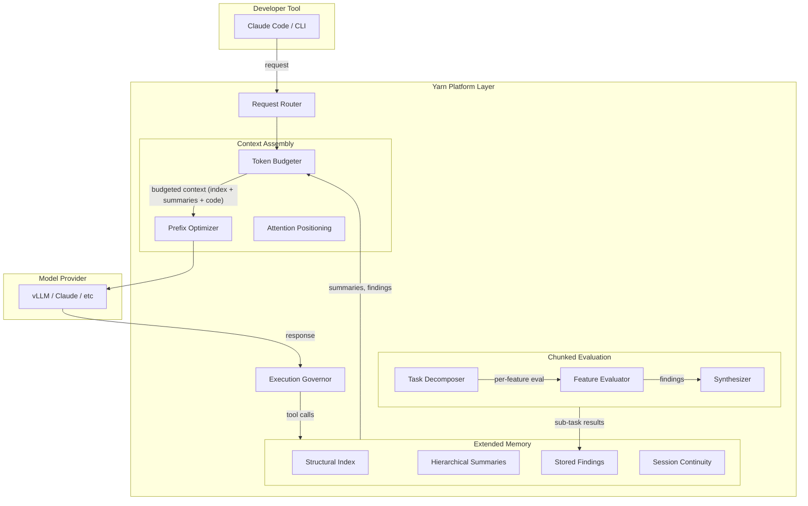

# Yarn Extended Memory: Hierarchical Codebase Understanding Beyond Context

Persistent memory architecture that lets models understand and evaluate large
codebases without exceeding context limits, using structural indices,
hierarchical summaries, and memory-augmented multi-pass workflows.

---

## Table of Contents

1. [Problem Statement](#problem-statement)
2. [Prior Art](#prior-art)
3. [Existing Building Blocks](#existing-building-blocks)
4. [Architecture](#architecture)
5. [Architecture Diagram](#architecture-diagram)
6. [Memory Tool APIs](#memory-tool-apis)
7. [Governor Integration](#governor-integration)
8. [Research References](#research-references)
9. [Implementation Status](#implementation-status)

---

## Problem Statement

When a model needs to validate that a project implements N features, the naive
approach is: read every file, hold it all in context, evaluate. This fails at
modest scale:

- A Go CLI of ~50-100 files is ~15k lines / ~60k raw tokens.
- The feature spec adds ~5k tokens.
- Tool calls, conversation history, and system prompts consume ~30-40k tokens.
- The model hits context pressure, begins truncating its own tool call JSON
  ("Invalid tool parameters"), and re-enters the discovery loop — re-reading
  files it already had.

The observed failure mode is cyclic: the model identifies what was done vs.
missing, attempts a plan, hits a tool parameter error from output truncation,
and restarts the entire discovery process. Content-addressed dedup prevents
re-transmitting identical file bodies but does not reduce the *number* of tool
rounds or the model's need to hold a mental map of the project.

The core constraint is that the model's context window is finite, but the
information needed to understand and evaluate a codebase is not. Yarn needs an
**external memory layer** that lets the model work with compact representations
and page in detail on demand.

## Prior Art

### Aider: Repo Map (AST Skeleton)

Uses tree-sitter to extract function/class signatures without bodies. A
15k-line codebase becomes ~1k tokens of signatures. The model sees the *shape*
of the code without the *bulk*. When it needs details, it requests specific
files.

Key insight: the map prioritizes identifiers that are *referenced across files*
(cross-file connective tissue). Local helpers are omitted. PageRank-style
scoring weights identifiers by how many files reference them.

### Claude Code: Subagent Isolation

Spawns explore subagents with isolated context windows. Each subagent
searches/reads and returns a summary. The parent never sees raw file contents —
only condensed findings. This is the primary mechanism that lets Claude Code
handle large repositories without context blowout.

### MemGPT / Letta: Virtual Context Management

Treats context like virtual memory — active working set in context, everything
else in external storage. The agent explicitly pages information in/out via
function calls. Two-tier: main context (RAM) + external storage (disk). The
model decides what to page in; the system enforces memory limits.

### SWE-Adept: Hierarchical Search

Agent-directed depth-first search through code dependencies. Starts broad
(project structure), narrows progressively. Uses working memory checkpoints to
avoid re-traversal. Two-agent framework with a planner and executor.

### OpenAI Codex: Long-Running Sandboxed Agent

Runs in an isolated environment with full file system access. Can work for
hours. Relies on `AGENTS.md` for project understanding rather than reading
everything. Tasks are scoped narrowly to avoid context pressure.

### Hierarchical Code Summarization (ICCSA 2025)

Three-level summaries: project-level, directory-level, file-level. Top-down
search narrows the space. Achieves Pass@10 of 0.89 for bug localization in
real repositories.

## Existing Building Blocks

Yarn already has several subsystems that serve as foundations for extended memory.

| Subsystem | What it does | Source |
|-----------|-------------|--------|
| Session continuity | Extracts task, findings, decisions, files from conversations; persists across sessions | [session-continuity.ts](../../base/yarn-ts/src/context/session-continuity.ts) |
| Sawtooth compaction | LLM-driven conversation summarization into `<ARCHITECTURAL_STATE>` blocks | [sawtooth-manager.ts](../../base/yarn-ts/src/context/sawtooth-manager.ts) |
| Working frame | Tracks current phase, files in play, goal | [working-frame-service.ts](../../base/yarn-ts/src/frame/working-frame-service.ts) |
| Plan graph | Structured task/stage tracking with progress signals | Plan graph in session state |
| Content-addressed dedup | Replaces repeated identical file reads with `<FILE_UNCHANGED>` stubs | [index.ts](../../base/yarn-ts/src/index.ts) |
| Session store (Redis) | CAS-protected session records with continuity, metadata, token counters | [session-store.ts](../../base/yarn-ts/src/state/session-store.ts) |
| Project manifest | File-path-based language/tool detection (Go, TS, Python, Rust) | [repo-scanner.ts](../../base/yarn-ts/src/manifest/repo-scanner.ts) |
| Execution governor | Between-turn behavior controller; detects loops and injects recovery | [execution-governor.ts](../../base/yarn-ts/src/governance/execution-governor.ts) |

These building blocks now feed the structural index, memory tools,
hierarchical summaries, and chunked evaluation workflow described below.

## Architecture

Four new layers, each building on the previous.

### Layer 1: Project Structural Index (the "Repo Map")

A persistent, compact representation of an entire codebase that fits in
~2-5% of the raw token count.

**Location:** `ProjectStructuralIndexService` in
[src/memory/structural-index.ts](../../base/yarn-ts/src/memory/structural-index.ts)

**Behavior:**

1. On first workspace handshake (or explicit trigger), run tree-sitter or
   lightweight AST extraction to produce:
   - File tree with sizes
   - Function/method/type signatures (no bodies)
   - Import/dependency graph edges
   - Test file mapping (which test covers which source)
2. Store as a structured JSON artifact in Redis (alongside session data in
   [session-store.ts](../../base/yarn-ts/src/state/session-store.ts)).
3. Inject a **token-budgeted** subset into each request's system context
   (analogous to Aider's `--map-tokens`).
4. Use PageRank-style relevance scoring: identifiers referenced across multiple
   files are weighted higher. Files the model has recently touched get a boost.

**Token budget:** ~1024-2048 tokens for the injected map. Full index stored
externally and queryable via tools.

**Language support:** Go (`go doc`, AST), TypeScript (tree-sitter or
`ts.createProgram`), Python (tree-sitter or `ast` module). Go has an immediate
pragmatic shortcut: `go doc ./...` produces a natural API surface that serves
as a repo map with zero custom parsing.

### Layer 2: Hierarchical Summaries (the "Memory Pages")

Persistent, queryable summaries at three levels: project, directory, file.

**Location:** `HierarchicalSummaryStore` in
[src/memory/summary-store.ts](../../base/yarn-ts/src/memory/summary-store.ts).

**Behavior:**

1. When the model reads a file, Yarn generates a ~100-token summary and stores
   it, keyed by file path and content hash.
2. Directory summaries aggregate child file summaries.
3. Project summary aggregates directory summaries.
4. Summaries are versioned by content hash — invalidated automatically when
   files change.
5. Model can query summaries via `QueryProjectMemory(scope, question)`.

**Token savings:** instead of re-reading a 500-line file (2k tokens) to
remember what it does, the model retrieves a 100-token summary. For a
50-file project, full project memory costs ~5k tokens vs. ~60k for raw code.

This is the MemGPT "external context" tier — the model pages summaries in
instead of raw files.

### Layer 3: Chunked Evaluation Protocol

A structured multi-pass workflow for "validate this project against these
requirements" that keeps each pass within a bounded context budget.

**Trigger:** large validation prompts (detected heuristically by requirement
count and codebase size) or explicit `--chunked-eval` flag.

**Three-phase workflow:**

```
Phase 1: Index (one-time, ~2k tokens in context)
  - Build/refresh structural index
  - Model sees: file tree + signatures

Phase 2: Map features to code (per-feature, ~4k tokens each)
  - For each requirement, model identifies relevant files from index
  - Yarn fetches ONLY those file sections
  - Model evaluates one feature, produces a finding
  - Finding stored in Yarn memory (not in conversation context)
  - Context reset for next feature

Phase 3: Synthesize (one pass, ~3k tokens)
  - Model receives: all findings from memory (summaries, not raw code)
  - Produces gap analysis and action plan
```

The model never holds the entire codebase in context at once. Each feature
evaluation is a clean-context sub-task with only the relevant code loaded.

### Layer 4: Memory-Augmented Tool Results

Enhance existing tool results with Yarn's extended memory.

**Behavior:**

- When model calls `Read(file)` and a summary exists for an unchanged file,
  return the summary with an offer to load full content.
- When model calls `Search(pattern)`, augment results with relevant summaries
  from the hierarchical store.
- New tool `RecallFindings(topic)` retrieves stored findings/decisions from
  prior passes.
- New tool `StoreObservation(topic, finding)` explicitly stores a finding in
  Yarn memory for later retrieval.

This gives the model explicit memory management (MemGPT-style) without
requiring it to understand the paging mechanism.

## Architecture Diagram



## Memory Tool APIs

### StoreObservation

Explicitly stores a finding in Yarn's extended memory for later retrieval.

```json
{
  "name": "StoreObservation",
  "description": "Store a finding or observation in Yarn memory for recall in later turns or sessions.",
  "parameters": {
    "type": "object",
    "required": ["topic", "finding"],
    "properties": {
      "topic": {
        "type": "string",
        "description": "Short label for the observation (e.g. 'auth-feature-status', 'missing-tests')."
      },
      "finding": {
        "type": "string",
        "description": "The observation text to store."
      },
      "scope": {
        "type": "string",
        "enum": ["session", "project"],
        "description": "Retention scope. 'session' expires with the session; 'project' persists across sessions."
      }
    }
  }
}
```

### RecallFindings

Retrieves stored findings/decisions from prior passes or sessions.

```json
{
  "name": "RecallFindings",
  "description": "Retrieve stored observations from Yarn memory by topic or keyword.",
  "parameters": {
    "type": "object",
    "required": ["query"],
    "properties": {
      "query": {
        "type": "string",
        "description": "Topic label or keyword to search stored findings."
      },
      "scope": {
        "type": "string",
        "enum": ["session", "project", "all"],
        "description": "Which scope to search. Default: 'all'."
      },
      "limit": {
        "type": "integer",
        "description": "Maximum number of findings to return. Default: 10."
      }
    }
  }
}
```

### QueryProjectMemory

Retrieves hierarchical summaries at a specified scope.

```json
{
  "name": "QueryProjectMemory",
  "description": "Query the project's hierarchical summary store. Returns compact summaries at the requested scope level.",
  "parameters": {
    "type": "object",
    "required": ["scope"],
    "properties": {
      "scope": {
        "type": "string",
        "enum": ["project", "directory", "file"],
        "description": "Level of summary to retrieve."
      },
      "path": {
        "type": "string",
        "description": "File or directory path to query. Required for 'directory' and 'file' scopes."
      },
      "question": {
        "type": "string",
        "description": "Optional natural-language question to filter/rank results."
      }
    }
  }
}
```

## Governor Integration

The execution governor gains awareness of the extended memory layer to detect
and correct inefficient memory usage patterns.

### New governor signals

| Signal | Source | Meaning |
|--------|--------|---------|
| `structuralIndexAvailable` | Structural Index | A repo map exists for the current project |
| `summaryHitRate` | Hierarchical Summaries | Fraction of file reads that had a cached summary |
| `findingsStoreSize` | Stored Findings | Number of stored observations in current session |
| `rereadWithSummaryAvailable` | Memory-Augmented Tools | Model re-read a file when a valid summary existed |

### New governor rules

| Rule | Trigger | Recovery |
|------|---------|----------|
| `reread_with_summary` | Model reads a file 2+ times when a valid summary exists | Inject summary, suggest `QueryProjectMemory` |
| `discovery_without_index` | Model runs 5+ broad search/read commands without consulting structural index | Inject index excerpt, suggest narrowing via map |
| `findings_not_stored` | Model produces evaluation findings in assistant text but never calls `StoreObservation` | Remind model to store findings for later synthesis |

These rules complement the existing `exploration_stall_no_edit`,
`no_progress_loop`, and `plan_reread_loop` rules in
[execution-governor.ts](../../base/yarn-ts/src/governance/execution-governor.ts).

## Research References

- **MemGPT** (Packer et al., 2023): Virtual context management with two-tier
  memory. Conceptual foundation for Yarn's external memory store.
- **Aider Repo Map** (2023-2025): Tree-sitter based structural indexing with
  PageRank relevance scoring. Proven approach for the structural index layer.
- **Hierarchical Code Summarization** (ICCSA 2025): Three-level summaries
  (project/directory/file) with top-down search. Directly applicable
  architecture. Pass@10 of 0.89 for bug localization.
- **Code-Craft HCGS** (2025): Graph-based hierarchical summarization achieving
  82% improvement in retrieval precision for large codebases.
- **SWE-Adept** (2026): Two-agent framework with depth-first dependency
  traversal and working memory checkpoints.
- **Claude Code Subagents** (2025-2026): Context isolation via parallel
  subagents. The pattern for chunked evaluation.

## Implementation Status

### Phase 0: Pragmatic Go Fix (implemented)

`go doc ./...` output as a zero-cost structural index for Go projects in
[go-doc-index.ts](../../base/yarn-ts/src/memory/go-doc-index.ts).
Parses go doc output into a `StructuralIndex` and renders a compact repo map.
Config: `SYNESIS_YARN_GO_DOC_REPOMAP_ENABLED`.

### Phase 1: Structural Index (implemented)

- Regex-based signature extraction for Go, TypeScript, Python in
  [extractors.ts](../../base/yarn-ts/src/memory/extractors.ts).
- `ProjectStructuralIndexService` in
  [structural-index.ts](../../base/yarn-ts/src/memory/structural-index.ts).
- Token-budgeted rendering with PageRank-style cross-file relevance scoring.
- Redis-backed persistence with configurable TTL.
- Config: `SYNESIS_YARN_STRUCTURAL_INDEX_ENABLED`,
  `SYNESIS_YARN_STRUCTURAL_INDEX_TOKEN_BUDGET`.

### Phase 2: Memory Tools (implemented)

- `MemoryStore` in
  [memory-store.ts](../../base/yarn-ts/src/memory/memory-store.ts).
- `StoreObservation` / `RecallFindings` with session and project scopes.
- Governor integration in
  [governor-integration.ts](../../base/yarn-ts/src/memory/governor-integration.ts):
  `MemoryGovernorTracker` and `evaluateMemoryRules`.
- Config: `SYNESIS_YARN_MEMORY_TOOLS_ENABLED`,
  `SYNESIS_YARN_MEMORY_STORE_MAX_ENTRIES`.

### Phase 3: Hierarchical Summaries (implemented)

- `HierarchicalSummaryStore` in
  [summary-store.ts](../../base/yarn-ts/src/memory/summary-store.ts).
- Heuristic file summaries generated on read (no LLM required).
- Directory and project rollup summaries from children.
- Content-hash versioning for automatic invalidation.
- Config: `SYNESIS_YARN_HIERARCHICAL_SUMMARIES_ENABLED`,
  `SYNESIS_YARN_SUMMARY_MAX_TOKENS`.

### Phase 4: Chunked Evaluation Protocol (implemented)

- Requirement extraction and `shouldChunkEval` heuristic in
  [chunked-eval.ts](../../base/yarn-ts/src/memory/chunked-eval.ts).
- Three-phase workflow: Index, Map Features, Synthesize.
- Per-feature context generation with bounded token budgets.
- Config: `SYNESIS_YARN_CHUNKED_EVAL_ENABLED`,
  `SYNESIS_YARN_CHUNKED_EVAL_MAX_FEATURES_PER_PASS`.
- Integration with the Eval Gym for regression testing (see
  [EVAL_GYM.md](EVAL_GYM.md)).
