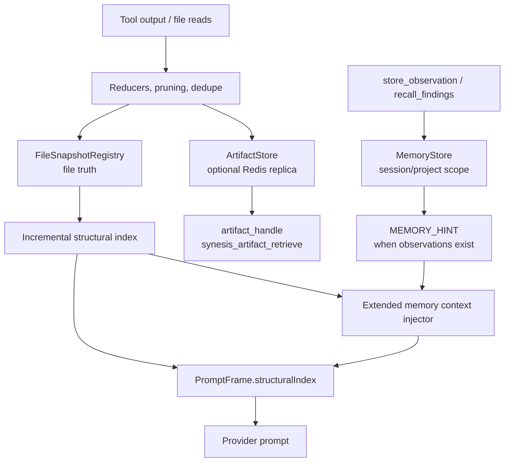

# Yarn Extended Memory

## Purpose

Yarn extended memory is the set of bounded runtime mechanisms that help a
coding model keep useful project state without re-reading everything or
overflowing the provider context window. It is not a general long-term memory
product and it does not replace the caller's transcript. It adds compact,
auditable context around the request: structural maps, artifact handles, stored
observations, optional chunked-eval progress, and memory/governor hints.

For the broader request pipeline, see
[`context-and-recall-architecture.md`](./context-and-recall-architecture.md).

## Current Scope

| Capability | Current status | Main code |
|---|---|---|
| Incremental structural map injection | Active when structural index exists for the session | [`route-enrichment.ts`](../../base/yarn-ts/src/context/route-enrichment.ts), [`structural-index.ts`](../../base/yarn-ts/src/memory/structural-index.ts) |
| Go doc repo-map fallback | Optional fallback for Go projects when no incremental structural map is present | [`go-doc-index.ts`](../../base/yarn-ts/src/memory/go-doc-index.ts) |
| Artifact-backed tool payload recall | Active for pruned/reduced tool outputs when artifact retention is enabled | [`artifact-store.ts`](../../base/yarn-ts/src/state/artifact-store.ts), [`artifact-retrieval.ts`](../../base/yarn-ts/src/state/artifact-retrieval.ts) |
| Memory tools | Optional MCP tools for explicit findings storage and recall | [`memory-tools.ts`](../../base/yarn-ts/src/mcp/handlers/memory-tools.ts), [`memory-store.ts`](../../base/yarn-ts/src/memory/memory-store.ts) |
| Memory hints | Injected when stored observations exist and memory tools are enabled | [`context-injector.ts`](../../base/yarn-ts/src/memory/context-injector.ts) |
| Chunked evaluation primitives | Implemented as planning/context primitives and unit-tested; not the default request path | [`chunked-eval.ts`](../../base/yarn-ts/src/memory/chunked-eval.ts) |
| Governor memory signals | Implemented helper signals for broad discovery, summaries, and stored findings | [`governor-integration.ts`](../../base/yarn-ts/src/memory/governor-integration.ts) |

Current MCP memory tool names are `store_observation` and `recall_findings`.
Large pruned payloads are recovered through `synesis_artifact_retrieve`.

## Runtime Flow



The primary injection path is `PromptFrame.structuralIndex`, populated by
`route-enrichment.ts` from the per-session incremental structural index. The
generic extended-memory injector adds only supplemental blocks: Go doc fallback,
chunked-eval progress, and memory hints.

## Structural Index

The structural index is a compact project map made from file paths, languages,
exported symbols, imports, and cross-file references. It is meant to help the
model choose specific files instead of doing repeated broad discovery.

Current behavior:

- Symbol extraction supports Go, TypeScript/JavaScript, Python, Rust, Java,
  C/C++, and Kotlin-style Java syntax through lightweight extractors. Other
  recognized file types such as Markdown, YAML, JSON, shell, SQL, Ruby, PHP,
  Swift, and C# are detected for navigation but do not currently emit symbols.
- `renderStructuralMap()` ranks files by exported symbols, cross-file
  references, and recently touched files.
- Render size is bounded by `SYNESIS_YARN_STRUCTURAL_INDEX_TOKEN_BUDGET`.
- Redis persistence is available through `ProjectStructuralIndexService`, with
  keys scoped by project root/caller identity where configured.
- If an incremental structural map is already injected, the Go doc fallback is
  skipped to avoid duplicate maps.

Configuration:

| Flag | Default | Meaning |
|---|---:|---|
| `SYNESIS_YARN_STRUCTURAL_INDEX_ENABLED` | `true` | Enable structural index storage/injection |
| `SYNESIS_YARN_STRUCTURAL_INDEX_TOKEN_BUDGET` | `1536` | Token budget for rendered maps |
| `SYNESIS_YARN_GO_DOC_REPOMAP_ENABLED` | `false` | Use `go doc ./...` as fallback for Go projects |

## Artifact Recall

When transcript pruning, context budget compaction, ingress caps, or tool-result
reduction remove large payloads from the prompt, Yarn can keep the original
bytes in `ArtifactStore`. The model-facing stub includes an `artifact_handle`
and recovery instruction:

```text
<TOOL_RESULT_PRUNED ... artifact_handle="art_..." recovery="synesis_artifact_retrieve">
```

`synesis_artifact_retrieve` can resolve that handle. With
`SYNESIS_YARN_ARTIFACT_REDIS_REPLICA_ENABLED=true`, artifacts are also written
to Redis so a different Yarn pod can recover them.

Configuration:

| Flag | Default | Meaning |
|---|---:|---|
| `SYNESIS_YARN_TRANSCRIPT_PRUNE_ARTIFACT_RETENTION_ENABLED` | `true` | Store pruned transcript payloads |
| `SYNESIS_YARN_ARTIFACT_REDIS_REPLICA_ENABLED` | `true` | Replicate artifact records to Redis |
| `SYNESIS_YARN_ARTIFACT_MAX_COUNT` | `500` | In-process max artifact records |
| `SYNESIS_YARN_ARTIFACT_TTL_MS` | `3600000` | Artifact TTL |
| `SYNESIS_YARN_ARTIFACT_MAX_PAYLOAD_BYTES` | `5242880` | Max payload bytes per artifact |
| `SYNESIS_YARN_TOOL_BLOB_REDIS_ENABLED` | `false` | Optional Redis blob tier for large tool payloads |

## Memory Tools

When MCP tools are enabled and memory tools are registered, the model can store
and recall concise findings:

| Tool | Purpose |
|---|---|
| `store_observation` | Store a concise finding under `session` or `project` scope |
| `recall_findings` | Retrieve stored findings by query and scope |

Memory entries are namespaced by org/user and scoped by session key or project
root. They are intended for observations such as "auth flow is in
`src/auth/*`" or "missing tests are around retry behavior", not for storing
raw file bodies.

Configuration:

| Flag | Default | Meaning |
|---|---:|---|
| `SYNESIS_YARN_MEMORY_TOOLS_ENABLED` | `true` | Enable memory-tool context hints |
| `SYNESIS_YARN_MEMORY_STORE_MAX_ENTRIES` | `200` | MemoryStore entry bound |
| `SYNESIS_YARN_MCP_TOOLS_ENABLED` | `true` | Enable Yarn MCP tool surface |

## Chunked Evaluation

Chunked evaluation is a deterministic helper for large "validate these
requirements" prompts. It is implemented as primitives:

- `shouldChunkEval()` detects validation prompts with several requirements.
- `createEvalPlan()` creates an index/map/synthesize plan.
- `generateEvalPhaseContext()` formats phase-specific context.
- `formatEvalProgress()` emits compact progress.

This is not the default execution mode for ordinary chat. Treat it as an
available workflow primitive for eval/harness scenarios and future productized
validation flows.

Configuration:

| Flag | Default | Meaning |
|---|---:|---|
| `SYNESIS_YARN_CHUNKED_EVAL_ENABLED` | `false` | Allow chunked-eval context injection when an eval plan exists |

## Governor Interaction

The memory governor tracker records signals that can inform recovery and
steering:

- structural index available
- summary hit rate
- stored findings count
- repeated rereads when summaries exist
- broad discovery despite an index being available
- findings mentioned but not stored

The main production guardrails for repeated discovery, stale file truth, and
false-green verification live in
[`GOVERNOR_HARNESS.md`](./GOVERNOR_HARNESS.md). Memory signals should be treated
as additional evidence for those controls, not as a separate unbounded loop.

## Validation

Run focused unit coverage from the repository root:

```bash
npm --workspace synesis-yarn-ts test -- tests/extended-memory.test.ts
npm --workspace synesis-yarn-ts test -- tests/artifact-retrieval.test.ts tests/transcript-pruning.test.ts
npm --workspace synesis-yarn-ts test -- tests/tool-result-reducer.test.ts
```

Run broader request-pipeline and governor checks:

```bash
npm --workspace synesis-yarn-ts run test:governor:unit
npm --workspace synesis-yarn-ts run test:governor:smoke
npm --workspace synesis-yarn-ts run eval:regression
```

Run live harness validation when a Yarn endpoint and lower harness are
available:

```bash
npm --workspace synesis-yarn-ts run harness:tester -- run \
  --task tests/fixtures/harness-tester/tasks/simple-python-bugfix.json \
  --harness opencode \
  --api-base-url "$SYNESIS_YARN_URL" \
  --api-key "$SYNESIS_TEST_PAT_TOKEN"
```

For matrix/lab sweeps, see
[`base/yarn-ts/docs/governor-behavior-validation.md`](../../base/yarn-ts/docs/governor-behavior-validation.md)
and
[`base/yarn-ts/docs/harness-tester.md`](../../base/yarn-ts/docs/harness-tester.md).

## Operational Checks

Use these checks when debugging extended memory in a live deployment:

- `/health/telemetry` should show structural index, pattern recall, and related
  feature flags.
- Tool stubs that mention `artifact_handle` should be recoverable with
  `synesis_artifact_retrieve`.
- `context_budget_evaluated` and `context_checkpoint_created` session events
  indicate context budget manager activity.
- `state_confidence_reground_required` indicates Yarn believes the model needs
  fresh file/chat grounding.
- When memory tools are used, the prompt may include `<MEMORY_HINT>` with the
  number of stored observations.

## Known Limits

- Structural maps are compact navigation aids, not proof that behavior is
  implemented.
- Memory tools store concise findings only; use RAG/SynPack for durable
  organization knowledge.
- Chunked evaluation is available as primitives and tests, but ordinary chat
  does not automatically become a multi-pass evaluator.
- Artifact handles expire by TTL and may be unavailable if Redis replication is
  disabled and the request lands on a different pod.
