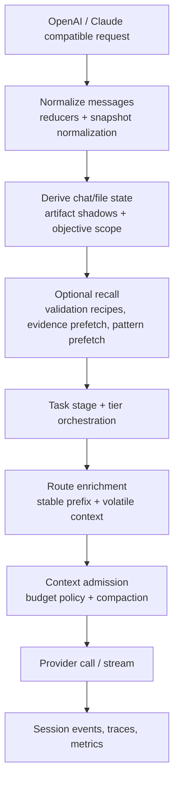

# Context and Recall Architecture

## Purpose

Yarn keeps client transcript context and Synesis runtime memory separate. The
client transcript remains the caller's conversation history; Synesis adds
bounded, typed runtime context around it so coding agents can preserve task
state, file truth, verification evidence, and retrieval hints without treating
every prior token as equally authoritative.

This document describes the current `base/yarn-ts` paradigm as an operational
architecture reference.

## Request-Time Pipeline

The shared enrichment path lives in
[`base/yarn-ts/src/context/route-enrichment.ts`](../../base/yarn-ts/src/context/route-enrichment.ts).
OpenAI and Claude routes prepare route-specific state in
[`base/yarn-ts/src/pipeline/openai-context-preparation.ts`](../../base/yarn-ts/src/pipeline/openai-context-preparation.ts)
and
[`base/yarn-ts/src/pipeline/claude-context-preparation.ts`](../../base/yarn-ts/src/pipeline/claude-context-preparation.ts).

## Prompt Frame Model

Yarn assembles context as a stable prefix plus one volatile system block before
the original conversation messages. The typed shape is
[`PromptFrame`](../../base/yarn-ts/src/context/prompt-frame.ts):

| Block | Source | Purpose |
|---|---|---|
| `stablePrefix` | Admin prompt profiles, stable adapter data, trusted context contract | Keep stable instructions cache-friendly |
| `projectContext` | Trusted path hints and top-level directories | Anchor workspace/root facts |
| `chatState` | Derived transcript state and pause summaries | Preserve task state across turns |
| `fileState` | File snapshot registry and artifact shadows | Preserve current file truth and stale-read warnings |
| `workingFrame` | `WorkingFrameService` | Compact goal, task stage, active files, constraints, checks |
| `projectManifest` | Manifest service and `@synesis/manifest` | Summarize detected project shape and conventions |
| `structuralIndex` | Incremental structural index | Map known file/symbol structure within a budget |
| `fileSummary` | Content-addressed dedup | Summarize already-seen file content |
| `verificationPlan` | Language-pack verification planner | Suggest bounded verification commands |
| `extendedMemoryBlocks` | Context injector | Go doc map fallback, memory hints, recent files |
| `governanceBlocks` | Governor, scope, tool, and policy preparation | Apply runtime safety and completion controls |
| `intentGate` / `toolEfficiency` | Route enrichment heuristics | Nudge efficient tool use and entry contracts |

Stable content is kept separate from volatile state to improve provider prefix
cache behavior and make changes visible in trace metadata through prefix hashes
and change reasons.

## Working Frame And Manifest

[`WorkingFrameService`](../../base/yarn-ts/src/frame/working-frame-service.ts)
builds the model-facing `<WORKING_FRAME>` block:

- tiny/small tasks use a lightweight frame with goal, constraints, active
  files, current task stage, pending checks, and open decisions.
- medium/large tasks use manifest-aware rich frames derived from
  `@synesis/manifest` templates, observed files, structural comparison, and
  optional structural critic output.
- active file lists are bounded by `SYNESIS_YARN_FRAME_MAX_FILES`.
- for non-exploration stages, active-file extraction favors recent messages so
  discovery-only files do not stay prominent indefinitely.
- project-root and shell-cwd hints are included only after path normalization
  and workspace-boundary checks.

Current primary flags:

| Flag | Default | Effect |
|---|---:|---|
| `SYNESIS_YARN_WORKING_FRAME_ENABLED` | `true` | Emit working frames |
| `SYNESIS_YARN_PROJECT_MANIFEST_ENABLED` | `true` | Emit project manifest blocks |
| `SYNESIS_YARN_MANIFEST_TEMPLATES_ENABLED` | `true` | Use manifest templates for richer frames |
| `SYNESIS_YARN_STRUCTURAL_CRITIC_ENABLED` | `true` | Add structural critic block when manifest comparison finds required gaps |
| `SYNESIS_YARN_FRAME_MAX_FILES` | `12` | Bound active files in working frames |
| `SYNESIS_YARN_SESSION_PATH_HINTS_IN_WORKING_FRAME` | see `config.ts` | Include trusted path hints in the frame |

## Recall Paths

"Recall" is not a single monolithic engine. Yarn has several narrow recall
paths, each with different trust and latency expectations.

### Validation Recipe Recall

The reduction pipeline can enrich validation/tool findings with language-pack
recipes, then route those findings through
[`base/yarn-ts/src/recall/routing.ts`](../../base/yarn-ts/src/recall/routing.ts):

- `passthrough`: no confident recipe match.
- `enrich`: inject compact repair guidance when confidence is above
  `SYNESIS_YARN_RECALL_ENRICH_THRESHOLD`.
- `bypass`: for eligible cases, emit a deterministic synthetic response when
  confidence is above `SYNESIS_YARN_RECALL_BYPASS_CONFIDENCE_THRESHOLD`.

This path is disabled unless `SYNESIS_YARN_RECALL_BYPASS_ENABLED=true`.

### Evidence Prefetch

[`base/yarn-ts/src/evidence/fast-path.ts`](../../base/yarn-ts/src/evidence/fast-path.ts)
can prefetch authoritative RAG evidence for compiler errors, linter rules,
language spec questions, and package/tooling references. It runs within
`SYNESIS_YARN_EVIDENCE_PREFETCH_TIMEOUT_MS` and fails soft: if retrieval is
slow or misses, the model can still use normal tools.

Primary flags:

| Flag | Default | Effect |
|---|---:|---|
| `SYNESIS_YARN_KNOWLEDGE_SEARCH_ENABLED` | `false` | Enable planner-backed knowledge search tools |
| `SYNESIS_YARN_EVIDENCE_PREFETCH_ENABLED` | `false` | Enable request-time evidence prefetch |
| `SYNESIS_YARN_EVIDENCE_PREFETCH_TIMEOUT_MS` | `200` | Prefetch latency budget |
| `SYNESIS_YARN_EVIDENCE_CONFIDENCE_MIN` | `0.3` | Minimum evidence confidence |
| `SYNESIS_YARN_EVIDENCE_PREFETCH_RETRY_ENABLED` | `false` | Allow a retry path |

### Pattern Prefetch

When evidence prefetch does not match, optional pattern recall can detect
composition/scaffolding intent and query knowledge search for pattern-like
content. It is gated by `SYNESIS_YARN_PATTERN_RECALL_ENABLED` and should be
treated as a bounded hint path, not a requirement for normal operation.

### Session Continuity

Same-session continuity uses Redis-backed session state. Optional durable and
cross-conversation recall are gated separately:

| Flag | Default | Effect |
|---|---:|---|
| `SYNESIS_YARN_SESSION_CONTINUITY_ENABLED` | `true` | Same-session continuity |
| `SYNESIS_YARN_CONVERSATION_MEMORY_ENABLED` | `false` | Persist conversation memory to Postgres |
| `SYNESIS_YARN_CROSS_CONVERSATION_RECALL_ENABLED` | `false` | Emit cross-conversation recall blocks |
| `SYNESIS_YARN_RECALL_MAX_AGE_MS` | 7 days | Max age for durable recall |

## Context Budget And Compaction

Yarn does not try to replace every client harness's context behavior. The
default context budget mode is conservative:

- client transcript context remains caller-controlled and is shaped
  conservatively.
- Synesis runtime memory is injected as bounded system context.
- `SYNESIS_YARN_CONTEXT_BUDGET_COMPACTION_MODE=minimal` is the default, so
  dedup and emergency pruning happen before aggressive summarization.
- operators can opt into `aggressive` when a client has weak context
  management.

Important controls:

| Flag | Default | Effect |
|---|---:|---|
| `SYNESIS_YARN_CONTEXT_BUDGET_ENABLED` | `true` | Enable budget manager |
| `SYNESIS_YARN_CONTEXT_BUDGET_COMPACTION_MODE` | `minimal` | Minimal or aggressive compaction |
| `SYNESIS_YARN_CONTEXT_ADMISSION_MODE` | `hybrid` | Advisory/enforced outbound admission |
| `SYNESIS_YARN_CONTEXT_ADMISSION_WARN_TOKENS` | `200000` | Warning threshold |
| `SYNESIS_YARN_CONTEXT_ADMISSION_HARD_TOKENS` | `262000` | Hard admission threshold |
| `SYNESIS_YARN_TRANSCRIPT_PRUNE_ENABLED` | `true` | Prune stale tool results and old turns |
| `SYNESIS_YARN_TRANSCRIPT_PRUNE_ARTIFACT_RETENTION_ENABLED` | `true` | Store pruned tool payloads as retrievable artifacts |

See also
[`SESSION_FRAME_COMPACTION.md`](../SESSION_FRAME_COMPACTION.md),
[`COMPACTION_SENSITIVITY.md`](./COMPACTION_SENSITIVITY.md), and
[`TRANSCRIPT_PRUNE_SAFE_CONTEXT.md`](./TRANSCRIPT_PRUNE_SAFE_CONTEXT.md).

## File Truth And Artifact Recall

File-memory state is derived from the read snapshot registry and artifact
shadows. This supports the governor and completion gates:

- stale writes are blocked when a file was edited after the last real read.
- stub-only reads are not treated as current file truth.
- false-green verification can block finalization when verification does not
  cover changed files.
- large pruned tool outputs can be retained in the artifact store and retrieved
  with artifact handles when enabled.

Implementation anchors:

- [`base/yarn-ts/src/reduction/file-snapshot-registry.ts`](../../base/yarn-ts/src/reduction/file-snapshot-registry.ts)
- [`base/yarn-ts/src/governance/artifact-shadow.ts`](../../base/yarn-ts/src/governance/artifact-shadow.ts)
- [`base/yarn-ts/src/state/artifact-store.ts`](../../base/yarn-ts/src/state/artifact-store.ts)
- [`base/yarn-ts/src/governance/file-state.ts`](../../base/yarn-ts/src/governance/file-state.ts)

## Observability

Context and recall decisions are visible through session events, traces, and
health/telemetry surfaces:

- evidence prefetch logs `evidence_prefetch_result` or
  `evidence_prefetch_result_claude`.
- pattern prefetch logs `pattern_prefetch_result` when enabled.
- context admission emits `context_budget_evaluated`,
  `context_checkpoint_created`, and admission warn/reject events.
- state confidence emits `state_confidence_reground_required` when the model
  needs to re-ground on current file or chat state.
- prefix hashes, prompt profile hashes, task-stage/tier decisions, governor
  decisions, and training signals flow into decision telemetry.

## Related Docs

- [`base/yarn-ts/README.md`](../../base/yarn-ts/README.md) — runtime overview
- [`base/yarn-ts/REQUEST_PIPELINE_MAP.md`](../../base/yarn-ts/REQUEST_PIPELINE_MAP.md) — request lifecycle and mutation boundaries
- [`GOVERNOR_HARNESS.md`](./GOVERNOR_HARNESS.md) — governor, artifact truth, and reliability invariants
- [`YARN_CONTEXT_STRETCH.md`](./YARN_CONTEXT_STRETCH.md) — extended memory and artifact handles
- [`YARN_TS_CONTEXT_TRUST.md`](./YARN_TS_CONTEXT_TRUST.md) — trust envelope model
- [`rag-schema-and-knowledge-sources.md`](./rag-schema-and-knowledge-sources.md) — SynPack and RAG knowledge sources
