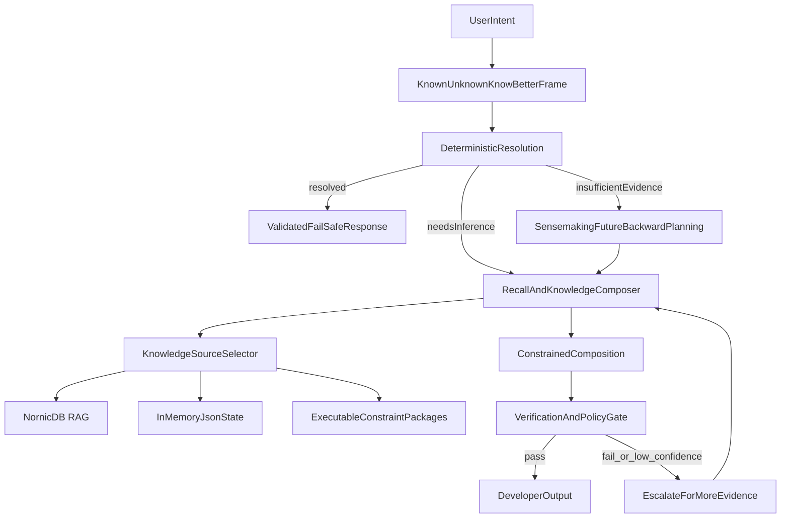

# Context and Recall Architecture

## Goal

Use deterministic recall and constrained composition to reduce unnecessary inference while preserving model reasoning for novel tasks.

## Layered Architecture

## Knowledge Placement Rules

- **RAG:** discoverable and attributable long-lived knowledge.
- **In-memory state:** short-lived session/task context and active constraints.
- **Executable packages:** deterministic analyzers, reducers, and policy evaluators.

## Runtime Context Enrichment

Yarn injects compact deterministic context before model inference so the model
does not have to rediscover basic task and project state on every turn.

| Component | Source | Config |
|-----------|--------|--------|
| Working frame | `base/yarn-ts/src/frame/working-frame-service.ts` | `SYNESIS_YARN_WORKING_FRAME_ENABLED=true`, `SYNESIS_YARN_FRAME_MAX_FILES=12` |
| Project manifest | `base/yarn-ts/src/project/project-manifest-service.ts`, `base/yarn-ts/src/manifest/*` | `SYNESIS_YARN_PROJECT_MANIFEST_ENABLED=true`, `SYNESIS_YARN_MANIFEST_TEMPLATES_ENABLED=true` |
| Structural critic | `base/yarn-ts/src/manifest/structural-critic.ts` | `SYNESIS_YARN_STRUCTURAL_CRITIC_ENABLED=true` |
| MCP tools | `base/yarn-ts/src/mcp/` | `SYNESIS_YARN_MCP_TOOLS_ENABLED=true` |
| Structural index | `base/yarn-ts/src/memory/structural-index.ts` | `SYNESIS_YARN_STRUCTURAL_INDEX_ENABLED=true`, `SYNESIS_YARN_STRUCTURAL_INDEX_TOKEN_BUDGET=1536` |

The shared manifest contract lives in `packages/synesis-manifest/`. Runtime
enrichment is deterministic; model calls happen after these blocks are built.

## Sensemaking Trigger

Use future-backward planning when any of the following are true:

- multi-step ambiguity with no single obvious path
- cross-domain tasks (for example, domain-specific app behavior plus coding constraints)
- repeated verification failures with conflicting evidence

Expected outputs:

- desired end state definition
- required evidence checkpoints
- executable forward path with fallback branches

## Compositional Pattern Library (Phase 19)

Layer 2 recall now includes **compositional pattern prefetch** alongside error/constraint evidence:

- **Composition Intent Detector** (`composition-detector.ts`): heuristic detection of code generation/scaffolding tasks via verb patterns ("create", "build", "implement"), language inference, and skill family mapping (api_endpoint, test_scaffold, error_handling, etc.)
- **Pattern Prefetch** (`fast-path.ts`): when composition intent is detected and no error pattern matched, queries MCP with `content_profile: "pattern"` filter; results formatted as `<synesis_pattern_recall>` blocks injected into system prompt
- **230 bootstrap patterns** across 10 languages covering error_handling, api_endpoint, test_scaffold, data_structure, config_pattern, async_pattern, auth_pattern, logging_pattern, validation_pattern
- **Trust scoring**: EMA-updated trust scores per pattern via usage feedback; propagated as `constraint_confidence` during ingestion sync
- **Kill-switch**: `SYNESIS_YARN_PATTERN_RECALL_ENABLED` (default `false`)

## Fix Recipe Coverage (Phase 19)

Layer 2 fix recipes expanded from 45 to 92 across all 10 language packs, covering the highest-impact error families from `ROOT_CAUSE_TABLES` in `enrichment.ts`. Each recipe provides structured repair guidance (steps + constraints) that the recall engine uses for deterministic bypass or enrichment blocks.
