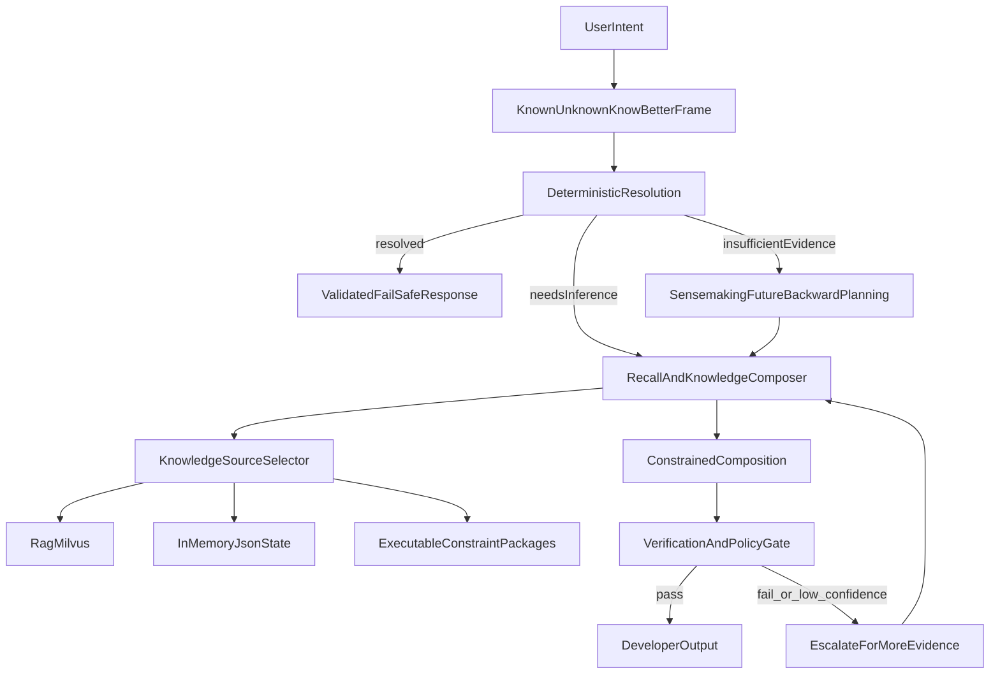

# Context and Recall Architecture

## Goal

Use deterministic recall and constrained composition to reduce unnecessary inference while preserving model reasoning for novel tasks.

## Layered Architecture

## Knowledge Placement Rules

- **RAG:** discoverable and attributable long-lived knowledge.
- **In-memory state:** short-lived session/task context and active constraints.
- **Executable packages:** deterministic analyzers, reducers, and policy evaluators.

## Sensemaking Trigger

Use future-backward planning when any of the following are true:

- multi-step ambiguity with no single obvious path
- cross-domain tasks (for example, domain-specific app behavior plus coding constraints)
- repeated verification failures with conflicting evidence

Expected outputs:

- desired end state definition
- required evidence checkpoints
- executable forward path with fallback branches
