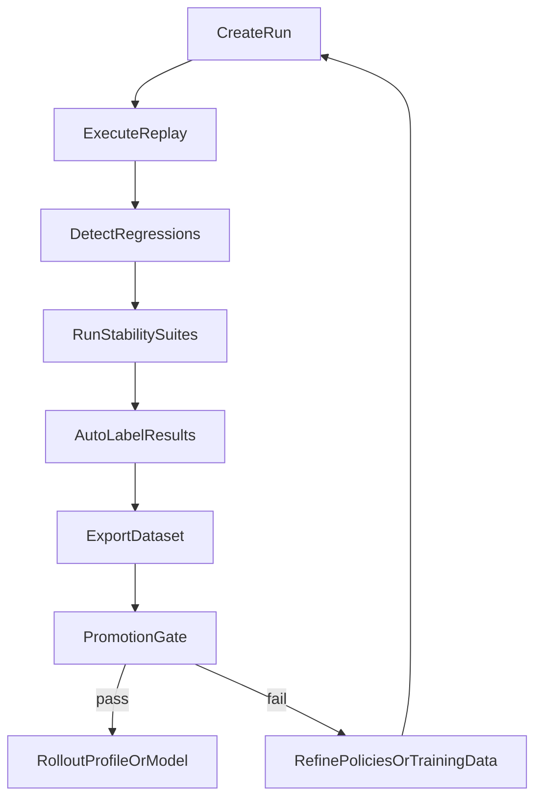
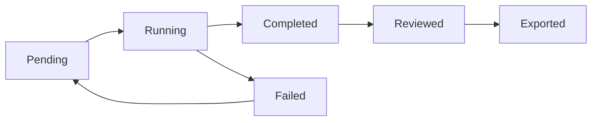
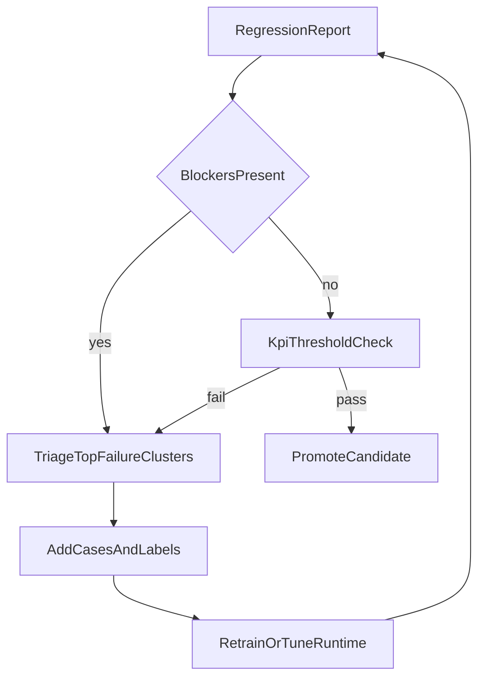

# Observability, Verification, and Evals

## Observability

### Trace Decision Analytics (Phase 18)

The admin service aggregates decision-routing metrics directly from trace `full_record` JSONB:

| Metric | Source | API |
|--------|--------|-----|
| Decision path distribution (deterministic/constrained/inference_first/abstain) | `decision_ledger[0].path` | `GET /api/v1/traces/analytics` |
| Escalation rate | `decision_ledger[0].escalated` | `GET /api/v1/traces/analytics` |
| Recall routing distribution (bypass/enrich/passthrough) | `decision_ledger[0].recall_routing` | `GET /api/v1/traces/analytics` |
| Evidence prefetch hit rate | `evidence_prefetch_hit` | `GET /api/v1/traces/analytics` |

Query params: `since` (unix ts), `until` (unix ts), `org_id`. RBAC: requires `org_observability` route group.

### Conformance Rollups (Phase 18)

Durable periodic snapshots of Yarn runtime telemetry stored in `conformance_rollups` table:

| Endpoint | Method | Description |
|----------|--------|-------------|
| `/api/v1/conformance/summary` | GET | Latest per-language conformance with delta vs previous scrape |
| `/api/v1/conformance/history` | GET | Time-series rollups for dashboard charts (`?language=go&limit=100`) |
| `/api/v1/conformance/scrape` | POST | Manual trigger to scrape Yarn `/health/telemetry` (platform-admin) |

Metrics tracked per language pack: family count, classifier/reducer coverage, fast path patterns, verification commands, fix recipes, recall bypass/enrich attempts, verification loops/findings/stalls.

Global metrics: recall stats, verification stats, decision path counts, escalations/deescalations, sensemaking triggered/skipped.

### Trace Enrichment (Phase 9)

Per-request `DecisionSnapshot` populates trace `full_record` with: `evidence_summary`, `decision_ledger`, `trace_context`, `streaming`, `taxonomy`, `is_code_task`.

### Execution Governor Telemetry

The execution governor emits telemetry on every evaluation, not just on pause/recovery. Data flows into four channels:

- **Session events** (`execution_governor_evaluated`): Full `metadata_json` with pause, reason, matched_rules, and telemetry counters. Queryable in Postgres `yarn_session_events`.
- **Request trajectory** (`request_trajectory_v1`): `governor` block and `training_signals` for auto-labeling and DPO pair generation.
- **Trace records**: Governor fields in `decision_ledger[0]` (`governorPause`, `governorRules`, `governorReason`) and `trace_context` (`governorTelemetry`).
- **OTEL spans**: `yarn.execution_governor.evaluate` span with `governor.pause`, `governor.reason`, `governor.matched_rules` attributes.

For the full rule catalog, telemetry schema, training signal mapping, and query examples, see **[GOVERNOR_HARNESS.md](./GOVERNOR_HARNESS.md)**. For client integration of hard-stop pauses, see **[GOVERNOR_PAUSE_ENVELOPE.md](./GOVERNOR_PAUSE_ENVELOPE.md)**.

## Verification

### Verification Loops (Phase 7b)

Language pack `VerificationCommands` wired into pipeline for deterministic verification and self-repair. `VerificationLoopState` tracks rounds, findings, stalls with configurable max rounds and stall threshold.

### Recall Engine (Phase 7a)

Fix recipes from language packs matched against error patterns. Confidence-based bypass routing: high confidence -> deterministic bypass, medium -> enriched prompt, low -> passthrough to LLM.

### Yarn live verification

Use the Yarn live verification scripts against a deployed coder endpoint when
changing reducers, telemetry, or OpenAI/Claude route behavior:

```bash
cd base/yarn-ts

SYNESIS_YARN_EVAL_URL=https://coder.example.com \
SYNESIS_TEST_PAT_TOKEN=syn-... \
npm run verify:live

SYNESIS_YARN_EVAL_URL=https://coder.example.com npm run verify:live:full
SYNESIS_YARN_EVAL_URL=https://coder.example.com npm run verify:ab
SYNESIS_YARN_EVAL_URL=https://coder.example.com npm run verify:openai-conformance
```

`verify:live` replays deterministic reducer fixtures and checks telemetry
counter deltas. `verify:live:full` adds the Claude Messages path. `verify:ab`
compares reducer savings profiles.

## Evaluation

### Golden-Prompt Eval Harness (Phase 18)

Curated prompt suites executed against Yarn's OpenAI-compatible API with expectation assertions:

| Suite | Cases | Tests |
|-------|-------|-------|
| `recall_bypass` | 5 | Prompts expected to hit deterministic fast paths |
| `verification_loop` | 3 | Prompts that should trigger verification loops |
| `decision_quality` | 4 | Mixed prompts testing decision path routing quality |
| `latency_budget` | 2 | Latency and token budget assertions |

API: `GET /api/v1/evals/suites` (list), `POST /api/v1/evals/run` (execute, platform-admin).

### Testing Labs (Phase 18)

Execution engine replays prompts from historical traces against Yarn:

| Endpoint | Method | Description |
|----------|--------|-------------|
| `/api/v1/testing-labs/runs/{run_id}/execute` | POST | Replay prompts against Yarn, populate results |
| `/api/v1/testing-labs/runs/{run_id}/regressions` | GET | Rule-based regression detection report |

Regression detection rules:
- **Verdict degradation**: baseline pass -> candidate fail
- **Latency regression**: candidate >2x baseline
- **Token regression**: candidate >2x baseline
- **Decision path degradation**: deterministic -> constrained -> inference_first -> abstain

### Stability Eval Suites (Phase 19)

The eval harness now includes explicit stability suites focused on coding-agent continuity:

| Suite | Purpose |
|------|---------|
| `stability_invalid_tool_args` | Verify recovery after malformed/invalid tool argument failures |
| `stability_compile_fix_recovery` | Verify compile/type-error recovery converges and continues feature work |
| `stability_resume_continuity` | Verify `resume` prompts continue state instead of restarting exploration loops |
| `stability_plan_update_loop` | Verify plan-maintenance prompts avoid reread loops and move to concrete action |

Source of truth for suite definitions:
- `base/admin/app/services/eval_harness.py`

### Feedback Loop Lab (Admin + API)

Closed-loop orchestration endpoints:

| Endpoint | Method | Description |
|----------|--------|-------------|
| `/api/v1/feedback-loop/overview` | GET | List suites + recent loop runs |
| `/api/v1/feedback-loop/runs` | POST | Create loop run and optionally execute immediately |
| `/api/v1/feedback-loop/runs/{run_id}/pipeline` | POST | Execute replay + regressions + optional eval suites + auto-label |
| `/api/v1/feedback-loop/runs/{run_id}/auto-label` | POST | Apply failure/strength labels to run results |
| `/api/v1/feedback-loop/runs/{run_id}/critic-score` | POST | Apply rubric/reward critic scoring for RLAIF/DPO foundations |
| `/api/v1/feedback-loop/runs/{run_id}/preferences` | GET | Export `chosen/rejected` preference pairs for DPO |
| `/api/v1/feedback-loop/runs/{run_id}/dataset` | GET | Export run as train-ready records (`json` or `jsonl`) |

Primary implementation:
- `base/admin/app/routers/feedback_loop.py`
- `base/admin/frontend/src/pages/rag/FeedbackLoop.tsx`

## Eval Design

### Taxonomy

- **Stability:** invalid params, compile-fix convergence, resume continuity, plan-update continuity
- **Completion:** task completion and narrow verification progression
- **Safety:** token/latency regressions, excessive loop indicators, hard-stop incidence
- **Regression:** baseline vs candidate verdict/latency/token/decision-path degradation

### Case Format

Each eval case includes:
- prompt
- category
- optional expected decision path / recall routing / language
- optional latency/token constraints

### Scoring Rules

- **Hard failures:** latency/token budget breach, missing response choices, transport errors
- **Soft mismatches:** decision path, recall routing, language mismatch (warnings)
- **Regression blockers:** verdict degradation, >2x latency, >2x token usage, worse decision path rank

## Eval Process

1. Create run (replay cohort from traces).
2. Execute replay against candidate.
3. Detect regressions.
4. Run selected stability suites.
5. Auto-label run outputs (weakness + strength tags).
6. Export dataset slices for training.
7. Gate promotion based on KPI targets.



## Eval Loops

### Run Lifecycle



### Regression Triage + Promotion



## Governance and Ownership

- **Runtime governance owner:** `base/yarn-ts` maintainers
- **Eval suite owner:** Admin eval/testing-labs owners
- **Training data owner:** model-training project owners (`~/src/qwen3`)
- **Promotion authority:** platform admins with documented KPI evidence

Threshold changes require:
1. changelog entry in this document
2. before/after KPI comparison
3. rollback plan and owner approval

## Documentation Cadence

- Update this file whenever:
  - a suite is added/removed
  - regression rules change
  - promotion thresholds change
  - dataset export schema changes
- Monthly review:
  - top failure tags
  - top strength tags
  - completion and loop KPI trend deltas

## Git-First KPI Pack

Use this KPI set when evaluating `SYNESIS_YARN_GIT_POLICY_MODE=advisory|enforced` rollouts:

| KPI | Source | Target |
|-----|--------|--------|
| First-pass verify rate | run_test/run_build/run_lint `ok=true` on first verification pass | No regression greater than 2 percentage points |
| Unsafe shell block count | `toolArgHardening.blockedUnsafeShellCount` | Increase expected; monitor for false positives |
| Path-drift block count | `toolArgHardening.blockedBashPathDriftCount` | Increase expected when duplicate `mkdir && cd` patterns appear |
| Write-capable block count | `toolArgHardening.blockedWriteCapableToolCount` | Stable in default clients; elevated only in strict profiles |
| Context admission warning/reject rate | `contextAdmission.warned`, `contextAdmission.rejected` from Yarn telemetry | Warnings may rise during tuning; rejects should remain low and actionable |
| Git commit hygiene | `git_commit_guarded` responses (`stagedCount > 0`, no blocked staged paths) | 100% successful commits satisfy preflight checks |
| Unintended file churn | trace diff size / changed-file count before finalization | No increase in median changed-file count |
| Stall rate | verification loop stalled or repeated tool loops | No regression greater than 1 percentage point |

### Suggested A/B sequence

1. Baseline with `SYNESIS_YARN_GIT_POLICY_MODE=off` on one cohort and `advisory` on another.
2. Promote to `enforced` only for cohorts where quality and stall KPIs remain within target.
3. Keep `off` as a tenant-level escape hatch for emergency rollback.
4. For context admission, start with `SYNESIS_YARN_CONTEXT_ADMISSION_MODE=hybrid` and verify reject messages are guiding users to recover (split task, reduce history, trim tool output).

## Eval Gym Integration

The [Eval Gym](EVAL_GYM.md) extends observability with three new
`yarn_session_events` event kinds:

| Event Kind | Producer | Purpose |
|------------|----------|---------|
| `scenario_eval_v1` | Eval gym scenario runner | Scored multi-turn scenario results |
| `eval_transcript_v1` | Session observer | Full turn-by-turn transcript of live sessions |
| `live_eval_v1` | Session observer | Real-time anomaly alerts (only emitted when issues detected) |

These events appear in the admin dashboard alongside existing
`request_trajectory_v1` and `execution_governor_evaluated` events.

**Querying eval gym data:**

```bash
# Via admin API
GET /api/v1/feedback-loop/eval-gym/events?event_kind=live_eval_v1&limit=50

# Via SQL
SELECT * FROM yarn_session_events
WHERE event_kind IN ('scenario_eval_v1', 'live_eval_v1', 'eval_transcript_v1')
ORDER BY created_at DESC;
```

**Enabling the session observer** for production observability:

```bash
# Via env (startup)
SYNESIS_YARN_EVAL_OBSERVER_ENABLED=true

# Via API (runtime)
POST /v1/eval/observe/start
POST /v1/eval/observe/stop
```

See [EVAL_GYM.md](EVAL_GYM.md) for full documentation on running
scenarios, authoring new ones, and using results for model fine-tuning.

## Replay and Audit

Support policy replay against historical traces to evaluate:

- candidate threshold changes
- constitution updates
- source ranking adjustments
- client-adapter conformance
