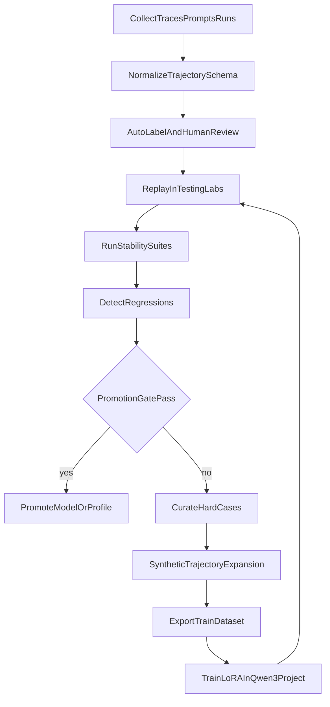

# Qwen Stability Feedback Loop

This document defines the operational loop for improving coding-agent stability with safety-first governance, reproducible evaluations, and training data exports.

## Governance Profiles

Yarn now supports explicit governance profiles via `SYNESIS_YARN_GOVERNANCE_PROFILE`:

- `safety_strict`
  - Prioritizes runaway safety over behavior policing.
  - Allows more retries before loop-based pause interventions.
- `balanced_completion` (default)
  - Best default for production quality: soft steering + safety protections.
- `strict_control`
  - Aggressive loop policing for debugging / forensic runs.

Related controls are still enforced independently:
- token ceilings
- context admission hard limits
- tool-call runaway limits
- rate limiting and circuit breaker controls

## End-to-End Closed Loop

## Trajectory Data Contract

Use one canonical schema for all exported training rows:

- `task_id`, `session_id`, `model_id`, `runtime_profile`
- `user_intent`
- `trajectory_steps[]`
- `outcome`
- `failure_tags[]`
- `strength_tags[]`
- `quality_signals`
- `gold_next_step`
- `governor` (from `request_trajectory_v1` event)
- `training_signals` (from `request_trajectory_v1` event)

This same schema is used for:
- SFT/LoRA samples
- preference pair derivations
- eval replay comparisons

### Governor-Derived Training Signals

The execution governor produces per-request signals that feed directly into the trajectory:

| Signal | Source | Training Use |
|--------|--------|-------------|
| `governor_intervened` | `training_signals.governor_intervened` | Tag trajectory as negative example for SFT filtering or DPO rejected side |
| `governor_rules` | `training_signals.governor_rules` | Populate `failure_tags[]` with specific failure classes (e.g. `verification_stall_no_edit`) |
| `no_edit_evidence` | `training_signals.no_edit_evidence` | Quality signal: model looping without making progress |
| `trailing_verification_stall` | `training_signals.trailing_verification_stall` | Quality signal: extended verification sequence without edits |
| `governor_pause_count` | Session metadata | Soft reward signal for RLAIF: lower is better |

See [GOVERNOR_HARNESS.md](./GOVERNOR_HARNESS.md) for the full telemetry schema and query examples.

## Admin and API Workflow

Primary APIs:
- `GET /api/v1/feedback-loop/overview`
- `POST /api/v1/feedback-loop/runs`
- `POST /api/v1/feedback-loop/runs/{run_id}/pipeline`
- `POST /api/v1/feedback-loop/runs/{run_id}/auto-label`
- `POST /api/v1/feedback-loop/runs/{run_id}/critic-score`
- `GET /api/v1/feedback-loop/runs/{run_id}/preferences`
- `GET /api/v1/feedback-loop/runs/{run_id}/dataset?format=jsonl&dataset_type=trajectory|dpo|rlaif`

Admin UI:
- `RAG -> Feedback Loop`

## CLI Workflow (Operator Convenience)

Use `scripts/feedback-loop-runner.py` to avoid manual API chaining:

- `python scripts/feedback-loop-runner.py collect --name "qwen nightly"`
- `python scripts/feedback-loop-runner.py pipeline --run-id <run_id> --suite stability_compile_fix_recovery --suite stability_resume_continuity`
- `python scripts/feedback-loop-runner.py critic-score --run-id <run_id>`
- `python scripts/feedback-loop-runner.py export --run-id <run_id> --dataset-type dpo --format jsonl --out artifacts/dpo.jsonl`
- `python scripts/feedback-loop-runner.py export --run-id <run_id> --dataset-type rlaif --format jsonl --out artifacts/rlaif.jsonl`
- `python scripts/feedback-loop-runner.py run --name "qwen nightly" --dataset-type dpo --out artifacts/nightly_dpo.jsonl`

## DPO / RLAIF Foundation

The closed-loop system now provides training-ready foundations without full RLHF rollout:

- **Critic scoring** (auto or post-run) writes rubric + `reward_score` + `confidence` per result
- **DPO preferences** provide `prompt`, `chosen`, `rejected` pairs from baseline/candidate outcomes
- **RLAIF exports** provide reward-annotated rows (`prompt`, `response`, `reward_score`, rubric, labels)

This supports:
- preference optimization (DPO/IPO variants)
- reward-conditioned supervised workflows (RLAIF-style)
- later extension to full RLHF if required

## Standard Tooling Reuse

Avoid rebuilding generic MLOps components:

- Experiment tracking: MLflow or Weights & Biases
- Dataset versioning: DVC or lakeFS
- Metrics and events: OpenTelemetry-compatible streams
- Artifact store: keep JSONL export stable for downstream fine-tuning pipelines

Synesis-specific value:
- coding-agent loop taxonomy
- governance-aware labels
- regression rules tied to real coding UX
- promotion gates tied to completion/safety KPIs

## Promotion Gates (Model Tiering)

Keep `qwen3-coder-next` in low/mid tier only if all gates pass:

1. completion rate non-regressing vs baseline
2. invalid tool arg rate decreased
3. loop intervention and hard-stop rates non-increasing
4. tokens-per-success non-regressing
5. no severe regression class (verdict degradation, >2x latency/token)

If a gate fails:
- keep candidate unpromoted
- add failure slices to the dataset
- retrain/tune and replay the same suites before reattempting promotion
