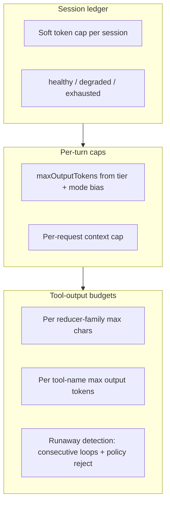
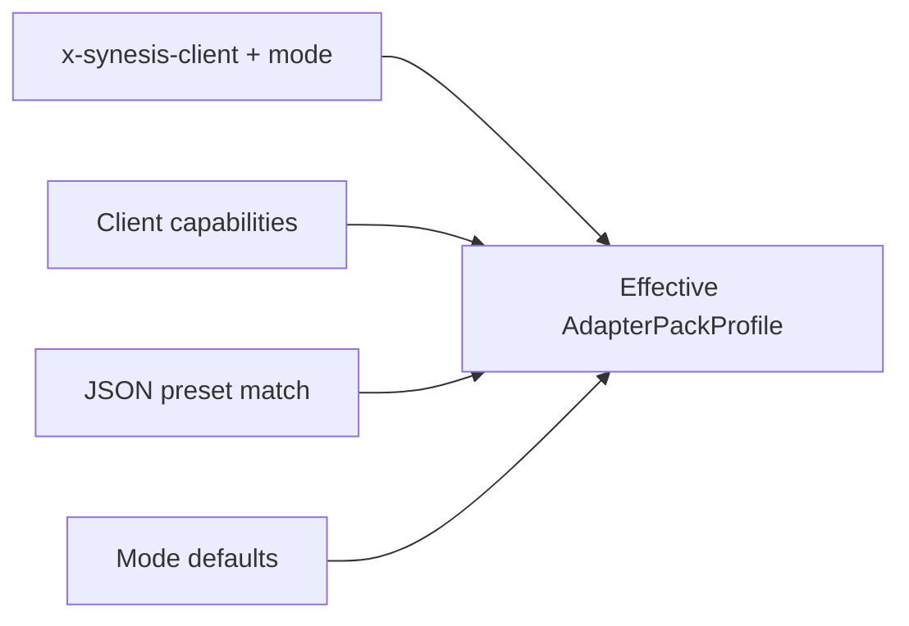

# Client Adapter Packs

Architecture note for Yarn's client adapter system. Originally introduced in
Milestone 7, now expanded to cover session scoping, per-client analytics,
token/tool budget framing, compatibility negotiation, and JSON-first preset
extensibility.

Sections marked **(shipped)** describe features live in code today. Sections
marked **(planned)** describe designed-but-not-yet-implemented directions; code
references in those sections point to the planned integration points.

---

## Purpose

Yarn serves any OpenAI- or Anthropic Messages-compatible client: IDE extensions,
terminal agents, background CI tools, and MCP-native runtimes. Rather than
hard-coding behavior for each brand, we classify by **interaction mode** first
and resolve a **client preset** second. This gives every client a good default
while keeping the system portable and extensible without code changes.

---

## Interaction mode contract (shipped)

Four stable modes define the behavioural contract. Every downstream subsystem
that needs client-specific tuning reads the resolved mode, never the raw client
name.

| Mode | Semantics | Workflow hint | Example clients |
|------|-----------|---------------|-----------------|
| `ide` | Interactive multi-turn; full context injection, rich errors | `mixed` | Cursor, VS Code, Windsurf, Continue, Cline, Roo, Junie |
| `cli` | Concise, validation-oriented; tight output budgets | `validation` | Codex CLI, OpenCode, Aider |
| `background` | Planning workflow; prefers artifact handles over inline content | `planning` | PR bots, CI agents, Copilot agent mode |
| `mcp_native` | MCP-first; tool references and structured output preferred | `mixed` | MCP SDK clients |

The mode is resolved from headers at request time:

```
x-synesis-client: claude-code
x-synesis-mode: ide            (optional override)
```

If `x-synesis-mode` is absent, the mode is inferred from the client name via
pattern matching in `modeForClient()`.

### Downstream consumers (current and planned)

| Subsystem | Reads mode? | Status |
|-----------|-------------|--------|
| `<CLIENT_ADAPTER>` system block injection | Yes | Shipped |
| Deterministic policy engine (consecutive tool limits) | No (global) | Shipped; planned: per-mode thresholds |
| Phase model orchestrator (`maxOutputTokens` by tier) | No (global) | Shipped; planned: mode bias |
| Tool-result reducers | No (global confidence) | Shipped; planned: per-mode verbosity |
| Token budget ledger | N/A | Planned |
| Capability negotiation | N/A | Planned |

---

## Shipped implementation snapshot

### Core adapter service

[base/yarn-ts/src/adapters/client-adapter-packs.ts](../base/yarn-ts/src/adapters/client-adapter-packs.ts)

- `ClientAdapterPacks.resolve(clientName, requestedMode?)` produces an
  `AdapterPackProfile` with: `client`, `mode`, `workflow`, and a `features`
  object (`prefersConciseErrors`, `prefersArtifactHandles`,
  `prefersDeterministicPolicy`).
- `toSystemBlock(profile)` emits a compact `<CLIENT_ADAPTER>...</CLIENT_ADAPTER>`
  text block injected into the model's system context.
- `getCatalog()` returns the known client list and available modes for the
  `GET /v1/adapter-packs` endpoint.
- `getStats()` exposes resolution counts by mode for `/health/telemetry`.

### Session execution context (shipped)

[base/yarn-ts/src/adapters/session-execution-context.ts](../base/yarn-ts/src/adapters/session-execution-context.ts)

- `parseSessionExecutionContext(headers, metadata?)` resolves `project_root` (from `synesis_project_root` metadata, then `x-synesis-project-root`, then legacy `x-synesis-workspace-root`) and `shell_cwd` (metadata or `x-synesis-shell-cwd`), plus optional runtime/git/model labels.
- `appendPathContextToAdapterBlock(adapterBlock, headers, metadata?)` appends `<SESSION_EXECUTION_CONTEXT>...</SESSION_EXECUTION_CONTEXT>` after `<CLIENT_ADAPTER>` when any field is set (replaces the older standalone `<WORKSPACE_ROOT>` block).
- `resolveWorkspaceRootForCollapse(headers, metadata?)` feeds the same resolved root into tool-collapse path validation on OpenAI non-stream rewrites.

Contract: [docs/clients/SESSION_EXECUTION_CONTEXT.md](clients/SESSION_EXECUTION_CONTEXT.md).

### Known clients

```
claude-code, cursor, vscode-copilot, windsurf, junie, continue, roo, cline, codex-cli
```

Unknown client names are accepted and default to `ide` mode. Mode auto-detection
uses substring matching (`codex` or `cli` -> `cli`; `copilot-agent` or
`background` -> `background`; `mcp` -> `mcp_native`; everything else -> `ide`).

### Runtime integration

[base/yarn-ts/src/index.ts](../base/yarn-ts/src/index.ts) reads the headers on
both OpenAI `/v1/chat/completions` and Claude `/v1/messages` routes, resolves
the profile, injects the adapter block into the enriched message list, and
includes the `clientKind` in the canonical session key.

### Tests

[base/yarn-ts/tests/client-adapter-packs.test.ts](../base/yarn-ts/tests/client-adapter-packs.test.ts)
covers mode resolution, explicit override, system block generation, and stats
tracking.

### Current limitation

Feature flags are coarse: `prefersConciseErrors` is true for all profiles, and
all IDE clients resolve identically. Richer differentiation comes from presets
and budgets (see planned sections below).

---

## Session scoping and per-client analytics (shipped + planned)

### Shipped: canonical session key

Every request is scoped to a session keyed as:

```
synesis:{userId}:{clientKind}:{conversationId}
```

`clientKind` comes from `x-synesis-client` (default `unknown` for OpenAI,
`claude-code` for Anthropic). `conversationId` is resolved from `body.conversation_id`
(OpenAI) or `body.metadata.synesis_conversation_id` / `conversation_id` /
`session_id` / `x-synesis-conversation-id` header (Claude). See
[docs/clients/CLAUDECODE.md](clients/CLAUDECODE.md) and
[docs/claude_code_compat.md](claude_code_compat.md) for the full resolution
policy.

`client_kind` is persisted on `yarn_sessions` and visible in the admin
Yarn Fabric sessions list and detail views.

### Shipped: session events

Failure and extension events (upstream errors, trust blocks, resolve failures,
compaction errors, CAS persistence errors) are recorded per-session via
`recordSessionEvent` and stored in `yarn_session_events`. The admin session
detail page shows an events timeline alongside usage rows.

### Planned: per-client intelligence

The Session Intelligence panel
([base/admin/app/services/yarn_service.py](../base/admin/app/services/yarn_service.py)
`get_yarn_intelligence`) currently aggregates `yarn_usage_log` globally (top
models, tool-call rates, error rates, cache hit estimates). A planned extension
groups these metrics by `client_kind` — either by denormalizing the column onto
`yarn_usage_log` or joining via `session_key` prefix — to answer questions like
"which client generates the most tool loops?" or "what is the cache hit rate for
Claude Code vs Cursor?".

---

## Yarn token budget model (planned, planner-informed)

### Contrast with planner

The planner scales budgets with **task difficulty** (0.0-1.0) assigned by an
entry classifier. See [docs/BUDGET_AND_LIMITS.md](BUDGET_AND_LIMITS.md) for the
full reference. Key planner concepts:

- `token_budget_remaining` ledger with `healthy -> degraded -> exhausted`
  transitions
- Per-node caps: `writer_budget_base` + difficulty * (max - base), clamped by
  model tier
- Overspend tolerance, anomaly detection, Prometheus counters

Yarn workloads are different: many short HTTP turns (tool loops, streaming
chunks) rather than a single long pipeline graph. Budgets should scale with
**interaction mode + client preset + optional risk signals**, not task difficulty.

### Proposed budget layers



**Session ledger.** A soft cap per `session_key` (or per user+time-window)
tracks cumulative token spend. States mirror planner: at `degraded`, Yarn can
reduce `maxOutputTokens` or increase reducer aggressiveness; at `exhausted`, it
returns a policy rejection. This prevents long-running agent sessions from
unbounded spend.

**Per-turn caps.** The phase model orchestrator already sets `maxOutputTokens`
by tier (pulse: 1800, core: 2800, horizon: 4200). Mode-aware biases would let
CLI presets request tighter caps (e.g. 0.6x multiplier) while background
presets allow larger outputs. The orchestrator decision lives in
[base/yarn-ts/src/orchestration/phase-model-orchestrator.ts](../base/yarn-ts/src/orchestration/phase-model-orchestrator.ts).

**Tool-output budgets.** The reducer registry
([base/yarn-ts/src/reduction/registry.ts](../base/yarn-ts/src/reduction/registry.ts))
ships 50+ specialized tool-family reducers (git, kubectl, pytest, npm, docker,
etc.). A tool-output budget layer would set max chars/tokens per family or per
tool-name pattern, with the existing reducers and JSON compactor as enforcement.
The policy engine
([base/yarn-ts/src/policy/deterministic-policy-engine.ts](../base/yarn-ts/src/policy/deterministic-policy-engine.ts))
already enforces consecutive tool-call limits and session token caps — budget
caps would wire into these same rejection paths.

**Risk signals.** The project manifest service
([base/yarn-ts/src/project/project-manifest-service.ts](../base/yarn-ts/src/project/project-manifest-service.ts))
infers a `riskProfile` (low/standard/high) from conversation content. High-risk
manifests already escalate the tier; they could also tighten tool budgets or
lower the session soft cap.

### Budget configuration source

Budgets would be defined in the JSON preset (see below) and overridable via
environment variables following the planner pattern
(`SYNESIS_YARN_SESSION_BUDGET_DEFAULT`, `SYNESIS_YARN_CLI_OUTPUT_MULTIPLIER`,
etc.). Admin-published overrides are a later phase.

---

## Compatibility negotiation (planned)

### Problem

Clients vary in capabilities: some support streaming, some send tool results as
content blocks, some can handle parallel tool calls, some need specific
stop-sequence handling. Today Yarn treats all clients identically after mode
resolution.

### Proposed contract

**Request side.** Clients advertise capabilities via an optional JSON payload in
`body.metadata.synesis_client_capabilities` (Claude) or an
`x-synesis-capabilities` header (OpenAI). Example:

```json
{
  "version": 1,
  "streaming": true,
  "tool_style": "parallel",
  "max_parallel_tools": 4,
  "supports_thinking": true,
  "max_response_tokens_hint": 4096
}
```

Unknown keys are ignored (forward-compatible). If absent, Yarn uses the
preset's defaults.

**Response side.** An optional `x-synesis-negotiated-profile` response header
or extension field echoes the resolved preset ID and any applied caps, so
clients can log what profile was active.

**Resolution.** Negotiation merges in priority order:



---

## Developer tools compatibility matrix (planned)

The following matrix seeds rows for all known and target clients. Source URLs
are filled from official project documentation as presets are developed.

| `client_id` (header) | Vendor | Default mode | Protocol | Source | Notes |
|----------------------|--------|-------------|----------|--------|-------|
| `claude-code` | Anthropic | ide | Anthropic Messages | [docs](https://docs.anthropic.com/en/docs/claude-code) | Session via metadata; tool search toggle |
| `cursor` | Cursor | ide | OpenAI | [docs](https://docs.cursor.com) | Sends conversation_id natively |
| `vscode-copilot` | GitHub | ide | OpenAI | [docs](https://docs.github.com/en/copilot) | Agent mode uses background |
| `windsurf` | Codeium | ide | OpenAI | [docs](https://docs.codeium.com/windsurf) | |
| `continue` | Continue | ide | OpenAI | [github](https://github.com/continuedev/continue) | MCP-aware |
| `cline` | Cline | ide | OpenAI | [github](https://github.com/cline/cline) | |
| `roo` | Roo Code | ide | OpenAI | [github](https://github.com/RooVetGit/Roo-Code) | |
| `junie` | JetBrains | ide | OpenAI | [docs](https://www.jetbrains.com/junie/) | JetBrains IDE agent |
| `codex-cli` | OpenAI | cli | OpenAI | [github](https://github.com/openai/codex) | Terminal agent |
| `opencode` | OpenCode | cli | OpenAI | [github](https://github.com/opencode-ai/opencode) | Terminal TUI |
| `aider` | Aider | cli | OpenAI | [github](https://github.com/Aider-AI/aider) | Git-aware CLI |
| `openclaw` | OpenClaw | ide | OpenAI | TBD | Legal/compliance workload on Yarn |
| `gemini-cli` | Google | cli | OpenAI | [github](https://github.com/google-gemini/gemini-cli) | Terminal agent |
| `zed` | Zed | ide | OpenAI | [docs](https://zed.dev/docs/assistant) | Built-in assistant |
| `jetbrains-ai` | JetBrains | ide | OpenAI | [docs](https://www.jetbrains.com/ai/) | AI Assistant plugin |
| `void` | Void | ide | OpenAI | [github](https://github.com/voideditor/void) | Open-source Cursor alternative |
| `pear-ai` | PearAI | ide | OpenAI | [github](https://github.com/trypear/pearai-master) | Fork of Continue |
| `bolt` | StackBlitz | background | OpenAI | [docs](https://bolt.new) | Web-based builder |
| `v0` | Vercel | background | OpenAI | [docs](https://v0.dev) | UI generation |
| `devin` | Cognition | background | OpenAI | TBD | Autonomous agent |

Clients not in this table are accepted with `client_id = unknown` and default
to `ide` mode. Adding a new client requires only a new JSON preset file (no
code changes).

---

## JSON-first adapter presets (planned)

### Design goals

- Presets are **human-reviewable JSON files** tracked in version control.
- Adding or tuning a client requires editing JSON, not TypeScript.
- A zod schema validates presets at load time.
- Admin-published overrides (phase 2) merge on top of the file-based defaults.

### On-disk layout

```
base/yarn-ts/config/adapter-presets/
  claude-code.json
  cursor.json
  codex-cli.json
  opencode.json
  _defaults.json       # mode-level fallbacks
```

### Schema

```json
{
  "preset_id": "claude-code",
  "match": {
    "client_aliases": ["claude-code", "claude", "anthropic-sdk"],
    "mode_default": "ide"
  },
  "workflow": "mixed",
  "features": {
    "prefers_concise_errors": true,
    "prefers_artifact_handles": false,
    "prefers_deterministic_policy": true,
    "supports_thinking": true,
    "supports_tool_search": true
  },
  "budgets": {
    "session_soft_cap_tokens": 500000,
    "max_output_tokens_multiplier": 1.0,
    "tool_output_caps": {
      "git-diff": 8000,
      "kubectl": 6000,
      "pytest": 10000,
      "*": 12000
    }
  },
  "tool_policies": {
    "consecutive_tool_calls_limit": 8,
    "allow_patterns": ["*"],
    "deny_patterns": [],
    "verbosity": "standard"
  },
  "negotiation": {
    "default_streaming": true,
    "default_tool_style": "sequential",
    "default_max_parallel_tools": 1
  }
}
```

`_defaults.json` provides mode-level fallbacks for any field not specified in a
client preset:

```json
{
  "modes": {
    "ide": {
      "max_output_tokens_multiplier": 1.0,
      "tool_output_caps": { "*": 12000 },
      "consecutive_tool_calls_limit": 8,
      "verbosity": "standard"
    },
    "cli": {
      "max_output_tokens_multiplier": 0.6,
      "tool_output_caps": { "*": 6000 },
      "consecutive_tool_calls_limit": 6,
      "verbosity": "concise"
    },
    "background": {
      "max_output_tokens_multiplier": 1.2,
      "tool_output_caps": { "*": 16000 },
      "consecutive_tool_calls_limit": 12,
      "verbosity": "detailed"
    },
    "mcp_native": {
      "max_output_tokens_multiplier": 1.0,
      "tool_output_caps": { "*": 12000 },
      "consecutive_tool_calls_limit": 8,
      "verbosity": "structured"
    }
  }
}
```

### Resolution order

1. Match `x-synesis-client` against `match.client_aliases` across all preset files.
2. Load the matched preset (or fall back to `_defaults.json` for the resolved mode).
3. Merge client capabilities from the request (if provided) over preset values.
4. Apply admin overrides (if published) on top.
5. Produce the effective `AdapterPackProfile` with resolved budgets and policies.

---

## Cross-references

- **Planner budgets:** [docs/BUDGET_AND_LIMITS.md](BUDGET_AND_LIMITS.md) is the
  single-source reference for planner token scaling. Yarn budgets follow the
  same philosophy (scale with context, enforce via ledger) but substitute
  mode+preset for difficulty.
- **Session scoping:** [docs/clients/CLAUDECODE.md](clients/CLAUDECODE.md) and
  [docs/claude_code_compat.md](claude_code_compat.md) document conversation ID
  resolution per client.
- **Safety and policy:** [docs/SECURITY.md](SECURITY.md) and
  [SAFETY_HARDENING_M11.md](./SAFETY_HARDENING_M11.md) cover the policy
  engine and trust pipeline that budget caps integrate with.

---

## Expansion checklist

Ordered phases for the work outlined in this document.

| Phase | Description | Status |
|-------|-------------|--------|
| **A** | JSON preset files + zod loader in `client-adapter-packs.ts` | Planned |
| **B** | Negotiation headers: `x-synesis-capabilities` request, `x-synesis-negotiated-profile` response | Planned |
| **C** | Yarn session budget env vars + enforcement in policy engine | Planned |
| **D** | Tool-family output caps wired through reducer service | Planned |
| **E** | Admin-published preset overrides (store in DB, poll like tier registry) | Planned |
| **F** | Session Intelligence grouped by `client_kind` (API + UI) | Planned |
| **G** | Per-client analytics: token efficiency, error rates, cache hit rates by client | Planned |
| **H** | Populate compatibility matrix source URLs from official project docs | In progress |
