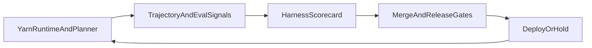

# Harness Trust Hardening

This document turns the harness trust plan into an implementation program that can run inside the current Synesis engineering system (Yarn telemetry, eval gym, CI workflows, and release gates).

Use this as the operating contract for improving and preserving:

- **Helpfulness** (research-first, convention-aware, complete follow-through)
- **Efficiency** (fewer loops, fewer retries, lower needless rewrites)
- **Consistency** (stable behavior across deploys and config profiles)
- **Transparency** (observable causes when quality shifts)

## Current Status

As of 2026-04-24:

- Phase 0 has started in `base/yarn-ts/src/index.ts` with trajectory `edits` telemetry for:
  - `files_read_count`
  - `read_edit_ratio`
  - `patch_ratio`
  - `whole_write_ratio`
- `training_signals.premature_stop_signals` is now emitted from governor-matched rules.
- Phase 1 budget enforcement has started in:
  - `base/yarn-ts/src/eval/regression-budget.ts`
  - `base/yarn-ts/scripts/eval-regression-budget.ts`
  - `base/yarn-ts/tests/eval-regression-budget.test.ts`
- New budget dimensions are now gateable:
  - `readEditRatio`
  - `wholeWriteRatio`
  - `prematureStopSignalRate`
- Governor regression suite now includes explicit trust scenarios in `base/yarn-ts/src/eval/scenarios/governor-regression.ts`:
  - `edit-without-read-discipline`
  - `permission-seeking-stop-loop`
- Main/release governor eval lanes now run trust budget checks in `.github/workflows/yarn-governor-eval-tiers.yml` (push `main`, nightly, and release).
- Documentation/rule drift checks now run in CI via:
  - `scripts/check-doc-reference-integrity.py`
  - `.github/workflows/lint.yml` (`docs-reference-integrity` job)
- Phase 3 canary/rollback automation has started with:
  - power-user canary scenarios in `base/yarn-ts/src/eval/scenarios/power-user-canary.ts`
  - scorecard builder `base/yarn-ts/scripts/eval-harness-scorecard.ts`
  - rollback evaluator `base/yarn-ts/scripts/eval-rollback-policy.ts`
  - streak-aware gating and artifacts in `.github/workflows/yarn-governor-eval-tiers.yml`
  - lane-specific scorecard history caches (`harness-scorecard-history-main.json`, `harness-scorecard-history-nightly.json`, `harness-scorecard-history-release.json`)
- `bytes_read_total` remains optional until per-turn read payload sizing is wired end-to-end.

---

## 1) Operating Principles

1. **Instrument before enforcing.** Add metrics first, baseline them, then gate on stable thresholds.
2. **Favor existing surfaces.** Use `request_trajectory_v1`, eval gym, and existing workflows before adding new systems.
3. **Separate alerts from blockers.** New metrics start in warning-only mode, then graduate to merge/release blockers.
4. **Keep rollback deterministic.** Every quality gate maps to a clear hold/revert action.

---

## 2) Trust Contract v1

The contract defines the minimum expected harness behavior for complex coding sessions.

| Dimension | KPI | Source | Initial policy |
|---|---|---|---|
| Helpfulness | Read:Edit ratio | `request_trajectory_v1` (`edits` block) | Alert if baseline drops by configured delta |
| Helpfulness | Premature stop signal rate | Governor/training signals | Alert on sustained increase over baseline |
| Efficiency | Repeated-command anomaly rate | Eval gym + regression budget | Block release when threshold exceeded |
| Efficiency | Whole-write ratio | Patch vs whole-write counters | Alert first, then block release |
| Consistency | Governor intervention rate | Regression budget + trajectory events | Block release on sustained regression |
| Transparency | Correlation handle on failures | Planner streamed fallback UX | Required for supportability |

Notes:
- Start with deltas versus known-good baseline, not fixed universal constants.
- Contract thresholds live with eval budget config and are reviewed with each model/harness release.

---

## 3) Implementation Plan (30 Days)

### Phase 0 (Days 1-4): Baseline Instrumentation

Objective: make trust-relevant behaviors measurable in normal traffic.

Deliverables:
- Populate read-side telemetry fields in `request_trajectory_v1` in `base/yarn-ts/src/index.ts`:
  - `files_read_count`
  - `bytes_read_total`
  - derived `read_edit_ratio`
- Add derived ratio fields for mutation quality:
  - `whole_write_ratio`
  - `patch_ratio`
- Add `premature_stop_signals` counter to training signals.

Acceptance criteria:
- New fields are present in trajectory events for staging traffic.
- No schema consumers break in admin dashboards or telemetry pipelines.

### Phase 1 (Days 5-10): Regression Budget Expansion

Objective: fail fast when research-first behavior regresses.

Deliverables:
- Extend `base/yarn-ts/src/eval/regression-budget.ts` metrics and threshold model to include:
  - max Read:Edit ratio drop
  - max whole-write ratio increase
  - max premature-stop signal increase
- Extend `base/yarn-ts/scripts/eval-regression-budget.ts` output summary to report new dimensions.
- Add scenario coverage in `base/yarn-ts/src/eval/scenarios/governor-regression.ts`:
  - edit without read
  - completion claim before relevant verification
  - permission-seeking stop loops

Acceptance criteria:
- Budget script fails with non-zero exit when new trust thresholds regress.
- CI artifacts include baseline/candidate deltas for new dimensions.

### Phase 2 (Days 11-18): Release and UX Hardening

Objective: reduce expectation drift and improve trust when failures happen.

Deliverables:
- Align docs/rules with runtime behavior:
  - `docs/chat/OPENWEBUI_PHASES.md`
  - `docs/user/USERGUIDE.md`
  - `.cursor/rules/sse-status-format.mdc`
  - `.cursor/rules/router-governed-evidence.mdc`
- Add a lightweight doc-reference consistency check in CI for stale enforcement links.
- Improve planner fallback text in `base/planner-ts/src/app.ts` to include a support-safe correlation handle (`authz_trace_id` or `run_id`).

Acceptance criteria:
- CI catches references to non-existent enforcement tests/files.
- User-visible fallback error includes trace handle without exposing sensitive data.

### Phase 3 (Days 19-30): Canary and Rollback Discipline

Objective: detect harness regressions before broad user impact.

Deliverables:
- Define and run nightly power-user canary scenarios (long-session, multi-file, convention-heavy).
- Publish a daily Harness Scorecard from trajectory + eval outputs.
- Add rollback policy:
  - hold rollout after `N` consecutive breaches on red-line KPIs
  - revert most recent harness config/prompt change
  - require explicit sign-off to re-enable rollout

Acceptance criteria:
- Scorecard is automatically generated on nightly runs.
- Rollout playbook includes objective hold/release criteria.

---

## 4) System Wiring Map



Where each component lands:

- **Runtime metrics:** `base/yarn-ts/src/index.ts`
- **Budget logic:** `base/yarn-ts/src/eval/regression-budget.ts`
- **Budget CLI/reporting:** `base/yarn-ts/scripts/eval-regression-budget.ts`
- **Scenario coverage (regression):** `base/yarn-ts/src/eval/scenarios/governor-regression.ts`
- **Scenario coverage (power-user canary):** `base/yarn-ts/src/eval/scenarios/power-user-canary.ts`
- **Scorecard generation:** `base/yarn-ts/scripts/eval-harness-scorecard.ts`
- **Rollback decisioning:** `base/yarn-ts/scripts/eval-rollback-policy.ts`
- **Workflow enforcement:** `.github/workflows/yarn-governor-eval-tiers.yml`

---

## 5) Rollout Policy

Use a two-stage gate for any new trust KPI:

1. **Observe mode (warning-only):** 3-7 days, no blocking.
2. **Enforce mode (blocking):** release-blocking after baseline stabilizes.

Rollback trigger template:

- Trigger when:
  - pass rate or quality score breach persists across configured windows, or
  - any trust red-line metric breaches for `N` consecutive canary runs.
- Immediate actions:
  - freeze rollout lane
  - revert latest harness prompt/config delta
  - open incident note with baseline vs candidate evidence

Current automation notes:

- Scorecard script: `base/yarn-ts/scripts/eval-harness-scorecard.ts`
- Rollback evaluator: `base/yarn-ts/scripts/eval-rollback-policy.ts`
- Default streak threshold in workflow: `N=2` consecutive red-line breaches
- History persistence uses per-lane cached files (`harness-scorecard-history-*.json`)
- Scorecard/rollback artifacts are uploaded on `main`, `nightly`, and `release` lanes.

Lane behavior:

| Lane | Scorecard generated | Rollback decision generated | Hold enforced |
|---|---|---|---|
| Nightly (`schedule`, `workflow_dispatch`) | Yes | Yes | No (`--enforce` not set) |
| Main (`push` to `main`) | Yes | Yes | Yes (`--enforce` set) |
| Release (`release: published`) | Yes | Yes | Yes (`--enforce` set) |

---

## 6) Weekly Operating Cadence

1. **Monday:** review scorecard deltas and breach trends.
2. **Midweek:** run targeted canary suite against candidate branch/profile.
3. **Friday:** decide promote/hold/revert using gate outcomes, not anecdotes.

Required review participants:
- Yarn maintainers
- Planner/runtime owners
- Eval/testing owners
- Release owner

---

## 7) Definition of Done (for this hardening initiative)

- Trust contract KPIs are instrumented and visible in routine telemetry.
- Regression budget enforces trust dimensions (not just aggregate pass/score).
- Nightly canary catches regressions in complex, long-session workflows.
- Release gates and rollback playbook are documented and exercised.
- User-facing failure paths include traceable support handles.

---

## 8) Initial Task Breakdown

Track these as first implementation tickets:

1. Instrument read/edit metrics in trajectory events and add tests.
2. Extend regression budget schema and CLI summary for trust KPIs.
3. Add three trust-focused governor regression scenarios.
4. Add scorecard generation step to nightly governor workflow artifacts.
5. Align runtime-facing docs/rules and add CI reference check.

---

## 9) Operator Runbook (Implemented)

Use this when validating or operating trust hardening locally or in CI.

Local flow:

```bash
cd base/yarn-ts

# 1) Regression suite + budget
npm run eval:regression -- --json --out eval-governor-regression.json
npm run eval:budget -- \
  --candidate eval-governor-regression.json \
  --baseline "$SYNESIS_EVAL_BASELINE_JSON" \
  --summary-out eval-governor-budget.json

# 2) Power-user canary (non-blocking per scenario)
npm run eval:canary

# 3) Scorecard
npm run eval:scorecard -- \
  --lane nightly \
  --regression eval-governor-regression.json \
  --budget eval-governor-budget.json \
  --canary eval-power-user-canary.json \
  --out-json harness-scorecard-nightly.json \
  --out-md harness-scorecard-nightly.md

# 4) Rollback policy decision (streak-aware)
npm run eval:rollback -- \
  --scorecard harness-scorecard-nightly.json \
  --history-in harness-scorecard-history-nightly.json \
  --history-out harness-scorecard-history-nightly.json \
  --decision-out harness-rollback-nightly.json \
  --breach-threshold 2
```

Key outputs:

- `eval-governor-budget.json`: budget pass/fail and violations
- `eval-power-user-canary.json`: canary scenario outcomes
- `harness-scorecard-*.json|.md`: KPI + red-line summary
- `harness-rollback-*.json`: hold/proceed recommendation and rationale
- `harness-scorecard-history-*.json`: persisted breach streak history per lane
